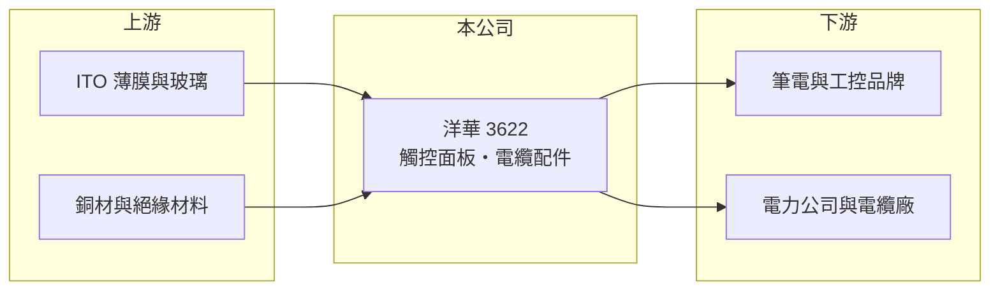

# 3622 洋華

> 上市｜[[產業索引-光電業|光電業]]｜上市（櫃）日期 2009/03/25

# 第一章：企業模式與商業藍圖

> [!info] 撰寫說明
> 精簡版，由 Claude 依公開資料整理，架構比照 [[2330台積電]]，資料截至 2026-10-07。來源：nstock.tw 洋華公司概況、winvest.tw 營收快訊。營收比重未查到。#待校對

洋華原本是觸控面板廠，目前同時經營電力電纜附屬配件。

- **核心業務：** 洋華光電成立於 2007 年，營業項目包括發電、輸電、配電用的電力電纜附屬配件製造，以及各型觸控面板（以[[電容式觸控]]為主，推估）的研發、製造與銷售。
- **營收結構：** 本次未查到兩大業務的營收比重。
- **營運據點：** 本次未查到詳細據點資料。
- **長期方向：** 電力電纜配件受惠電網更新與再生能源併網需求，可能是降低觸控本業波動的主要方向（推估）。

# 第二章：護城河深度與競爭優勢

洋華的兩項業務屬性不同，觸控面板競爭激烈，電力配件則較看重認證與規格。

- **競爭優勢：** 電力電纜配件需要通過電力公司規格認證，進入門檻高於一般消費性零組件（推估）。
- **主要對手：** 觸控面板有 [[3673TPK-KY]]、[[4729熒茂]]與中國觸控廠；電力配件對手本次未查到。
- **觀察重點：** 2025 年高 EPS 的來源是否為一次性，以及 2026 年第二季毛利率 36.91% 但 EPS 僅 0.01 元的原因。

# 第三章：財務體質與盈利規模

資料日期：2026-10-07，以下數字是撰寫當時的快照；最新月營收、毛利率、累計 EPS 由自動排程寫在本筆記的屬性欄位（月營收、毛利率、累計EPS 等）。#待校對

洋華 2025 年獲利亮眼，2026 年獲利明顯回落。

- **營收規模：** 2025 年全年營收 17.26 億元；2026 年 1 至 8 月累計 10.32 億元，8 月 1.03 億元，6 月 1.47 億元、年減 19.47%。
- **獲利：** 2025 年全年 EPS 6.09 元；2026 年第二季 EPS 0.01 元、[[毛利率]] 36.91%。2025 年獲利是否含[[一次性收益]]本次未查證。
- **財務特色：** 資本額約 15.13 億元；2025 年現金股利 3.2 元。

# 第四章：總體風險與地緣政治

洋華的風險在於獲利波動大與兩項業務各自的景氣循環。

- **產業週期：** 觸控面板隨筆電、平板與消費性電子景氣起伏；電力配件則取決於電力公司的採購與電網投資計畫。
- **營運風險：** 2026 年營收較 2025 年下滑，費用若無法同步調整，獲利容易被壓縮。
- **其他風險：** 銅、橡膠等原物料價格與匯率波動；電網採購政策變動。

# 專有名詞解析

## 半導體

- **[[電容式觸控]]**：偵測手指接觸造成的微小電容變化來判斷位置的觸控技術，是筆電觸控板與手機螢幕的主流。

## 金融

- **[[一次性收益]]**：不會每年重複發生的收益，例如處分土地或子公司，分析獲利時通常要排除。

# 核心供應鏈

- 上游：ITO 薄膜、玻璃、銅材與絕緣材料供應商
- 下游／客戶：使用觸控面板的電子產品品牌，以及電力公司與電纜廠（推估）
- 同業：[[3673TPK-KY]]、[[4729熒茂]]、[[3623富晶通]]

## 最新新聞
<!-- news:start -->
<!-- news:end -->

## 相關連結
- [公開資訊觀測站](https://mopsov.twse.com.tw/mops/web/t05st03?step=1&firstin=1&co_id=3622)
- [Goodinfo](https://goodinfo.tw/tw/StockDetail.asp?STOCK_ID=3622)
- [Yahoo 股市](https://tw.stock.yahoo.com/quote/3622)
- [鉅亨網新聞](https://www.cnyes.com/twstock/3622/news)
