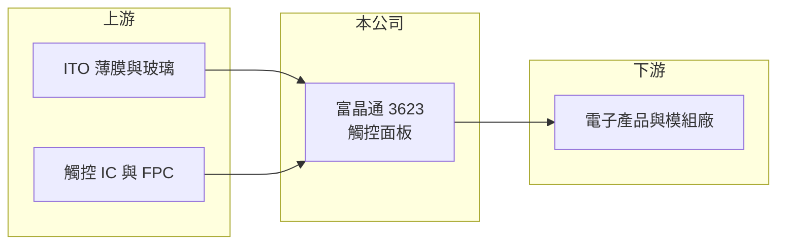

# 3623 富晶通

> 上櫃｜[[產業索引-光電業|光電業]]｜上市（櫃）日期 2010/04/28

# 第一章：企業模式與商業藍圖

> [!info] 撰寫說明
> 精簡版，由 Claude 依公開資料整理，架構比照 [[2330台積電]]，資料截至 2026-10-07。來源：nstock.tw 富晶通公司概況、winvest.tw 營收快訊。公開資料有限，營收比重未查到。#待校對

富晶通是小型觸控面板廠，營收規模不到每年 3 億元。

- **核心業務：** 富晶通主要營業項目為觸控面板等產品的生產與銷售，屬[[電容式觸控]]相關零組件廠（推估）。
- **營收結構：** 本次未查到產品與應用別比重。
- **營運據點：** 本次未查到據點資料。
- **長期方向：** 小型觸控廠多轉向工控、車載或特殊應用等利基市場以避開消費性紅海（推估）。

# 第二章：護城河深度與競爭優勢

富晶通規模小，在觸控產業中缺乏明顯的規模或技術優勢。

- **競爭優勢：** 公開資料看不出明確優勢；小量多樣的客製接單可能是主要生存方式（推估）。
- **主要對手：** [[3673TPK-KY]]、[[3622洋華]]、[[4729熒茂]]，以及中國觸控面板廠。
- **觀察重點：** 2026 年 8 月營收年增 96% 是否來自新客戶或新產品，以及毛利率何時轉正。

# 第三章：財務體質與盈利規模

資料日期：2026-10-07，以下數字是撰寫當時的快照；最新月營收、毛利率、累計 EPS 由自動排程寫在本筆記的屬性欄位（月營收、毛利率、累計EPS 等）。#待校對

富晶通本業毛利為負，但上半年 EPS 為正，推估有業外挹注。

- **營收規模：** 2026 年 1 至 8 月累計營收 1.93 億元；8 月 4,099.6 萬元，月增 111.27%、年增 96.27%。
- **獲利：** 2026 年上半年累計 EPS 0.64 元；第二季[[毛利率]] -9.98%。毛利為負而 EPS 為正，推估含[[業外收益]]，需查財報確認。
- **財務特色：** 資本額約 2.92 億元，近五年沒有配息紀錄。

# 第四章：總體風險與地緣政治

富晶通的風險在於規模過小與本業虧損。

- **產業週期：** 觸控面板需求隨消費性電子景氣波動，價格競爭激烈。
- **營運風險：** 毛利為負代表售價或稼動不足以支應成本，若業外收益無法延續，獲利將轉為虧損。
- **其他風險：** 客戶集中、原料價格與匯率波動；小型股流動性較低。

# 專有名詞解析

## 半導體

- **[[電容式觸控]]**：偵測手指接觸造成的微小電容變化來判斷位置的觸控技術，是筆電觸控板與手機螢幕的主流。

## 金融

- **[[業外收益]]**：本業以外的收入，例如處分資產、投資收益或匯兌利益，通常較不穩定。

# 核心供應鏈

- 上游：ITO 薄膜、玻璃、觸控 IC 與軟板供應商
- 下游／客戶：電子產品品牌與顯示模組廠（推估）
- 同業：[[3673TPK-KY]]、[[3622洋華]]、[[4729熒茂]]

## 最新新聞
<!-- news:start -->
<!-- news:end -->

## 相關連結
- [公開資訊觀測站](https://mopsov.twse.com.tw/mops/web/t05st03?step=1&firstin=1&co_id=3623)
- [Goodinfo](https://goodinfo.tw/tw/StockDetail.asp?STOCK_ID=3623)
- [Yahoo 股市](https://tw.stock.yahoo.com/quote/3623)
- [鉅亨網新聞](https://www.cnyes.com/twstock/3623/news)
