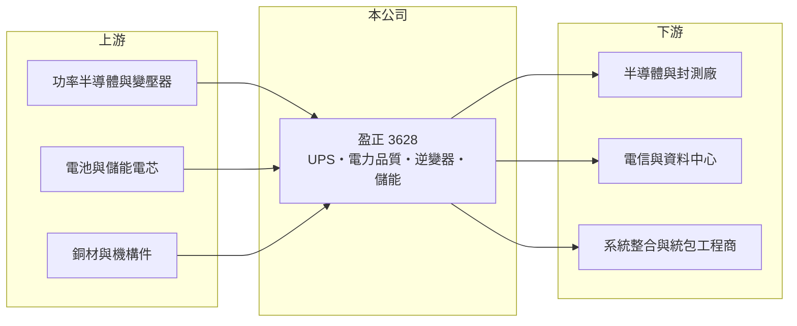

# 3628 盈正

> 上櫃｜[[產業索引-其他電子業|其他電子業]]｜上市（櫃）日期 2010/09/09

# 第一章：企業模式與商業藍圖

> [!info] 撰寫說明
> 精簡版，由 Claude 依公開資料整理，架構比照 [[2330台積電]]，資料截至 2026-10-07。來源：富果研究盈正 2026 年 8 月法說摘要、nstock.tw 盈正公司概況、winvest.tw 營收快訊。營收比重未查到。#待校對

盈正是以工業與機房用不斷電系統為主的電力轉換設備廠，國內 AI 建廠需求是近年主要動能。

- **核心業務：** 盈正豫順電子生產[[UPS]]不斷電系統、電力品質改善設備、太陽能[[逆變器]]與[[儲能]]系統，規格涵蓋中小型商用到百萬瓦（MW）級的大型工業 UPS，並提供維護服務。
- **營收結構：** 本次未查到產品比重；銷售約 40% 直接賣給終端客戶，60% 透過系統整合商或統包工程公司。
- **營運據點：** 總部在新北新店，生產基地在屏東與中國蘇州，海外子公司分布於義大利、英國、日本、新加坡、越南、泰國與美國。
- **長期方向：** 搶攻半導體廠、封測廠與 AI 資料中心（[[AIDC]]）的大型 UPS 專案，公司表示國內 AI 訂單能見度已到 2027 年。

# 第二章：護城河深度與競爭優勢

盈正的優勢在大型工業 UPS 的專案經驗與在地服務。

- **競爭優勢：** 半導體產線單一專案需求可達 2 至 3MW，需要穩定的大型 UPS 與即時維護能力；盈正客戶涵蓋三大電信商、半導體廠與封測廠，具在地專案實績。
- **主要對手：** [[2308台達電]]、[[6409旭隼]]、[[3617碩天]]、[[3043科風]]，以及施耐德、Vertiv、Eaton 等國際大廠。
- **觀察重點：** 2026 年 7 月起調漲價格後，海外業務獲利能否回升，以及國內專案的高成長能延續多久。

# 第三章：財務體質與盈利規模

資料日期：2026-10-07，以下數字是撰寫當時的快照；最新月營收、毛利率、累計 EPS 由自動排程寫在本筆記的屬性欄位（月營收、毛利率、累計EPS 等）。#待校對

盈正年營收約 34 億元，2026 年營收成長但單季獲利波動。

- **營收規模：** 2025 年全年營收 33.55 億元；2026 年 1 至 8 月累計 24.24 億元、年增 16.21%，7 月營收 3.76 億元、年增 23.92%。
- **獲利：** 2025 年全年 EPS 4.02 元；2026 年第二季 EPS 0.63 元、[[毛利率]] 30.56%，法說稱上半年毛利率約 28%。
- **財務特色：** 資本額 4.5 億元，2025 年度現金股利 3.25 元，法說稱現金股利發放率接近八成。

# 第四章：總體風險與地緣政治

盈正的風險在於專案認列時點、原物料成本與海外市場。

- **產業週期：** 國內營收高度依賴半導體與 AI 機房建廠，客戶資本支出放緩時專案會延後。
- **營運風險：** 專案型營收認列時點不平均，單季獲利波動大；海外業務受原物料與運輸成本上漲影響，2026 年上半年營收成長但獲利衰退。
- **其他風險：** 銅、功率元件等原物料價格、匯率，以及中國蘇州廠的兩岸政策風險。

# 專有名詞解析

## 金融

- **[[毛利率]]**：毛利除以營收，代表產品扣除直接成本後的獲利空間。

## 產業

- **[[UPS]]**：不斷電系統，市電中斷時以電池即時供電，保護電腦、伺服器與機房設備不因斷電受損。
- **[[逆變器]]**：把直流電轉換成交流電的設備，太陽能板與儲能電池併網時都需要。
- **[[儲能]]**：以電池等設備把電力儲存起來，在需要時釋放，用於電網調頻、削峰填谷與再生能源併網。
- **[[AIDC]]**：AI 資料中心，以 GPU 伺服器為主、耗電與散熱需求遠高於傳統機房的資料中心。

# 核心供應鏈

- 上游：功率半導體、變壓器、電池與銅材供應商
- 下游／客戶：三大電信商、半導體廠、封測廠、資料中心營運商，以及系統整合與統包工程商
- 同業：[[2308台達電]]、[[6409旭隼]]、[[3617碩天]]、[[3043科風]]

## 最新新聞
<!-- news:start -->
<!-- news:end -->

## 相關連結
- [公開資訊觀測站](https://mopsov.twse.com.tw/mops/web/t05st03?step=1&firstin=1&co_id=3628)
- [Goodinfo](https://goodinfo.tw/tw/StockDetail.asp?STOCK_ID=3628)
- [Yahoo 股市](https://tw.stock.yahoo.com/quote/3628)
- [鉅亨網新聞](https://www.cnyes.com/twstock/3628/news)
