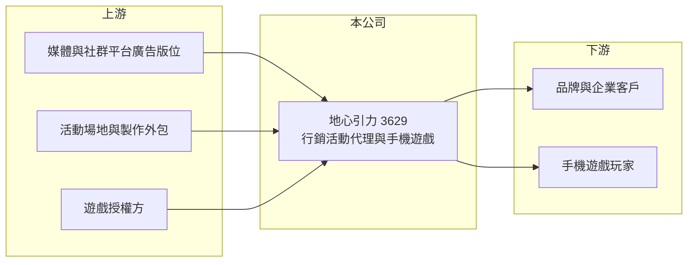

# 3629 地心引力

> 上櫃｜[[產業索引-文化創意業|文化創意業]]｜上市（櫃）日期 2020/06/01

# 第一章：企業模式與商業藍圖

> [!info] 撰寫說明
> 精簡版，由 Claude 依公開資料整理，架構比照 [[2330台積電]] 的四章研究，資料截至 2026-10-08。來源：Goodinfo 年度經營績效頁、nStock 公司簡介、櫃買中心開放資料（基本資料、2026 年第二季資產負債與綜合損益、每月營收、本益比殖利率）。公開資料有限，業務內容以公司登記與月營收說明為準。#待校對

本章拆解地心引力（股票代號：3629）的商業模式。地心引力原名群富通科技，2017 年更名後轉向手機遊戲與數位行銷，但營收規模長期極小，2022 至 2025 年每年營收都不到 0.5 億元，屬於仍在尋找穩定商業模式的公司。

- **核心業務：** 公司 2001 年設立，2010 年上櫃，2017 年 12 月由群富通科技更名為地心引力，實收資本額約 3.30 億元，董事長為馬震偉。依公司介紹，業務包括手機遊戲、廣告代理、產品行銷、品牌設計及軟體服務。
- **營收結構：** 公司未揭露營收比重。依 2026 年 8 月月營收公告的說明，營收成長主要來自客戶的行銷及活動專案增加，顯示目前收入以替品牌客戶執行行銷活動為主，手機遊戲的比重下降（推估）。
- **營運據點：** 總部位於台北信義區。重要子公司 GAMESWORD CO., LIMITED 於 2023 年辦理現金減資；同年公司把手機遊戲《花見 Hanami》的授權協議移轉給其他業者（nStock），可視為逐步收縮遊戲業務。
- **長期方向：** 2026 年 1 至 8 月累計營收約 0.28 億元，遠高於去年同期的不到 100 萬元，主要來自行銷活動專案。行銷代理是低門檻、以人力為主的服務業，公司能否建立固定客戶群並讓營收規模足以支付營運費用，是長期存續的關鍵。

# 第二章：護城河深度與競爭優勢

地心引力目前沒有可辨識的護城河，所處的數位行銷與手機遊戲兩個市場都高度競爭。

- **競爭優勢：** 小型行銷公司的價值在於創意、執行速度與客戶關係，具彈性但難以形成長期門檻。公司兼具遊戲營運與行銷經驗，理論上可以替遊戲或娛樂品牌提供整合行銷服務，但公開資料看不出具體成果。
- **主要對手：** 數位行銷與廣告代理方面，對手包括國際廣告集團在台分公司與大量未上市的數位行銷、活動公關公司；手機遊戲方面則面對 [[6180橘子]]、[[3086華義]] 等發行商與海外遊戲公司。
- **觀察重點：** 2019 至 2020 年營收曾達 4.7 億至 8 億元並小幅獲利，之後快速萎縮。觀察重點在於 2026 年的行銷專案營收能否延續，而不是一次性的活動收入。

# 第三章：財務體質與盈利規模

資料日期：2026-10-08，表格是撰寫當時的快照；最新月營收、毛利率、累計 EPS 由自動排程寫在本筆記的屬性欄位（月營收、毛利率、累計EPS 等）。#待校對

本章用多年度數據檢視地心引力的營收變化。營收極小的年份，比率數字會嚴重失真。

| 年度 | 營收（新台幣） | [[毛利率]] | [[營業利益率]] | EPS（元） | [[ROE]] |
|---|---|---|---|---|---|
| 2018 | 0.40 億 | 45.2% | -57.3% | -1.41 | -20.9% |
| 2019 | 4.74 億 | 31.0% | 7.25% | 1.39 | 9.94% |
| 2020 | 7.98 億 | 40.3% | 9.79% | 0.70 | 5.20% |
| 2021 | 3.43 億 | 22.1% | -31.4% | -4.76 | -42.3% |
| 2022 | 0.50 億 | 11.4% | -282% | -4.63 | -62.6% |
| 2023 | 0.15 億 | 66.6% | 失真 | -2.29 | -51.0% |
| 2024 | 不到 0.01 億 | 失真 | 失真 | -1.05 | -38.9% |
| 2025 | 0.15 億 | 22.5% | -191% | -0.65 | -34.9% |
| 2026 上半年 | 0.21 億 | 33.2% | -39.1% | -0.23 | 不適用（半年） |

- **營收規模：** 2020 年營收 7.98 億元為高峰，之後連年萎縮，2024 年幾乎沒有營收。2026 年上半年回升到 0.21 億元，但仍遠低於疫情前。
- **獲利：** 2019 與 2020 年小幅獲利，其餘年份本業都虧損，2021 至 2025 年 ROE 全為負值。2026 年上半年營業虧損約 0.08 億元，淨損約 0.08 億元（櫃買中心資料）。
- **財務特色：** 2026 年第二季底總資產約 0.56 億元、負債約 0.12 億元、股東權益約 0.43 億元，保留盈餘約 -2.72 億元，累積虧損已吃掉大部分股本，每股淨值約 1.31 元。Goodinfo 統計歷年平均現金股利約 0.09 元，近年未配息。

**[[ROIC]] 與 [[WACC]]：** 2025 年與 2026 年上半年本業皆為虧損，ROIC 為負（推算）。WACC 假設公債 1.75%、市場風險溢酬 6%、β 取 1.2（微型股，假設偏高以反映波動），無借款，WACC 約 9%（推算）。ROIC 長期為負，代表公司仍在消耗股東資本；以目前約 0.43 億元的股東權益，若虧損持續，財務緩衝相當有限。

# 第四章：總體風險與地緣政治

地心引力的風險集中在規模過小與財務緩衝不足。

- **產業週期：** 行銷活動預算是企業最容易刪減的費用之一，景氣轉弱時，行銷代理商的訂單會最先減少。
- **營運風險：** 營收來自少數專案，單一客戶流失就可能讓營收大幅下滑；業務從遊戲轉向行銷，團隊與經驗需要重新建立。累積虧損已大幅侵蝕股本，若淨值持續下降，可能面臨交易方式變更或需要辦理增資、減資。
- **其他風險：** 經營方向多次調整，股權與經營團隊若有變動，策略也可能再度改變。

# 專有名詞解析

## 金融

- **[[累積虧損]]**：公司歷年虧損累計造成保留盈餘為負，會侵蝕股本並降低每股淨值。
- **[[ROIC]]**：投入資本報酬率，稅後營業利益除以股東權益加有息負債，衡量本業運用資本的效率。
- **[[WACC]]**：加權平均資金成本，股東與債權人要求報酬的加權平均，ROIC 高於它才代表創造價值。

## 產業

- **[[整合行銷]]**：結合廣告、社群、活動與公關等多種管道，為品牌規劃一致的行銷方案。
- **[[專案型收入]]**：依單一大型合約完成進度或驗收認列的收入，金額大但時點集中，容易造成年度營收波動。

# 核心供應鏈

- 上游：媒體與社群平台廣告版位、活動場地與製作外包廠商、遊戲授權方。
- 下游／客戶：委託行銷與活動專案的品牌與企業客戶；手機遊戲玩家。
- 同業：國際廣告集團在台分公司、數位行銷與活動公關公司；遊戲方面為 [[6180橘子]]、[[3086華義]]。

## 最新新聞
<!-- news:start -->
<!-- news:end -->

## 相關連結
- [公開資訊觀測站](https://mopsov.twse.com.tw/mops/web/t05st03?step=1&firstin=1&co_id=3629)
- [Goodinfo](https://goodinfo.tw/tw/StockDetail.asp?STOCK_ID=3629)
- [Yahoo 股市](https://tw.stock.yahoo.com/quote/3629)
- [鉅亨網新聞](https://www.cnyes.com/twstock/3629/news)
