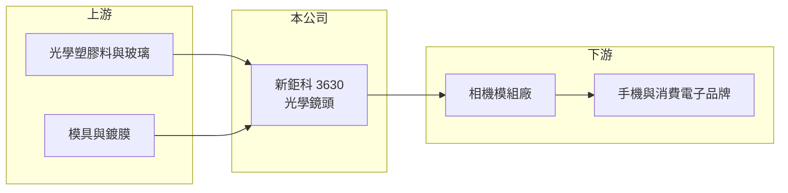

# 3630 新鉅科

> 上櫃｜[[產業索引-光電業|光電業]]｜上市（櫃）日期 2010/04/26

# 第一章：企業模式與商業藍圖

> [!info] 撰寫說明
> 精簡版，由 Claude 依公開資料整理，架構比照 [[2330台積電]]，資料截至 2026-10-07。來源：nstock.tw 新鉅科公司概況、科技新報月營收快訊。營收比重未查到。#待校對

新鉅科是台中的光學鏡頭廠，2025 年營收成長，2026 年下半年轉弱。

- **核心業務：** 新鉅科技成立於 1999 年，從事光學鏡頭的設計、製造與買賣，產品以手機等消費性電子使用的[[塑膠鏡頭]]為主（推估）。
- **營收結構：** 本次未查到應用別或客戶別比重。
- **營運據點：** 總部與廠區位於台中市外埔區，海外據點本次未查到。
- **長期方向：** 手機鏡頭規格往高畫素與[[玻塑混合鏡頭]]發展，車用與其他新應用也是鏡頭廠分散風險的方向（推估）。

# 第二章：護城河深度與競爭優勢

新鉅科屬於第二梯隊的鏡頭廠，規模與良率不如龍頭。

- **競爭優勢：** 具備鏡片射出與組裝一貫製程，能承接中階手機鏡頭訂單（推估）。
- **主要對手：** [[3008大立光]]、[[3406玉晶光]]，以及中國的舜宇光學等大型鏡頭廠。
- **觀察重點：** 2026 年第二季轉為虧損後，下半年新機拉貨能否帶動毛利率回升。

# 第三章：財務體質與盈利規模

資料日期：2026-10-07，以下數字是撰寫當時的快照；最新月營收、毛利率、累計 EPS 由自動排程寫在本筆記的屬性欄位（月營收、毛利率、累計EPS 等）。#待校對

新鉅科前半年營收成長，第三季月營收轉為年減，第二季虧損。

- **營收規模：** 2025 年全年營收 22.68 億元、年增 19.2%；2026 年 1 至 9 月累計 17.51 億元，9 月 1.6 億元、年減 23.59%。
- **獲利：** 2026 年第二季 EPS -0.48 元，[[毛利率]] 15.51%。
- **財務特色：** 資本額約 20.42 億元，近五年沒有配息紀錄。

# 第四章：總體風險與地緣政治

新鉅科的風險在於手機市場集中與價格競爭。

- **產業週期：** 手機鏡頭需求隨新機拉貨呈季節性波動，整體手機出貨成長有限。
- **營運風險：** 毛利率偏低時，[[產能利用率]]下降就容易轉為虧損。
- **其他風險：** 中國鏡頭廠擴產造成的價格壓力；客戶若以中國品牌為主，也受兩岸關係影響（推估）。

# 專有名詞解析

## 金融

- **[[產能利用率]]**：實際使用產能占總產能的比例，固定成本高的製造業毛利率高度取決於此數字。

## 產業

- **[[塑膠鏡頭]]**：以光學塑膠射出成型的多片鏡片堆疊而成的相機鏡頭，是手機相機的主流方案。
- **[[玻塑混合鏡頭]]**：在塑膠鏡片組中加入一片或數片玻璃鏡片，以改善成像品質與耐熱性。

# 核心供應鏈

- 上游：光學塑膠原料、玻璃鏡片、精密模具與鍍膜
- 下游／客戶：相機模組廠與手機品牌（推估）
- 同業：[[3008大立光]]、[[3406玉晶光]]、舜宇光學

## 最新新聞
<!-- news:start -->
<!-- news:end -->

## 相關連結
- [公開資訊觀測站](https://mopsov.twse.com.tw/mops/web/t05st03?step=1&firstin=1&co_id=3630)
- [Goodinfo](https://goodinfo.tw/tw/StockDetail.asp?STOCK_ID=3630)
- [Yahoo 股市](https://tw.stock.yahoo.com/quote/3630)
- [鉅亨網新聞](https://www.cnyes.com/twstock/3630/news)
