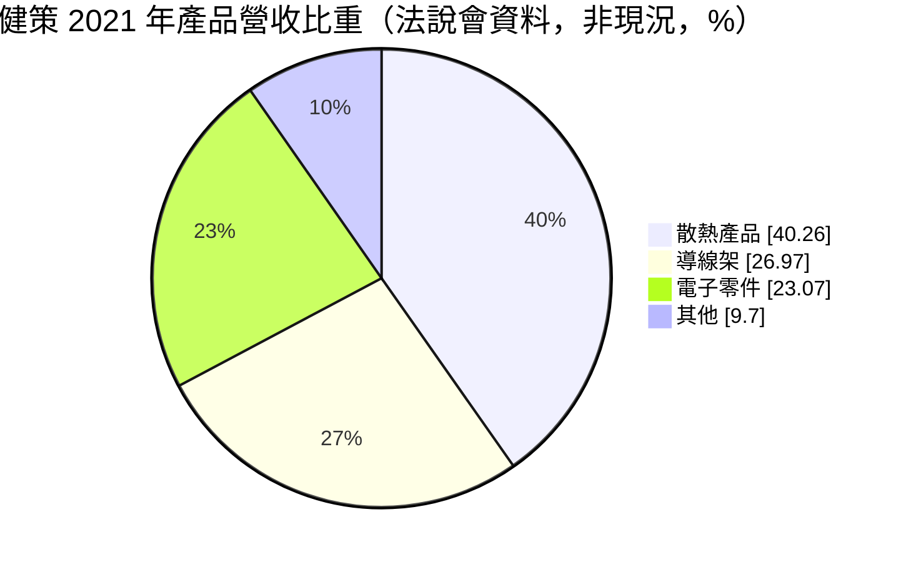
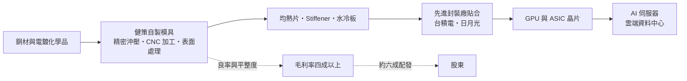
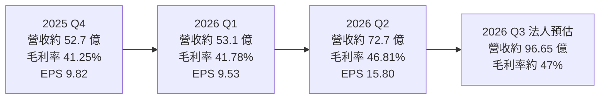
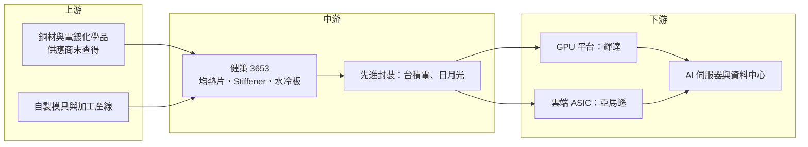

# 3653 健策

> 上市｜[[產業索引-電子零組件業|電子零組件業]]｜上市（櫃）日期 2009/11/18

# 第一章：企業模式與商業藍圖

> [!info] 撰寫說明
> 本文由 Claude 依公開資料整理，架構比照 [[2330台積電]] 的四章研究，資料截至 2026-10-07。財務數字來源：HiStock 嗨投資（每股盈餘、利潤比率、月營收、除權息頁面）、工商時報、經濟日報（里昂報告報導）、科技新報、健策 2021 年法說會簡報；產業描述為整理性內容，尚未逐條比對原始文件。#待校對

在評估單一個股的長期投資價值時，首要步驟是拆解企業的底層獲利邏輯。本章針對健策精密（股票代號：3653，以下簡稱健策）的商業模式進行定性分析，說明一家精密沖壓廠如何成為 AI 晶片散熱的關鍵供應商，以及它的成長為何高度取決於客戶每一代晶片的設計。

## 一、核心定位：從精密沖壓廠轉型為 AI 晶片封裝散熱零組件供應商

健策成立於 1987 年，2008 年掛牌，總部與主要廠區位於桃園。公司早期以精密沖壓、模具與 LED 導線架起家，後來把沖壓、表面處理與精密加工的能力延伸到「晶片封裝層級」的金屬零組件，目前的核心產品是覆蓋在高階晶片上的[[均熱片]]（Lid）與[[加強環]]（Stiffener）。

均熱片是一片以銅為主要材料、經過沖壓、加工與電鍍的金屬蓋，直接貼在 GPU、[[ASIC]] 等大面積晶片上，負責把熱快速均勻地帶到上方的散熱器或[[水冷板]]，同時保護晶片並抑制封裝翹曲。隨著 AI 晶片功耗不斷攀升、[[先進封裝]]（例如 [[CoWoS]]）面積變大，均熱片的平整度、尺寸精度與表面處理要求越來越高，也讓健策從傳統零件廠變成 AI 伺服器供應鏈的關鍵環節。

## 二、終端應用與產品板塊：AI 均熱片為主，水冷板與車用為第二支柱

健策最近一次公開的完整產品比重來自 2021 年法說會，之後隨 AI 需求放大，散熱產品比重持續上升，最新精確比重未查得。下圖僅作為轉型起點的參考：

* **高階晶片均熱片與 Stiffener：** 用於 GPU、ASIC、網通交換器晶片的封裝，是目前營收與獲利的主力。依工商時報 2026 年 8 月報導，B300 持續放量，[[NVDA輝達]] Vera Rubin 平台均熱片第二季月出貨約 10 至 20 萬片，公司目標第四季月出貨 50 至 60 萬片、全年約 200 萬片。
* **水冷板與[[微通道蓋板]]（MCL）：** 依經濟日報引述里昂報告，Rubin 水冷板已通過輝達認證，水冷板占營收比重預估 2026 年達 11%、2027 年提高到 16%（屬券商預估）。微通道蓋板把液冷通道直接做進蓋板，若獲客戶採用，可望提高單位價值。
* **高速交換器機構件：** 工商時報報導，健策切入 Spectrum-X 與 Quantum-X 等高速交換器相關產品，預計 2027 年開始貢獻營收。
* **車用 [[IGBT]] 散熱基板與電子零件：** 用於電動車功率模組散熱，屬成長中但比重較小的業務。
* **傳統導線架與連接器零件：** 比重已逐年下降。

## 三、資本轉化邏輯：精密製程換取高毛利

* **製程一條龍：** 從模具、沖壓、CNC 加工到鍍鎳鍍金都在自家完成，能同時控制平整度與交期，是毛利率能維持四成以上的關鍵。
* **營運據點：** 依 2021 年法說會簡報，健策在台灣有華亞廠與大園一、二、三廠，中國有無錫君山廠與錫紳廠，並在美國、日本、馬來西亞設有據點。高階 AI 均熱片主要在台灣生產，以就近配合台灣的先進封裝產能。最新擴產細節與資本支出金額本次未查得。

## 四、企業長期藍圖：從「一片銅蓋」走向「散熱模組化」

健策的策略是沿著晶片散熱路徑往上延伸：從均熱片、Stiffener，走到水冷板、微通道蓋板，再到交換器機構件，提高每顆晶片的單位價值。

這條路並非單向上升。工商時報報導，次世代 Rubin Ultra 平台預計採用「可拆卸式上蓋」設計，單價可望高於現行單一上蓋架構；但科技新報 2026 年 5 月報導，Rubin GPU 均熱片設計由雙上蓋改為單上蓋，單價由約 150 美元降至約 50 美元，供應鏈估計影響健策 2026 年營收約 60 億元。這兩則消息說明，健策的成長高度取決於客戶每一代產品的設計選擇。

# 第二章：護城河深度與競爭優勢

在長期價值投資中，「護城河」指企業抵禦競爭、維持超額利潤的保護機制。本章分析健策的護城河構成、主要競爭對手，以及這些優勢能否抵擋客戶設計變更與同業進入。

## 一、健策護城河的核心組成要素

* **1. 製程整合能力：** 高階均熱片需要精密沖壓、CNC 加工、表面處理與平整度控制一次到位。健策數十年沖壓與表面處理經驗，加上自製模具，能在[[良率]]與交期上取得優勢。
* **2. 客戶認證與先進封裝綁定：** 均熱片屬於封裝材料的一環，需要通過晶片設計公司與封裝廠的長期驗證。早年市場報導指出健策取得 [[2330台積電]] 均熱片供應認證，這類認證一旦完成，客戶在同一代產品中很少更換供應商。
* **3. 規模與交期：** AI 晶片放量時，供應商必須在短時間內把月產能從數十萬片拉到上百萬片。健策已有大規模量產經驗，是後進者短期難以複製的條件。
* **4. 向液冷延伸：** 水冷板、MCL 讓健策從單一零件供應商轉向熱管理方案的一部分，增加與客戶共同開發的深度。

## 二、全球主要競爭對手格局

| 對手 | 定位 | 對健策的威脅 |
|---|---|---|
| [[3017奇鋐]] | 伺服器整機散熱模組、水冷板與分歧管 | 在水冷板領域與健策重疊，毛利率約 32.57% 低於健策 |
| [[3324雙鴻]] | 伺服器散熱模組與液冷方案 | 水冷板與液冷系統的競爭者 |
| 日系與中國均熱片廠 | 封裝金屬件供應商 | 在中低階晶片或非輝達平台競爭（推估） |
| 封裝廠自行開發 | 部分封裝廠內製方案 | 可能取代外購均熱片（推估） |
| 客戶設計變更 | 不是對手，但影響最大 | Rubin 雙上蓋改單上蓋使單價大幅下滑 |

## 三、優勢轉化：哪些市場守得住、哪些守不住

* **守得住：** 輝達與主要 ASIC 客戶的高階均熱片，需要高精度與大量交貨，健策目前是主要供應者之一，2026 年第二季毛利率 46.81% 也說明定價能力仍在。
* **守不住：** 單價取決於客戶的封裝設計，設計簡化時單價可能腰斬；水冷板屬於較成熟的產品，競爭者較多，毛利率可能低於均熱片。
* **觀察重點：** Rubin 均熱片第四季月出貨能否達到 50 至 60 萬片、Rubin Ultra 是否確定採用較高單價的可拆卸式上蓋、MCL 是否獲終端客戶採用，以及 ASIC 客戶的貢獻能否降低對單一 GPU 平台的依賴。

# 第三章：財務體質與盈利規模

資料日期：2026-10-07。數字取自 HiStock 嗨投資整理之財報與月營收資料，以及工商時報、經濟日報報導，最新月營收與三率請見[[#相關連結]]的公開資訊觀測站。#待校對

財務報表是檢驗護城河是否真實存在的最終標準。本章用三率、ROE、現金流與資本報酬，檢視健策在 AI 散熱需求爆發期的獲利品質。

## 一、獲利能力的基石：三率

| 項目 | 2025 全年 | 2025 Q4 | 2026 Q1 | 2026 Q2 |
|---|---|---|---|---|
| 營收（新台幣） | 202.8 億 | 約 52.7 億 | 約 53.1 億 | 約 72.7 億 |
| [[毛利率]] | 約 41.6%（依季資料推算） | 41.25% | 41.78% | 46.81% |
| [[營業利益率]] | 約 32.0%（依季資料推算） | 31.26% | 31.98% | 37.79% |
| EPS（元） | 36.75 | 9.82 | 9.53 | 15.80 |

* **[[毛利率]]：** 季營收由月營收加總而得。2025 年營收年增 42%，EPS 由 2024 年的 24.15 元成長到 36.75 元。2026 年第二季毛利率創近年新高，反映高階均熱片放量與產品組合改善。
* **[[營業利益率]]：** 第二季 37.79%，營收放大後費用率下降，營業槓桿明顯。上半年 EPS 合計 25.33 元。
* **近期月營收：** 2026 年 7、8 月營收分別約 32.1 億與 32.3 億元，年增約九成；1 至 8 月累計 190.2 億元，年增 42.9%。經濟日報引述法人預估第三季營收約 96.65 億元、毛利率約 47%，屬預估值。

## 二、[[ROE]]：資本效率

健策屬於輕資產的零組件廠，毛利率四成以上、營益率三成以上，加上營收快速成長，股東權益報酬率處於高檔（精確數字未查得）。主要資本需求在於沖壓、加工與電鍍產線的擴充，相對於半導體製造業，資本密集度低。

## 三、資本支出與自由現金流

* **[[CapEx]]：** 本次未查得 2025 至 2026 年的資本支出金額。依 2021 年法說會，當時預估 2022 年資本支出約 12 億元。隨 Rubin 均熱片與水冷板放量，推估 2026 年資本支出會高於過往水準。
* **[[自由現金流]]：** 以營益率三成以上的獲利水準，推估營業現金流足以支應擴產並維持配息。
* **股利：** 依 HiStock 除權息資料，健策現金股利 2021 年度 6.00 元、2022 年度 11.66 元、2023 年度 9.85 元、2024 年度 14.50 元、2025 年度 21.72 元（2026 年 7 月除息）。以 2025 年 EPS 36.75 元計算，配發率約 59%，大致維持六成左右。

## 四、[[ROIC]] 與 [[WACC]]：價值創造利差

健策以相對少量的設備投資換取四成以上的毛利率，ROIC 明顯高於 WACC 的機率高（推估，具體數值未查得）。利差能否維持，關鍵不在資本效率，而在單價：若下一代平台再出現設計簡化、單價下滑，即使出貨量成長，ROIC 也可能從高點回落。

# 第四章：總體風險與地緣政治

任何企業都無法脫離宏觀環境獨立存在。本章分析健策未來必須面對的地緣政治、產業週期與營運風險。

## 一、地緣政治風險

* **美國關稅與在地化：** 健策的高階產品主要在台灣生產，再出貨給台灣封裝廠，最終組裝成伺服器出口美國。若美國對半導體或伺服器零組件課徵關稅，或要求在美國封裝，健策可能需要跟著客戶調整生產布局。
* **出口管制：** 輝達高階 GPU 對中國的出口限制，會影響部分平台出貨量；健策在中國的無錫廠以傳統產品為主，受直接影響較小（推估）。
* **台灣集中風險：** 主要高階產能在桃園，與其他台灣 AI 供應鏈相同，面臨兩岸風險。

## 二、產業週期與市場結構風險

* **客戶集中：** 營收高度依賴輝達 GPU 與少數 ASIC 平台，一旦客戶拉貨節奏改變，月營收波動會很大。2026 年 2 月營收年減 14.6% 就是例子。
* **AI 資本支出循環：** 雲端業者若放緩 AI 投資，均熱片需求會同步下修。
* **匯率與銅價：** 原料以銅為主，銅價上漲若無法完全轉嫁會壓縮毛利；營收多以美元計價，新台幣升值也會影響獲利。

## 三、營運環境的隱性風險

* **設計變更風險：** Rubin 均熱片由雙上蓋改為單上蓋，單價由約 150 美元降至約 50 美元，報導當天股價下跌 9.8%。未來每一代平台都可能出現類似的設計調整。
* **擴產與良率：** 第四季月出貨目標較第二季成長數倍，產能爬坡與良率控制是執行重點。
* **新產品認證：** MCL 終端客戶的採用時程仍未確定，若延後，成長動能會落空。

## 四、科技演進風險

若晶片散熱走向更激進的方案（例如直接晶片液冷、晶片內微流道或其他整合式封裝），均熱片的角色可能被重新定義。健策目前以水冷板與 MCL 布局因應，但新技術的主導權可能落在晶片廠、封裝廠或整機散熱廠手上。

# 專有名詞解析

## 半導體

- **[[ASIC]]**：特殊應用積體電路，雲端業者為自家 AI 運算自行設計的晶片，與輝達 GPU 互為替代。
- **[[IGBT]]**：絕緣閘雙極電晶體，電動車與工業設備的大功率開關元件，運作時發熱量大，需要散熱基板。
- **[[先進封裝]]**：把多顆晶片以中介層、混合鍵合等方式高密度整合的封裝技術，例如 CoWoS、SoIC。
- **[[CoWoS]]**：台積電的 2.5D 先進封裝技術，把 GPU 與 HBM 並排放在中介層上，是 AI 晶片的主流封裝。
- **[[良率]]**：合格產品占總產出的比例，精密零件的良率直接影響成本與交期。

## 金融

- **[[毛利率]]**：毛利除以營收，反映產品本身的定價能力與成本控制。
- **[[營業利益率]]**：營業利益除以營收，反映扣除研發、管銷費用後的本業獲利能力。
- **[[ROE]]**：股東權益報酬率，稅後淨利除以股東權益，衡量公司運用股東資金的效率。
- **[[自由現金流]]**：營業活動現金流減去資本支出，代表企業可自由用於配息、還債或併購的現金。
- **[[ROIC]]**：投入資本報酬率，衡量公司運用股東與債權人資金創造本業報酬的效率。

## 產業

- **[[均熱片]]**：覆蓋在晶片上的金屬蓋（Lid），把晶片熱量均勻傳到散熱器，同時保護晶片並抑制封裝翹曲。
- **[[加強環]]**：Stiffener，貼在封裝載板周圍的金屬框，用來防止大面積封裝在受熱時變形翹曲。
- **[[水冷板]]**：內部有冷卻液流道的金屬板，貼在晶片或均熱片上帶走熱量，是 AI 伺服器液冷系統的核心零件。
- **[[微通道蓋板]]**：MCL，把液冷微流道直接做進晶片上蓋，讓冷卻液更接近發熱源，散熱效率高於傳統均熱片加水冷板。

# 核心供應鏈

## 1. 上游：原物料與製程
- 銅材與電鍍化學品：本次未查得具體供應商
- 自有模具與精密沖壓、CNC 加工、表面處理產線

## 2. 中游：健策本身與封裝合作夥伴
- 先進封裝（均熱片貼合）：[[2330台積電]]、[[3711日月光投控]]

## 3. 下游：晶片與雲端客戶
- GPU 平台：[[NVDA輝達]]
- 自研 ASIC 雲端業者：[[AMZN亞馬遜]]（Trainium3）

## 4. 同業與相關散熱廠
- 伺服器散熱模組與水冷：[[3017奇鋐]]、[[3324雙鴻]]

延伸閱讀：[[台積電供應鏈]]

## 最新新聞
<!-- news:start（自動產生，請勿手動編輯此範圍） -->
- 2026-10-07 📰 媒體 17:50｜營收速報 - 健策(3653)9月營收30.54億元年增率高達79.97％｜[鉅亨網](https://news.cnyes.com/news/id/6623799)
- 2026-10-05 📰 媒體 12:46｜〈焦點股〉健策展望穩健毛利率逐季增 衝7440元再創歷史新天價｜[鉅亨網](https://news.cnyes.com/news/id/6621622)

完整紀錄：[[3653健策 新聞]]
<!-- news:end -->

## 相關連結
- [公開資訊觀測站](https://mopsov.twse.com.tw/mops/web/t05st03?step=1&firstin=1&co_id=3653)
- [Goodinfo](https://goodinfo.tw/tw/StockDetail.asp?STOCK_ID=3653)
- [Yahoo 股市](https://tw.stock.yahoo.com/quote/3653)
- [鉅亨網新聞](https://www.cnyes.com/twstock/3653/news)
