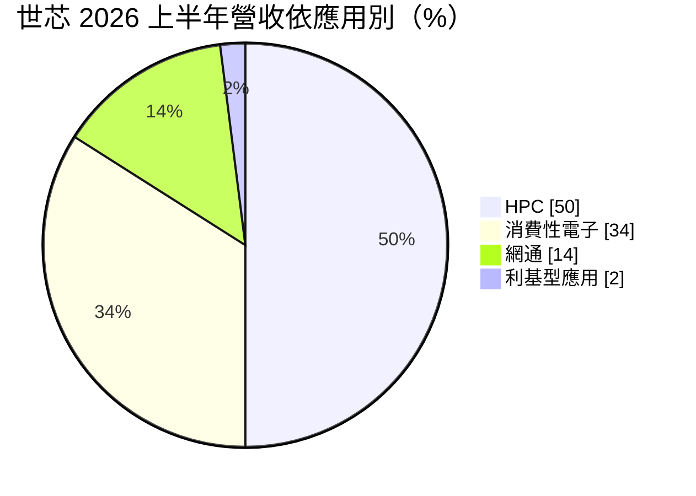
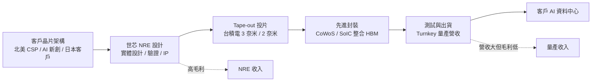
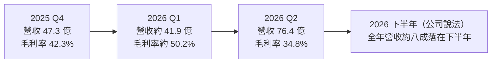
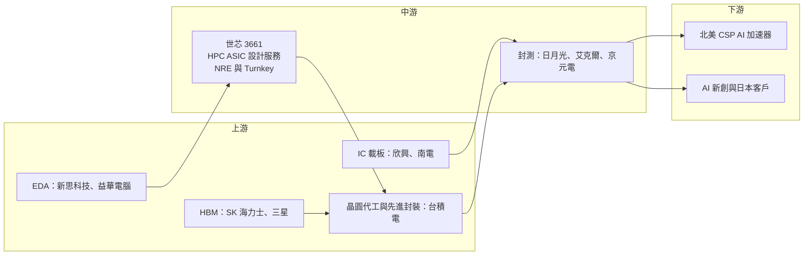

# 3661 世芯-KY

> 上市｜[[產業索引-半導體業|半導體業]]｜上市（櫃）日期 2014/10/28

# 第一章：企業模式與商業藍圖

> [!info] 撰寫說明
> 本文由 Claude 依公開資料整理，架構比照 [[2330台積電]] 的四章研究，資料截至 2026-10-07。財務數字來源：世芯-KY 2025 年財報與 2026 年第二季法說會相關報導（經濟日報、優分析、工商時報）、nstock 公司資料頁；產業描述為整理性內容，尚未逐條比對原始文件。#待校對

在評估單一個股的長期投資價值時，首要步驟是拆解企業的底層獲利邏輯。本章針對世芯電子（股票代號：3661，台股簡稱世芯-KY，以下簡稱世芯）的商業模式進行定性分析，說明一家沒有晶圓廠、也沒有自有品牌晶片的公司，如何靠替別人設計與量產 AI 晶片，成為 AI 供應鏈中的關鍵環節。

## 一、核心定位：專攻高效能運算的 ASIC 設計服務公司

世芯成立於 2003 年，註冊於英屬開曼群島，營運總部位於台北，2014 年 10 月在台灣證券交易所掛牌，因此股票名稱帶有「-KY」。世芯的業務是客製化晶片（[[ASIC]]）與系統單晶片（SoC）的設計服務：替客戶完成晶片的實體設計、驗證與投片，並在量產階段代為安排晶圓代工、封裝與測試，最後交付成品晶片。

與同業相比，世芯的特色是高度聚焦在高效能運算（[[HPC]]），也就是 AI 加速器、資料中心運算晶片與超級電腦晶片這類「面積最大、製程最新、最難做」的晶片。世芯以 [[2330台積電]] 的先進製程與[[先進封裝]]為主要生產平台，是台積電設計服務生態系（VCA）的重要成員。這個定位有兩個商業意義：

* **替不想自建完整晶片團隊的客戶補位：** 大型雲端服務業者（[[CSP]]）與 AI 新創擁有演算法與系統架構，但未必有完整的實體設計與量產管理能力，世芯把「從架構到成品晶片」的後半段包下來。
* **與台積電綁在一起往前走：** 世芯不需要自建晶圓廠，卻能取得最先進製程與封裝的設計資源，技術進度與台積電的製程藍圖同步。

## 二、終端應用板塊：HPC 占一半

2026 年上半年的應用別營收結構如下：

* **HPC：** 北美 CSP 的 AI 加速器是近年最重要的營收來源。依工商時報報導，北美客戶的 3 奈米產品已於 2026 年 6 月開始量產出貨。
* **消費性電子與網通：** 包括各類客製化 SoC 與網通晶片專案，提供相對分散的收入。
* **利基型應用：** 工業、特殊用途等小量專案。

依收入性質，世芯的營收又可分成兩類：

* **委託設計（[[NRE]]）：** 設計服務、[[IP]] 與光罩相關收入，毛利率高，2025 年第四季 NRE 占營收超過五成。
* **量產（[[Turnkey]]）：** 晶片量產後的晶圓、封裝、測試代購與出貨，營收規模大但毛利率較低。營收波動主要來自大型量產專案的世代交替。

客戶與地區方面，世芯過去有相當比例的中國客戶，受美國出口管制影響後，中國客戶營收占比已降至 8% 以下，並積極拓展北美、日本與馬來西亞等市場。

## 三、資本轉化邏輯：輕資產的設計加代購模式

* **輕資產：** 世芯沒有晶圓廠，生產委由台積電，封裝測試委由台積電的先進封裝與外部封測廠。公司在美國、日本、中國等地設有設計與業務據點，主要資產是工程師與 [[EDA]] 工具。
* **NRE 與量產的毛利率落差：** 同一個專案先收 NRE、後收量產營收。量產放量時營收暴增但毛利率下滑，這是解讀世芯財報時最重要的一點。
* **供應鏈協調能力：** 2025 年 IC 載板缺貨時，公司表示因與供應鏈合作緊密，影響相對有限，顯示量產階段的代購與產能協調本身也是服務價值的一部分。

## 四、企業長期藍圖：3 奈米放量、2 奈米接棒、3D IC 整合

* **3 奈米量產放量：** 董事長沈翔霖表示，3 奈米 AI 加速器於 2026 年第二季進入量產，全年營收約八成落在下半年，目標挑戰歷史新高。
* **2 奈米專案：** 已有數個 2 奈米專案進行中，最快 2026 年底完成設計定案（[[Tape-out]]）。
* **[[3D IC]] 整合能力：** 具備運算晶粒（top die）與 I/O 晶粒的 3D IC 整合能力，配合台積電 [[CoWoS]] 與 [[SoIC]] 等先進封裝，把多顆晶粒與 [[HBM]] 整合在同一封裝內，爭取下一代 AI 晶片訂單。
* **客戶多元化：** 除大型 CSP 外，也爭取新創 AI 晶片公司與日本客戶，降低對單一客戶的依賴。

# 第二章：護城河深度與競爭優勢

在長期價值投資中，「護城河」指企業抵禦競爭、維持超額利潤的保護機制。本章分析世芯的護城河構成、全球客製化 AI 晶片市場的競爭格局，以及世芯的優勢在大廠夾擊下能守住多少。

## 一、護城河的核心組成要素

世芯的護城河屬於「中等寬度」，由四個要素組成：

* **1. 大晶片設計經驗：** AI 加速器晶片面積大、功耗高，需要同時處理時序、功耗、散熱、[[良率]]與先進封裝整合，世芯多年專注 HPC，累積大量成功量產經驗。這類經驗無法靠短期招募複製。
* **2. 台積電先進製程與封裝合作：** 作為台積電設計服務夥伴，世芯能提早取得最新製程與封裝的設計規則與資源，這是新進者難以取得的位置。
* **3. 3D IC 與 [[Chiplet]] 整合：** 能把多顆晶粒與 HBM 整合在同一封裝內，是 AI 晶片從單晶片走向多晶粒架構後的關鍵能力。
* **4. 客戶專案綁定：** ASIC 從設計到量產需要一到兩年，客戶完成一個世代後，下一世代通常傾向延續合作，但並非必然，這也是世芯營收波動的根源。

## 二、全球主要競爭對手格局

| 對手 | 定位 | 對世芯的威脅 |
|---|---|---|
| [[AVGO博通]] | 全球客製化 AI 晶片龍頭，擁有完整 [[SerDes]]、網路與封裝 IP | 承接谷歌、Meta 等大型 CSP 的核心 AI 晶片，規模遠大於世芯 |
| [[MRVL邁威爾]] | 資料中心客製化晶片與高速互連 | 與世芯爭取 CSP 的 AI 加速器與周邊晶片 |
| [[3443創意]] | 台積電轉投資的設計服務公司 | 在 AI ASIC 專案上直接競爭，同樣依託台積電 |
| [[2454聯發科]] | 以自有高速 SerDes 與大規模團隊切入 CSP 客製化晶片 | 能提供更完整 IP 組合，搶下一世代專案 |
| Socionext、CSP 自建團隊 | 日本設計服務公司，以及雲端業者內部晶片部門 | 分食日本客戶，或讓 CSP 減少外包 |

## 三、優勢轉化：哪些市場守得住、哪些守不住

* **守得住：** HPC 大晶片的實體設計與量產經驗，讓世芯能承接 CSP 的先進製程 AI 加速器，2026 年 3 奈米專案如期量產即為證明。台積電生態系內的位置，也讓它在 2 奈米世代有機會持續參與。
* **守不住：** 營收高度集中在少數大型專案。2025 年營收年減約四成，正是前一世代量產專案結束、新專案尚未量產的空窗期。大型 CSP 的核心晶片若轉向博通、邁威爾或聯發科，世芯的營收可能再次大幅波動。
* **觀察重點：** 3 奈米專案下半年出貨能否如法人預期放量、2 奈米專案能否如期 Tape-out 並取得量產訂單，以及新創 AI 晶片與日本客戶的貢獻是否提升。這三點決定世芯能否擺脫「單一大客戶、單一世代」的營收循環。

# 第三章：財務體質與盈利規模

資料日期：2026-10-07。數字取自財報與法說會相關財經報導（經濟日報、優分析、工商時報）與 nstock 公司資料頁，表格是撰寫當時的快照；最新月營收、毛利率、累計 EPS 由自動排程寫在本筆記的屬性欄位（月營收、毛利率、累計EPS 等）。#待校對

財務報表是檢驗護城河是否真實存在的最終標準。本章用三率、ROE、現金流與資本報酬，檢視世芯在 NRE 與量產交替之間的獲利品質。

## 一、獲利能力的基石：三率

| 項目 | 2025 全年 | 2025 Q4 | 2026 Q1 | 2026 Q2 |
|---|---|---|---|---|
| 營收（新台幣） | 309.3 億 | 47.3 億 | 約 41.9 億（推算） | 76.4 億 |
| [[毛利率]] | 26.4% | 42.3% | 約 50.2%（推算） | 34.8% |
| [[營業利益率]] | 16.2% | 25.7% | 約 32.7%（推算） | 21.5% |
| 稅後淨利 | 56.0 億 | 約 14.9 億 | 約 14.3 億 | 16.4 億 |
| EPS（元） | 69.18 | 18.29 | 約 17.55（推算） | 20.02 |

* **[[毛利率]]：** 世芯的毛利率主要由 NRE 與量產的比重決定。2025 年營收年減約四成，但 NRE 占比提高，毛利率年增 6.8 個百分點，獲利僅年減 13.1%。2026 年第二季 3 奈米量產營收加入，營收季增 82.5%，毛利率則季減 15.3 個百分點。
* **[[營業利益率]]：** 營業費用以研發人力為主、相對固定，量產放量時費用率下降，營業利益金額仍可成長。2026 年第二季稅後淨利季增 14.7%，創同期新高。
* **上半年合計：** 2026 年上半年營收 118.3 億元、年增 39.8%，毛利率 40.3%、營業利益率 25.5%，稅後淨利 30.7 億元，EPS 合計 37.57 元。第一季數字由上半年減去第二季推算，屬約略值。
* **展望：** 工商時報引述法人預估，第三季營收可能大幅季增，3 奈米專案全年營收貢獻可望超過 400 億元（法人預估，非公司財測）。

## 二、[[ROE]]：資本效率

世芯屬輕資產公司，股本約 8.6 億元，獲利對 ROE 的放大效果明顯。量產營收占比提高時毛利率下降，但營業費用率同步下降，營業利益金額仍可成長，因此 ROE 在量產年通常高於空窗年（推估，本次未查得具體 ROE 數值）。

## 三、資本支出與自由現金流

* **[[CapEx]]：** 主要用於 EDA 工具授權、IP 開發與測試設備，相對營收很小。
* **[[自由現金流]]：** 量產專案放量時，需要預先支付晶圓與封裝費用，營運資金占用會隨之上升，需留意存貨與預付款的變化。設計服務公司的現金流壓力不在設備投資，而在量產代購的週轉。
* **股利政策：** 依 nstock 整理，世芯以 2025 年度盈餘配發現金股利每股 32.55 元，約為 2025 年 EPS 的 47%，股利金額隨獲利浮動。

## 四、[[ROIC]] 與 [[WACC]]：價值創造利差

輕資產模式下，世芯投入的資本主要是營運資金與研發，ROIC 在量產年明顯高於資金成本；在專案空窗年，獲利下滑但投入資本也同步下降，利差縮小但仍為正值（推估，具體數值未查得）。真正的風險不是資本報酬率，而是大型專案能否接續，讓高報酬持續。

# 第四章：總體風險與地緣政治

任何企業都無法脫離宏觀環境獨立存在。本章分析世芯未來必須面對的地緣政治、AI 投資週期與營運風險。

## 一、地緣政治風險

* **美國出口管制：** 世芯過去有中國 HPC 客戶，美國對中國先進運算晶片的出口管制已迫使公司大幅降低中國營收占比至 8% 以下。未來管制若進一步擴大，可能影響其他亞洲客戶的專案。
* **對台積電與台灣的依賴：** 先進製程與先進封裝產能集中在台灣，兩岸風險與台積電的產能分配直接影響出貨。
* **美國在地化要求：** 若美國要求 AI 晶片在美國製造或封裝，世芯需配合台積電海外產能，成本與時程可能改變。

## 二、產業週期與市場結構風險

* **AI 資本支出週期：** 營收高度依賴北美 CSP 的 AI 投資，若 CSP 縮減資本支出或改變晶片策略，營收可能大幅下滑。
* **專案空窗期：** 世芯的營收在大型專案世代交替時會出現明顯低谷，2025 年營收年減約四成就是一例。
* **客戶集中：** 單一北美客戶貢獻比重高，客戶轉單或延後量產的影響很大。

## 三、營運環境的隱性風險

* **供應鏈瓶頸：** CoWoS 先進封裝、HBM 與 IC 載板供給緊張時，量產出貨可能受限。
* **毛利率稀釋：** 量產占比提高使毛利率下降，2026 年第二季毛利率已從第一季約 50% 降至 34.8%，市場若只看毛利率容易誤判。
* **專案執行：** 先進製程晶片若需要重新投片，成本高且可能延誤客戶產品時程。

## 四、科技演進風險

* **2 奈米與 3D IC：** 下一世代製程與封裝的設計複雜度大幅提高，若技術準備不及，可能在下一輪專案競標中落後。
* **CSP 內部化與大廠競爭：** CSP 擴大自建晶片團隊，或博通、聯發科以更完整的 IP 組合爭取訂單，可能壓縮設計服務公司的市場空間（推估）。

# 專有名詞解析

## 半導體

- **[[ASIC]]**：特定應用積體電路，為單一客戶或單一用途量身設計的晶片，例如雲端業者自用的 AI 加速器。
- **[[NRE]]**：一次性工程費用，客戶支付的設計、驗證與光罩費用，毛利率通常高於量產收入。
- **[[Turnkey]]**：一條龍量產服務，設計服務公司代客戶向晶圓廠、封測廠下單並交付成品晶片。
- **[[Tape-out]]**：設計定案，晶片設計完成並把光罩資料交給晶圓廠開始投片的里程碑。
- **[[SoIC]]**：台積電的系統整合晶片技術，把多顆晶片以垂直堆疊方式直接接合，屬 3D 先進封裝。
- **[[3D IC]]**：把多層晶片垂直堆疊並互相連接的整合方式，可縮短訊號路徑、提高頻寬。
- **[[Chiplet]]**：小晶片架構，把一顆大晶片拆成多顆功能晶粒再封裝在一起，以提高良率並降低成本。
- **[[SerDes]]**：串列器與解串器，把平行資料轉成高速串列訊號傳輸的電路，是晶片間高速互連的核心 IP。
- **[[CoWoS]]**：台積電的 2.5D 先進封裝技術，把運算晶片與 HBM 並排放在中介層上，是 AI 加速器的主流封裝。
- **[[HBM]]**：高頻寬記憶體，以多層 DRAM 垂直堆疊提供極高頻寬，與 AI 晶片封裝在一起使用。
- **[[先進封裝]]**：把多顆晶片以中介層、混合鍵合等方式高密度整合的封裝技術，例如 CoWoS、SoIC。
- **[[EDA]]**：電子設計自動化軟體，晶片設計必備的工具，主要由新思科技與益華電腦提供。

## 應用

- **[[HPC]]**：高效能運算，泛指 AI 加速器、資料中心伺服器與超級電腦等需要大量運算的應用。
- **[[CSP]]**：雲端服務供應商，例如亞馬遜、微軟、谷歌，是 AI 伺服器與客製化晶片的最大買家。

# 核心供應鏈

## 1. 上游：晶圓代工、封測、IP 與 EDA
- 晶圓代工與先進封裝：[[2330台積電]]
- 封裝測試：[[3711日月光投控]]、[[AMKR艾克爾]]、[[2449京元電子]]
- HBM 記憶體：SK 海力士、[[005930三星電子]]
- EDA：[[SNPS新思科技]]、[[CDNS益華電腦]]
- IC 載板：[[3037欣興]]、[[8046南電]]

## 2. 中游：世芯本身
- HPC ASIC 委託設計（NRE）與量產服務（Turnkey）

## 3. 下游：主要客戶類型
- 北美雲端服務業者 AI 加速器：[[AMZN亞馬遜]]（市場普遍推測的主要客戶，公司未公開證實）
- 新創 AI 晶片公司與日本客戶

## 4. 同業與競爭者
- 國內：[[3443創意]]、[[2454聯發科]]
- 國外：[[AVGO博通]]、[[MRVL邁威爾]]、Socionext

延伸閱讀：[[台積電供應鏈]]

## 供應鏈關係
- 供應給 [[2330台積電]]：高階 ASIC 設計服務（台積電供應鏈 › 上游：晶片設計工具、IP與設計服務 (ASIC)）

## 最新新聞
<!-- news:start（自動產生，請勿手動編輯此範圍） -->
- 2026-10-07 📰 媒體 01:14｜世芯-KY(3661) 個股概覽 ／ 個股 - 股市｜[CMoney](https://news.google.com/rss/articles/CBMiU0FVX3lxTE9KbVdYM0cyLWpXLUNmaUYybDdra0lrVGoyTldjVk1xNlV0Q3hWOVJCLVBlWUN1cmZudXRqekEyVHQxVV9nMXN4bDJlNUNEUGd5TS04?oc=5)
- 2026-10-06 📰 媒體 15:27｜AI伺服器、ASIC、散熱三路吸金！緯穎衝2290 世芯-KY、奇鋐同步走強｜[聚財網](https://news.google.com/rss/articles/CBMiTEFVX3lxTE96anYxeVRRMlh5RHJkbUJ2amhxVWdjWHFNanBSU0hCRXBqb2VoQnBtaTN3dDEwY0pTMHYtY1lfdDd4NTdyOHA1ZWgwcmE?oc=5)
- 2026-10-06 📰 媒體 13:38｜3661世芯KY｜展現極其強勢的飆漲走勢｜[CMoney](https://news.google.com/rss/articles/CBMiWEFVX3lxTE9UWXNlZEtLVERla05VQ3dKRGpVWVVobDNRLXlTTm5uQUxocS1VaWliN1ZQYmp4WWF5ZTN2UzMyNzJiSHFpLXpLTXNhWC1QYm5iRXQ4WjVCWDk?oc=5)
- 2026-10-06 📰 媒體 13:38｜3661世芯KY｜展現極其強勢的飆漲走勢｜[CMoney](https://news.google.com/rss/articles/CBMiWEFVX3lxTE9UWXNlZEtLVERla05VQ3dKRGpVWVVobDNRLXlTTm5uQUxocS1VaWliN1ZQYmp4WWF5ZTN2UzMyNzJiSHFpLXpLTXNhWC1QYm5iRXQ4WjVCWDk?oc=5)
- 2026-10-06 📰 媒體 13:38｜3661世芯KY｜展現極其強勢的飆漲走勢｜[CMoney](https://news.google.com/rss/articles/CBMiWEFVX3lxTE9UWXNlZEtLVERla05VQ3dKRGpVWVVobDNRLXlTTm5uQUxocS1VaWliN1ZQYmp4WWF5ZTN2UzMyNzJiSHFpLXpLTXNhWC1QYm5iRXQ4WjVCWDk?oc=5)

完整紀錄：[[3661世芯-KY 新聞]]
<!-- news:end -->

## 相關連結
- [公開資訊觀測站](https://mopsov.twse.com.tw/mops/web/t05st03?step=1&firstin=1&co_id=3661)
- [Goodinfo](https://goodinfo.tw/tw/StockDetail.asp?STOCK_ID=3661)
- [Yahoo 股市](https://tw.stock.yahoo.com/quote/3661)
- [鉅亨網新聞](https://www.cnyes.com/twstock/3661/news)
