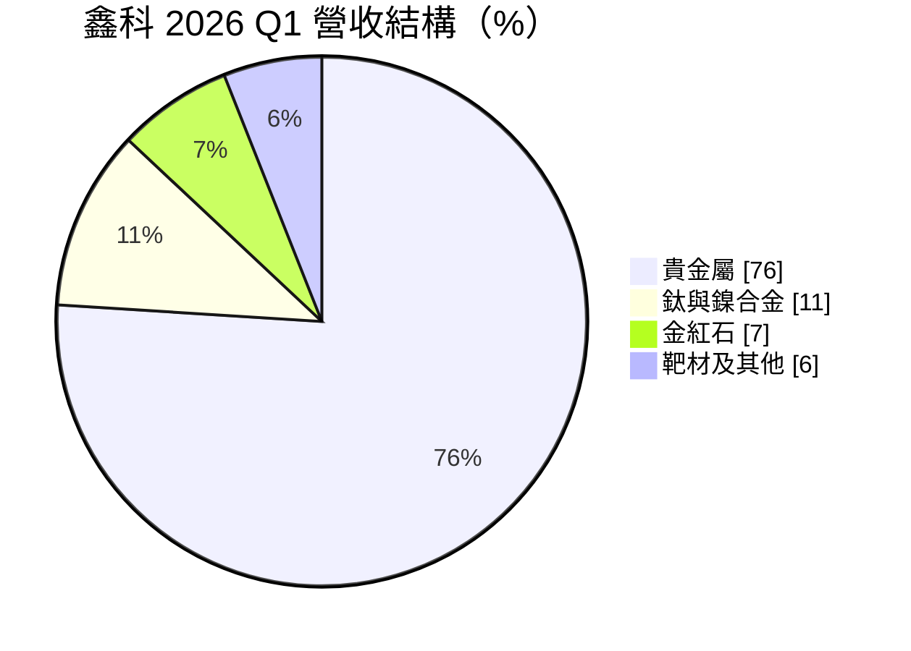
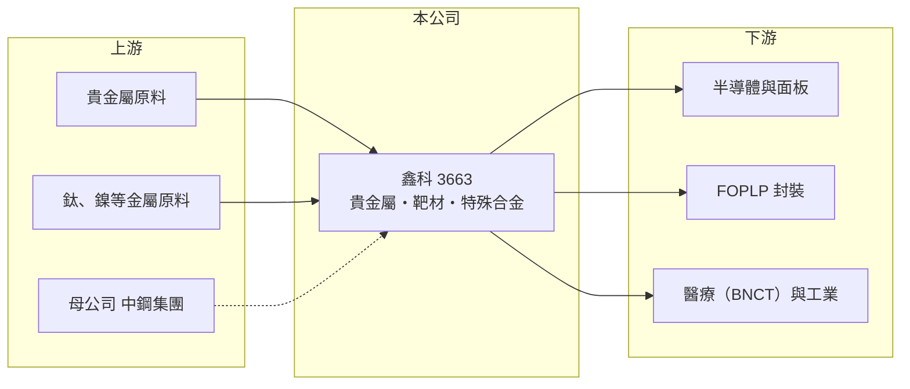

# 3663 鑫科

> 上櫃｜[[產業索引-其他電子業|其他電子業]]｜上市（櫃）日期 2012/11/20

# 第一章：企業模式與商業藍圖

> [!info] 撰寫說明
> 精簡版，由 Claude 依公開資料整理，架構比照 [[2330台積電]]，資料截至 2026-10-07。來源：富果研究鑫科 2026 年 7 月法說摘要、nstock.tw 鑫科公司概況、winvest.tw 營收快訊。#待校對

鑫科是中鋼集團旗下的金屬材料廠，營收以貴金屬為主，並發展半導體與醫療用特殊材料。

- **核心業務：** 鑫科材料生產薄膜[[濺鍍]][[靶材]]、貴金屬材料、粉末冶金產品、鈦合金與鎳基合金，最大股東為中鋼集團的中盈投資開發（持股 46.62%）。
- **營收結構：** 2026 年第一季貴金屬占 76%、鈦與鎳合金 11%、金紅石 7%、靶材及其他 6%。

- **營運據點：** 台灣廠區與子公司中鋼精材；詳細廠區位置本次未查到。
- **長期方向：** 三大策略業務為 [[FOPLP]] 金屬載板、[[BNCT]] 硼中子捕獲治療材料，以及半導體前段製程材料。

# 第二章：護城河深度與競爭優勢

鑫科的差異化在特殊材料認證，但主體營收是低毛利的貴金屬買賣。

- **競爭優勢：** 法說稱是 FOPLP 金屬載板唯一取得技轉認可的供應商，也是 BNCT 中子調節器的獨家供應商，並已取得 2027 年訂單。
- **主要對手：** 靶材有 [[1785光洋科]]、日本與美國靶材大廠；貴金屬加工則有國內外精煉與回收業者。
- **觀察重點：** 子公司中鋼精材轉虧為盈的進度，以及特殊材料營收比重能否拉高、改善毛利率。

# 第三章：財務體質與盈利規模

資料日期：2026-10-07，以下數字是撰寫當時的快照；最新月營收、毛利率、累計 EPS 由自動排程寫在本筆記的屬性欄位（月營收、毛利率、累計EPS 等）。#待校對

鑫科營收受貴金屬價格推升，但毛利率很低、獲利有限。

- **營收規模：** 2025 年全年營收 57.15 億元；2026 年第一季營收 24.49 億元創新高，1 至 8 月累計 51.09 億元、年增 37.52%。
- **獲利：** 2026 年第二季 EPS 0.02 元、[[毛利率]] 3.41%，上半年累計 EPS 0.28 元。
- **財務特色：** 貴金屬營收是「價格轉嫁」性質，營收隨金屬價格放大但毛利有限；近五年平均現金股利 0.58 元，2025 年第四季未配發。

# 第四章：總體風險與地緣政治

鑫科的風險在於金屬價格波動與新事業的放量速度。

- **產業週期：** 貴金屬與鈦、鎳價格波動直接影響營收與存貨評價，價格急跌時可能出現存貨損失。
- **營運風險：** 子公司虧損拖累整體獲利；FOPLP 與半導體材料仍在驗證與放量初期，進度不如預期會延後獲利改善。
- **其他風險：** 原料進口價格與匯率、醫療材料的法規審查時程。

# 專有名詞解析

## 半導體

- **[[濺鍍]]**：在真空中以離子撞擊靶材，把金屬原子沉積到晶圓或基板表面形成薄膜的製程。
- **[[靶材]]**：濺鍍製程中被離子撞擊、提供薄膜材料來源的高純度金屬或化合物板材。
- **[[FOPLP]]**：面板級扇出型封裝，以方形大面板取代圓形晶圓進行扇出封裝，可提高面積利用率、降低成本。

## 應用

- **[[BNCT]]**：硼中子捕獲治療，讓腫瘤細胞吸收含硼藥物後以中子照射，精準破壞癌細胞的放射治療方式。

## 金融

- **[[毛利率]]**：毛利除以營收，代表產品扣除直接成本後的獲利空間。

# 核心供應鏈

- 上游：貴金屬、鈦與鎳等金屬原料供應商；母集團 [[2002中鋼]]
- 下游／客戶：半導體與面板廠、FOPLP 封裝客戶、BNCT 醫療設備業者、工業用合金客戶
- 同業：[[1785光洋科]]、日本與美國靶材廠

## 最新新聞
<!-- news:start（自動產生，請勿手動編輯此範圍） -->
- 2026-10-08 📰 媒體 17:23｜營收速報 - 鑫科(3663)9月營收5.84億元年增率高達56.48％｜[鉅亨網](https://news.cnyes.com/news/id/6625017)

完整紀錄：[[3663鑫科 新聞]]
<!-- news:end -->

## 相關連結
- [公開資訊觀測站](https://mopsov.twse.com.tw/mops/web/t05st03?step=1&firstin=1&co_id=3663)
- [Goodinfo](https://goodinfo.tw/tw/StockDetail.asp?STOCK_ID=3663)
- [Yahoo 股市](https://tw.stock.yahoo.com/quote/3663)
- [鉅亨網新聞](https://www.cnyes.com/twstock/3663/news)
