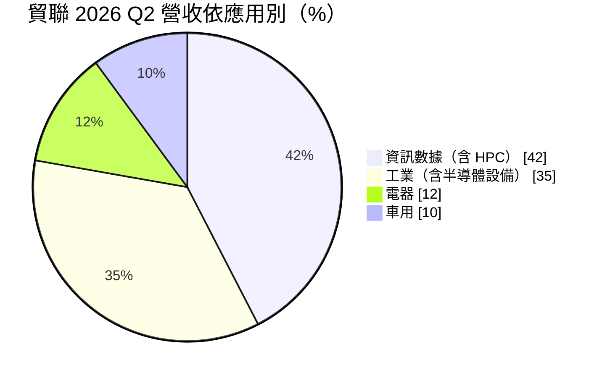
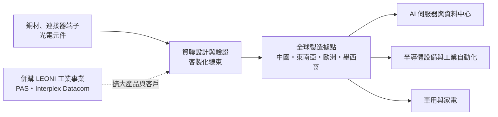
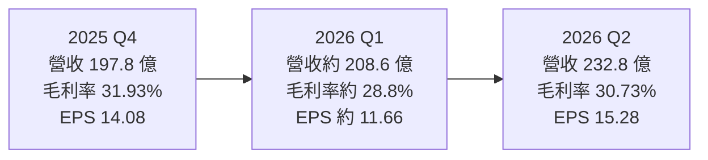
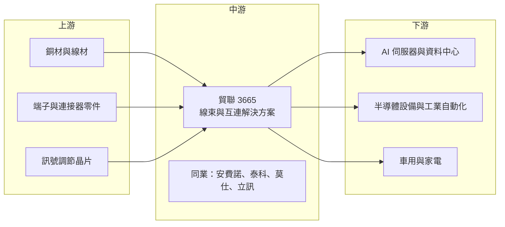

# 3665 貿聯-KY

> 上市｜[[產業索引-其他電子業|其他電子業]]｜上市（櫃）日期 2011/04/21

# 第一章：企業模式與商業藍圖

> [!info] 撰寫說明
> 本文由 Claude 依公開資料整理，架構比照 [[2330台積電]] 的四章研究，資料截至 2026-10-07。財務數字來源：優分析（2025 年報與 2026 年第二季財報報導）、聯合新聞網 2026 年 8 月報導、Poorstock 法說會整理、富果研究個股分析、數位時代 2021 年併購報導、Yahoo 股市公司基本資料；產業描述為整理性內容，尚未逐條比對原始文件。#待校對

在評估單一個股的長期投資價值時，首要步驟是拆解企業的底層獲利邏輯。本章針對貿聯控股（股票代號：3665，以下簡稱貿聯）的商業模式進行定性分析，說明一家以線束起家的公司，如何靠併購擴大版圖，再搭上 AI 伺服器的高速傳輸與電源連接需求。

## 一、核心定位：多產業的互連解決方案供應商

貿聯是開曼註冊的 KY 公司，依 Yahoo 股市資料，登記成立日為 2000 年 6 月 1 日（富果研究則稱集團創立於 1996 年），2011 年在台上市，董事長為梁華哲。公司產品是各種連接器、線束（[[Wire Harness]]）與光電元件，簡單說就是「讓設備內部與設備之間的電力和訊號能接通」的零件。

貿聯的特色在於產業分散。它不只做電腦周邊線材，也服務工業自動化、半導體設備、車用、家電與醫療等市場，且大多是客製化的線束組件，而非標準品。

* **以客製化換取黏著度：** 工業與車用線束需依客戶設備設計，通過驗證後在整個產品生命週期持續供貨，轉換成本高。
* **以併購擴大規模：** 2021 年以約 4.51 億歐元企業價值收購德國 LEONI 的工業應用事業群，取得歐洲工業、醫療與機器人客戶；2026 年再收購墨西哥 PAS，並簽約以 8.5 億美元現金（加最高 5,000 萬美元或有對價）收購 Ennovi 旗下的資料通訊業務 Interplex Datacom。

## 二、終端應用板塊：資訊數據與工業雙主軸

依 2026 年 8 月法說會資料（Poorstock 整理），2026 年第二季營收結構如下：

* **資訊數據：** 包含 AI 伺服器的電源連接線束與資料傳輸線材（推估涵蓋 [[AEC]]、[[DAC]] 等高速銅纜，具體品項未查得），[[HPC]] 業務已連續 10 季季成長，第二季年增 67%。
* **工業：** 工廠自動化、半導體設備（SPE）、醫療與機器人線束，半導體設備第二季年增 52%。
* **電器：** 家電用線束，含墨西哥 PAS 併購貢獻。
* **車用：** 電動車高壓線束與充電相關產品，第二季營收為近兩年最高。

## 三、資本轉化邏輯：客製化線束的全球製造網

* **製造貼近客戶：** 線束組裝人力密集，且需要就近供貨，貿聯在多個國家設廠，併購 LEONI 後歐洲據點大增，墨西哥併購則強化北美布局（具體廠區數未查得）。
* **AI 帶動組合改善：** HPC 產品毛利率較高，2025 年 HPC 全年營收年增 199%，帶動毛利率從 2024 年約 28.2% 升到 31.7%。
* **費用槓桿：** 營收成長快於費用，2025 年營業利益年增 89.7%，遠高於營收 31.7% 的成長。

## 四、企業長期藍圖：從線束廠成為資料中心互連要角

* **強化資料通訊：** Interplex Datacom 交易完成後，可補強資料中心連接器與高速互連的產品線。
* **半導體設備與工業：** 半導體設備需求隨晶圓廠擴產成長，工業線束是 AI 之外的穩定支柱。
* **併購整合：** 貿聯的成長模式高度依賴併購，未來重點是把收購來的事業整合到集團的成本與管理體系。

# 第二章：護城河深度與競爭優勢

在長期價值投資中，「護城河」指企業抵禦競爭、維持超額利潤的保護機制。本章分析貿聯的護城河構成、全球主要競爭對手，以及這些優勢在 AI 傳輸技術快速變化下能守住多少。

## 一、貿聯護城河的核心組成要素

貿聯屬於「中等護城河」，由三個要素組成：

* **1. 客戶驗證與轉換成本：** 工業、半導體設備、醫療與車用線束都需要長時間驗證，一旦導入，客戶很少更換供應商。
* **2. 產業與地區分散：** 四大應用與全球多地生產，讓單一產業景氣變化的衝擊較小，也能配合客戶的區域生產要求。
* **3. 併購整合能力：** 多次跨國併購累積的整合經驗，讓貿聯能以收購方式快速取得技術與客戶。

## 二、全球主要競爭對手格局

| 對手 | 定位 | 對貿聯的威脅 |
|---|---|---|
| Amphenol 安費諾 | 全球連接器龍頭，資料中心高速互連布局完整 | 產品線最廣，在 AI 伺服器互連市占高 |
| TE Connectivity 泰科 | 全球連接器大廠，車用與工業為主 | 在車用與工業線束直接競爭 |
| Molex 莫仕 | 連接器大廠 | 資料中心與車用皆有重疊 |
| 立訊精密 | 中國連接器與組裝大廠 | 價格競爭力強，積極切入 AI 銅纜 |
| [[3533嘉澤]]、[[6197佳必琪]] 等台廠 | 台灣連接器廠 | 在伺服器連接器與線材有部分競爭 |

## 三、優勢轉化：哪些市場守得住、哪些守不住

* **守得住：** 工業與半導體設備線束，客製化程度高、驗證門檻高；HPC 電源線束由客戶指定供應商的情況也較多。
* **守不住：** 標準化的資料線材與消費性產品，價格競爭激烈。
* **觀察重點：** AI 平台世代交替時的供應商分配、Interplex Datacom 交割後的整合成效，以及車用與電器業務能否在 AI 之外貢獻穩定成長。

# 第三章：財務體質與盈利規模

資料日期：2026-10-07。數字取自優分析與聯合新聞網的財報報導，表格是撰寫當時的快照；最新月營收、毛利率、累計 EPS 由自動排程寫在本筆記的屬性欄位（月營收、毛利率、累計EPS 等）。#待校對

財務報表是檢驗護城河是否真實存在的最終標準。本章用三率、ROE、現金流與資本報酬，檢視貿聯在 AI 與併購擴張期的獲利品質。

## 一、獲利能力的基石：三率

| 項目 | 2025 全年 | 2025 Q4 | 2026 Q1 | 2026 Q2 |
|---|---|---|---|---|
| 營收（新台幣） | 712.47 億 | 197.79 億 | 約 208.6 億（推算） | 232.81 億 |
| [[毛利率]] | 31.73% | 31.93% | 約 28.77%（推算） | 30.73% |
| [[營業利益率]] | 17.49% | 18.37% | 約 14.89%（推算） | 17.22% |
| 稅後淨利 | 90.05 億 | 27.4 億 | 約 22.7 億（推算） | 29.82 億 |
| EPS（元） | 46.57 | 14.08 | 約 11.66（推算） | 15.28 |

* **[[毛利率]]：** 2025 年大幅提升 3.52 個百分點，主因 HPC 產品比重提高。2026 年第一季回落，第二季回升到 30.73%，但仍略低於 2025 年同期，顯示併購進來的電器業務毛利較低。
* **[[營業利益率]]：** 2026 年第二季 17.22%，季增 2.33 個百分點，營收連續 6 季創新高帶動費用攤提。
* **[[淨利率]]：** 第二季 12.81%，稅後純益創單季新高。

## 二、[[ROE]]：資本效率

2025 年 EPS 46.57 元，稅後純益年增 104%，ROE 隨獲利倍增明顯提升（具體數值未查得）。後續大型併購若以舉債支應，會提高財務槓桿；若以增資支應，則可能稀釋 ROE。

## 三、資本支出與自由現金流

* **[[CapEx]]：** 線束組裝屬於人力密集、設備投資相對較小的產業，具體資本支出未查得。
* **併購支出：** Interplex Datacom 交易金額 8.5 億美元，是貿聯近年最大的資本配置，將大幅消耗現金或增加負債。
* **股利：** 2025 年度擬配發現金股利 15 元，配發率約 32%，保留較多盈餘支應併購。

## 四、[[ROIC]] 與 [[WACC]]：價值創造利差

貿聯本業的 ROIC 在 2025 年隨營益率提升而改善，推估高於資金成本。但大型併購會一次增加大量投入資本（含商譽），若被收購事業的獲利成長不如預期，ROIC 會被稀釋。觀察併購後兩到三年的 ROIC 變化，是判斷貿聯併購策略是否創造價值的關鍵。

# 第四章：總體風險與地緣政治

任何企業都無法脫離宏觀環境獨立存在。本章分析貿聯未來必須面對的地緣政治、產業週期與營運風險。

## 一、地緣政治風險

* **中國產能與美國關稅：** 部分產能仍在中國，美國關稅與供應鏈去中國化要求，促使貿聯加速墨西哥與東南亞布局。
* **歐洲據點：** 併購 LEONI 工業事業後歐洲營運比重提高，歐洲能源成本與工業景氣也成為影響因素。

## 二、產業週期與市場結構風險

* **AI 平台變動：** 富果研究曾指出輝達平台規劃調整會影響相關零組件需求，法說會也提醒平台轉換、客戶部署時程可能造成季度波動。
* **工業與車用景氣：** 工業自動化與電動車需求具週期性，車用業務在 2024 年後成長放緩。
* **[[長鞭效應]]：** 線束位於供應鏈中段，客戶庫存調整時訂單波動會被放大。

## 三、營運環境的隱性風險

* **併購整合：** 跨國併購涉及文化、系統與成本整合，若整合不順，可能出現商譽減損。
* **人力成本：** 線束組裝人力密集，各地工資上升會壓縮毛利。
* **匯率：** 營收以美元、歐元計價，匯率波動影響以台幣計的獲利。

## 四、科技演進風險

AI 伺服器內部與機櫃間的傳輸，未來可能隨速率提高從銅纜轉向光纖或[[CPO]]。若銅纜被光通訊取代的速度快於預期，貿聯的 AEC 與 DAC 產品需求會受影響；反之，Interplex Datacom 等新事業能否補上光電與連接器能力，是因應的關鍵。

# 專有名詞解析

## 半導體

- **[[HPC]]**：高效能運算，泛指 AI 與資料中心等需要大量運算的應用。

## 應用

- **[[AEC]]**：主動式電纜，在銅纜兩端加入訊號調節晶片，可在較長距離維持高速傳輸，用於 AI 伺服器機櫃間連接。
- **[[DAC]]**：直連銅纜，不含主動元件的高速銅線，成本低、耗電少，適合短距離連接。
- **[[CPO]]**：共同封裝光學，把光學收發元件和交換器晶片封裝在一起，可降低高速傳輸的耗電。

## 金融

- **[[商譽]]**：併購價格高於被收購公司可辨認淨資產的部分，若被收購事業表現不佳須提列減損。
- **[[CapEx]]**：資本支出，企業購買土地、廠房與設備的支出。
- **[[長鞭效應]]**：終端需求的小幅變動，沿供應鏈往上游傳遞時被逐級放大，造成上游庫存與訂單劇烈波動。

## 產業

- **[[Wire Harness]]**：線束，把多條電線、端子與連接器組裝成一組，用來在設備內傳輸電力與訊號。
- **[[連接器]]**：讓兩端電路可插拔連接的零件，資料中心、車用與工業設備都大量使用。

# 核心供應鏈

## 1. 上游：材料與零件
- 銅材、端子、連接器零件與訊號調節晶片：供應商未揭露

## 2. 中游：連接器與線束同業
- 國外：Amphenol 安費諾、TE Connectivity 泰科、Molex 莫仕、立訊精密
- 台灣：[[3533嘉澤]]、[[6197佳必琪]]

## 3. 下游：應用客戶
- AI 伺服器平台：[[NVDA輝達]]（GB200 相關電源連接產品，依富果研究）
- 半導體設備：設備廠客戶名稱未揭露
- 車用、家電與醫療：客戶名稱未揭露

## 4. 併購來源
- LEONI 工業應用事業群（2021 年）、墨西哥 PAS、Interplex Datacom（2026 年簽約）

## 最新新聞
<!-- news:start（自動產生，請勿手動編輯此範圍） -->
- 2026-10-05 📰 媒體 18:50｜營收速報 - 貿聯-KY(3665)9月營收93.32億元年增率高達39.16％｜[鉅亨網](https://news.cnyes.com/news/id/6621910)
- 2026-10-05 📰 媒體 12:10｜鉅亨速報 - Factset 最新調查：貿聯-KY(3665-TW)EPS預估上修至68.98元，預估目標價為3212.5元｜[鉅亨網](https://news.cnyes.com/news/id/6621621)

完整紀錄：[[3665貿聯-KY 新聞]]
<!-- news:end -->

## 相關連結
- [公開資訊觀測站](https://mopsov.twse.com.tw/mops/web/t05st03?step=1&firstin=1&co_id=3665)
- [Goodinfo](https://goodinfo.tw/tw/StockDetail.asp?STOCK_ID=3665)
- [Yahoo 股市](https://tw.stock.yahoo.com/quote/3665)
- [鉅亨網新聞](https://www.cnyes.com/twstock/3665/news)
