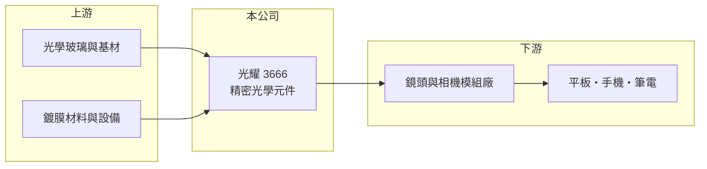

# 3666 光耀

> 上櫃｜[[產業索引-光電業|光電業]]｜上市（櫃）日期 2014/12/04

# 第一章：企業模式與商業藍圖

> [!info] 撰寫說明
> 精簡版，由 Claude 依公開資料整理，架構比照 [[2330台積電]]，資料截至 2026-10-07。來源：nstock.tw 光耀公司概況、winvest.tw 營收快訊。公開資料有限，營收比重未查到。#待校對

光耀是新竹科學園區的精密光學元件廠，規模小且目前虧損。

- **核心業務：** 光耀科技成立於 2004 年，2014 年上櫃，從事精密光學元件的研發與製造，應用於平板電腦、手機、筆記型電腦與光學鏡頭。
- **營收結構：** 本次未查到產品別比重，產品推估以鏡頭內使用的[[光學鍍膜]]元件與濾光片為主。
- **營運據點：** 註冊地與主要營運據點都在新竹科學園區。
- **長期方向：** 消費性電子之外，車用、感測等光學應用是小型元件廠尋求成長的方向（推估）。

# 第二章：護城河深度與競爭優勢

光耀屬於光學元件的小型供應商，議價能力有限。

- **競爭優勢：** 具備精密光學鍍膜與加工能力，能配合鏡頭廠的客製規格（推估）。
- **主要對手：** 台灣與中國的光學元件、濾光片廠，例如中國的水晶光電（推估）。
- **觀察重點：** 2026 年第二季[[毛利率]]為負，後續月營收回升能否讓毛利率轉正。

# 第三章：財務體質與盈利規模

資料日期：2026-10-07，以下數字是撰寫當時的快照；最新月營收、毛利率、累計 EPS 由自動排程寫在本筆記的屬性欄位（月營收、毛利率、累計EPS 等）。#待校對

光耀營收規模約每年 4 至 5 億元，2026 年上半年虧損。

- **營收規模：** 2025 年全年營收 4.6 億元；2026 年 1 至 8 月累計 3.19 億元、年減 3.17%，8 月 3,994 萬元、年增 21%。
- **獲利：** 2026 年第二季 EPS -0.28 元，上半年累計 -0.68 元；第二季毛利率 -9.13%。
- **財務特色：** 資本額約 13.89 億元，近五年沒有配息紀錄。

# 第四章：總體風險與地緣政治

光耀的風險在於持續虧損與終端市場集中在消費性電子。

- **產業週期：** 平板、手機與筆電出貨波動直接影響元件需求。
- **營運風險：** 毛利為負代表[[產能利用率]]或售價不足以支應成本，虧損持續可能需要增資或調整產線。
- **其他風險：** 中國同業低價競爭、匯率與原料價格波動。

# 專有名詞解析

## 應用

- **[[光學鍍膜]]**：在鏡片或玻璃表面鍍上多層薄膜，用來增加透光、過濾特定波長或防止反光。

## 金融

- **[[產能利用率]]**：實際使用產能占總產能的比例，固定成本高的製造業毛利率高度取決於此數字。

# 核心供應鏈

- 上游：光學玻璃、基材與鍍膜材料供應商
- 下游／客戶：鏡頭與相機模組廠，終端為平板、手機與筆電（推估）
- 同業：水晶光電等光學元件廠

## 最新新聞
<!-- news:start -->
<!-- news:end -->

## 相關連結
- [公開資訊觀測站](https://mopsov.twse.com.tw/mops/web/t05st03?step=1&firstin=1&co_id=3666)
- [Goodinfo](https://goodinfo.tw/tw/StockDetail.asp?STOCK_ID=3666)
- [Yahoo 股市](https://tw.stock.yahoo.com/quote/3666)
- [鉅亨網新聞](https://www.cnyes.com/twstock/3666/news)
