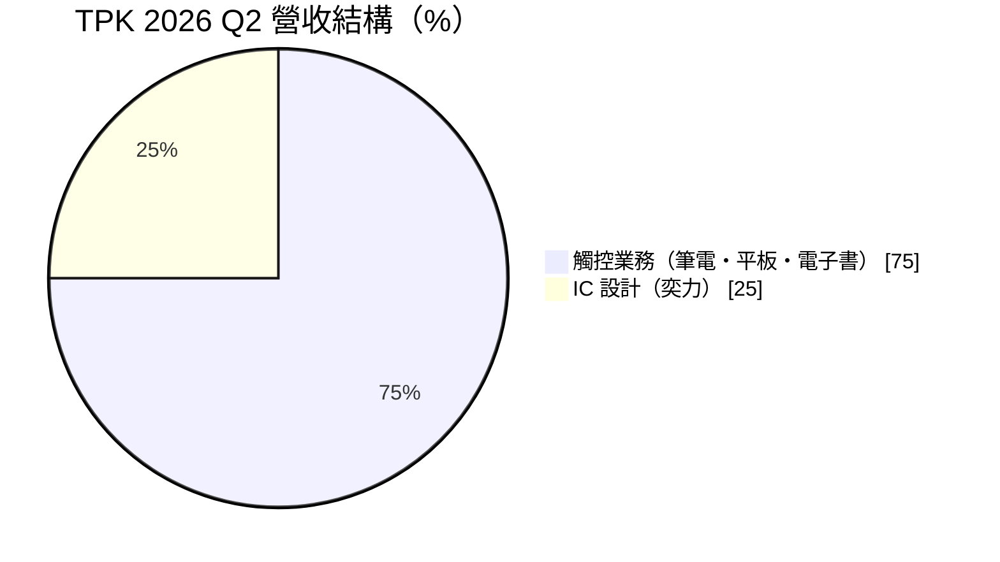
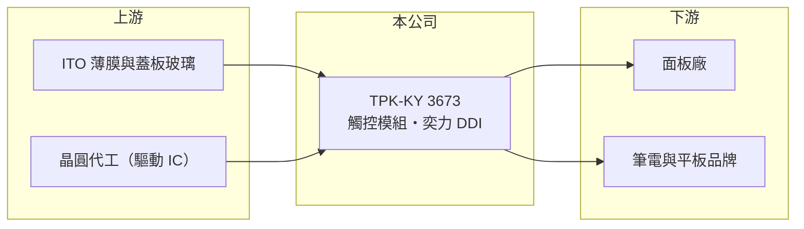

# 3673 TPK-KY

> 上市｜[[產業索引-光電業|光電業]]｜上市（櫃）日期 2010/10/29

# 第一章：企業模式與商業藍圖

> [!info] 撰寫說明
> 精簡版，由 Claude 依公開資料整理，架構比照 [[2330台積電]]，資料截至 2026-10-07。來源：TPK 2026 年第二季中文營運成果新聞稿（ir-cloud）、優分析、科技新報月營收快訊。#待校對

TPK-KY（宸鴻）是全球主要的觸控模組廠，2026 年透過入股奕力跨入顯示驅動 IC 設計。

- **核心業務：** TPK 生產筆電、平板與電子書等產品的觸控模組，以[[電容式觸控]]技術為主；2026 年 1 月入股 6963奕力-KY，新增 IC 設計產品營收。
- **營收結構：** 2026 年第二季 IC 設計產品約占 25%；觸控業務中（不含奕力）筆電與大尺寸平板約 52%、平板與電子書約 37%。
- **營運據點：** 總部與主要生產據點推估位於中國廈門，其他據點本次未查證。
- **長期方向：** 開發 [[TGV]] 玻璃鑽孔技術，切入先進封裝用的[[玻璃基板]]，是轉型半導體的主要方向。

# 第二章：護城河深度與競爭優勢

TPK 的優勢在大尺寸觸控模組的量產經驗與大客戶關係，但觸控本業毛利低。

- **競爭優勢：** 長期供應美系品牌的大尺寸觸控模組，具備大量交貨與良率管理經驗；奕力的 [[DDI]] 設計能力則帶來較高毛利的產品線。
- **主要對手：** 觸控方面有 [[6456GIS-KY]] 與中國觸控廠；面板內嵌觸控（in-cell）技術也持續取代外掛式觸控。
- **觀察重點：** 平板客戶導入 [[OLED]] 對觸控模組需求的影響、奕力營收季增能否延續，以及 TGV 技術的客戶認證進度。

# 第三章：財務體質與盈利規模

資料日期：2026-10-07，以下數字是撰寫當時的快照；最新月營收、毛利率、累計 EPS 由自動排程寫在本筆記的屬性欄位（月營收、毛利率、累計EPS 等）。#待校對

TPK 營收規模大但毛利率低，本業仍是營業虧損，淨利多來自業外與子公司。

- **營收規模：** 2026 年第二季營收 192.4 億元；上半年累計 371.2 億元、年增 14.9%。
- **獲利：** 2026 年第二季[[毛利率]] 6.2%、[[營業利益率]] -2.4%，稅後淨利 8.1 億元、EPS 2.0 元；上半年 EPS 3.33 元，稅後淨利年增 127.2%。
- **財務特色：** 營業利益為負而淨利為正，代表獲利仰賴[[業外收益]]，品質需要逐季檢視。

# 第四章：總體風險與地緣政治

TPK 的風險在於觸控本業的低毛利與客戶集中。

- **產業週期：** 筆電與平板出貨隨消費性電子景氣波動，新聞稿提到筆電市場受記憶體價格上漲干擾。
- **營運風險：** 大客戶集中度高，訂單轉移或技術改採 in-cell 都會直接影響營收；新事業投入初期將增加費用。
- **其他風險：** 生產據點在中國，面臨中美關稅與地緣政治風險；人民幣與美元匯率波動。

# 專有名詞解析

## 半導體

- **[[電容式觸控]]**：偵測手指接觸造成的微小電容變化來判斷位置的觸控技術，是筆電觸控板與手機螢幕的主流。
- **[[DDI]]**：顯示驅動 IC，負責控制面板每個像素的電壓，需要高壓製程，聯詠、奇景為主要設計公司。
- **[[TGV]]**：玻璃穿孔，在玻璃基板上鑽出微孔並填入導體，用於玻璃載板的垂直導通。
- **[[玻璃基板]]**：以玻璃取代有機樹脂作為載板核心材料，平整度與耐熱性較好，被視為下一代大尺寸 AI 晶片載板的候選技術。

## 金融

- **[[業外收益]]**：本業以外的收入，例如處分資產、投資收益或匯兌利益，通常較不穩定。

## 產業

- **[[OLED]]**：有機發光二極體顯示技術，每個像素自行發光、不需背光，對比高且可做成可彎折面板。

# 核心供應鏈

- 上游：ITO 薄膜、蓋板玻璃、觸控 IC；奕力的驅動 IC 委由晶圓代工廠生產（推估）
- 下游／客戶：筆電與平板品牌（主要客戶推估為 [[AAPL蘋果]]）、面板廠
- 同業：[[6456GIS-KY]]、[[3622洋華]]；DDI 同業有 [[3034聯詠]]、[[3592瑞鼎]]

## 最新新聞
<!-- news:start -->
<!-- news:end -->

## 相關連結
- [公開資訊觀測站](https://mopsov.twse.com.tw/mops/web/t05st03?step=1&firstin=1&co_id=3673)
- [Goodinfo](https://goodinfo.tw/tw/StockDetail.asp?STOCK_ID=3673)
- [Yahoo 股市](https://tw.stock.yahoo.com/quote/3673)
- [鉅亨網新聞](https://www.cnyes.com/twstock/3673/news)
