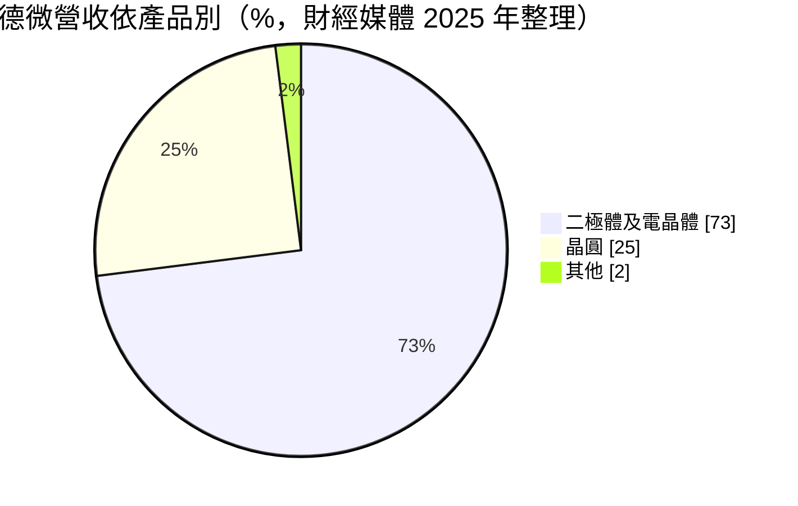
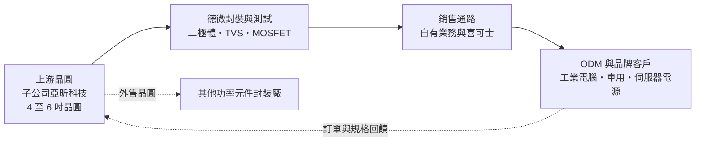
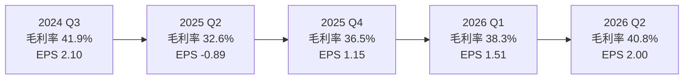
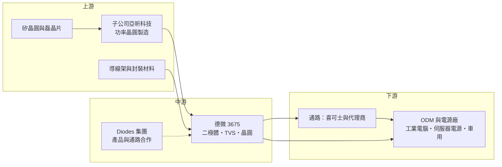

# 3675 德微

> 上櫃｜[[產業索引-半導體業|半導體業]]｜上市（櫃）日期 2012/06/29

# 第一章：企業模式與商業藍圖

> [!info] 撰寫說明
> 本文由 Claude 依公開資料整理，架構比照 [[2330台積電]] 的四章研究，資料截至 2026-10-08。財務數字來源：HiStock 嗨投資（歷年 EPS、季度利潤比率、杜邦分析 ROE、月營收累計）、櫃買中心 OpenAPI 財報（2026 上半年損益與資產負債）、優分析、經濟日報、科技新報、Money錢、nStock、Uptogo 整理之財經報導；產業描述為整理性內容，尚未逐條比對原始文件。#待校對

評估一家公司的長期價值，第一步是弄清楚它靠什麼賺錢、在產業鏈裡站在哪個位置。本章針對德微科技（股票代號：3675，以下簡稱德微）的商業模式進行定性分析，說明它如何從二極體封裝廠，逐步往上游晶圓、往下游通路延伸，成為一家小型的垂直整合[[功率半導體]]公司。

## 一、核心定位：以二極體為核心的功率分離式元件廠

德微成立於 1995 年，2012 年在櫃買中心掛牌，主要產品是整流二極體、[[蕭特基二極體]]、超快速整流二極體與 [[TVS]] 保護元件等[[分離式元件]]，另外也銷售自己生產的二極體晶圓。依財經媒體報導，德微屬於美國 Diodes（達爾）集團旗下的子公司，這層關係讓德微除了自有品牌客戶之外，也與國際大廠的產品線與通路產生連結。

功率分離式元件的功能很單純：讓電流只往一個方向流、把交流電整流成直流電，或在電壓突然升高時把多餘的能量導走以保護後端晶片。這類元件單價低、用量大，幾乎每一台電腦、伺服器電源、汽車與家電都需要數十到上百顆。正因為產品標準化程度高，這個產業的競爭重點不在設計，而在於製造成本、良率、交期穩定度與能否通過客戶的長期認證。

德微的定位可以概括為兩點。第一，它是「台灣製造」的功率元件供應商，晶圓製造與封裝都在台灣完成，這在全球供應鏈重組時成為接單的賣點。第二，它正從單純的封裝廠轉型為整合元件製造商（[[IDM]]），自己掌握晶圓、封裝與部分銷售通路，目的是把毛利留在公司內部，並縮短新產品開發時間。

## 二、終端應用與產品板塊

依財經媒體整理的資料，德微的營收以元件為主、晶圓為輔：

**二極體及電晶體元件。** 這是德微的主力，包括蕭特基二極體、超快速整流二極體與 TVS 等。蕭特基二極體導通損耗低，適合用在電源供應器與 DC-DC 轉換電路；TVS 則用來保護電路免受突波或靜電損害。公司曾對外表示 TVS 產品良率達 97% 至 98%，代表在高度價格競爭的產品上，仍能靠製造效率維持合理毛利。

**晶圓。** 德微也銷售蕭特基晶圓與矽整流晶圓給其他封裝廠。晶圓業務一方面讓自家工廠產能被充分利用，另一方面也讓德微成為部分同業的上游供應商，這種「既是競爭者、也是供應商」的角色在功率分離式元件產業相當常見。

**應用端。** 產品主要用於[[工業電腦]]、汽車電子、個人電腦與消費性電子。近年新的需求來自 AI 伺服器電源與資料中心高壓供電架構（[[HVDC]]），以及 AR 眼鏡、AI 耳機、機器人等邊緣裝置。這些新應用對保護元件與高效率整流的要求較高，屬於單價與毛利都較好的產品。

## 三、資本轉化邏輯：從封裝廠走向垂直整合

德微的營運模式可以理解為三段式整合，每一段都有明確的商業目的。

**往上游整合晶圓。** 德微透過收購亞昕科技與集團基隆廠，取得 4 至 6 吋功率晶圓的製造能力。過去封裝廠必須向外購買晶圓，晶圓供應緊張時就會缺貨，毛利也被上游拿走一部分。自己做晶圓之後，德微可以決定產品規格與產能分配，在景氣好時把晶圓先供應自家高毛利產品。亞昕近年投入 800V AI 電源節能晶片，依 2025 年報導這類產品已占亞昕營收超過四分之一，並在 2026 年啟動公開發行、規劃登錄興櫃。

**往下游延伸通路。** 德微投資通路商喜可士約 40% 股權，目的是更直接接觸 ODM 與 AI 伺服器供應鏈。分離式元件過去多經由代理商銷售，製造廠不一定知道終端客戶在設計什麼產品；擁有通路之後，德微能更早參與客戶設計，提高新產品被採用的機率。

**營運槓桿。** 封裝與晶圓廠的折舊、人力屬於固定成本，產能利用率提高時，每多出貨一顆元件的利潤會明顯放大。這也是德微季度[[毛利率]]在 30% 到 42% 之間大幅擺動的主要原因：需求好時毛利率可接近四成，庫存調整時則迅速滑落。

## 四、企業長期藍圖

德微的長期方向有三條主線。第一是**產品升級**：從一般整流二極體走向 AI 伺服器電源、800V 高壓架構與車用元件，這些產品的認證時間長、價格較穩定。第二是**完整的 IDM 化**：讓晶圓、封裝、通路在同一集團內完成，以「台灣製造」與穩定交期爭取國際客戶。2025 年荷蘭功率元件大廠安世半導體（Nexperia）發生供應鏈事件後，德微表示轉單效應在後續數季逐步浮現，這類事件顯示供應來源分散對客戶的價值。第三是**擴充產能**：2026 年起亞昕新增的 6 吋設備陸續到位，主要用來提高 AI 電源節能晶片的產能。

這三條主線的共同邏輯，是讓德微擺脫「低價標準品封裝廠」的定位，轉向少量多樣、需要認證的利基型功率元件。轉型能否成功，最終要看高毛利產品的比重能否持續上升，並在下一次產業庫存調整時守住毛利率。

# 第二章：護城河深度與競爭優勢

在長期價值投資中，「護城河」指企業抵禦競爭、維持超額利潤的保護機制。本章分析德微在功率分離式元件市場的競爭優勢、主要對手，以及這些優勢能在多大程度上抵抗價格戰。

## 一、護城河的核心組成要素

德微屬於「窄護城河」企業。分離式元件技術成熟、對手眾多，任何單一優勢都不足以長期壟斷，但幾項優勢疊加之後，仍讓德微在利基市場保有一定的定價空間。

**1. 製造成本與良率。** 功率分離式元件的售價以分、角計算，成本稍高就無法接單。德微公開表示 TVS 良率達 97% 至 98%，代表它在製程控制上已相當成熟。良率每提高一個百分點，等於直接降低單位成本，這是長年累積的工藝經驗，新進者難以在短時間內追上。

**2. 垂直整合帶來的供應穩定。** 擁有自家晶圓廠的封裝廠，在晶圓吃緊時可以優先保障自家出貨。對客戶來說，元件雖然便宜，但缺一顆就無法出貨，因此「能不能準時交貨」往往比價格更重要。德微整合晶圓與封裝後，在交期穩定度上比單純外購晶圓的同業更有說服力。

**3. 認證帶來的轉換成本。** 工業電腦、車用與伺服器電源客戶，每導入一個新元件都要做可靠度測試與長期驗證。一旦德微的元件被設計進某個平台，在產品生命週期內（工業與車用常達五年以上）通常不會輕易更換供應商。這種黏著度是分離式元件廠最重要的護城河來源。

**4. 集團背景與台灣製造。** 身為 Diodes 集團旗下公司，加上晶圓與封裝都在台灣，德微能同時滿足國際客戶對品質系統的要求，以及「中國以外產能」的供應鏈分散需求。

## 二、全球主要競爭對手格局

| 對手 | 定位 | 對德微的威脅 |
|---|---|---|
| 安森美（onsemi）、Vishay | 國際功率元件大廠，產品線完整 | 在車用與工業市場擁有品牌與認證優勢，可整包供貨 |
| 安世半導體（Nexperia） | 歐洲標準品分離式元件大廠 | 規模大、成本低；2025 年供應鏈事件後部分客戶轉單 |
| [[5425台半]]、[[2481強茂]] | 台灣二極體與 MOSFET 同業 | 產品高度重疊，直接爭奪同一批 ODM 與通路客戶 |
| 中國分離式元件廠 | 政策扶植、擴產積極 | 以低價搶占消費性與一般工業市場，壓抑標準品價格 |

## 三、優勢轉化：守得住與守不住的市場

**守得住的市場。** 需要長期認證的工業電腦、車用與伺服器電源，以及要求台灣或非中國產能的國際客戶。這些客戶在乎交期與品質穩定，價格敏感度較低，德微的良率與垂直整合優勢最能發揮。AI 伺服器的高壓供電與保護元件，也屬於規格要求高、供應商較少的市場。

**守不住的市場。** 一般消費性電子使用的標準品二極體。這類產品規格公開、替代性高，中國廠商的擴產會長期壓低價格。2024 年第四季與 2025 年第二、三季德微毛利率掉到 29% 至 33%，反映的就是需求轉弱與價格競爭同時發生時，標準品毛利的脆弱性。

**觀察重點。** 第一，高毛利產品（AI 電源、車用、800V 元件）占營收比重能否持續提高。第二，亞昕擴產後的產能利用率能否維持高檔，避免折舊拖累毛利。第三，在下一次產業庫存調整時，毛利率的低點是否比過去墊高；若低點逐次提高，代表產品組合轉型真正發揮了作用。

# 第三章：財務體質與盈利規模

資料日期：2026-10-08。數字取自 HiStock 嗨投資（歷年 EPS、季度利潤比率、杜邦分析 ROE、月營收累計）與櫃買中心 OpenAPI 財報，表格是撰寫當時的快照；最新月營收、毛利率、累計 EPS 由自動排程寫在本筆記的屬性欄位（月營收、毛利率、累計EPS 等）。#待校對

財務報表是檢驗護城河是否真實存在的最終標準。本章用多年度的三率、ROE、現金流與資本報酬，檢視德微在功率元件景氣循環中的獲利品質。

## 一、獲利能力的基石：三率

| 年度 | 營收（新台幣） | [[毛利率]] | [[營業利益率]] | EPS（元） | [[ROE]] |
|---|---|---|---|---|---|
| 2021 | 未查得 | 約 33.0%（推算） | 約 16.4%（推算） | 7.36 | 約 29.6%（推算） |
| 2022 | 21.78 億 | 約 36.9%（推算） | 約 19.8%（推算） | 9.08 | 約 34.1%（推算） |
| 2023 | 17.40 億 | 約 37.5%（推算） | 約 17.9%（推算） | 6.73 | 約 22.5%（推算） |
| 2024 | 29.26 億 | 約 34.4%（推算） | 約 11.5%（推算） | 8.34 | 約 14.6%（推算） |
| 2025 | 26.37 億 | 約 34.7%（推算） | 約 8.3%（推算） | 2.67 | 約 5.8%（推算） |
| 2026 上半年 | 14.86 億 | 39.6% | 16.4% | 3.51 | 未滿一年 |

註：年度毛利率與營業利益率為四季數字的簡單平均，ROE 為四季單季 ROE 加總，皆為推算值。2024 年營收大增，主要是合併亞昕科技所致，2023 年在合併後的重編基礎約為 20.25 億元，兩者不能直接比較。

**毛利率的長期區間。** 過去五年德微的毛利率大致落在 30% 到 42% 之間，平均約 35%。對一家以標準品為主的分離式元件廠來說，這個水準不算低，反映出晶圓自製與良率控制帶來的成本優勢。毛利率的高低點主要跟著產能利用率與產品組合移動，2026 年上半年回到 39.6%，與公司提高高附加價值產品比重的說法一致。

**營業利益率的波動更大。** 營業費用相對固定，因此營收一下滑，營業利益率就會被放大壓縮。2022 年營業利益率約兩成，2025 年降到約 8%，2025 年第二季甚至出現稅前虧損，從季度資料看，當季營業利益仍為正，虧損來自業外，推估與新台幣升值造成的匯兌損失有關（原因未查得原始說明）。

**EPS 與股本。** 德微 2022 年 EPS 9.08 元是近年高峰，2025 年降至 2.67 元，2026 年上半年已回到 3.51 元。由於股本只有約 5.3 億元，獲利變動會在 EPS 上被明顯放大，這是小型股的典型特性。

## 二、ROE：資本效率

以單季 ROE 加總推算，德微在 2021 至 2023 年的 ROE 約在 22% 至 34%，是資本效率相當好的時期；2024 年合併亞昕、資產規模擴大後，ROE 降到約 15%，2025 年景氣低迷時只剩約 6%。近五年平均 ROE 約 21%（推算），但趨勢是往下走的。

ROE 下滑有兩個原因。第一是景氣循環，2025 年功率元件市場庫存調整，獲利大幅縮水。第二是資本結構改變，垂直整合需要投入晶圓廠與設備，股東權益與資產都變大，同樣的獲利換算成 ROE 就會變低。換句話說，德微用較低的資本效率，換取供應穩定與產品升級的能力，這筆交易是否划算，要看未來高毛利產品能否把 ROE 拉回 15% 以上。

## 三、資本支出與自由現金流

**資本支出。** 德微具體的年度[[CapEx]]金額未查得。可以確定的是，亞昕自 2026 年起陸續引進 6 吋生產設備，代表公司正處於投資期，折舊在未來幾年會增加。功率晶圓廠的設備規模遠小於先進製程晶圓廠，資本支出相對營收的比例屬於中低水準（推估）。

**自由現金流與股利。** 德微長期維持配息，近五年平均現金股利約 4.91 元。2024 年度每股配發 5.15 元，配發率約 62%；2025 年度每股配發 4 元，高於當年 EPS 2.67 元，代表公司動用過去累積的盈餘維持股利水準。這種做法顯示經營層重視股利穩定，但若未來資本支出增加、獲利又遇到低谷，股利可能需要調整。[[自由現金流]]是否長期為正，因未查得現金流量表的多年資料，無法確認。

## 四、[[ROIC]] 與 [[WACC]]：價值創造利差

**ROIC 推算。** 以 2026 年上半年營業利益 2.43 億元年化為 4.87 億元，乘以（1－20% 稅率）得稅後營業利益約 3.90 億元。投入資本若只計 2026 年第二季底股東權益 33.26 億元（有息負債金額未查得），ROIC 約 11.7%；若保守地把全部負債 19.38 億元都視為投入資本，ROIC 約 7.4%。以 2025 年估算，營業利益約 2.19 億元（營收 26.37 億元乘以平均營業利益率 8.3%），稅後約 1.75 億元，除以約 33 億元的權益，ROIC 只有約 5.3%。以上皆為推算。

**WACC 推算。** 以 CAPM 估算股東要求報酬率：無風險利率取台灣 10 年期公債約 1.75%，市場風險溢酬約 6%，β 假設為 1.1（功率半導體同業常見值，非德微實際數字），得權益成本約 8.35%。假設有息負債占投入資本約 20%、稅前負債成本 2.5%（稅後約 2.0%），WACC 約為 0.8 × 8.35% + 0.2 × 2.0% ≈ 7.1%，區間約 7% 至 8%（推算）。

**價值創造判斷。** 2021 至 2023 年德微的 ROE 長期高於 20%，ROIC 明顯高於資金成本，屬於創造價值的時期。2025 年 ROIC 約 5%，低於約 7% 至 8% 的 WACC，等於當年在侵蝕股東價值。2026 年上半年年化 ROIC 回到 7% 至 12%，大致與 WACC 持平或略高。德微長期能否創造價值，關鍵在於垂直整合投入的資本，能否換來比過去更高、更穩定的利潤率。

# 第四章：總體風險與地緣政治

任何企業都無法脫離宏觀環境獨立存在。本章分析德微未來十年必須面對的地緣政治、產業週期、營運與技術風險。

## 一、地緣政治

**供應鏈去中國化是順風。** 美中科技競爭讓國際客戶傾向把關鍵元件分散到中國以外生產。德微晶圓與封裝都在台灣，屬於受惠的一方。2025 年安世半導體事件更凸顯單一來源的風險，客戶開始把台灣供應商列為第二來源。這種結構性轉變若延續，能為德微帶來長期的新客戶。

**台灣集中風險。** 反過來說，德微的產能高度集中在台灣，面臨與其他台灣半導體公司相同的兩岸風險、電力供應與天災風險。目前未查得德微在海外設廠的計畫。

**關稅政策。** 分離式元件多半先賣給 ODM，再組裝成電腦或電源出口到美國。美國關稅政策的變化會影響終端產品的生產地點，進而改變德微客戶的分布，但不一定直接減少需求。

## 二、產業週期與市場結構

**庫存循環明顯。** 分離式元件是典型的[[長鞭效應]]產業：終端需求小幅變動，經過代理商、ODM 層層放大後，到元件廠就成為大幅的訂單波動。德微 2023 年與 2025 年營收都曾出現兩位數衰退，未來仍會反覆出現類似的循環。

**中國產能擴張。** 中國功率元件廠在政策支持下持續擴產，標準品價格長期承壓。德微必須持續把產品組合往高規格移動，才能避免被拉進純價格戰。

**AI 帶來的結構性需求。** 資料中心從低壓供電轉向高壓直流，每台伺服器電源需要的保護與整流元件數量和規格都在提高。這是未來十年少數確定性較高的成長動能，但同時也會吸引國際大廠投入，競爭不會比過去輕鬆。

## 三、營運環境的隱性風險

**匯率。** 德微外銷比重高，新台幣升值會產生匯兌損失並壓低以台幣計算的毛利。2025 年第二季營業利益為正、稅前卻轉虧，就是匯率影響獲利的例子（推估）。

**擴產與折舊。** 亞昕擴產後折舊增加，如果新產能沒有被高毛利產品填滿，毛利率反而可能下滑。垂直整合讓德微的固定成本比過去更高，景氣反轉時的獲利下滑幅度也可能更大。

**集團關係。** 德微與 Diodes 集團之間的產品分工、定價與通路安排，屬於關係人交易的範圍。集團策略若調整，可能影響德微的產品方向或接單來源，投資人應關注年報中的關係人交易揭露。

## 四、科技與法規演進

**寬能隙材料的替代。** 高壓、高頻的電源設計正逐步採用[[SiC]] 與 [[GaN]] 元件，傳統矽基二極體在部分高階應用可能被取代。德微目前以矽基產品為主，未來是否需要投入寬能隙材料，或在既有矽基產品上找到不被取代的利基，是長期的技術課題。

**車規與能效法規。** 各國對電源轉換效率與汽車電子可靠度的要求持續提高，認證門檻上升一方面保護已通過認證的廠商，另一方面也讓新產品的開發與驗證成本變高。德微若要擴大車用比重，需要長期投入品質系統與驗證資源。

# 專有名詞解析

## 半導體

- **[[功率半導體]]**：負責電能轉換與控制的半導體，例如二極體、MOSFET、IGBT，用在電源、馬達與充電設備中。
- **[[分離式元件]]**：單一功能的半導體元件，例如二極體、電晶體，相對於把許多功能整合在一起的積體電路。
- **[[蕭特基二極體]]**：以金屬與半導體接面製成的二極體，導通壓降低、切換速度快，常用於電源供應器與整流電路。
- **[[TVS]]**：暫態電壓抑制二極體，在電壓瞬間升高時導走多餘能量，保護後端晶片不被突波或靜電損壞。
- **[[IDM]]**：從晶片設計、晶圓製造到封裝測試都由自己完成的整合元件製造商。
- **[[SiC]]**：碳化矽，一種寬能隙半導體材料，耐高壓、耐高溫，適合電動車與高壓電源。
- **[[GaN]]**：氮化鎵，一種寬能隙半導體材料，切換速度快、體積小，常用於快充與資料中心電源。

## 金融

- **[[營運槓桿]]**：固定成本占比高的企業，營收增加時利潤增幅會大於營收增幅，營收減少時利潤也會加速下滑。
- **[[ROIC]]**：投入資本報酬率，衡量公司用股東與債權人投入的資金，每年能創造多少稅後營業利益。
- **[[WACC]]**：加權平均資金成本，股東與債權人要求報酬率的加權平均，是判斷投資是否創造價值的門檻。
- **[[配發率]]**：現金股利占每股盈餘的比例，反映公司把多少獲利以現金發還股東。
- **[[長鞭效應]]**：終端需求的小幅變動，沿供應鏈往上游傳遞時被逐級放大，造成上游庫存與訂單劇烈波動。

## 產業

- **[[HVDC]]**：高壓直流供電，資料中心以較高的直流電壓配電，可減少轉換損耗，是 AI 伺服器電源架構的發展方向。
- **[[工業電腦]]**：用於工廠自動化、交通、醫療等場域的電腦，強調長期供貨與穩定性，產品生命週期常達五年以上。

# 核心供應鏈

## 1. 上游：晶圓與材料
- 功率晶圓製造：子公司亞昕科技（4 至 6 吋），並取得集團基隆廠
- 矽晶圓（產業代表廠商，未查得實際交易關係）：[[6488環球晶]]、[[5483中美晶]]

## 2. 中游：德微本身與集團夥伴
- 集團母公司：Diodes（達爾）
- 台灣同業：[[5425台半]]、[[2481強茂]]
- 國際同業：安森美（onsemi）、Vishay、安世半導體（Nexperia）

## 3. 下游：通路與終端客戶
- 轉投資通路商：喜可士（持股約 40%）
- 主要應用：工業電腦、汽車電子、個人電腦、AI 伺服器電源（具體客戶名單未查得）

## 最新新聞
<!-- news:start -->
<!-- news:end -->

## 相關連結
- [公開資訊觀測站](https://mopsov.twse.com.tw/mops/web/t05st03?step=1&firstin=1&co_id=3675)
- [Goodinfo](https://goodinfo.tw/tw/StockDetail.asp?STOCK_ID=3675)
- [Yahoo 股市](https://tw.stock.yahoo.com/quote/3675)
- [鉅亨網新聞](https://www.cnyes.com/twstock/3675/news)
