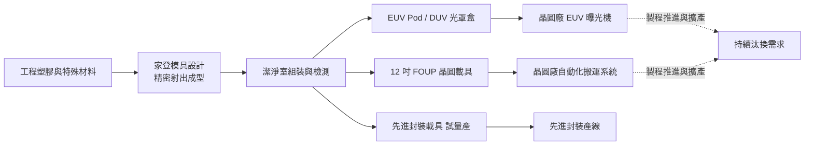
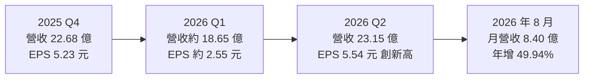
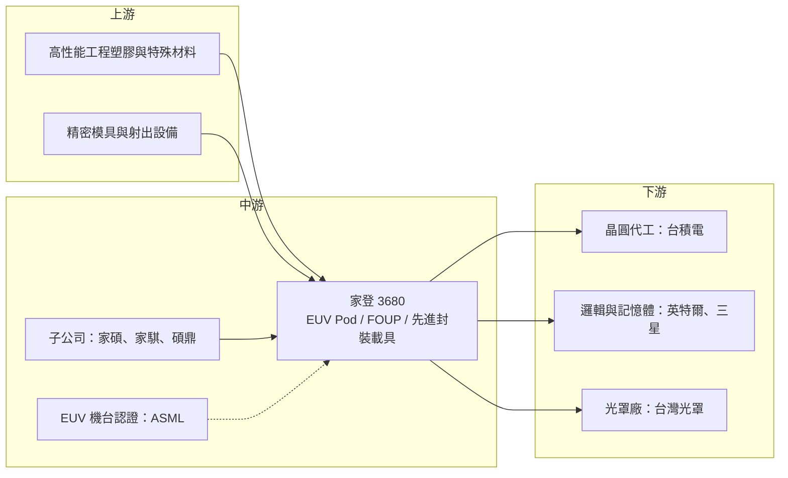

# 3680 家登

> 上櫃｜[[產業索引-半導體業|半導體業]]｜上市（櫃）日期 2011/08/31

# 第一章：企業模式與商業藍圖

> [!info] 撰寫說明
> 本文由 Claude 依公開資料整理，架構比照 [[2330台積電]] 的四章研究，資料截至 2026-10-07。財務數字來源：自由時報財經（2026 年 8 月第二季財報報導）、旺得富／中時（2025 年財報報導）、富果研究（2026 年 3 月法說整理與公司分析）、winvest 月營收快訊；產業描述為整理性內容，尚未逐條比對原始文件。各產品線的精確營收比重本次未查得，因此未繪製營收結構圓餅圖。#待校對

在評估單一個股的長期投資價值時，首要步驟是拆解企業的底層獲利邏輯。本章針對家登精密（股票代號：3680，以下簡稱家登）的商業模式進行定性分析，說明一家從塑膠模具起家的公司，如何變成先進製程不可或缺的「搬運盒」供應商，以及它的成長為何與晶圓廠的製程推進幾乎同步。

## 一、核心定位：先進製程不可或缺的「搬運盒」供應商

家登成立於 1998 年，2011 年上櫃，董事長為邱銘乾。家登早年從高精密塑膠模具與[[精密射出成型]]起家，後來切入半導體領域，專門生產用來保護、運送[[光罩]]與晶圓的載具。

半導體製程對潔淨度要求極高，光罩與晶圓在機台之間移動、儲存時，必須放在特製的密封盒中，避免微粒與化學污染。到了 [[EUV]] 世代，光罩更怕微粒，一顆微小的灰塵就可能讓整批晶圓報廢，因此 EUV 光罩盒（[[EUV Pod]]）的精密度與潔淨度要求遠高於傳統產品。家登在 2014 年取得 [[ASML艾司摩爾]] 的 EUV 光罩盒認證，是全球少數能量產 EUV 光罩盒的業者。

這個定位有兩個商業意義：

* **耗材屬性：** 光罩盒與晶圓盒會隨晶圓廠擴產、製程換代與使用磨耗持續汰換，需求不是一次性的設備採購，而是隨產能規模持續發生。
* **跟著製程走：** 每一代先進製程的 EUV 光罩層數增加、每一座新 EUV 晶圓廠建置，都會直接帶來新的載具需求，讓家登成為先進製程擴產的「間接受惠者」。

## 二、終端應用／產品板塊：光罩載具、晶圓載具與先進封裝載具

依富果研究整理，家登的業務分成三大類：

* **光罩載具：** 以 EUV 光罩盒為主，EUV Pod 占光罩載具營收的一半以上，也包括傳統 DUV 光罩盒。EUV 光罩盒是家登毛利最高、技術門檻最高的產品。
* **晶圓載具：** 以 12 吋前開式晶圓傳送盒（[[FOUP]]）為主，用於晶圓廠內部在機台間運送晶圓。先進製程的 FOUP 對材料[[釋氣]]、抗靜電與尺寸精度要求更高。
* **先進封裝載具：** 2026 年仍在試量產階段，毛利率優於公司平均，是新的成長引擎，對應 AI 晶片[[先進封裝]]的需求。

此外，家登旗下有家碩（設備）、家騏（冷卻系統）、碩鼎（先進封裝載具）等子公司，並在 2020 年跨入航太精密零組件。

## 三、資本轉化邏輯：精密成型能力轉成高毛利耗材

* **一條龍製造：** 從模具設計、射出成型到潔淨組裝自己完成，這是家登能控制品質與毛利的關鍵。2026 年上半年毛利率 43.23%，屬半導體耗材中的高毛利水準。
* **產能布局：** 主要產能在台灣，台南樹谷 P2 廠產能陸續開出；中國設有昆山據點；日本九州久留米廠興建中，依不同報導預計 2026 年底至 2027 年間啟用，作為全球第三個備援基地；美國亞利桑那州設有初期零件加工產線，配合客戶在美國的擴產。
* **擴產先於營收：** 多個據點同時建置，折舊與費用先發生、營收後到，2025 年就出現「營收成長、獲利下滑」的情況。

## 四、企業長期藍圖：跟著先進製程與先進封裝走

家登的成長幾乎與先進製程推進同步。2025 年第四季，大客戶 2 奈米製程量產，帶動光罩載具與晶圓載具出貨同時創下高峰。長期策略包括：

* **深耕 EUV 與先進製程：** 每一代製程推進、每一座新 EUV 晶圓廠建置，都帶來新的 EUV 光罩盒與先進 FOUP 需求；下一代 [[High-NA EUV]] 也需要新規格的光罩保護。
* **切入先進封裝：** 把在前段製程累積的潔淨與精密技術，延伸到 AI 晶片的封裝端。
* **全球化備援：** 跟著客戶到日本、美國設廠，降低台灣集中風險，並爭取當地晶圓廠訂單。

# 第二章：護城河深度與競爭優勢

在長期價值投資中，「護城河」指企業抵禦競爭、維持超額利潤的保護機制。本章分析家登的護城河構成、全球晶圓與光罩載具的競爭格局，以及家登在 EUV 與 FOUP 兩個市場各自能守住多少。

## 一、護城河的核心組成要素

家登的護城河屬於「中等到寬」，在 EUV 光罩盒領域尤其明顯：

* **1. ASML 認證與設備相容性：** EUV 光罩盒必須與 ASML 的 EUV 曝光機完全相容，取得認證的業者極少。家登 2014 年即通過認證，十多年的量產經驗形成很高的進入門檻。
* **2. 客戶驗證與綁定：** 光罩盒與晶圓盒一旦導入晶圓廠的自動化搬運系統，更換供應商需要重新驗證，晶圓廠很少為了價格冒險換貨，因為一次污染造成的報廢損失遠高於載具本身的價格。
* **3. 材料與精密成型技術：** 載具需要極低的釋氣、極高的尺寸精度與潔淨度，家登具備模具設計、射出成型到潔淨組裝的一條龍能力。
* **4. 專利布局：** 家登在光罩盒領域累積大量專利，過去也曾與國際競爭對手發生專利訴訟，顯示這是一個以技術與專利為主要競爭手段的市場。

## 二、全球主要競爭對手格局

| 對手 | 定位 | 對家登的威脅 |
|---|---|---|
| Entegris（英特格） | 美國半導體材料與耗材大廠，FOUP 與光罩盒都是全球主要供應商 | 產品線比家登廣，可用材料、過濾與載具組合銷售 |
| 信越聚合物（Shin-Etsu Polymer） | 日本晶圓載具大廠 | 在 FOUP 市場有相當份額，與日本晶圓廠關係深 |
| Miraial | 日本晶圓載具業者 | 主要競爭晶圓運送盒市場 |
| 中國本土業者 | 成熟製程用載具逐步擴產 | 在成熟製程載具以價格競爭，EUV 光罩盒仍有明顯技術差距（推估） |

## 三、優勢轉化：哪些市場守得住、哪些守不住

* **守得住：** EUV 光罩盒的技術門檻與 ASML 認證，讓家登在這塊市場具有寡占地位；2026 年上半年毛利率 43.23%，顯示產品具有良好的定價能力。
* **守不住：** FOUP 市場競爭者較多，Entegris 規模大、產品線完整，能以組合銷售爭取客戶；成熟製程用載具價格競爭較激烈。
* **觀察重點：** 2 奈米及更先進製程的 EUV 層數增加，能否持續推升 EUV 光罩盒需求；先進封裝載具能否從試量產走到正式量產；日本、美國新據點能否爭取到台灣以外的客戶。

# 第三章：財務體質與盈利規模

資料日期：2026-10-07。數字取自自由時報財經、旺得富／中時與富果研究等財經媒體整理，表格是撰寫當時的快照；最新月營收、毛利率、累計 EPS 由自動排程寫在本筆記的屬性欄位（月營收、毛利率、累計EPS 等）。#待校對

財務報表是檢驗護城河是否真實存在的最終標準。本章用三率、ROE、現金流與資本報酬，檢視家登在擴產期間的獲利品質。

## 一、獲利能力的基石：三率

| 項目 | 2025 全年 | 2025 Q4 | 2026 Q1 | 2026 Q2 |
|---|---|---|---|---|
| 營收（新台幣） | 73.47 億 | 22.68 億 | 約 18.65 億（推算） | 23.15 億 |
| [[毛利率]] | 41.88% | 43.28% | 約 42.63%（推算） | 43.71% |
| [[營業利益率]] | 14.91% | 17.47% | 約 15.63%（推算） | 17.28% |
| EPS（元） | 9.43 | 5.23 | 約 2.55（推算） | 5.54 |

* **[[毛利率]]：** 長期維持在四成以上，公司對 2026 年的目標是營收雙位數成長、毛利率維持在 40% 至 45% 區間。毛利率穩定代表 EUV 光罩盒的定價能力沒有被擴產稀釋。
* **[[營業利益率]]：** 約 15% 至 17%，與毛利率之間有超過 25 個百分點的落差，反映研發、專利與營業費用占比不低，以及新廠初期費用。
* **2025 年獲利下滑：** 營收年增 12.26%，但營業利益年減 8.15%、淨利年減 22.48%，代表新廠投產初期費用與折舊壓抑了獲利；第四季隨大客戶 2 奈米量產，營收季增 36.57%，獲利明顯回升。
* **2026 年回升：** 第二季淨利 5.32 億元，季增 1.17 倍，單季 EPS 5.54 元創新高。上半年營收 41.8 億元、毛利率 43.23%、營業利益率 16.54%、淨利 7.77 億元、EPS 8.09 元；第一季數字依上半年累計與第二季推算。

## 二、[[ROE]]：資本效率

家登屬於高毛利的精密耗材業者，但近年台南、日本、美國擴產讓資產規模增加，2025 年獲利年減，資本效率階段性下滑；2026 年營收放大後，資本效率回升（推估）。確切 ROE 數字本次未查得。

## 三、資本支出與自由現金流

* **[[CapEx]]：** 主要投入台南樹谷 P2 廠、日本久留米廠與美國亞利桑那產線，確切金額本次未查得。
* **[[自由現金流]]：** 光罩盒與晶圓盒屬於耗材型產品，隨晶圓廠擴產與製程推進持續有需求，營業現金流相對穩定，但新據點建置期間自由現金流可能偏緊（推估）。
* **股利政策：** 家登 2026 年上半年擬配發每股 10 元，其中盈餘配發 6 元、[[資本公積]]配發 4 元，採半年配息。以資本公積配發的部分不是當期獲利，評估殖利率時應區分。2025 年度完整股利金額本次未查得。

## 四、[[ROIC]] 與 [[WACC]]：價值創造利差

家登的毛利率高，代表每一元營收的附加價值高；但擴產期間投入資本增加快於營業利益，ROIC 在 2025 年應有下滑（推估）。日本、美國新據點的產能利用率，決定 ROIC 能否回到擴產前水準，具體數值未查得。

# 第四章：總體風險與地緣政治

任何企業都無法脫離宏觀環境獨立存在。本章分析家登未來必須面對的地緣政治、產業週期、營運與技術風險。

## 一、地緣政治風險

* **台灣集中：** 主要產能與最大客戶都在台灣，面臨兩岸風險；日本與美國據點是降低集中風險的布局，但規模仍小。
* **中國據點：** 昆山據點服務中國客戶，但美國對中國先進製程的管制，使中國市場的 EUV 相關需求受限。
* **美國關稅與在地化：** 客戶在美國擴產，可能要求載具在當地生產，家登亞利桑那產線需要逐步擴大，成本較台灣高。

## 二、產業週期與市場結構風險

* **客戶集中：** 營收成長高度依賴少數先進製程晶圓廠，尤其是台灣最大的晶圓代工廠。大客戶擴產節奏放緩時，家登出貨會直接受影響。
* **EUV 推進速度：** EUV 光罩盒需求與 EUV 機台裝機數、EUV 層數高度連動；若先進製程擴產放緩，成長動能會減弱。
* **半導體景氣循環：** 晶圓廠[[產能利用率]]下降時，FOUP 等晶圓載具的汰換需求也會延後。

## 三、營運環境的隱性風險

* **新廠爬坡：** 多個新據點同時建置，費用與折舊先行，2025 年已出現營收成長但獲利下滑的情況。
* **專利訴訟：** 光罩盒領域專利密集，與國際對手的專利爭議可能帶來訴訟費用或市場限制。
* **資本公積配息：** 部分股利來自資本公積，若獲利成長不如預期，股利水準可能難以維持。

## 四、科技演進風險

下一代 High-NA EUV 與更先進的製程，對光罩保護與潔淨度要求會再提高。家登需要持續與 ASML 及客戶共同開發新規格；若競爭對手率先取得新世代規格認證，家登在 EUV 光罩盒的領先地位可能受到挑戰。另一方面，先進封裝載具的規格仍在演變，能否成為業界標準也是不確定因素。

# 專有名詞解析

## 半導體

- **[[EUV]]**：極紫外光微影技術，以 13.5 奈米波長光源在晶圓上曝光，是 7 奈米以下先進製程的關鍵設備，只有 ASML 能供應。
- **[[EUV Pod]]**：EUV 光罩盒，保護 EUV 光罩在儲存與運送時不受微粒污染的雙層密封盒，須通過 ASML 機台相容認證。
- **[[High-NA EUV]]**：高數值孔徑 EUV，提高光學系統解析度的新一代 EUV 曝光機，用於 2 奈米以下製程。
- **[[FOUP]]**：前開式晶圓傳送盒，12 吋晶圓廠在機台間自動搬運晶圓的標準密封容器。
- **[[光罩]]**：刻有電路圖案的石英玻璃板，曝光時把圖案轉印到晶圓上，先進製程一顆晶片需要數十層光罩。
- **[[先進封裝]]**：把多顆晶片以中介層、混合鍵合等方式高密度整合的封裝技術，例如 CoWoS、SoIC。

## 金融

- **[[產能利用率]]**：實際投片量占總產能的比例，晶圓廠利用率下降時，耗材與載具的汰換需求也會延後。
- **[[資本公積]]**：公司發行股票溢價等非營業來源累積的資本，可依法配發給股東，但不屬於當期獲利。
- **[[自由現金流]]**：營業活動現金流減去資本支出，代表企業可自由用於配息、還債或併購的現金。

## 產業

- **[[釋氣]]**：材料在真空或潔淨環境中逸出氣體分子的現象，會污染晶圓與光罩，是載具材料的關鍵規格。
- **[[精密射出成型]]**：把熔融塑膠以高壓注入精密模具成型的製程，家登載具的核心製造技術。

# 核心供應鏈

## 1. 上游：材料與零組件
- 高性能工程塑膠與特殊材料供應商
- 精密模具與射出設備

## 2. 中游：家登本身與子公司
- 設備：家碩
- 冷卻系統：家騏
- 先進封裝載具：碩鼎
- EUV 機台認證：[[ASML艾司摩爾]]

## 3. 下游：晶圓廠與光罩廠客戶
- 晶圓代工：[[2330台積電]]
- 邏輯與記憶體：[[INTC英特爾]]、[[005930三星電子]]（推估）
- 光罩廠：[[2338光罩]]

## 4. 同業
- Entegris（英特格）、信越聚合物、Miraial

延伸閱讀：[[台積電供應鏈]]

## 供應鏈關係
- 供應給 [[2330台積電]]：光罩盒與 EUV 載具霸主（台積電供應鏈 › 上游：關鍵耗材、特用化學品與氣體）

## 最新新聞
<!-- news:start（自動產生，請勿手動編輯此範圍） -->
- 2026-10-07 📰 媒體 10:37｜《半導體》家登美國產線啟用 攻在地半導體與航太商機｜[富聯網](https://news.google.com/rss/articles/CBMiiAFBVV95cUxNRm1SQXpnLVhpX1FHMF9XSTRFdk52YWQ3a29PMWJpZVoyUEk1Sy15RmRzWk5HMGplRmdxVUtZUGpTMkNtbjFGRS00WmV3TjNSV1lMZktSME5NVHROZUl4QTI3MGNZYXJjSWFzWUxIa2I1clFzSXFTSTZUMHV1X1F1OVB1Z2dmOFdM?oc=5)
- 2026-10-07 📰 媒體 09:47｜家登美國亞利桑那產線落成啟用 全力支援當地半導體、航太客戶｜[鏡報](https://news.google.com/rss/articles/CBMiUkFVX3lxTE5CLWxUX0Z4X2tQS3FHcjVJYUFqYXpCajdsdmd4S0RnUWlKX3NZRmp2WnpaVlNUUGZqNGpfMjdpOTRPT01wbzJURncyTzNtVE5EV0E?oc=5)
- 2026-10-07 📰 媒體 09:30｜家登美國製造據點啟用！Q4投產 搶攻半導體、航太商機｜[壹蘋新聞網](https://news.google.com/rss/articles/CBMiggFBVV95cUxQTmZZai1CVkhTMVoyYjV5S01INi02RzE1R1I4N1BxTzBNNTV6Z3FKalUwX0tkTmZ5UTNrUlZwNWxhbHNia25QRUkzRnZGTUkyb0dhSE1jMVVkQW9QN1Vrc01scVZfZkt2b3JYMDRGZEJULS10bHRLeThNb01pR1gxY05B?oc=5)
- 2026-10-06 📰 媒體 22:55｜家登(3680) 個股概覽 ／ 個股 - 股市｜[CMoney](https://news.google.com/rss/articles/CBMiU0FVX3lxTFB5aS1LS3pvZnEyQTlnZ3VjdVpIdFU1OXNSeTg3MTFlLURXdEdGRXRwWUNnUkNETjRRUmNwQW5lWll0cGZBZFllWV9RRXBDRnZ4SXNj?oc=5)

完整紀錄：[[3680家登 新聞]]
<!-- news:end -->

## 相關連結
- [公開資訊觀測站](https://mopsov.twse.com.tw/mops/web/t05st03?step=1&firstin=1&co_id=3680)
- [Goodinfo](https://goodinfo.tw/tw/StockDetail.asp?STOCK_ID=3680)
- [Yahoo 股市](https://tw.stock.yahoo.com/quote/3680)
- [鉅亨網新聞](https://www.cnyes.com/twstock/3680/news)
