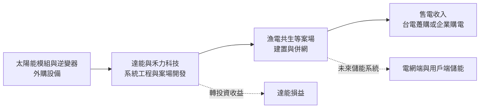
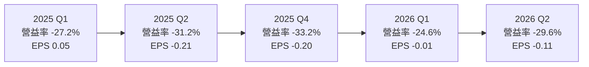
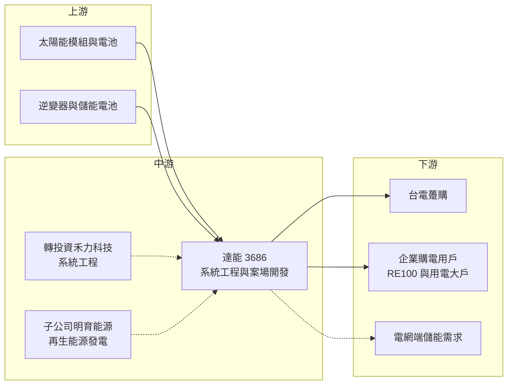

# 3686 達能

> 上市｜[[產業索引-半導體業|半導體業]]｜上市（櫃）日期 2010/07/20

# 第一章：企業模式與商業藍圖

> [!info] 撰寫說明
> 本文由 Claude 依公開資料整理，架構比照 [[2330台積電]] 的四章研究，資料截至 2026-10-08。財務數字來源：HiStock 嗨投資（歷年 EPS、季度利潤比率、杜邦分析 ROE、月營收累計）、證交所 OpenAPI 財報與股利資料、富果研究 2025 年 11 月法說會備忘錄、nStock、Simply Wall St、今周刊 2010 年報導；產業描述為整理性內容，尚未逐條比對原始文件。#待校對

評估一家公司的長期價值，第一步是理解它的商業模式。本章針對達能科技（股票代號：3686，以下簡稱達能）進行定性分析。達能的故事和多數半導體公司不同：它曾是台灣太陽能矽晶圓的明星廠，在產業長期跌價後營收大幅萎縮，目前正嘗試轉型為太陽光電系統工程與儲能業者。理解這段歷史，是判斷它未來能否翻身的前提。

## 一、核心定位：從太陽能矽晶圓廠轉向系統應用

達能成立於 2007 年，總部位於新竹，2010 年在證交所上市。公司早期專注生產太陽能多晶矽晶圓，2008 年 7 月第一批產品量產，隨即遭遇金融海嘯，當年虧損約 2.5 億元；2009 年需求回溫後轉為單月損益兩平。依 2010 年的報導，達能當時產能約 120 MW、規劃擴充到 300 MW，客戶包括德國 Q-Cells 與台灣的 [[6244茂迪]]，當年產能幾乎被預訂一空。

之後十多年，全球太陽能產業發生了根本變化。中國廠商以國家政策支持大規模擴產，矽晶圓價格長期下跌，技術也從多晶矽轉向單晶矽。台灣多數矽晶圓廠因規模不足而退出或轉型，達能也不例外。依 Simply Wall St 整理，達能營收在 2016 年前後曾達到約 17 億元的年化水準，之後持續萎縮，2025 年全年營收只剩約 0.86 億元。

目前達能的營業項目登記為太陽能相關產品的製造、加工與買賣，2020 年成立子公司明育能源，從事再生能源發電與能源技術顧問。依 2025 年 11 月法說會，公司已明確表示要從太陽能製造轉向下游系統應用與整合服務，聚焦[[太陽光電]]系統工程與[[儲能]]案場。換句話說，今天的達能比較接近一家規模很小、正在重建業務的再生能源公司，而不是半導體製造廠。

## 二、產品與事業板塊

達能未公開各事業的營收比重，因此本文不畫營收結構圖。依法說會與公司登記資料，目前的事業可以分成三塊。

**太陽能相關產品加工與買賣。** 這是原本製造業務的延續，但規模已大幅縮小。從財報看，達能近三年的季度[[毛利率]]接近 0%，代表這部分業務幾乎沒有加值空間，比較像是維持營運的過渡性收入。

**太陽光電系統工程。** 達能透過轉投資禾力科技參與系統工程，並直接參與南部漁電共生專區的開發。公司表示若案場順利推展，預期獲利率約 7%。禾力科技在 2025 年 11 月登錄興櫃，2025 年上半年達能認列的禾力投資收益約 1,400 萬元，是當時主要的獲利來源。

**儲能與發電。** 子公司明育能源從事再生能源發電；公司規劃 2026 年跨入儲能應用、2027 年擴展儲能系統業務，並與一家儲能業者洽談合作。這是達能中長期的新事業方向。

## 三、資本轉化邏輯：以轉投資與案場開發重建現金流

達能目前的營運邏輯，和過去的製造業完全不同。製造矽晶圓需要大量設備投資，賺的是產品價差；系統工程與案場開發則是「先投入土地、設備與工程，再用二十年左右的售電收入回收」，賺的是長期穩定的現金流與工程利潤。

**轉投資作為過渡期的獲利來源。** 本業仍在虧損，公司短期主要依靠禾力科技等轉投資收益支撐損益。這種模式的好處是不需要自己承擔所有工程風險，缺點是獲利高度依賴被投資公司的表現，且以權益法認列的收益不一定能轉成達能自己的現金。

**案場開發的資本需求。** 漁電共生等大型案場需要整合土地、取得漁民與地方同意、申請併網，開發期長且前期投入大。達能 2026 年第二季底總資產約 6.66 億元、負債僅約 760 萬元，財務結構保守，但以這樣的規模，要自行開發大型案場勢必需要外部資金或合作夥伴。

## 四、企業長期藍圖

依法說會，達能把策略分成三個時間層次：短期以轉投資收益與案場開發穩定現金流；中期（2026 至 2027 年）發展儲能業務；長期結合光電與儲能提供整合方案，並評估海外市場。

這個方向有政策面的支撐。台灣政府設定 2030 年再生能源占比的目標，加上用電大戶條款、RE100 承諾與碳費等制度，企業對綠電的需求持續增加，售電也逐漸由台電躉購轉向企業直接購電（[[CPPA]]）。台電同時規劃電網端儲能的建置目標。這些都是未來十年真實存在的需求。

但必須誠實地說，達能在這個市場還沒有建立明顯的規模或技術優勢。它的轉型能否成功，取決於能否取得足夠的案場、找到可靠的儲能合作夥伴，並讓本業在不依賴轉投資的情況下轉虧為盈。

# 第二章：護城河深度與競爭優勢

「護城河」指企業抵禦競爭、維持超額利潤的保護機制。本章分析達能在太陽光電與儲能市場的競爭位置。需要先說明的是，以目前的財務表現來看，達能尚未展現護城河，本章重點在於說明它擁有哪些可能發展成優勢的資源，以及與對手相比的差距。

## 一、護城河的核心組成要素

**1. 產業經驗與人脈。** 達能從 2007 年起就身處太陽能產業，經營團隊熟悉矽晶圓、電池到模組的整條供應鏈。這種經驗在挑選設備、評估案場發電效率時有實際價值，但在系統工程市場中，多數競爭者也具備類似的經驗，因此只能算是入場門票，不是護城河。

**2. 乾淨的資產負債表。** 達能幾乎沒有負債，帳上以流動資產為主。在需要長期資金的再生能源產業，財務彈性可以讓公司在好的案場出現時迅速投入，也比較能承受開發延遲。但這項優勢的另一面是資金規模小，無法同時開發多個大型案場。

**3. 轉投資布局。** 透過禾力科技參與系統工程，讓達能能以較少資本分享工程市場的成長。若禾力持續成長，達能的投資收益也會增加；但這屬於財務性的優勢，不是達能自己的營運能力。

整體來說，達能的護城河評估為「無護城河」。太陽光電系統工程技術門檻不高，主要競爭在於取得土地、資金成本與執行效率，大型集團與專業能源公司在這幾點上都更有優勢。

## 二、全球主要競爭對手格局

| 對手 | 定位 | 對達能的威脅 |
|---|---|---|
| [[6806森崴能源]] | 再生能源開發與工程統包 | 規模大、案場多，在大型漁電共生與離岸案件具優勢 |
| [[6869雲豹能源]] | 太陽光電與儲能開發營運 | 同時布局光電與儲能，與達能的轉型方向重疊 |
| [[3576聯合再生]]、[[6443元晶]] | 台灣太陽能電池與模組廠，延伸到電廠 | 從製造端往下游整合，擁有自有模組與案場 |
| 大型集團能源子公司 | 金控、電子與傳產集團成立的綠能公司 | 資金成本低，可大量取得企業購電合約 |

## 三、優勢轉化：守得住與守不住的市場

**可能守得住的市場。** 規模較小、需要彈性與在地協調的地面型或漁電共生案場，以及與合作夥伴分工的工程案。在這類案件中，大型業者未必有興趣投入，小型業者靠執行速度與地方關係仍有機會。

**守不住的市場。** 太陽能矽晶圓與模組製造。這個市場已被中國廠商以規模壓倒，台灣廠商幾乎無法以成本競爭，這也是達能退出製造的原因。大型企業購電與電網端儲能標案，則需要強大的資金與信用，達能目前的規模難以爭取。

**觀察重點。** 第一，漁電共生案場能否取得土地並開始認列營收。第二，儲能合作模式能否落地，並帶來毛利率為正的業務。第三，本業的營業利益率能否從長期約 -30% 改善到接近損益兩平。若這三點持續沒有進展，轉型就只停留在規劃階段。

# 第三章：財務體質與盈利規模

資料日期：2026-10-08。數字取自 HiStock 嗨投資（歷年 EPS、季度利潤比率、杜邦分析 ROE、月營收累計）與證交所 OpenAPI 財報，表格是撰寫當時的快照；最新月營收、毛利率、累計 EPS 由自動排程寫在本筆記的屬性欄位（月營收、毛利率、累計EPS 等）。#待校對

財務報表是檢驗商業模式是否成立的最終標準。本章用多年度的損益、ROE 與資本報酬，說明達能目前的財務處境。

## 一、獲利能力的基石：三率

| 年度 | 營收（新台幣） | [[毛利率]] | [[營業利益率]] | EPS（元） | [[ROE]] |
|---|---|---|---|---|---|
| 2021 | 未查得 | 季度波動劇烈，不具比較意義 | 未查得 | -0.27 | 約 -2.7%（推算） |
| 2022 | 0.44 億 | 季度波動劇烈，不具比較意義 | 未查得 | -0.40 | 約 -4.1%（推算） |
| 2023 | 0.41 億 | 約 -2.4%（推算） | 約 -146%（推算） | -0.38 | 約 -4.1%（推算） |
| 2024 | 0.83 億 | 約 -1.0%（推算） | 約 -32%（推算） | -0.06 | 約 -0.6%（推算） |
| 2025 | 0.86 億 | 約 -0.8%（推算） | 約 -32%（推算） | -0.50 | 約 -5.5%（推算） |
| 2026 上半年 | 0.45 億 | 0.26% | -26.9% | -0.13 | 未滿一年 |

註：年度毛利率與營業利益率為四季簡單平均，ROE 為四季單季 ROE 加總，皆為推算。2021 與 2022 年因營收極小，個別季度毛利率出現超過 80% 或負兩成的極端值，平均後不具參考性。

**毛利率接近零。** 近三年達能的毛利率在 -3% 到 +0.5% 之間，代表現有業務的銷售收入大致只能打平直接成本，沒有任何加值空間。這通常意味著產品屬於買賣或加工性質，或是工廠規模過小、固定成本無法攤提。

**營業費用壓過營收。** 達能每年的營業費用大約是營收的三成左右，營收規模不到 1 億元，研發、管理與上市公司的基本開支就足以讓本業持續虧損。2023 年營收只有約 0.41 億元時，營業利益率更低到約 -146%。

**損益靠業外調節。** 2024 年第三季與 2025 年第一季的稅後淨利率為正，但當季營業利益率仍是負數，代表獲利來自業外收入，例如轉投資收益或資產處分。依法說會，2025 年上半年禾力科技投資收益約 1,400 萬元。從 2018 年以來，達能每一年的 EPS 都是負數，最好的 2024 年為 -0.06 元。

## 二、ROE：資本效率

達能近五年的 ROE 全部為負，平均約 -3.4%（推算）。公司 2026 年第二季底保留盈餘約為 -1.12 億元，也就是累積虧損，每股淨值約 8.61 元，低於 10 元面額。近五年未配發現金或股票股利。

這樣的 ROE 代表股東投入的資本長期沒有產生報酬。不過因為公司幾乎沒有負債，虧損幅度每年只占股東權益的幾個百分點，短期內沒有財務危機，主要問題在於資本長期閒置、無法創造價值。

## 三、資本支出與自由現金流

**資本支出。** 具體金額未查得。從資產結構看，2026 年第二季底流動資產約 3.82 億元、非流動資產約 2.84 億元，非流動資產中推估包含轉投資與發電設備。轉型為案場開發後，未來資本支出需求取決於案場規模，目前公司的自有資金只足以支應小型案場（推估）。

**自由現金流。** 多年度現金流量資料未查得。以本業長期虧損推估，營業現金流不太可能長期為正，公司主要依靠既有現金與轉投資收益維持營運（推估）。

**營收成長。** 2022 至 2025 年營收從約 0.44 億元成長到約 0.86 億元，年複合成長率約 25%，但基期極低，成長並未改善獲利。

## 四、[[ROIC]] 與 [[WACC]]：價值創造利差

**ROIC 推算。** 2026 年上半年營業利益為 -0.12 億元，年化約 -0.24 億元；投入資本以股東權益 6.59 億元計算（有息負債近乎為零），ROIC 約 -3.7%。2025 年營業利益約為營收 0.86 億元乘以 -32%，約 -0.28 億元，ROIC 約 -4%。以上皆為推算。

**WACC 推算。** 無風險利率取台灣 10 年期公債約 1.75%，市場風險溢酬約 6%，β 假設為 1.0（小型再生能源與太陽能股常見值，非達能實際數字），權益成本約 7.75%。由於幾乎沒有負債，WACC 約等於權益成本，約 7.5% 至 8%（推算）。

**價值創造判斷。** ROIC 為負、WACC 約 8%，兩者差距約 11 至 12 個百分點，代表達能目前每年都在侵蝕股東價值。轉型要真正成功，必須先讓本業營業利益轉正，再逐步把 ROIC 拉高到資金成本以上；在那之前，投資達能比較接近押注轉型成敗，而不是投資一家已經能創造價值的公司。

# 第四章：總體風險與地緣政治

任何企業都無法脫離宏觀環境獨立存在。本章分析達能未來必須面對的政策、產業週期、營運與技術風險。

## 一、地緣政治與政策風險

**能源政策依賴度高。** 太陽光電與儲能的需求，很大程度取決於政府的再生能源目標、躉購費率、電網建設與碳費制度。政策方向若因政黨輪替或財政壓力改變，案場的報酬率與開發速度都會受影響。對規模小、尚未建立穩定收入的達能來說，政策變化的衝擊會比大型業者更大。

**設備供應鏈集中於中國。** 太陽能模組、電池與儲能電芯多數來自中國。美中貿易限制、反傾銷措施或關稅變化，可能推高設備成本或拉長交期，進而壓縮案場報酬率。

## 二、產業週期與市場結構

**太陽能設備長期跌價。** 太陽能產業的歷史是一部價格持續下跌的歷史。對製造商而言這是災難，達能本身就是例子；對案場開發商而言，設備便宜反而有利，但跌價也會讓同業以更低價格競標，壓低整體的工程利潤。

**土地與併網瓶頸。** 台灣地狹人稠，好的地面型案場越來越少，漁電共生涉及漁民權益與環境評估，開發時程常被延後。達能法說會也承認，南部漁電共生專區土地取得競爭激烈，開發時程已延後。

## 三、營運環境的隱性風險

**規模不足。** 年營收不到 1 億元的公司，很難負擔完整的工程、財務與法務團隊，也難以在大型案場競標中取得信用。若轉型持續緩慢，公司可能長期處於「上市公司固定成本」大於「業務毛利」的狀態。

**依賴轉投資。** 目前損益主要靠禾力科技等轉投資收益。被投資公司的經營或股價波動，會直接影響達能的帳面獲利，且權益法收益不等於現金流入。

**極端氣候與建置成本。** 颱風、淹水等極端氣候會增加案場損壞與保險成本，也可能推高工程建置費用。

## 四、科技與法規演進

**技術快速迭代。** 太陽能電池效率與儲能電池技術進步很快，今天建置的設備可能在數年後就不具成本競爭力。案場開發商需要持續評估設備選擇，避免資產過早貶值。

**電力市場制度改革。** 台灣電力市場逐步開放企業購電與輔助服務市場，儲能業者的收益模式會隨制度設計而改變。這對新進者既是機會，也代表規則可能在投資之後改變，收益不確定性較高。

# 專有名詞解析

## 金融

- **[[權益法]]**：持有被投資公司一定比例股權時，依持股比例認列其損益的會計方法，認列的收益不一定伴隨現金流入。
- **[[轉投資收益]]**：公司從投資其他公司所認列的收益，屬於本業以外的獲利來源。
- **[[ROIC]]**：投入資本報酬率，衡量公司用股東與債權人投入的資金，每年能創造多少稅後營業利益。
- **[[WACC]]**：加權平均資金成本，股東與債權人要求報酬率的加權平均，是判斷投資是否創造價值的門檻。

## 產業

- **[[太陽光電]]**：利用太陽能電池把陽光轉換成電力的發電方式，產業鏈包括矽晶圓、電池、模組、系統工程與電廠營運。
- **[[多晶矽晶圓]]**：由許多小晶粒組成的矽晶圓，成本較低但轉換效率較單晶矽低，已逐漸被單晶矽取代。
- **[[漁電共生]]**：在魚塭上方或周邊設置太陽能板，同時養殖與發電，是台灣增加太陽光電土地的政策方向。
- **[[儲能]]**：以電池等設備把電力儲存起來，在需要時釋放，可協助電網調節尖峰用電與再生能源的不穩定。
- **[[躉購]]**：台電以政府公告的固定費率，長期收購再生能源電力的制度，為早期太陽能電廠的主要收入來源。
- **[[CPPA]]**：企業購電協議，企業直接向再生能源電廠購買綠電並簽訂長期合約，用來達成減碳與 RE100 目標。
- **[[RE100]]**：企業承諾 100% 使用再生能源的國際倡議，蘋果、台積電等大廠參與後帶動供應鏈的綠電需求。
- **[[碳費]]**：政府對排放溫室氣體的企業收取的費用，提高化石能源成本，間接增加企業購買綠電的誘因。

# 核心供應鏈

## 1. 上游：設備與材料
- 太陽能電池與模組（產業代表廠商，未查得實際交易關係）：[[3576聯合再生]]、[[6443元晶]]
- 儲能電池與逆變器：未查得具體供應商

## 2. 中游：達能本身與關係企業
- 轉投資：禾力科技（太陽光電系統工程，2025 年登錄興櫃）
- 子公司：明育能源（再生能源發電與能源技術顧問）
- 同業：[[6806森崴能源]]、[[6869雲豹能源]]

## 3. 下游：售電與用電對象
- 台電（躉購）
- 企業購電用戶與用電大戶（具體客戶未查得）

## 4. 歷史客戶（矽晶圓時期）
- 德國 Q-Cells、[[6244茂迪]]（2010 年報導）

## 最新新聞
<!-- news:start -->
<!-- news:end -->

## 相關連結
- [公開資訊觀測站](https://mopsov.twse.com.tw/mops/web/t05st03?step=1&firstin=1&co_id=3686)
- [Goodinfo](https://goodinfo.tw/tw/StockDetail.asp?STOCK_ID=3686)
- [Yahoo 股市](https://tw.stock.yahoo.com/quote/3686)
- [鉅亨網新聞](https://www.cnyes.com/twstock/3686/news)
