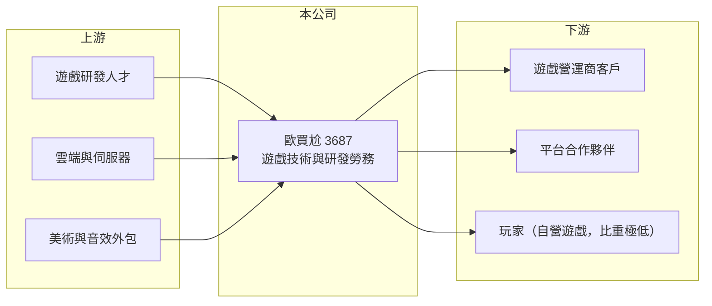

# 3687 歐買尬

> 上櫃｜[[產業索引-數位雲端|數位雲端]]｜上市（櫃）日期 2020/06/01

# 第一章：企業模式與商業藍圖

> [!info] 撰寫說明
> 精簡版，由 Claude 依公開資料整理，架構比照 [[2330台積電]]，資料截至 2026-10-08。來源：櫃買中心開放資料（基本資料、資產負債、綜合損益、本益比殖利率、每月營收）、Goodinfo 年度經營績效、富邦 e 點通（MoneyDJ）公司基本資料。公開資料有限，勞務收入的服務對象、合約內容與子公司持股結構未查得；Goodinfo 提醒部分年度欄位對位可能不完整。#待校對

本章說明茂為歐買尬（3687）如何從自營線上遊戲，轉為以遊戲技術與研發服務收取勞務收入的模式。

- **核心業務：** 茂為歐買尬數位科技成立於 1999 年，2011 年上櫃，董事長羅士博，實收資本額約 3.0 億元。依 MoneyDJ 2025 年營收比重，勞務收入占 96.0%，其他占 3.6%，自營網路遊戲只占 0.4%。這代表公司目前的主要收入不是向玩家賣點數，而是替客戶提供遊戲開發、平台技術與營運支援等服務（服務對象未查得）。
- **商業模式：** 勞務型的遊戲技術服務，通常依專案、使用量或營收分成向客戶收費，公司不必自行承擔行銷與玩家獲取成本，收入也比自營單款遊戲穩定。代價是公司的成長取決於客戶的營運狀況，而且客戶集中度可能偏高。
- **營收結構：** 2020 至 2025 年營收從 12.0 億元成長到 18.3 億元，毛利率長期穩定在 40% 至 44%，比一般自營遊戲公司低、但比代工型服務高，符合「技術服務」的定位。
- **長期方向：** 公司帳上總負債遠大於歸屬母公司權益，且合併淨利與每股盈餘之間有明顯落差，推估營運集中在部分持股的子公司，且帳上可能有大量代收款項（推估，依財報結構判斷）。未來觀察重點是勞務服務能否擴大客戶群，降低對少數合作夥伴的依賴。

# 第二章：護城河深度與競爭優勢

本章分析歐買尬的競爭條件與限制。

- **競爭優勢：** 長期累積的遊戲研發團隊與平台技術，是承接技術服務的基礎；營業利益率在 2020 至 2025 年維持在 15% 至 23%，顯示這套服務模式有一定的獲利能力。由於客戶將遊戲開發與系統維運外包，一旦系統上線，更換供應商的成本較高，形成轉換成本。
- **主要對手：** 國內上市櫃遊戲公司如 [[3293鈊象]]、[[6180橘子]]、[[5478智冠]]、[[3546宇峻]] 等，雖以自營遊戲為主，但都具備研發與營運能力，可能在技術服務市場競爭；國際上則有大量遊戲外包與平台技術供應商。
- **觀察重點：** 第一是勞務收入的客戶集中度與合約期限。第二是歸屬母公司淨利占合併淨利的比例，這決定一般股東實際分到多少獲利。第三是公司揭露的資訊是否足以讓投資人理解主要服務對象與營運地區。

# 第三章：財務體質與盈利規模

資料日期：2026-10-08，表格是撰寫當時的快照；最新月營收、毛利率、累計 EPS 由自動排程寫在本筆記的屬性欄位（月營收、毛利率、累計EPS 等）。#待校對

本章用六年數字檢視歐買尬的獲利與資本結構。

| 年度 | 營收（新台幣） | [[毛利率]] | [[營業利益率]] | EPS（元） | [[ROE]] |
|---|---|---|---|---|---|
| 2020 | 12.0 億 | 40.4% | 14.8% | 1.49 | 11.7% |
| 2021 | 15.8 億 | 41.7% | 21.7% | 2.42 | 19.3% |
| 2022 | 16.7 億 | 43.7% | 22.8% | 2.71 | 12.6% |
| 2023 | 16.2 億 | 41.3% | 19.8% | 1.75 | 8.07% |
| 2024 | 17.2 億 | 40.7% | 17.8% | 2.33 | 7.49% |
| 2025 | 18.3 億 | 40.3% | 14.9% | 4.67 | 16.1% |

- **營收規模：** 2020 至 2025 年營收年複合成長率約 8.8%（推算）。依櫃買中心資料，2026 年上半年營收約 9.9 億元、營業利益約 1.7 億元、合併淨利約 1.4 億元，但每股盈餘只有 0.60 元，換算歸屬母公司淨利約 0.18 億元，推估大部分獲利歸屬於[[非控制權益]]（需校對）。
- **獲利：** 近五年（2021 至 2025）平均 ROE 約 12.7%（推算）。營業利益率從 2022 年的 22.8% 逐年下滑到 2025 年的 14.9%，但 2025 年 EPS 反而升到 4.67 元，推估有業外收益或子公司持股比例變動的影響（細節未查得）。
- **財務特色：** 2026 年第二季歸屬母公司權益約 15.7 億元，每股淨值 52.00 元，總負債約 53.7 億元（流動 47.3 億、非流動 6.4 億），MoneyDJ 所列負債比例約 57%。負債規模接近年營收的三倍，以技術服務公司而言相當特殊，推估包含大量代收代付款項（未查得）。依櫃買中心資料，最近年度現金股利約 2.0 元，以 2025 年 EPS 4.67 元計算[[配息率]]約 43%（推算）。
- **[[ROIC]] 與 [[WACC]]：** 2025 年營業利益約 2.7 億元（18.3 億 × 14.9%），以稅率 20% 計稅後約 2.2 億元；投入資本以歸屬母公司權益約 15.7 億元計，有息負債未查得、假設極少，ROIC 約 14%（推算；若計入非控制權益，分母變大、ROIC 會較低）。WACC 以 CAPM 推估：無風險利率 1.75%、市場風險溢酬 6%，MoneyDJ 的 β 為 0.31 不具代表性，改用遊戲股常見值 1.0，股東權益成本約 7.75%；幾乎無有息負債，WACC 約 7.7%（推算）。ROIC 高於 WACC，代表本業在創造價值，但一般股東能分到的比例取決於子公司持股結構。

# 第四章：總體風險與地緣政治

本章整理歐買尬長期必須面對的風險。

- **產業週期：** 遊戲與數位娛樂需求受消費景氣與熱門作品週期影響，技術服務收入也會隨客戶營運狀況起伏。營業利益率近三年下滑，顯示競爭或成本壓力正在增加。
- **營運風險：** 勞務收入可能集中在少數客戶或關係企業，客戶策略改變、合約到期未續就會直接衝擊營收。大部分獲利歸屬非控制權益的結構，使一般股東的實際報酬與合併營收的成長不一定同步。
- **其他風險：** 遊戲與線上娛樂在各國的監管差異很大，若服務涉及海外市場，法規變動、金流限制與匯率都會帶來風險；公開揭露有限也讓外部投資人較難評估真實的營運風險。

# 專有名詞解析

## 金融

- **[[非控制權益]]**：子公司中不屬於母公司持有的股權，合併報表中對應的淨利不計入母公司每股盈餘。
- **[[配息率]]**：現金股利占每股盈餘的比例，反映公司把多少獲利發還股東。
- **[[ROIC]]**：投入資本報酬率，稅後營業利益除以投入資本，衡量本業運用資金創造報酬的能力。
- **[[WACC]]**：加權平均資金成本，股東與債權人要求報酬率的加權平均，ROIC 高於 WACC 才代表創造價值。

# 核心供應鏈

- 上游：遊戲研發與美術人才、雲端與伺服器服務、美術與音效外包。
- 下游／客戶：委託開發與技術服務的遊戲營運商與平台合作夥伴（實際客戶未查得）；自營遊戲的玩家占比極低。
- 同業：[[3293鈊象]]、[[6180橘子]]、[[5478智冠]]、[[3546宇峻]] 等遊戲公司。

## 最新新聞
<!-- news:start -->
<!-- news:end -->

## 相關連結
- [公開資訊觀測站](https://mopsov.twse.com.tw/mops/web/t05st03?step=1&firstin=1&co_id=3687)
- [Goodinfo](https://goodinfo.tw/tw/StockDetail.asp?STOCK_ID=3687)
- [Yahoo 股市](https://tw.stock.yahoo.com/quote/3687)
- [鉅亨網新聞](https://www.cnyes.com/twstock/3687/news)
