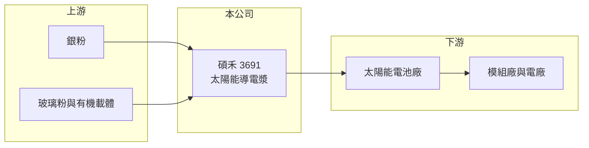

# 3691 碩禾

> 上櫃｜[[產業索引-光電業|光電業]]｜上市（櫃）日期 2010/11/18

# 第一章：企業模式與商業藍圖

> [!info] 撰寫說明
> 精簡版，由 Claude 依公開資料整理，架構比照 [[2330台積電]]，資料截至 2026-10-07。來源：nstock.tw 碩禾公司概況。營收比重未查到。#待校對

碩禾是太陽能電池用導電漿的材料廠，營收隨銀價大幅波動。

- **核心業務：** 碩禾電子材料成立於 2003 年，主要從事太陽能[[導電漿]]的研發、製造與銷售。
- **營收結構：** 本次未查到產品別比重；導電漿以銀粉為主要原料，營收大幅成長可能部分反映銀價上漲（推估）。
- **營運據點：** 主要營運地在新竹湖口工業園區，南科分公司已於 2017 年廢止。
- **長期方向：** 隨太陽能電池技術從 PERC 轉向 [[TOPCon]] 等高效率電池，導電漿配方需要跟著升級（推估）。

# 第二章：護城河深度與競爭優勢

碩禾的優勢在配方技術，但主要市場在中國，面對當地業者的價格競爭。

- **競爭優勢：** 導電漿配方會影響電池轉換效率，客戶導入後需要重新驗證才會更換，具一定轉換成本。
- **主要對手：** 德國賀利氏（Heraeus）、中國帝科等導電漿廠（推估）。
- **觀察重點：** 營收大增但營業利益率幾乎為零，需確認是銀價墊高營收還是出貨量真正成長。

# 第三章：財務體質與盈利規模

資料日期：2026-10-07，以下數字是撰寫當時的快照；最新月營收、毛利率、累計 EPS 由自動排程寫在本筆記的屬性欄位（月營收、毛利率、累計EPS 等）。#待校對

碩禾營收規模大，但本業獲利率很薄。

- **營收規模：** 2026 年 1 至 8 月累計營收 69.12 億元；8 月 8.42 億元、年增 75.84%。
- **獲利：** 2026 年第二季 EPS 0.38 元，[[毛利率]] 10.61%，[[營業利益率]] 0.03%，淨利率 2.15%。
- **財務特色：** 資本額約 9.19 億元，近五年沒有配息紀錄；營業利益接近零，EPS 推估多來自業外。

# 第四章：總體風險與地緣政治

碩禾的風險在於原料價格、太陽能產業週期與中國市場。

- **產業週期：** 太陽能產業供過於求，電池廠壓縮材料成本，導電漿報價承壓。
- **營運風險：** 銀價上漲墊高營收與營運資金需求，但不一定帶來利潤；應收帳款回收風險需留意。
- **其他風險：** 銀價、匯率波動，以及中國市場的政策與同業低價競爭。

# 專有名詞解析

## 應用

- **[[導電漿]]**：以銀粉為主、印在太陽能電池表面形成電極的材料，成本與銀價高度連動。

## 產業

- **[[TOPCon]]**：穿隧氧化層鈍化接觸太陽能電池，轉換效率高於傳統 PERC 電池，是目前主流的高效電池技術。

# 核心供應鏈

- 上游：銀粉、玻璃粉與有機載體供應商
- 下游／客戶：太陽能電池廠，例如 [[3576聯合再生]]（推估）與中國電池廠
- 同業：賀利氏、帝科

## 最新新聞
<!-- news:start（自動產生，請勿手動編輯此範圍） -->
- 2026-10-07 🏛️ 重訊 16:05｜公告子公司禾迅綠電(股)公司115年現金增資調整發行股數 及延長特定人繳款期間之補償方案｜[觀測站](https://mops.twse.com.tw/mops/#/web/t05st01)

完整紀錄：[[3691碩禾 新聞]]
<!-- news:end -->

## 相關連結
- [公開資訊觀測站](https://mopsov.twse.com.tw/mops/web/t05st03?step=1&firstin=1&co_id=3691)
- [Goodinfo](https://goodinfo.tw/tw/StockDetail.asp?STOCK_ID=3691)
- [Yahoo 股市](https://tw.stock.yahoo.com/quote/3691)
- [鉅亨網新聞](https://www.cnyes.com/twstock/3691/news)
