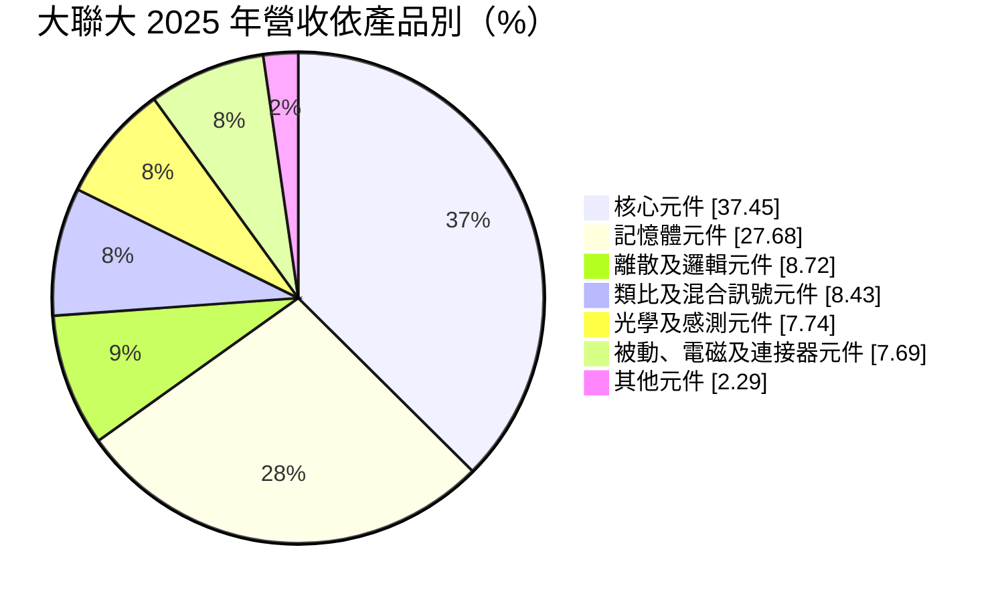
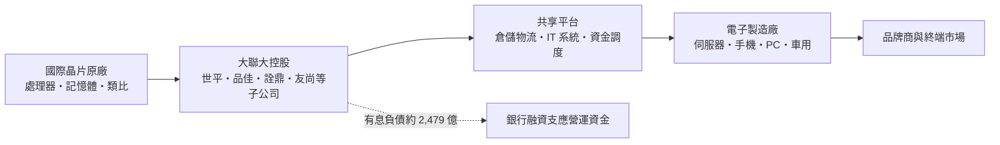
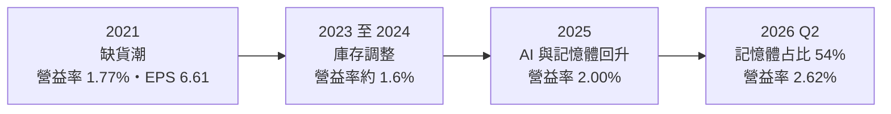
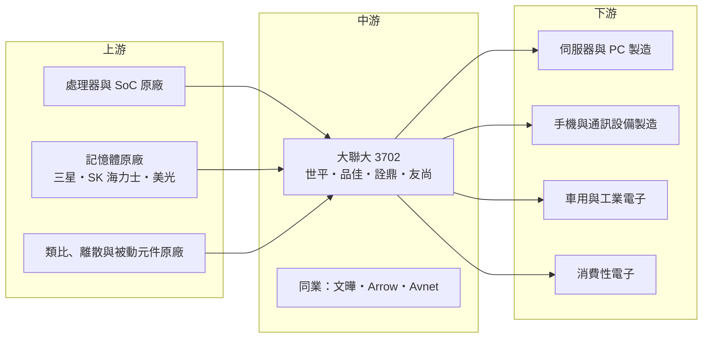

# 3702 大聯大

> 上市｜[[產業索引-電子通路業|電子通路業]]｜上市（櫃）日期 2005/11/09

# 第一章：企業模式與商業藍圖

> [!info] 撰寫說明
> 本文由 Claude 依公開資料整理，架構比照 [[2330台積電]] 的四章研究，資料截至 2026-10-08。財務數字來源：Goodinfo 年度經營績效、現金流量與股利政策頁、MoneyDJ 理財網財務比率、營收比重與資產負債表、富果研究法說會備忘錄（2026 年 8 月）、證交所開放資料（基本資料、資產負債、綜合損益、營益分析、股利）；產業描述為整理性內容，尚未逐條比對原始文件。#待校對

在評估單一個股的長期投資價值時，首要步驟是拆解企業的底層獲利邏輯。本章針對大聯大控股（股票代號：3702，以下簡稱大聯大）的商業模式進行定性分析。大聯大是一家以「[[控股公司]]」形式整合多家台灣通路商而成的集團，年營收接近一兆元，是亞太地區規模最大的半導體零組件通路商之一。理解大聯大，要看懂控股架構如何讓多家原本互相競爭的通路商在同一屋簷下合作，以及記憶體循環如何左右它的獲利。

## 一、核心定位：以控股架構整合的亞太半導體通路龍頭

大聯大成立於 2005 年 11 月，同日在台灣證券交易所上市，總部位於台北市南港區，董事長為黃偉祥。大聯大本身是一家控股公司，旗下子公司是原本獨立經營的通路商，最早由世平與品佳以股份轉換方式共同成立，之後陸續納入詮鼎、友尚等通路商（成立過程與子公司名單為整理性描述，待校對）。

控股架構的設計，是讓各子公司保留各自的品牌、代理權與業務團隊，同時在後勤、資訊系統、倉儲物流與資金調度上共享資源。這種模式的好處是可以快速擴大規模，又不會因為合併而失去原廠的代理權；挑戰則是內部各子公司之間可能代理競爭產品線，需要集團層級的協調。

和其他半導體通路商一樣，大聯大是晶片原廠的[[代理商]]，替原廠把產品賣給數以萬計的電子製造廠，提供技術支援、庫存、配送與帳款融資，賺取約 4% 的毛利。

## 二、終端應用／產品板塊：核心元件與記憶體為兩大支柱

依 MoneyDJ 理財網整理的 2025 年營收比重，核心元件占 37.45%、記憶體元件占 27.68%、離散及邏輯元件占 8.72%、類比及混合訊號元件占 8.43%、光學及感測元件占 7.74%、被動及電磁及連接器元件占 7.69%、其他元件占 2.29%。

* **核心元件：** 處理器、[[SoC]]、微控制器等運算核心晶片，用於 PC、伺服器、手機與工業設備。
* **記憶體元件：** [[DRAM]] 與 [[NAND]] Flash 等記憶體產品。記憶體價格波動劇烈，是大聯大營收與獲利最大的變數。依富果研究整理的 2026 年第二季法說會資料，記憶元件占比從前一年同期的 26% 大增到 54%，反映記憶體價格大漲與 AI 伺服器需求。
* **其他元件：** 類比、離散、光學感測、被動元件與連接器，這些產品單價較低但品項多，毛利率通常高於記憶體。

依應用別，富果研究整理的 2026 年第二季資料顯示：運算（含伺服器）占 45%、通訊電子占 15%、消費性電子占 9%、工業電子占 9%、車用電子占 8%。依地區，大陸及香港占 63%（前一年同期 70%）、東南亞占 19%、北美占 8%（前一年同期 4%），代表大聯大正隨著客戶的產能移轉，逐步降低對中國市場的依賴。

## 三、資本轉化邏輯（營運模式）：控股平台加上高槓桿營運資金

* **共享平台的規模效益：** 子公司共用倉儲、物流與資訊系統，可以降低每家公司的固定成本。大聯大也推出數位化的供應鏈服務平台（名稱與內容待校對），把訂單、庫存與物流資訊整合，提高週轉效率。
* **高槓桿的營運資金：** 2026 年第二季底，大聯大的存貨約 2,150 億元、應收帳款約 2,948 億元、應付帳款約 2,124 億元（MoneyDJ），存貨加應收減應付的[[營運資金]]約 2,974 億元（推算），主要靠銀行借款支應。有息負債約 2,479 億元，是股東權益的 2.5 倍左右。這種高槓桿讓大聯大在景氣好時 ROE 很高，景氣差時利息負擔也很重。
* **記憶體的雙面刃：** 記憶體營收占比高，記憶體漲價時營收與毛利大增，跌價時則有庫存損失風險。大聯大的獲利循環與記憶體循環高度相關。

## 四、企業長期藍圖：數位化、全球化與產品組合調整

* **跟著客戶走出中國：** 北美營收占比在一年內從 4% 提升到 8%，東南亞占 19%，反映電子製造業的產能轉移。大聯大在東南亞、印度與北美擴大據點，是未來十年降低地緣政治風險的主要方向。
* **AI 與運算：** 運算類應用已占 45%，AI 伺服器帶動的處理器、記憶體與周邊晶片需求，是大聯大最重要的成長動能。
* **車用與工業：** 車用營收在 2026 年第二季年增 53.3%（富果研究），工業與車用的產品生命週期長、毛利較高，是改善產品組合的重點。
* **資本籌措：** 公司擬發行上限 150 億元的第四次無擔保[[可轉換公司債]]（富果研究），反映營運規模擴大後對長期資金的需求。經營層的資本配置習慣是以短期銀行借款支應營運資金，並搭配可轉債補充長期資金。

# 第二章：護城河深度與競爭優勢

在長期價值投資中，「護城河」指企業抵禦競爭、維持超額利潤的保護機制。本章分析大聯大在半導體通路產業的護城河構成、主要競爭對手，以及控股模式的優勢與限制。

## 一、護城河的核心組成要素

大聯大的護城河主要來自規模與代理權組合：

* **1. 代理權的廣度：** 透過多家子公司，大聯大取得大量國際原廠的代理權，涵蓋處理器、記憶體、類比、被動元件等完整產品線。對客戶來說，向大聯大可以一次買齊大部分零組件；對原廠來說，大聯大是觸及亞洲中小型製造廠最有效率的通路。
* **2. 規模帶來的成本優勢：** 營收接近一兆元，讓大聯大在倉儲、物流與資訊系統上的單位成本低於中小型通路商。2025 年營業費用率約 1.96%（毛利率 3.96% 減營業利益率 2.0%，推算）。
* **3. 客戶覆蓋與信用資料：** 大聯大服務大量亞洲中小型電子製造廠，長期累積的客戶信用資料，讓它能精準管理應收帳款風險，這是原廠難以自己處理的。
* **4. 控股模式的代理權保護：** 控股架構讓子公司保留各自的代理權，避免因合併觸發原廠收回代理的條款。這是大聯大當年選擇控股模式而非直接合併的重要原因（推估）。

## 二、全球主要競爭對手格局

| 對手 | 定位 | 對大聯大的影響 |
|---|---|---|
| [[3036文曄]] | 台灣，併購 Future 後為全球前兩大電子元件通路 | 在亞洲市場最直接的對手，資料中心比重較高 |
| Arrow Electronics、Avnet | 美國，全球大型通路商 | 在全球與亞洲市場競爭 |
| [[2347聯強]] | 台灣，IT 通路為主、半導體為輔 | 在部分半導體產品線競爭 |
| 中國本土通路商 | 服務中國客戶與本土晶片 | 中國晶片國產化後，本土通路商代理國產晶片具優勢 |

## 三、優勢轉化：守得住／守不住／觀察重點

* **守得住：** 亞洲中小型製造廠的代理業務、多產品線的一站式採購服務。原廠不會直接服務數萬家中小客戶，這是大聯大的基本盤。
* **守不住：** 記憶體的價格循環與超大型客戶的直銷。記憶體占比高，價格下跌時營收與獲利同步下滑；超大型雲端客戶則傾向直接向原廠採購。
* **觀察重點：** 第一，記憶體占比與價格走勢，這決定短中期的獲利高低。第二，北美與東南亞營收比重的提升速度。第三，[[淨營運現金週期]]能否維持在 50 天左右，2026 年第二季為 52 天，較前一年同期的 67 天明顯改善（富果研究）。第四，中國晶片國產化對大聯大中國業務的長期影響。

# 第三章：財務體質與盈利規模

資料日期：2026-10-08。數字取自 Goodinfo 年度經營績效、現金流量與股利政策頁、MoneyDJ 理財網財務比率與資產負債表、富果研究法說會備忘錄與證交所開放資料，表格是撰寫當時的快照；最新月營收、毛利率、累計 EPS 由自動排程寫在本筆記的屬性欄位（月營收、毛利率、累計EPS 等）。#待校對

財務報表是檢驗護城河是否真實存在的最終標準。對通路商而言，除了三率之外，存貨與應收帳款的週轉天數、[[營運資金]]的規模，才是判斷經營品質的核心。本章檢視大聯大在半導體循環中的獲利與資本效率。

## 一、獲利能力的基石：三率與通路指標

| 年度 | 營收（新台幣） | [[毛利率]] | [[營業利益率]] | EPS（元） | [[ROE]] |
|---|---|---|---|---|---|
| 2019 | 5,276 億 | 4.25% | 1.84% | 3.84 | 11.0% |
| 2020 | 6,099 億 | 3.78% | 1.65% | 4.77 | 12.6% |
| 2021 | 7,786 億 | 3.81% | 1.77% | 6.61 | 17.0% |
| 2022 | 7,752 億 | 3.82% | 1.90% | 6.02 | 14.9% |
| 2023 | 6,719 億 | 3.78% | 1.55% | 4.59 | 10.5% |
| 2024 | 8,806 億 | 3.55% | 1.67% | 4.07 | 8.78% |
| 2025 | 9,991 億 | 3.96% | 2.00% | 5.77 | 12.4% |
| 2026 上半年 | 7,727.1 億 | 4.45% | 2.64% | 8.42 | 未查得 |

註：2019 至 2025 年取自 Goodinfo 合併報表（2016 至 2018 年未查得）；2026 上半年取自證交所營益分析與綜合損益開放資料。

| 年度 | 平均售貨天數 | 平均收帳天數 | 負債比率 |
|---|---|---|---|
| 2019 | 47.9 天 | 73.0 天 | 72.2% |
| 2020 | 38.8 天 | 67.1 天 | 71.8% |
| 2021 | 34.9 天 | 57.7 天 | 75.3% |
| 2022 | 48.5 天 | 60.0 天 | 74.1% |
| 2023 | 60.8 天 | 68.3 天 | 73.1% |
| 2024 | 55.1 天 | 61.6 天 | 79.2% |
| 2025 | 56.2 天 | 60.6 天 | 79.3% |

註：取自 MoneyDJ 理財網年度財務比率。

* **[[毛利率]]：** 毛利率長期在 3.5% 至 4.5% 之間，2026 年上半年升到 4.45%，主要受記憶體價格上漲帶動的[[庫存利益]]與產品組合影響。
* **[[營業利益率]]：** 營業利益率從 2023 至 2024 年約 1.6% 提升到 2026 年上半年的 2.64%，營收規模擴大帶來明顯的[[營運槓桿]]。
* **週轉天數：** 2021 年缺貨潮時售貨天數只有 34.9 天，2023 年庫存調整時拉長到 60.8 天，之後維持在 55 至 56 天。應收天數約 60 天。售貨天數與應收天數合計約 115 天，扣除應付天數後的淨營運週期，在 2026 年第二季降到 52 天（富果研究）。
* **營收趨勢：** 2020 至 2025 年營收從 6,099 億元成長到 9,991 億元，年複合成長率約 10.4%（推算）。

## 二、[[ROE]]：資本效率

2021 至 2025 年平均 ROE 約 12.7%（推算）。大聯大的 ROE 主要靠槓桿撐起：負債比率長期在 72% 至 79% 之間（MoneyDJ），權益乘數約 4 至 5 倍（推算）。這代表在約 2% 的營業利益率下，透過高槓桿可以把 ROE 拉高到 10% 以上。依富果研究整理，2026 年第二季年化 ROE 達 38.5%，是記憶體大漲與營收規模擴大同時發生的結果，屬於景氣高峰的數字，不宜視為常態。

## 三、資本支出、自由現金流與股利

| 年度 | 營業現金流 | 投資現金流 | [[自由現金流]] | 現金股利（元） |
|---|---|---|---|---|
| 2019 | -14.1 億 | -93.3 億 | -107 億 | 2.4 |
| 2020 | 178 億 | -90.9 億 | 87.3 億 | 3.1 |
| 2021 | -190 億 | -11.4 億 | -202 億 | 3.5 |
| 2022 | -60.9 億 | -26.3 億 | -87.2 億 | 3.85 |
| 2023 | 162 億 | 40.3 億 | 202 億 | 3.5 |
| 2024 | -252 億 | -30.1 億 | -282 億 | 3.2 |
| 2025 | 222 億 | -3.86 億 | 218 億 | 3.643 |

註：現金流取自 Goodinfo（自由現金流＝營業現金流＋投資現金流），股利依所屬年度列示。

* **現金流與營收成長反向：** 大聯大在營收快速成長的年份（2021、2024 年）營業現金流大幅為負，因為需要墊付更多庫存與應收；在營收持平或下滑的年份則回收現金。七年中自由現金流有三年為正、四年為負，累計約為負 171 億元（推算），代表營運規模擴張持續消耗現金，需要借款支應。
* **資本支出輕：** 大聯大的投資現金流主要與轉投資及倉儲有關，相對營收規模很小。
* **股利政策：** 公司章程規定每年股利分配總額不低於當年度盈餘的 40%，現金股利不低於股利總額的 20%。實務上大聯大以現金股利為主，2019 年以來每年現金股利在 2.4 至 3.85 元之間，相當穩定。2025 年度配發 3.643 元，以 EPS 5.77 元計算[[配發率]]約 63%（推算）。

## 四、[[ROIC]] 與 [[WACC]]：價值創造利差

**ROIC 推算：** 2025 年營業利益約 199.8 億元（營收 9,991 億元 × 營業利益率 2.0%），扣除 20% 稅率後約 159.9 億元。投入資本以 2026 年第二季底計算：股東權益 989.4 億元（證交所），有息負債約 2,478.7 億元（短期借款 1,685.2 億元、短期票券 174.6 億元、一年內到期長期負債 224.5 億元、長期借款 369.8 億元、租賃負債約 24.7 億元，MoneyDJ），合計約 3,468 億元，ROIC 約 4.6%（推算）。以 2026 年上半年營業利益 204.25 億元年化，ROIC 約 9.4%（推算）。公司法說會揭露的 2026 年第二季年化 ROIC 為 16.1%（富果研究，公司口徑，計算方式可能不同）。

**WACC 推估（CAPM）：** 假設台灣 10 年期公債殖利率約 1.75%、市場風險溢酬 6%、β 取 0.8（推估，半導體通路商常見值），股東權益成本約 6.55%；稅前負債成本假設 3%（推估，含外幣借款），稅後約 2.4%。以市值計算（股價淨值比約 2.14 倍，市值約 2,061 億元），權益約占 45%、負債約占 55%，WACC 約 4.3%（推算）。

**結論：** 大聯大的 ROIC 在一般年份約 4% 至 6%（推算），與約 4.3% 的 WACC 相比利差很薄；在 2021 年與 2026 年這類景氣高峰，ROIC 明顯高於 WACC。通路商的價值創造高度依賴週轉效率與低廉的資金成本，大聯大的高槓桿讓它在低利率環境下能創造價值，但若利率上升或庫存週轉變慢，利差可能轉為負值。長期而言，產品組合往車用、工業等高毛利產品移動，並降低記憶體的波動影響，是提升 ROIC 的關鍵。

# 第四章：總體風險與地緣政治

任何企業都無法脫離宏觀環境獨立存在。本章分析大聯大未來必須面對的地緣政治、產業週期與營運風險。

## 一、地緣政治

* **中國市場集中：** 大陸及香港仍占營收 63%，是大聯大最大的地緣政治風險。美國對中國的半導體出口管制、中國的晶片國產化政策，都可能讓大聯大代理的國際原廠晶片在中國的市占下降。
* **供應鏈轉移的機會：** 電子製造業往東南亞、印度與北美移動，大聯大北美營收占比已從 4% 提升到 8%。能否跟上客戶的移轉速度，決定大聯大在新市場的地位。
* **出口合規：** 通路商需要確保產品不流向受管制的最終用戶，合規成本隨管制擴大而上升。

## 二、產業週期與市場結構

* **記憶體循環：** 記憶體占營收比重在 2026 年第二季高達 54%，記憶體價格的漲跌會直接放大大聯大的營收與獲利波動。記憶體價格反轉時，營收可能快速下滑並伴隨跌價損失。
* **半導體庫存週期：** 2023 至 2024 年的庫存調整期，EPS 從 6.02 元降到 4.07 元。[[長鞭效應]]讓通路商的波動大於終端需求。
* **客戶提前拉貨：** 關稅或缺貨預期會造成客戶提前拉貨，墊高短期營收，但之後可能出現需求真空。

## 三、營運環境的隱性風險

* **利率風險：** 有息負債約 2,479 億元，利率每上升 1 個百分點，年利息支出約增加 25 億元（推算），相當於 2025 年營業利益的一成以上。
* **[[存貨跌價損失]]：** 存貨約 2,150 億元，其中記憶體占比高，價格下跌時跌價損失可能很大。
* **應收帳款風險：** 應收帳款約 2,948 億元，主要客戶為中小型製造廠，景氣反轉時呆帳風險上升。
* **控股架構的協調：** 子公司各自代理不同原廠，內部可能出現產品線衝突，需要集團層級的協調機制。

## 四、科技或法規演進

* **原廠直銷化：** AI 加速器等高階晶片多由原廠直接銷售給雲端服務商與大型 ODM，通路商在最先進產品上的角色有限。
* **數位化供應鏈：** 線上採購與數位供應鏈平台逐漸普及，大聯大需要持續投資數位化，才能在小量多樣訂單上維持效率。

# 專有名詞解析

## 半導體

- **[[SoC]]**：系統單晶片，把處理器、記憶體控制、通訊等功能整合在同一顆晶片上。
- **[[DRAM]]**：動態隨機存取記憶體，電腦與伺服器的主記憶體，價格波動劇烈。
- **[[NAND]]**：快閃記憶體的一種，斷電後仍可保存資料，用於固態硬碟與手機儲存。

## 金融

- **[[營運資金]]**：存貨加應收帳款減應付帳款的金額，代表企業日常營運被占用的資金，通路商的核心指標。
- **[[淨營運現金週期]]**：存貨天數加應收天數減應付天數，代表資金從付給供應商到從客戶收回需要的天數。
- **[[庫存利益]]**：原料或產品價格上漲時，先前以低價買進的庫存被以較高售價賣出所產生的額外利潤。
- **[[營運槓桿]]**：固定成本比重高的企業，營收增加時利潤增加得更快，營收減少時利潤也掉得更快。
- **[[存貨跌價損失]]**：存貨的市價低於帳上成本時必須提列的損失，常見於原物料價格急跌時。
- **[[可轉換公司債]]**：可以在約定條件下轉換為公司普通股的公司債，兼具債券與股權性質。
- **[[長鞭效應]]**：終端需求的小幅變動，沿供應鏈往上游傳遞時被逐級放大，造成庫存與訂單劇烈波動。
- **[[配發率]]**：現金股利占當年度每股盈餘的比例，用來衡量公司把多少獲利分給股東。

## 產業

- **[[代理商]]**：向原廠採購產品再轉售給下游客戶的通路業者，價值在於庫存、配送與信用服務。
- **[[控股公司]]**：以持有其他公司股權為主要業務的公司，子公司保留獨立經營，母公司負責資源整合與資金調度。

# 核心供應鏈

## 1. 上游：晶片原廠
- 記憶體原廠：[[005930三星電子]]、SK 海力士、美光（代理關係待校對）
- 處理器與 SoC 原廠：[[INTC英特爾]]、[[2454聯發科]] 等（代理關係待校對）
- 類比、離散與被動元件原廠：代理名單未逐一查證（待校對）

## 2. 中游：通路同業
- [[3036文曄]]
- [[2347聯強]]（半導體業務）
- Arrow Electronics、Avnet

## 3. 下游：客戶
- 伺服器、PC 與網通製造商
- 手機與通訊設備製造商
- 車用電子與工業設備製造商
- 消費性電子製造商

## 最新新聞
<!-- news:start -->
<!-- news:end -->

## 相關連結
- [公開資訊觀測站](https://mopsov.twse.com.tw/mops/web/t05st03?step=1&firstin=1&co_id=3702)
- [Goodinfo](https://goodinfo.tw/tw/StockDetail.asp?STOCK_ID=3702)
- [Yahoo 股市](https://tw.stock.yahoo.com/quote/3702)
- [鉅亨網新聞](https://www.cnyes.com/twstock/3702/news)
