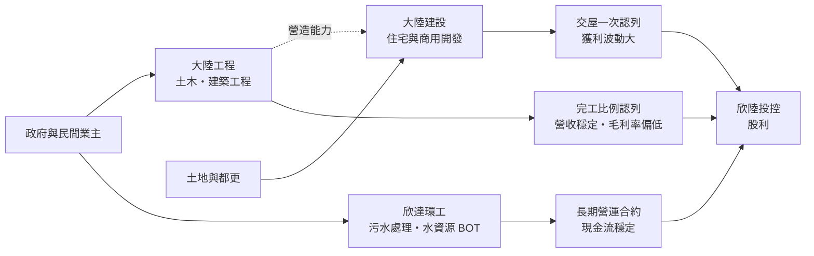
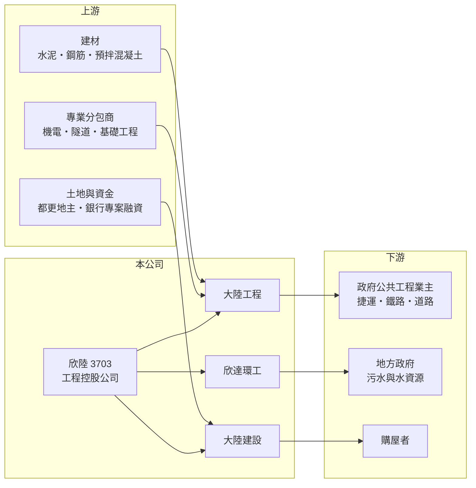

# 3703 欣陸

> 上市｜[[產業索引-建材營造業|建材營造業]]｜上市（櫃）日期 2010/04/08

# 第一章：企業模式與商業藍圖

> [!info] 撰寫說明
> 本文由 Claude 依公開資料整理，架構比照 [[2330台積電]] 的四章研究，資料截至 2026-10-08。財務數字來源：MoneyDJ 理財網年度財務比率與損益表、證交所開放資料（基本資料、2026 年第二季財報、營益分析、股利）；事業描述參考自由時報、經濟日報、工商時報與富果研究法說會頁面的新聞標題。各事業的營收比重與在手訂單金額未查得，產業描述為整理性內容。#待校對

在評估一家公司的長期價值時，第一步是拆解它由哪些事業組成、各自如何賺錢。本章針對欣陸投資控股（股票代號：3703，以下簡稱欣陸）進行定性分析，說明一家以大型公共工程起家的集團，如何把營建、環境工程與不動產開發三種性質不同的事業放在同一個控股公司之下。

## 一、核心定位：三大事業體的工程控股公司

欣陸於 2010 年以股份轉換方式成立並上市，取代原本的大陸工程成為集團的上市母公司，董事長為殷琪，實收資本額約 82.3 億元。依自由時報報導，殷琪在 2026 年股東會上以「三大事業體穩定成長」描述集團，三大事業分別是：

* **營建工程（大陸工程）：** 承攬捷運、高鐵、道路、橋梁等大型土木與建築工程，是集團營收規模最大的事業。工程依施工進度以[[完工比例法]]認列營收，營收相對平穩，但毛利率受工程報價與成本控制影響。
* **環境工程（欣達環工）：** 經營污水處理、下水道與水資源相關的興建與營運，多以[[BOT]] 或委託營運方式取得長期合約。營運期可長達十幾年到數十年，現金流穩定，是集團獲利品質最好的一塊。
* **不動產開發（大陸建設）：** 在台北等都會區開發中高價住宅與商用不動產，依經濟日報報導，大陸建設年度推案規模曾達 289 億元。營收在[[建案交屋]]時認列，波動較大。

## 二、資本轉化邏輯：工程現金流、營運合約與開發獲利互補

* **集團內部互補：** 大陸工程的營造能力可以支援大陸建設的建案，降低對外部營造廠的依賴；欣達環工的長期合約則平衡工程與建案的景氣波動。
* **高資產規模、低毛利：** 2026 年第二季底總資產約 978 億元，負債約 690 億元。工程業以預收款、應付工程款與專案融資支應，負債比率長期約六至七成，2025 年約 70%。

## 三、長期方向：公共建設與水資源的長期需求

台灣的軌道建設、都市更新與水資源基礎設施，都是以十年為單位的長期投資。欣陸的長期成長動能來自三點：政府持續推動捷運與鐵路建設帶來大型工程案源；氣候變遷使污水回收、再生水與防洪需求增加，有利環境工程的長期合約；台北都會區老舊建物改建（[[都更]]）提供不動產開發的土地來源。

# 第二章：護城河深度與競爭優勢

護城河是企業抵禦競爭、長期維持超額利潤的機制。本章分析欣陸三大事業各自的防守能力、主要競爭對手，以及它在工程業中能守住的位置。

## 一、欣陸護城河的核心組成要素

* **1. 大型工程的資格門檻：** 捷運、高鐵這類工程需要多年的施工實績、甲級營造資格與龐大的保證能力。大陸工程有數十年承攬經驗，能參與一般營造廠無法投標的大型標案。
* **2. 環境工程的長約與營運經驗：** 污水處理廠一旦取得 BOT 或營運合約，就在合約期間內獨家營運，競爭者很難介入。營運經驗與水處理技術也讓公司在下一輪標案中更有優勢。
* **3. 品牌與集團整合：** 「大陸」在台灣營建業是歷史悠久的品牌，大陸建設的住宅可以借助集團的營造品質形象，在中高價市場建立定位。

## 二、主要競爭對手格局

| 對手 | 定位 | 對欣陸的威脅 |
|---|---|---|
| [[2597潤弘]] | 預鑄工法建築營造 | 在建築工程與科技廠房搶標 |
| [[2545皇翔]]、[[2542興富發]] | 住宅開發 | 與大陸建設在台北住宅市場競爭 |
| 中華工程、榮工 | 公共工程營造 | 大型土木標案的直接對手 |
| 日系與韓系營造商 | 軌道與大型基礎建設 | 國際標案常以聯合承攬方式參與 |
| [[8473山林水]] | 污水處理與水資源 | 在環境工程 BOT 與營運標案競爭 |

## 三、優勢轉化：哪些守得住、哪些守不住

* **守得住：** 環境工程的長期營運合約與大型土木工程的資格門檻，是欣陸相對穩固的防線。
* **守不住：** 工程業本質上是低毛利的競標生意，[[毛利率]]長期只有 12% 至 16%，物價與工資上漲時很難轉嫁。不動產開發則受房市與[[信用管制]]影響大。
* **觀察重點：** 第一，大型公共工程的得標與執行毛利；第二，環境工程新合約的取得；第三，大陸建設的推案去化與交屋時程。

# 第三章：財務體質與盈利規模

資料日期：2026-10-08。數字取自 MoneyDJ 理財網年度財務資料與證交所開放資料，表格是撰寫當時的快照；最新月營收、毛利率、累計 EPS 由自動排程寫在本筆記的屬性欄位（月營收、毛利率、累計EPS 等）。#待校對

財務報表是檢驗護城河是否真實存在的最終標準。本章用五年的三率、ROE、股利與資本報酬，檢視欣陸作為工程控股公司的獲利品質。

## 一、獲利能力的基石：三率

| 年度 | 營收（新台幣） | [[毛利率]] | [[營業利益率]] | EPS（元） | [[ROE]] |
|---|---|---|---|---|---|
| 2021 | 268.4 億 | 14.5% | 8.58% | 2.22 | 6.83% |
| 2022 | 321.5 億 | 15.7% | 10.1% | 3.51 | 9.06% |
| 2023 | 306.1 億 | 14.0% | 7.10% | 2.09 | 4.42% |
| 2024 | 307.0 億 | 12.1% | 4.07% | 1.43 | 2.21% |
| 2025 | 343.8 億 | 12.0% | 4.81% | 1.80 | 4.82% |

資料來源：MoneyDJ 理財網年度損益表與財務比率。2026 年上半年（證交所營益分析）營收約 137.9 億元、毛利率 14.4%、營業利益率 5.41%、EPS 0.57 元。

欣陸營收穩定在 270 億至 340 億元，2021 至 2025 年營收年複合成長率約 6.4%（推算）。但毛利率由 2022 年的 15.7% 降到 2025 年的 12.0%，營業利益率由 10.1% 降到 4.8%，顯示近年工程成本上升或建案交屋較少，使獲利率下滑。2022 年獲利較高，與不動產交屋貢獻有關（推估）。

## 二、[[ROE]] 與股利

2021 至 2025 年平均 ROE 約 5.5%（推算），對一家資產規模近千億元的公司來說偏低，反映工程業低毛利、高資產的特性。2025 年度現金股利每股 1.05 元，配發率約 58%（推算）。依公司章程，期初無累積虧損時每年至少提撥稅後淨利 30% 分配股東股利，股利政策相對穩定。2026 年第二季底保留盈餘約 106.6 億元，股利來源充足。

## 三、資產負債與現金流

2026 年第二季底流動資產約 614 億元、流動負債約 506 億元，非流動負債約 184 億元。工程業的負債有相當比例是預收工程款與應付款，而環境工程的 BOT 專案則需要長期融資。自由現金流是否長期為正的完整資料未查得，但穩定配息顯示營運現金流足以支應股利。

## 四、[[ROIC]] 與 [[WACC]]：價值創造利差

**ROIC 推算：** 2025 年營業利益約 16.5 億元，稅後約 13.2 億元。官方資料只揭露負債總計約 690 億元，未區分有息負債；假設其中五成為銀行借款與專案融資，約 345 億元（推估），加上股東權益約 288 億元，投入資本約 633 億元，ROIC 約 2.1%（推算）；以 2021 至 2025 年平均營業利益計算約 2.7%（推算）。

**WACC 推算：** 台灣 10 年期公債殖利率取 1.75%、市場風險溢酬 6%、β 取大型營建同業常見值 0.8（未查得公司實際 β），股東權益成本約 6.6%。負債成本假設 3%，稅率 20%，稅後約 2.4%。權益約占投入資本 46%，WACC 約 4.3%（推算）。

**結論：** 欣陸的 ROIC 長期低於 WACC，代表龐大的資產規模並未轉化為足夠的本業報酬。環境工程的穩定現金流與大陸建設的高毛利建案，是拉高整體 ROIC 的關鍵；若工程本業毛利率持續停留在 12% 左右，價值創造會持續偏弱。

# 第四章：總體風險與地緣政治

任何企業都無法脫離宏觀環境獨立存在。本章分析欣陸長期必須面對的工程執行、政策、房市與財務風險。

## 一、工程執行風險

* **成本超支：** 大型工程合約期長，簽約時的報價若低估了工資、鋼筋與混凝土的漲幅，就可能出現虧損工程。營建業近年缺工嚴重，是毛利率下滑的重要原因之一。
* **工期延誤與履約爭議：** 地質、環評、徵收與設計變更都可能讓工期延長，衍生罰款或與業主的仲裁爭議。

## 二、政策與產業週期風險

* **公共建設預算：** 營建工程的案源大量依賴政府預算，政策方向與財政狀況會影響大型標案的推出節奏。
* **房市與[[信用管制]]：** 大陸建設的住宅開發受央行信用管制、房地合一稅等政策影響，2024 年起房市交易量下滑，會延後推案與交屋。
* **環境法規：** 污水排放標準提高，一方面增加環境工程的需求，另一方面也可能提高既有營運廠的改善成本。

## 三、財務與治理風險

* **高負債結構：** 負債比率約七成，利率上升會增加融資成本，也使公司在景氣反轉時的緩衝較小。
* **控股結構：** 獲利來自多家子公司，部分子公司有非控制權益，投資人需要分辨歸屬母公司的獲利與合併獲利。
* **經營傳承：** 集團長期由殷琪領導，經營團隊的延續與決策風格是長期觀察的重點。

# 專有名詞解析

## 金融

- **[[完工比例法]]**：工程依施工進度分期認列營收與利潤的會計方法，常用於營造工程與長期合約。
- **[[信用管制]]**：央行限制購屋與建商貸款成數的政策，會影響房市成交與建商資金。
- **[[ROIC]]**：投入資本報酬率，稅後營業利益除以股東權益加有息負債，衡量本業運用資本的效率。
- **[[WACC]]**：加權平均資金成本，股東與債權人要求報酬率的加權平均，是 ROIC 要超越的門檻。

## 產業

- **[[BOT]]**：興建、營運、移轉，民間出資興建公共設施並在一定期間營運收費，期滿後移轉給政府。
- **[[建案交屋]]**：建商在房屋完工並交付買方時才認列營收，因此營建公司的營收常集中在交屋年度。
- **[[都更]]**：都市更新，由地主與建商合作把老舊建物改建，地主依權利價值分回房地或收益。

# 核心供應鏈

## 1. 上游：建材、分包與資金
- 建材：[[1101台泥]]、[[1102亞泥]]、[[2002中鋼]]
- 專業分包：機電、隧道、基礎工程等協力廠（具體名單未查得）
- 資金：銀行與專案融資

## 2. 中游：欣陸與同業
- 子公司：大陸工程、欣達環工、大陸建設
- 同業：[[2597潤弘]]、中華工程、[[8473山林水]]、[[2545皇翔]]

## 3. 下游：業主與客戶
- 中央與地方政府（交通、水利、環保單位）、民間開發業主、台北都會區購屋者

## 最新新聞
<!-- news:start（自動產生，請勿手動編輯此範圍） -->
- 2026-10-08 🏛️ 重訊 17:16｜代子公司大陸建設股份有限公司依公開發行公司 資金貸與及背書保證處理準則第22條第一項第三款規定公告新增 資金貸與資訊｜[觀測站](https://mops.twse.com.tw/mops/#/web/t05st01)
- 2026-10-08 🏛️ 重訊 17:12｜代子公司大陸建設(股)公司公告申請臺北市信義區逸仙段都市更新事業 計畫及權利變換計畫案報核｜[觀測站](https://mops.twse.com.tw/mops/#/web/t05st01)

完整紀錄：[[3703欣陸 新聞]]
<!-- news:end -->

## 相關連結
- [公開資訊觀測站](https://mopsov.twse.com.tw/mops/web/t05st03?step=1&firstin=1&co_id=3703)
- [Goodinfo](https://goodinfo.tw/tw/StockDetail.asp?STOCK_ID=3703)
- [Yahoo 股市](https://tw.stock.yahoo.com/quote/3703)
- [鉅亨網新聞](https://www.cnyes.com/twstock/3703/news)
