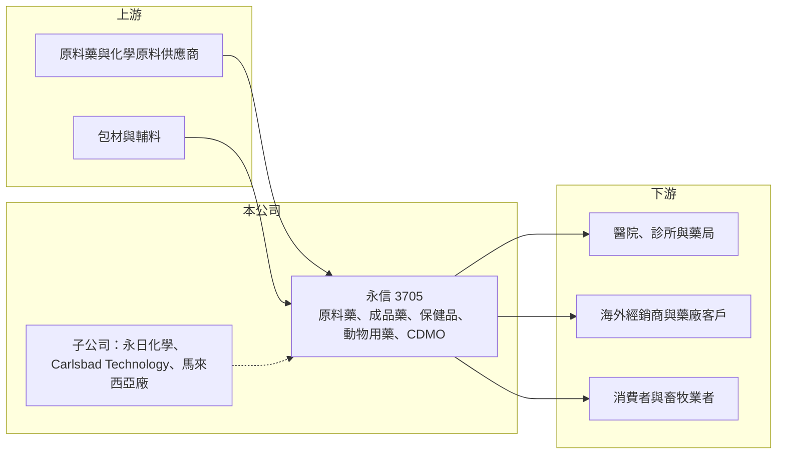

# 3705 永信

> 上市｜[[產業索引-生技醫療業|生技醫療業]]｜上市（櫃）日期 2011/01/03

# 第一章：企業模式與商業藍圖

> [!info] 撰寫說明
> 精簡版，由 Claude 依公開資料整理，架構比照 [[2330台積電]] 的四章研究，資料截至 2026-10-08。來源：Goodinfo 年度經營績效頁（2020 至 2025 年）、證交所開放資料（基本資料、2026 年第二季資產負債與綜合損益、營益分析、股利）、富果研究 2026 年 9 月永信法說會整理、nStock 2023 年法說報導；憑既有知識撰寫的部分已標「待校對」。#待校對

永信國際投資控股（股票代號：3705，以下簡稱永信）是台灣歷史最悠久的[[學名藥]]集團之一。它的商業模式是在多個國家建立符合國際標準的藥廠，以學名藥、[[原料藥]]、保健品與動物用藥分散收入，並以受託製造（[[CDMO]]）擴大產能利用。

- **核心業務：** 永信以控股公司形式於 2011 年 1 月成立並同日上市，董事長為李芳信、總經理為簡志維（證交所開放資料）。集團事業涵蓋原料藥、成品藥、消費性產品（保健品）與動物保健四大領域，CDMO 業務包括原料藥、品牌藥、保健品與動物用藥，年營收超過 10 億元（富果研究整理）。
- **營收結構：** 各地區與產品的營收比重本次未查得。依 2023 年法說報導，日本市場當年營收比重預計由 10% 提高到 14%（nStock）。2026 年上半年，高致敏與抗癌藥品的生產比重提高，帶動毛利率升到 44.43%，為三年來高點（富果研究整理）。
- **營運據點：** 集團在美國、日本、台灣、中國與東南亞共有 9 個生產基地，產品銷售超過 35 個國家。台灣通過美國 FDA 查廠的工廠包括永信幼獅廠與[[4102永日]]，美國則有 Carlsbad Technology 負責生產、包裝、法規與銷售；東南亞以馬來西亞為中心，當地保健品廠取得多項清真認證（富果研究整理）。
- **長期方向：** 永信的策略是「內部整合加外部併購」，目標領域包括生物製劑、細胞治療等新製程技術與醫療器材新事業。在建或規劃中的產能包括台灣的新醫材廠與新注射劑廠、馬來西亞注射劑新廠，以及子公司永鴻生技規劃的越南廠；2026 年取得中美洲第一張藥證，開啟中南美市場（富果研究整理）。

# 第二章：護城河深度與競爭優勢

永信的護城河建立在多國藥廠認證、長年累積的藥證組合與全球化產能，這些都需要數十年時間建立。

- **競爭優勢：** 藥廠要供應美國、日本等嚴格市場，必須通過各國主管機關的查廠，這類資格的建立成本高、時間長。永信擁有多座通過美國 FDA 查核的工廠與跨國產能，能在不同國家的政策中找到機會，例如日本對必要藥品穩定供應的價格鼓勵、美國 TAA 政策，以及台灣的藥品韌性計畫（富果研究整理）。
- **主要對手：** 台灣學名藥同業包括 [[1795美時]]、[[4114健喬]]、[[1720生達]]、[[4105東洋]]、[[3716中化控股]] 等；國際上則要面對印度與中國的大型學名藥與原料藥廠，它們的成本優勢明顯。#待校對
- **觀察重點：** 第一，高附加價值藥品（抗癌、高致敏、注射劑）比重能否持續提升，讓毛利率站穩 44% 以上；第二，CDMO 業務能否成為穩定的第二成長引擎；第三，併購案的執行品質，因為永信的成長有相當部分仰賴外部併購。

# 第三章：財務體質與盈利規模

資料日期：2026-10-08，表格是撰寫當時的快照；最新月營收、毛利率、累計 EPS 由自動排程寫在本筆記的屬性欄位（月營收、毛利率、累計EPS 等）。#待校對

永信是典型的成熟型藥廠：營收成長緩慢，但毛利率穩定、現金流良好，並維持高配息。

| 年度 | 營收（新台幣） | [[毛利率]] | [[營業利益率]] | EPS（元） | [[ROE]] |
|---|---|---|---|---|---|
| 2020 | 80.8 億 | 45.5% | 11.9% | 2.97 | 12.0% |
| 2021 | 78.1 億 | 47.7% | 12.3% | 2.77 | 11.3% |
| 2022 | 73.1 億 | 43.0% | 10.4% | 3.15 | 11.8% |
| 2023 | 70.3 億 | 42.4% | 13.2% | 3.11 | 11.2% |
| 2024 | 80.3 億 | 43.8% | 16.1% | 4.39 | 14.2% |
| 2025 | 83.8 億 | 43.5% | 15.8% | 3.31 | 10.0% |
| 2026 上半年 | 37.7 億 | 44.43% | 15.35% | 1.63 | 未查得 |

- **營收規模：** 2020 至 2025 年營收年複合成長率約 0.7%（推算），2022 年處分中國昆山廠後營收基期下降（nStock 2023 年報導），2024 年起回升。2026 年上半年營收年減 12.4%，但營業利益率仍維持 15.35%（證交所營益分析、富果研究整理）。
- **獲利：** 營業利益率由 2020 年的 11.9% 提高到 2024 至 2025 年的 16% 左右，代表產品組合正在改善；2021 至 2025 年平均 ROE 約 11.7%（推算）。2025 年 EPS 下滑，部分原因是匯兌損失（富果研究整理）。
- **財務特色：** 2025 年營業現金流約 15 億元，為十年新高（富果研究整理）。2026 年第二季底權益總計約 85.8 億元、負債約 45.9 億元，負債比約 34.9%（證交所開放資料）。2025 年度現金股利 3.0 元，約為 EPS 的 91%（推算），公司章程也明訂股東紅利以累積未分配盈餘的 10% 至 90% 分派。

**[[ROIC]] 與 [[WACC]]：**
- ROIC（推算）：2025 年營業利益約 83.8 億元 × 15.8% ≈ 13.2 億元，稅後約 10.6 億元；投入資本以權益總計 85.8 億元加上推估的有息負債約 25 億元（開放資料未拆分，假設），合計約 111 億元，ROIC 約 9.5%（推算）。
- WACC（推算）：無風險利率 1.75%、市場風險溢酬 6%，β 取製藥股常見值 0.7（假設），股東權益成本約 6.0%；負債成本 2.3%、稅後約 1.8%，負債占比約 23%，WACC 約 5.0%（推算）。
- 結論：ROIC 高於 WACC 約 4 至 5 個百分點，永信長期穩定地創造經濟價值，但幅度溫和。提高注射劑、抗癌藥與 CDMO 的比重，是擴大這個利差的主要途徑。

# 第四章：總體風險與地緣政治

永信的風險來自藥價政策、國際競爭與多國營運的複雜度。

- **產業週期：** 藥品需求相對穩定，但季節性明顯，例如秋冬急性感染季節的用藥需求較高。學名藥市場的長期壓力來自各國的藥價調降與集中採購，中國的一致性評價與帶量採購就大幅壓低了學名藥價格。
- **營運風險：** 原料藥供應不穩會影響產量與成本，2023 年公司就因美國產品的原料藥供應問題而新增第二家供應商（nStock 2023 年報導）。多國工廠需要持續維持各國的查廠資格，任何一次查核缺失都可能影響出口。
- **其他風險：** 美元、日圓與人民幣的匯率波動會造成匯兌損益，2025 年就因匯損拖累 EPS。中美貿易政策、關稅與各國對藥品在地生產的要求，也會影響永信的產能布局。

# 專有名詞解析

## 金融

- **[[ROIC]]**：投入資本報酬率，稅後營業利益除以股東權益與有息負債的合計，衡量本業對所有資金提供者的報酬。
- **[[WACC]]**：加權平均資金成本，依股東權益與負債的比重加權計算的資金成本，ROIC 高於它才代表創造價值。

## 產業

- **[[學名藥]]**：原廠藥專利到期後，其他藥廠依相同成分與劑型生產的藥品，價格通常較低。
- **[[原料藥]]**：藥品中具有療效的活性成分，經製劑廠加工成錠劑、膠囊或注射劑等成品藥。
- **[[CDMO]]**：委託開發暨製造服務，替其他藥廠或品牌開發製程並代工生產。
- **[[帶量採購]]**：中國政府集中招標、以採購量換取大幅降價的藥品採購制度，壓縮學名藥利潤。

# 核心供應鏈

- 上游：原料藥與化學原料供應商、藥用包材與輔料供應商。
- 下游／客戶：台灣與日本的醫療院所與藥局、美國與東南亞的藥品經銷商、CDMO 委託客戶、保健品消費者與畜牧業者。
- 同業：[[1795美時]]、[[4114健喬]]、[[1720生達]]、[[4105東洋]]、[[3716中化控股]]，以及印度與中國的學名藥廠。#待校對

## 最新新聞
<!-- news:start -->
<!-- news:end -->

## 相關連結
- [公開資訊觀測站](https://mopsov.twse.com.tw/mops/web/t05st03?step=1&firstin=1&co_id=3705)
- [Goodinfo](https://goodinfo.tw/tw/StockDetail.asp?STOCK_ID=3705)
- [Yahoo 股市](https://tw.stock.yahoo.com/quote/3705)
- [鉅亨網新聞](https://www.cnyes.com/twstock/3705/news)
