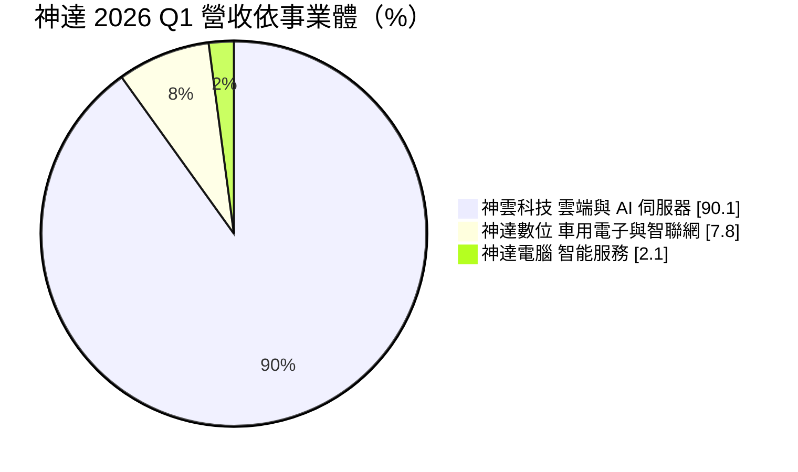
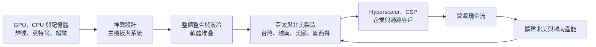
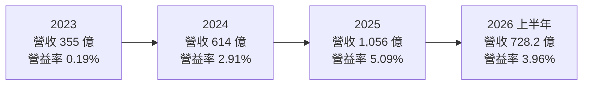
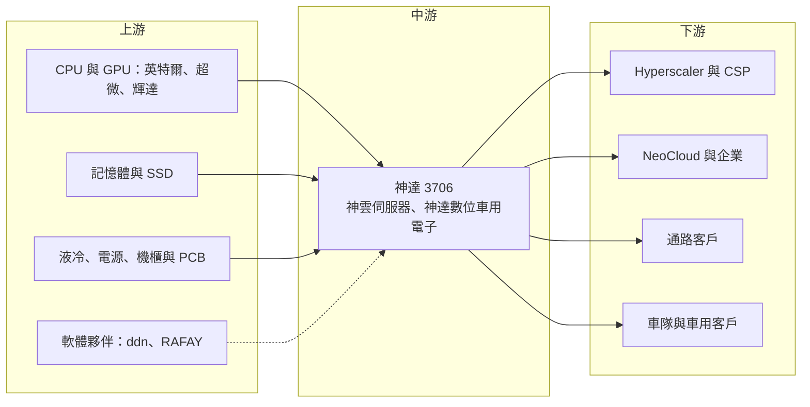

# 3706 神達

> 上市｜[[產業索引-電腦及週邊設備業|電腦及週邊設備業]]｜上市（櫃）日期 2013/09/12

# 第一章：企業模式與商業藍圖

> [!info] 撰寫說明
> 本文由 Claude 依公開資料整理，架構比照 [[2330台積電]] 的四章研究，資料截至 2026-10-08。財務數字來源：Goodinfo 年度經營績效頁（2020 至 2025 年）、證交所開放資料（基本資料、2026 年第二季資產負債與綜合損益、營益分析、股利）、富果研究 2026 年 5 月神達法說會整理、經濟日報營收報導；產業描述為整理性內容，尚未逐條比對原始文件，憑既有知識撰寫的部分已標「待校對」。#待校對

在評估單一個股的長期投資價值時，首要步驟是拆解企業的底層獲利邏輯。本章針對神達（股票代號：3706）的商業模式進行分析，說明這家以控股公司形式經營的集團，如何從多元的電子事業收斂到以伺服器為核心，並在 AI 伺服器時代取得成長。

## 一、核心定位：以伺服器為核心的控股公司

神達目前的上市主體成立於 2013 年 9 月，同日上市，是由原神達電腦以股份轉換方式成立的控股公司，屬於聯華神通集團，董事長為苗豐強、總經理為何繼武（證交所開放資料）。#待校對 2026 年第二季底股本約 146 億元，較基本資料登記的 132.7 億元增加，反映 2025 年度每股配發 1 元股票股利（證交所開放資料）。

神達旗下有三個主要事業體：神雲科技（雲端運算與 AI 伺服器）、神達數位（車用電子與智聯網）與神達電腦（智能服務）。其中神雲占營收九成以上，因此神達實質上已是一家伺服器公司。神雲以自有品牌與 [[ODM]] 並行，產品涵蓋 AI 伺服器、[[HPC]] 伺服器、企業級與儲存伺服器，以及整櫃與叢集解決方案。神雲過去收購伺服器品牌 TYAN，並在 2023 年承接英特爾的資料中心伺服器主機板與系統業務，讓它取得英特爾原有的伺服器客戶與產品線。#待校對

## 二、終端應用與產品板塊

2026 年第一季的營收結構如下（富果研究整理之法說資料）：

* **神雲科技：** 2026 年第一季營收約 287 億元，年增 38.1%。客戶包括 Hyperscaler、[[CSP]]、通路與企業用戶，公司表示沒有單一客戶過度集中的風險，也開始收到 [[NeoCloud]] 業者的合作詢問。產品包括高密度 AI [[液冷]]整合機櫃，單一機櫃最多支援 96 顆 GPU。
* **神達數位：** 以 Mio 品牌的行車記錄器與車用電子起家，近年轉向車隊管理與智聯網服務，主張「AI as a service」，目標建立經常性收入。#待校對 2026 年 4 月 20 日神達數位上市，神達的持股降到 54.5%，但仍採合併報表。
* **神達電腦：** 提供智能服務與系統整合，規模較小。

## 三、資本轉化邏輯：從 ODM 走向端到端方案

神達的伺服器業務和一般代工廠相比，有兩個不同之處：

* **自有品牌與 ODM 並行：** 神雲除了替大型客戶代工，也以自有品牌經營通路與企業客戶，這讓它的客戶結構比純代工廠分散，毛利率也相對較高。2025 年神達毛利率約 11.3%，高於仁寶、英業達等筆電與伺服器代工廠的 5% 左右（Goodinfo）。
* **端到端整合：** 神雲正從純硬體 ODM 轉向端到端整合方案，結合軟體（Open BMC、Canonical Ubuntu）、合作夥伴（ddn 軟體定義儲存、RAFAY GPU 資源管理）與液冷技術，以避免陷入純代工的價格競爭（富果研究整理）。

## 四、企業長期藍圖

神達正在建立亞太與北美兩大製造聚落：亞太包括台灣、越南（河內廠 2026 年第二季量產）與中國；北美包括美國（新增兩座工廠，預計 2026 年第三季營運）與墨西哥。公司表示 2026 至 2028 年資本支出將持續擴張（富果研究整理）。

產品方向上，神達認為全液冷已成為主要趨勢，並預期推論（Inference）應用的出貨比重會逐步提高。長期而言，神達的目標是成為能提供 AI 機櫃、運算、網路與儲存整合方案的伺服器系統商，而不是單純的組裝廠。2020 年營收約 411 億元，到 2025 年已增至 1,056 億元，伺服器的成長讓神達在五年內完成了規模上的轉型。

# 第二章：護城河深度與競爭優勢

本章針對神達的競爭優勢進行分析。神達在伺服器市場的規模不及鴻海、廣達，它的競爭力來自伺服器專業、自有品牌通路與多元客戶結構。

## 一、護城河的核心組成要素

* **伺服器設計的長期經驗：** 神雲經營伺服器業務數十年，並透過收購 TYAN 與承接英特爾的伺服器業務，累積主機板與系統設計能力，以及英特爾原有的客戶基礎。#待校對 這讓神雲能在新一代 CPU 與 GPU 平台推出時，快速推出對應的產品。
* **自有品牌與通路：** 除了大型雲端客戶，神雲也透過通路服務企業與中小型資料中心。這些客戶需要的是標準化但可客製的產品，訂單規模小但利潤率較高，也能分散對大客戶的依賴。
* **液冷與整櫃整合：** 高密度 AI 機櫃需要電力、散熱與網路的整合設計。神雲同時提供 Liquid-to-Liquid（適用新建資料中心）與 Liquid-to-Air（適用改造舊資料中心）的液冷方案，能滿足不同客戶的需求（富果研究整理）。
* **雙聚落製造：** 台灣、越南、美國與墨西哥的產能布局，讓神達能因應關稅與客戶的在地化要求。

## 二、全球主要競爭對手格局

| 公司 | 定位 | 與神達的比較 |
|---|---|---|
| [[2317鴻海]] | 全球最大 AI 伺服器代工 | 規模與垂直整合遠勝 |
| [[2382廣達]] | CSP 整櫃主要供應商 | 大型 CSP 關係領先 |
| [[3231緯創]]、[[6669緯穎]] | GPU 模組與 CSP 整機 | 規模較大 |
| [[2356英業達]] | 伺服器主機板與整機 | 在主機板上直接競爭 |
| [[2376技嘉]] | 自有品牌伺服器 | 品牌伺服器市場的直接對手 |
| Supermicro | 美國伺服器品牌 | 品牌伺服器與整櫃的國際對手 #待校對 |

神達在伺服器市場的定位，比較接近「品牌加 ODM 的混合型」：它不像鴻海、廣達以超大型 CSP 訂單為主，也不像 Supermicro 完全以品牌經營，而是在兩者之間尋找客戶多元、利潤率較佳的市場。

## 三、優勢轉化：守得住、守不住與觀察重點

* **守得住：** 企業、通路與第二線雲端客戶的伺服器市場。這些客戶重視產品彈性與服務，神雲的品牌與設計能力能維持較好的利潤率。
* **守不住：** 毛利率在 AI 伺服器放量時的稀釋。2026 年第一季毛利率由去年同期的 12% 降到 9%，原因包括高單價產品比重增加、客戶組合變化，以及記憶體、SSD、CPU 等關鍵零組件缺料與成本上升（富果研究整理）。
* **觀察重點：** 第一，美國新廠與越南河內廠的量產進度；第二，能否打入大型 Hyperscaler 的 AI 機櫃訂單；第三，營業利益率能否在營收快速成長的同時，維持在 3% 至 5% 的區間。

# 第三章：財務體質與盈利規模

資料日期：2026-10-08。多年度數字取自 Goodinfo 年度經營績效頁，2026 年上半年取自證交所開放資料，表格是撰寫當時的快照；最新月營收、毛利率、累計 EPS 由自動排程寫在本筆記的屬性欄位（月營收、毛利率、累計EPS 等）。#待校對

財務報表是檢驗護城河是否真實存在的最終標準。本章用多年度的三率、ROE、現金流與資本報酬，檢視神達轉型為伺服器公司後的獲利品質。

## 一、獲利能力的基石：三率

| 年度 | 營收（新台幣） | [[毛利率]] | [[營業利益率]] | EPS（元） | [[ROE]] |
|---|---|---|---|---|---|
| 2020 | 411 億 | 11.2% | 0.18% | 2.45 | 6.93% |
| 2021 | 422 億 | 10.3% | 0.10% | 10.01 | 25.1% |
| 2022 | 478 億 | 8.02% | -2.49% | 7.76 | 16.4% |
| 2023 | 355 億 | 12.6% | 0.19% | 1.48 | 2.93% |
| 2024 | 614 億 | 12.0% | 2.91% | 3.28 | 6.52% |
| 2025 | 1,056 億 | 11.3% | 5.09% | 5.15 | 10.9% |
| 2026 上半年 | 728.2 億 | 9.17% | 3.96% | 2.58 | 未查得 |

* **2023 年後的結構轉變：** 2020 至 2023 年，神達的本業幾乎不賺錢，營業利益率在 0% 上下，2022 年甚至為負。2024 年起，在英特爾伺服器業務併入與 AI 伺服器需求帶動下，營收由 355 億元跳升到 1,056 億元，營業利益率提高到 5.09%。2020 至 2025 年營收年複合成長率約 20.8%（推算）。
* **早年 EPS 主要來自業外：** 2021 年營業利益率只有 0.10%，EPS 卻高達 10.01 元，代表當年獲利主要來自處分投資等業外收益（推估）。因此 2021 至 2022 年的高 ROE 不能代表本業的競爭力；2024 年後的獲利才是由本業驅動。
* **2026 年上半年：** 營收年增明顯，但毛利率降到 9.17%、營業利益率 3.96%，營業外收入約 11.2 億元（證交所開放資料），業外仍占稅前淨利約四分之一。

## 二、[[ROE]]：資本效率

2021 至 2025 年平均 ROE 約 12.4%（推算），但波動極大，由 2021 年的 25.1% 到 2023 年的 2.93%。2026 年第二季底權益總計約 778.6 億元、總負債約 1,021.6 億元，負債比約 57%（證交所開放資料）。神達的股東權益中有相當部分是金融資產投資，2026 年上半年其他綜合損益約 70.9 億元，遠高於本期淨利 35.7 億元，代表股權投資的評價變動對淨值影響很大。

## 三、資本支出與自由現金流

神達表示 2026 至 2028 年資本支出將持續擴張，主要用於美國、越南的新廠與液冷整櫃產能，具體金額本次未查得。2026 年第一季存貨天數約 110 天，公司說明是策略性備貨（富果研究整理）。在營收快速成長與擴產同時進行的期間，[[自由現金流]]可能轉緊（推估）。

股利方面，2025 年度每股配發現金股利 3.0 元與股票股利 1.0 元，現金配發率約 58%（證交所股利資料，推算）。配發股票股利會擴大股本，可能稀釋未來的 EPS，但也保留現金支應擴產。

## 四、[[ROIC]] 與 [[WACC]]：價值創造利差

* **ROIC（推算）：** 2025 年營業利益約 1,056 億元 × 5.09% ≈ 53.8 億元，稅後約 43.0 億元。投入資本以 2026 年第二季底權益總計 778.6 億元，加上假設的有息負債約 450 億元（開放資料未拆分借款，以非流動負債 402 億元加上部分短期借款推估），合計約 1,229 億元，ROIC 約 3.5%（推算）。由於權益中包含大量非營業用的股權投資，若只計算伺服器業務實際使用的資本，本業 ROIC 會明顯較高（推估）。
* **WACC（推算）：** 無風險利率 1.75%、市場風險溢酬 6%，β 取伺服器股常見值 1.0，股東權益成本約 7.75%；負債成本 2.5%、稅後約 2.0%；權益約占 63%，WACC 約 5.6%（推算）。
* **結論：** 以帳面總資本計算，神達的 ROIC 仍低於 WACC，主要是因為大量的投資部位拉高了分母。伺服器本業在 2024 年後已轉為明顯獲利，若持續成長並維持 4% 以上的營業利益率，加上適度活化投資部位，ROIC 有機會在未來幾年超越 WACC。這是觀察神達資本配置是否有效的核心指標。

# 第四章：總體風險與地緣政治

任何企業都無法脫離宏觀環境獨立存在。本章分析神達長期必須面對的地緣政治、產業週期與營運風險。

## 一、地緣政治風險

* **美中科技管制：** 神達在中國仍有產能，AI 伺服器使用的高階 GPU 受美國出口管制。公司表示所有業務皆遵循美國出口規範（富果研究整理），但管制範圍若擴大，可能影響部分客戶與產品。
* **美國在地製造：** 美國新廠能回應關稅與在地化要求，但美國的營運成本高、人才招募困難，新廠能否達到經濟規模是重要的觀察點。
* **多地營運：** 台灣、越南、中國、美國與墨西哥的產能布局，需要同時面對多國的法規與政治風險。

## 二、產業週期與市場結構風險

* **AI 資本支出週期：** 神達的成長高度依賴 AI 與雲端伺服器需求。若 CSP 與企業的 AI 投資放緩，伺服器訂單可能快速下滑。
* **資料中心電力：** 公司在法說中提到，資料中心電力基礎設施的建置速度是主要風險之一。AI 機櫃耗電量大，若電力建設跟不上，客戶的部署時程會延後。
* **[[長鞭效應]]：** 伺服器客戶在需求旺盛時大量下單、在調整期同步削減，代工與系統廠的訂單波動常比終端需求劇烈。

## 三、營運環境的隱性風險

* **零組件缺料與成本：** 記憶體、SSD、CPU 等關鍵零組件的缺料與漲價，已在 2026 年壓縮毛利率。
* **存貨風險：** 策略性備貨讓存貨天數拉長，若需求不如預期或平台更替，可能面臨跌價損失。
* **業外波動：** 股權投資的評價變動與處分損益，會讓 EPS 與淨值大幅波動，增加財報解讀的難度。

## 四、科技演進風險

AI 伺服器正朝全液冷、更高功率密度與整櫃交付發展，神達已投入液冷與機櫃整合，但需要持續投資才能跟上 GPU 平台的更替速度。另一方面，推論應用的普及可能讓伺服器需求從少數大型訓練叢集，擴散到更多企業與邊緣資料中心，這對擁有自有品牌與通路的神雲是機會。車用電子方面，神達數位的轉型取決於車隊管理與 AI 服務能否建立穩定的經常性收入，而不只是硬體銷售。

# 專有名詞解析

## 半導體

- **[[HPC]]**：高效能運算，以大量處理器並行運算處理科學模擬、AI 訓練等大型計算工作。

## 金融

- **[[控股公司]]**：本身不直接營運、透過持有子公司股權來管理集團事業的公司。
- **[[毛利率]]**：營業毛利占營收的比例，反映產品定價能力與生產成本控制。
- **[[ROE]]**：股東權益報酬率，稅後淨利除以股東權益，衡量公司運用股東資金的效率。
- **[[ROIC]]**：投入資本報酬率，稅後營業利益除以股東權益與有息負債的合計，衡量本業對所有資金提供者的報酬。
- **[[WACC]]**：加權平均資金成本，依股東權益與負債的比重加權計算的資金成本，ROIC 高於它才代表創造價值。
- **[[自由現金流]]**：營業活動現金流減去資本支出，代表企業可自由用於配息、還債或併購的現金。
- **[[長鞭效應]]**：終端需求的小幅變動，沿供應鏈往上游傳遞時被逐級放大，造成上游庫存與訂單劇烈波動。

## 產業

- **[[ODM]]**：原始設計製造，代工廠替品牌客戶負責產品設計與生產，品牌商負責行銷與銷售。
- **[[CSP]]**：雲端服務供應商，例如亞馬遜 AWS、微軟 Azure、Google Cloud，是 AI 伺服器最大的買家。
- **[[Hyperscaler]]**：超大規模資料中心業者，通常指亞馬遜、微軟、Google、Meta 等擁有全球資料中心的大型雲端公司。
- **[[NeoCloud]]**：專門出租 GPU 算力的新興雲端業者，規模小於大型 CSP，但近年快速成長。
- **[[液冷]]**：以液體帶走伺服器晶片熱量的散熱方式，效率高於傳統氣冷，是高功率 AI 伺服器的主流方向。
- **[[推論]]**：AI 模型訓練完成後實際回答問題或產生內容的運算，需求隨 AI 應用普及而擴大。
- **[[Open BMC]]**：開源的伺服器基板管理控制器韌體，用來遠端監控與管理伺服器硬體。

# 核心供應鏈

## 1. 上游：關鍵零組件與軟體夥伴
- CPU 與 GPU：[[INTC英特爾]]、[[AMD超微]]、[[NVDA輝達]]。
- 記憶體與儲存：[[005930三星電子]] 等。
- 液冷與電源：[[3017奇鋐]]、[[2308台達電]] 等。#待校對
- 軟體與生態系：ddn、RAFAY、Canonical。

## 2. 中游：神達與子公司
- 神雲科技（含 TYAN 品牌）：雲端與 AI 伺服器。#待校對
- 神達數位：車用電子與智聯網，2026 年 4 月上市，神達持股 54.5%。

## 3. 下游：客戶
- Hyperscaler、CSP、NeoCloud、企業與通路客戶、車隊管理客戶。

## 4. 同業與競爭者
- [[2317鴻海]]、[[2382廣達]]、[[3231緯創]]、[[6669緯穎]]、[[2356英業達]]、[[2376技嘉]]、Supermicro。

## 最新新聞
<!-- news:start（自動產生，請勿手動編輯此範圍） -->
- 2026-10-08 📰 媒體 19:51｜營收速報 - 神達(3706)9月營收189.13億元年增率高達88.65％｜[鉅亨網](https://news.cnyes.com/news/id/6625876)
- 2026-10-08 🏛️ 重訊 16:18｜新聞稿-神達控股公佈一百一十五年九月營收｜[觀測站](https://mops.twse.com.tw/mops/#/web/t05st01)
- 2026-10-08 🏛️ 重訊 15:55｜代子公司神雲科技股份有限公司公告向關係人取得不動產使用權資產｜[觀測站](https://mops.twse.com.tw/mops/#/web/t05st01)
- 2026-10-08 🏛️ 重訊 15:55｜代子公司神雲科技股份有限公司公告興建廠房案｜[觀測站](https://mops.twse.com.tw/mops/#/web/t05st01)
- 2026-10-06 🏛️ 重訊 17:00｜代子公司Mega Prosper Group Limited 公告新增資金貸與金額 達本公司最近期財務報表淨值百分之二以上。｜[觀測站](https://mops.twse.com.tw/mops/#/web/t05st01)

完整紀錄：[[3706神達 新聞]]
<!-- news:end -->

## 相關連結
- [公開資訊觀測站](https://mopsov.twse.com.tw/mops/web/t05st03?step=1&firstin=1&co_id=3706)
- [Goodinfo](https://goodinfo.tw/tw/StockDetail.asp?STOCK_ID=3706)
- [Yahoo 股市](https://tw.stock.yahoo.com/quote/3706)
- [鉅亨網新聞](https://www.cnyes.com/twstock/3706/news)
