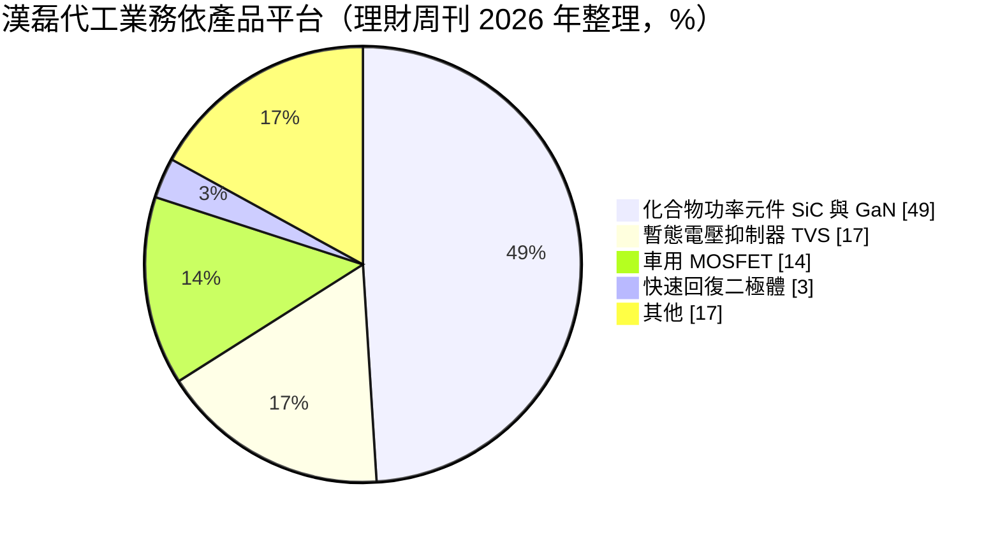
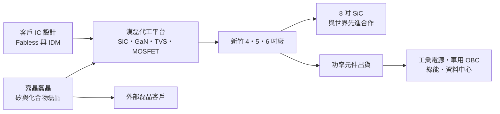
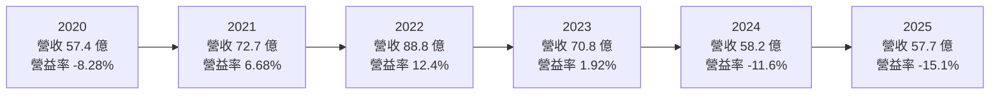
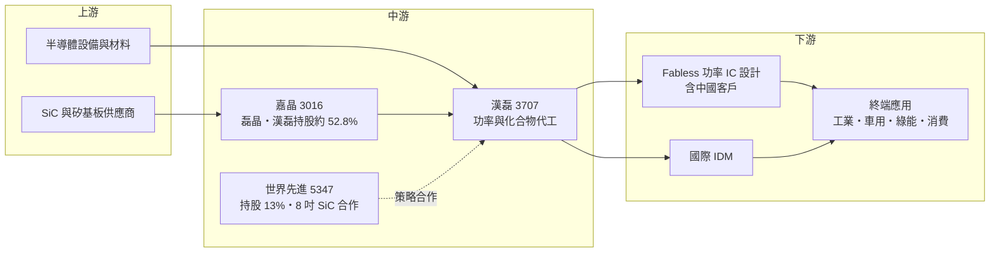

# 3707 漢磊

> 上櫃｜[[產業索引-半導體業|半導體業]]｜上市（櫃）日期 2014/10/01

# 第一章：企業模式與商業藍圖

> [!info] 撰寫說明
> 本文由 Claude 依公開資料整理，架構比照 [[2330台積電]] 的四章研究，資料截至 2026-10-08。財務數字來源：Goodinfo 年度獲利指標、資產負債結構與股利政策頁、富果研究 2025 年 9 月法說會整理、理財周刊 2026 年公司報導、富邦證券轉載之 2026 年 6 月處分嘉晶股票公告、Yahoo 股市公司基本資料；產業描述為整理性內容，尚未逐條比對原始文件。成立日期為現行公司（原漢磊投控）設立日，漢磊科技本身的營運歷史更早。#待校對

在評估單一個股的長期投資價值時，首要步驟是拆解企業的底層獲利邏輯。本章針對漢磊先進投資控股（股票代號：3707，以下簡稱漢磊）的商業模式進行定性分析，說明這家結合功率元件代工與磊晶晶圓的集團，為什麼在碳化矽與氮化鎵的長期趨勢中具有戰略位置，卻在 2024 至 2025 年陷入連續虧損。

## 一、核心定位：功率與化合物半導體的專業代工加磊晶集團

漢磊是台灣少數專注[[功率半導體]]與類比 IC 的[[晶圓代工]]廠，廠房位於新竹科學園區，擁有 4 吋、5 吋與 6 吋產線。和 [[2303聯電]]、[[2330台積電]] 這類邏輯晶圓代工不同，漢磊做的是二極體、[[MOSFET]]、暫態電壓抑制器（[[TVS]]）以及碳化矽（[[SiC]]）與氮化鎵（[[GaN]]）功率元件，這些元件負責電力轉換與保護，廣泛用於工業設備、車用與電源。

漢磊的公司架構經過多次調整，理解它的財報必須先了解這段沿革。依理財周刊整理，2014 年 10 月以股份轉換方式成立漢磊投控，原本的漢磊科技成為百分之百持股子公司；同年 12 月把業務分為晶圓代工與磊晶兩大事業；2016 年磊晶事業與 [[3016嘉晶]] 合併，以嘉晶為存續公司；2021 年 9 月漢磊投控再與漢磊科技合併，11 月更名為現名。因此，現在的漢磊一方面自己經營晶圓代工，另一方面是嘉晶的母公司，合併報表同時包含代工與[[磊晶]]兩塊業務。

依理財周刊的資料，合併營收中磊晶晶片約占 65%、元件及積體電路代工約占 34%。換句話說，漢磊合併營收的大半其實來自嘉晶。2026 年 6 月，漢磊處分 1,450 萬股嘉晶股票，交易金額約 16.75 億元，處分後仍持有嘉晶約 52.8% 股權，公司說明目的是活化資產，以因應產業波動或擴充核心業務的資金需求。

## 二、終端應用／產品板塊

以晶圓代工業務來看，依理財周刊引用的最新資料，產品平台與應用的比重如下：

**化合物功率元件**是漢磊長期轉型的核心。SiC 元件耐高壓、高溫，適合電動車車載充電器（[[OBC]]）、主驅逆變器、太陽能逆變器與工業電源；GaN 元件切換速度快，適合快充、資料中心電源與通訊。依 2025 年 9 月法說會，漢磊 6 吋 SiC 月產能約 5,000 片、GaN 約 2,000 片。

**TVS 與車用 MOSFET** 是傳統矽基產品，技術成熟但需求穩定。TVS 用於保護電路免受突波傷害，隨電子產品與車用電子的普及而持續成長；車用 MOSFET 則需要通過[[車規驗證]]，客戶黏著度高。

依應用別，最新資料顯示工業用約 44%、車用約 28%、消費性約 21%、綠能約 7%；銷售地區以台灣 42% 最高，其次為亞洲 26%、美洲 23%。工業與車用合計超過七成，代表漢磊的需求主要來自電力電子與交通電動化，而不是手機、PC 這類消費性產品。

## 三、資本轉化邏輯（營運模式）：重資產代工的產能利用率遊戲

漢磊是重資產的製造業，獲利高度取決於[[產能利用率]]。依 Goodinfo，2025 年固定資產占總資產約 44%，比 2024 年的 34.5% 明顯提高，反映新設備陸續投入。新設備的折舊是固定成本，當 SiC 需求在 2024 至 2025 年因電動車放緩與中國低價競爭而下滑時，產能利用率偏低加上折舊增加，使毛利率轉為負值。2025 年上半年法說會中，公司就把虧損主因歸於產能利用率偏低與新設備折舊大幅增加。

這種營運模式的另一面是，一旦需求回升，增加的營收大部分可以轉為毛利，獲利改善的速度也會很快。2022 年漢磊營收 88.8 億元、營業利益率 12.4%，就是產能滿載時的樣貌。

嘉晶的磊晶事業則位於代工的上游，負責在矽或碳化矽基板上長出高品質的薄膜，再交給代工廠或 IDM 製作元件。漢磊集團因此同時掌握「磊晶」與「元件製造」兩段，對化合物半導體的品質控制與客戶服務都有幫助。

## 四、企業長期藍圖：8 吋 SiC 與世界先進結盟

漢磊長期藍圖中最重要的事件，是 2024 年 9 月與 [[5347世界先進]] 的策略結盟。依理財周刊，世界先進以 24.8 億元取得漢磊 13% 股權，雙方簽訂合作協議，共同推動 8 吋 SiC 晶圓技術研發與生產，由漢磊移轉相關技術。依 2025 年 9 月法說會，雙方利用世界先進廠房建置 8 吋試產線，規劃月產能 1,500 片。

這項結盟的意義在於規模。SiC 晶圓從 6 吋轉到 8 吋，每片晶圓可切出的晶片數大幅增加，單位成本隨之下降，是全球 SiC 產業的主要方向。漢磊自己若要建置 8 吋產能，資本負擔沉重；借助世界先進的廠房與資本，漢磊可以把技術轉化為規模，並同時提供 6 吋與 8 吋代工，接觸過去難以觸及的大型 IDM 客戶。公司在法說會中也表示，若大型 IDM 客戶需要大額投資，不排除由客戶直接與世界先進合作，雙方協調分工。

技術面，公司第四代 SiC 平面型 MOSFET 預計 2026 年成為主力之一，效能較第三代提升約 20%、晶片面積縮小約 20%；SiC 溝槽型 MOSFET 則採客戶自有技術導入模式開發，以降低專利風險。應用上，漢磊除了既有的 OBC 與太陽能，也拓展到電動車主驅逆變器、資料中心電源、3,300 伏以上高壓產品，以及機器人與無人機等新領域。

# 第二章：護城河深度與競爭優勢

「護城河」指企業抵禦競爭、維持超額利潤的保護機制。本章分析漢磊的護城河組成、全球主要競爭對手，以及它在 SiC 價格戰中能守住多少。

## 一、漢磊護城河的核心組成要素

漢磊的護城河並不深，但有三個值得注意的要素。

第一是化合物功率元件的製程經驗。SiC 與 GaN 的製程和矽完全不同，需要高溫離子佈植、特殊蝕刻與缺陷控制，良率的學習曲線很長。漢磊是台灣最早投入 SiC 代工的業者之一，累積了多代平面型 MOSFET 的量產經驗，這是新進者短期內難以取得的。

第二是磊晶加代工的垂直整合。透過持有嘉晶過半股權，漢磊集團掌握磊晶與元件製造兩段，能在客戶開發新元件時同時調整磊晶層與製程參數。對沒有自有晶圓廠的 SiC 設計公司而言，一站式服務可以縮短開發時間。

第三是世界先進的策略背書。世界先進入股後，漢磊不再只是一家小型功率代工廠，而是進入泛台積電集團的產業網絡。這有助於爭取國際 IDM 客戶的信任，也解決了 8 吋擴產的資金問題。

## 二、全球主要競爭對手格局

| 對手 | 定位 | 對漢磊的威脅 |
|---|---|---|
| Wolfspeed、英飛凌、意法半導體、安森美 | 國際 SiC IDM，自有基板到元件 | 掌握大型車廠訂單，規模與成本領先 |
| 中國 SiC 代工與 IDM 業者 | 政策扶植、大舉擴產 | 以低價搶中國設計公司客戶，壓低 SiC 價格 |
| [[2303聯電]]、[[2342茂矽]] 等台灣功率代工 | 矽基功率元件代工 | 在 MOSFET、二極體等矽基產品競爭 |
| [[2330台積電]] 等 GaN 代工 | GaN-on-Si 製程 | 在 GaN 代工競爭，但台積電已規劃逐步退出 GaN 代工（產業報導，未逐條查證） |

依理財周刊，漢磊自列的晶圓代工主要競爭對手還包括旺宏、茂矽、敦南、元隆、三星與英特爾，顯示它在矽基功率元件領域面對的是高度分散的競爭。

## 三、優勢轉化：守得住／守不住／觀察重點

漢磊守得住的，是需要長期驗證的車用與工業客戶，以及希望在中國以外取得 SiC 產能的國際客戶。這些客戶看重品質與供應穩定，一旦完成驗證，不會輕易轉單。TVS 等矽基保護元件則提供穩定的現金流基礎。

守不住的，是一般規格的 6 吋 SiC 代工價格。依 2025 年 9 月法說會，SiC 價格在過去一年大幅下滑，中國業者擴產是重要原因。漢磊的毛利率從 2022 年的 19.5% 一路降到 2025 年的 -3.3%，代表在價格戰與低利用率之下，6 吋 SiC 的經濟效益已大幅縮水。

長期觀察重點有三個：8 吋 SiC 試產線能否如期通過客戶驗證並放量；第四代 SiC MOSFET 與溝槽型產品能否提高每片晶圓的價值；以及產能利用率能否回升到足以覆蓋折舊的水準，使毛利率重新轉正。

# 第三章：財務體質與盈利規模

資料日期：2026-10-08。數字取自 Goodinfo 年度財務資料、資產負債結構與股利政策頁、富果研究法說會整理，表格是撰寫當時的快照；最新月營收、毛利率、累計 EPS 由自動排程寫在本筆記的屬性欄位（月營收、毛利率、累計EPS 等）。#待校對

財務報表是檢驗護城河是否真實存在的最終標準。本章用六年的三率、ROE、現金流與資本報酬，檢視漢磊在功率半導體循環中的獲利品質。

## 一、獲利能力的基石：三率

| 年度 | 營收（新台幣） | [[毛利率]] | [[營業利益率]] | EPS（元） | [[ROE]] |
|---|---|---|---|---|---|
| 2020 | 57.4 億 | -0.15% | -8.28% | -1.64 | -10.3% |
| 2021 | 72.7 億 | 13.6% | 6.68% | 0.73 | 6.96% |
| 2022 | 88.8 億 | 19.5% | 12.4% | 2.47 | 15.4% |
| 2023 | 70.8 億 | 11.4% | 1.92% | 0.20 | 1.75% |
| 2024 | 58.2 億 | 0.72% | -11.6% | -1.51 | -4.81% |
| 2025 | 57.7 億 | -3.3% | -15.1% | -1.97 | -7.97% |

六年數字形成一個完整的循環。2020 年漢磊仍在虧損，2021 至 2022 年受惠於全球晶片短缺與電動車、綠能需求，營收從 57.4 億元成長到 88.8 億元，營業利益率升到 12.4%。2023 年起功率半導體庫存調整，SiC 又面臨中國低價競爭，營收回落到 2025 年的 57.7 億元，回到 2020 年的水準，營業利益率則跌到 -15.1%。2020 至 2025 年的營收年複合成長率約 0.1%（推算），代表五年下來規模沒有實質成長。

值得注意的是，2025 年營收與 2020 年相近，但虧損反而更大。原因是這段期間漢磊投入新設備，折舊等固定成本比 2020 年更高。這說明了重資產代工的特性：擴產後若需求沒有跟上，同樣的營收會產生更大的虧損。反過來說，只要產能利用率回升，營運槓桿也會讓獲利快速改善。

漢磊的毛利率高峰只有 19.5%，即使在 2022 年的景氣頂點，也遠低於邏輯晶圓代工龍頭的水準。這反映功率元件代工的規模較小、價格較低，且漢磊的產線以 6 吋以下為主，單位成本較高。

## 二、[[ROE]]：資本效率

2021 至 2025 年的平均 ROE 約 2.3%（推算），只有 2022 年一年超過 10%。依 Goodinfo，2025 年股東權益占總資產約 71.2%，負債比約 28.8%，財務結構不算緊繃，但本業長期無法穩定獲利，使 ROE 長期偏低。每股淨值從 2023 年的 16.58 元升到 2024 年的 19.61 元，主要來自 2024 年世界先進以 24.8 億元入股的資金挹注，而非本業盈餘累積。

## 三、資本支出與自由現金流

漢磊的固定資產占總資產比例從 2024 年的 34.5% 提高到 2025 年的 44.1%，顯示資本支出明顯增加（具體金額未查得）。在 2024 至 2025 年營業虧損的情況下，營業現金流難以覆蓋資本支出，[[自由現金流]]為負的可能性很高（推估）。公司的資金來源主要靠世界先進入股的現金，以及 2026 年處分部分嘉晶股票取得的約 16.75 億元。依 Goodinfo，長期負債占總資產比重由 2024 年的 3.37% 升到 2025 年的 8.69%。

股利方面，依 Goodinfo，漢磊只在 2021 與 2022 年度發放現金股利，分別約 0.347 元與 1 元，2023 至 2025 年度都沒有配息。這反映公司處於投資期，資本配置的優先順序是擴產與技術轉型，而非股東回饋。

## 四、[[ROIC]] 與 [[WACC]]：價值創造利差

**ROIC 推算：** 2025 年營業利益約 -8.71 億元（57.7 億 × -15.1%），營業虧損不計稅。歸屬母公司股東權益約 71 億元（每股淨值 18.21 元 × 約 3.9 億股），長期負債約占總資產 8.69%，以總資產約 100 億元推算約 8.7 億元（推算，未區分有息與無息），投入資本約 80 億元，ROIC 約 -11%（推算）。景氣最好的 2022 年，稅後營業利益約 8.8 億元（88.8 億 × 12.4% × 0.8），股東權益約 57.5 億元（17.33 元 × 約 3.32 億股），以股東權益計算的 ROIC 約 15%（推算，未計入有息負債，屬上限值）。

**WACC 推算：** 股東權益成本用 CAPM 估計，假設台灣 10 年期公債殖利率 1.75%、市場風險溢酬 6%、β 取景氣循環較強的功率半導體代工同業常見值 1.2，股東權益成本約 8.95%。稅前負債成本假設 2.5%，稅後約 2%，有息負債占投入資本約一成（推算），WACC 約 8.3%（推算）。

**結論：** 漢磊在六年中只有 2022 年的 ROIC 明顯高於 WACC，其餘年度都低於資金成本，2024 至 2025 年更是大幅為負。這代表過去幾年漢磊整體在消耗經濟價值，投資邏輯完全押在未來：8 吋 SiC 能否帶來成本下降與大型客戶，以及產能利用率能否回到 2022 年的水準。若這兩件事沒有實現，新增的折舊會繼續壓低 ROIC。

# 第四章：總體風險與地緣政治

任何企業都無法脫離宏觀環境獨立存在。本章分析漢磊長期必須面對的地緣政治、產業週期、營運與技術風險。

## 一、地緣政治

中國是全球 SiC 產能擴張最快的地區，政策扶植下的大量新產能，是 2024 至 2025 年 SiC 價格大幅下滑的主因之一，這對漢磊的定價形成結構性壓力。漢磊部分客戶是中國 Fabless 業者，同時又積極拓展非中國的 IDM 客戶，兩邊市場的政策變化都會影響訂單。依 2025 年 9 月法說會，公司對 GaN 業務因地緣政治與美國關稅態度保守。另一方面，國際客戶希望分散中國產能的需求，是漢磊爭取海外 IDM 訂單的機會。

## 二、產業週期與市場結構

功率半導體的需求和電動車、太陽能、工業投資高度連動，這些產業本身就有明顯的投資循環。電動車銷售放緩時，車廠與 Tier 1 會調整 SiC 元件庫存，這種調整沿供應鏈放大，最後反映為代工廠的產能利用率下滑。依法說會，SiC 與傳統 [[IGBT]] 的價差已從 2 至 3 倍縮小到 1.2 至 1.5 倍，長期有助於 SiC 滲透，但也代表 SiC 的單價溢價正在消失，獲利必須靠規模與成本取得。

## 三、營運環境的隱性風險

折舊是漢磊最大的隱性風險。新設備投入後折舊固定發生，若需求復甦慢於預期，虧損會持續。集團架構也增加了分析的難度，合併營收的大部分來自嘉晶，嘉晶的獲利有相當比例屬於少數股東，母公司股東實際分到的利益需要看歸屬母公司的數字。此外，處分嘉晶持股雖能取得資金，但也降低了集團對磊晶事業的經濟權益。

## 四、科技或法規演進

SiC 產業正從 6 吋轉向 8 吋，國際大廠已有 8 吋產線，若漢磊與世界先進的 8 吋計畫延後，成本差距會擴大。元件結構也從平面型轉向溝槽型 MOSFET，溝槽型的專利多掌握在國際大廠手中，漢磊採客戶自有技術導入模式以降低專利風險，但這也代表在溝槽型產品上，漢磊比較像是純代工角色，議價能力有限。GaN 方面，技術路線與應用仍在快速變化，代工廠需要持續投資才能跟上。

# 專有名詞解析

## 半導體

- **[[功率半導體]]**：負責電力轉換、開關與保護的半導體元件，例如 MOSFET、IGBT、二極體，廣泛用於電源、車用與工業。
- **[[MOSFET]]**：金氧半場效電晶體，最常見的功率開關元件，用於電源轉換與馬達控制。
- **[[IGBT]]**：絕緣閘雙極電晶體，適合高電壓大電流的功率開關，常見於電動車逆變器與工業變頻器。
- **[[SiC]]**：碳化矽，耐高壓、高溫的化合物半導體材料，用於電動車與綠能的高壓功率元件。
- **[[GaN]]**：氮化鎵，切換速度快的化合物半導體材料，用於快充、資料中心電源與射頻元件。
- **[[磊晶]]**：在晶圓基板上長出一層結構精確的單晶薄膜，元件特性很大程度取決於磊晶層的品質。
- **[[TVS]]**：暫態電壓抑制器，在電路遇到突波或靜電時迅速導通，保護後端晶片不被高電壓損壞。
- **[[晶圓代工]]**：替其他公司製造晶片、本身不賣自有品牌晶片的商業模式，代表廠商為台積電、聯電。

## 應用

- **[[OBC]]**：車載充電器，把外部交流電轉換成直流電替電動車電池充電，是 SiC 元件的主要應用之一。
- **[[車規驗證]]**：車用晶片須通過 AEC-Q100 等可靠度測試與車廠認證，流程常需 2 至 3 年，因此轉換成本高。

## 金融

- **[[產能利用率]]**：實際投片量占總產能的比例，晶圓代工廠的毛利率高度取決於此數字。
- **[[ROIC]]**：投入資本報酬率，稅後營業利益除以股東權益加有息負債，衡量本業運用資本的效率。
- **[[WACC]]**：加權平均資金成本，股東與債權人要求報酬的加權平均，ROIC 高於它才代表創造價值。
- **[[自由現金流]]**：營業活動現金流減去資本支出，代表企業可自由用於配息、還債或併購的現金。

# 核心供應鏈

## 1. 上游：基板、設備與材料
- 矽晶圓與 SiC 基板：[[6488環球晶]]、[[5483中美晶]]（產業參考，漢磊實際基板來源未查得）

## 2. 中游：漢磊集團與策略夥伴
- 磊晶子公司：[[3016嘉晶]]
- 8 吋 SiC 合作與策略股東：[[5347世界先進]]
- 功率元件代工同業：[[2303聯電]]、[[2342茂矽]]；國際 SiC 大廠 Wolfspeed、英飛凌、意法半導體、安森美

## 3. 下游：客戶
- 功率元件設計公司與 IDM（公司未公開名稱，含中國 Fabless 與歐美日 IDM）
- 終端應用：電動車 OBC 與主驅逆變器、太陽能、資料中心電源、工業設備

延伸閱讀：[[台積電供應鏈]]

## 最新新聞
<!-- news:start（自動產生，請勿手動編輯此範圍） -->
- 2026-10-05 🏛️ 重訊 15:27｜本公司可轉換公司債漢磊五(代號：37075)近期達公布 注意交易資訊標準，故公告相關訊息，以利投資人區別瞭解｜[觀測站](https://mops.twse.com.tw/mops/#/web/t05st01)

完整紀錄：[[3707漢磊 新聞]]
<!-- news:end -->

## 相關連結
- [公開資訊觀測站](https://mopsov.twse.com.tw/mops/web/t05st03?step=1&firstin=1&co_id=3707)
- [Goodinfo](https://goodinfo.tw/tw/StockDetail.asp?STOCK_ID=3707)
- [Yahoo 股市](https://tw.stock.yahoo.com/quote/3707)
- [鉅亨網新聞](https://www.cnyes.com/twstock/3707/news)
