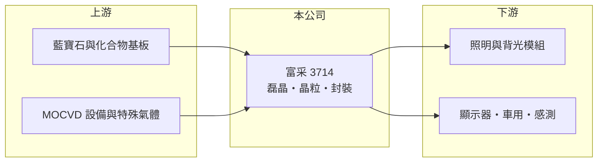

# 3714 富采

> 上市｜[[產業索引-光電業|光電業]]｜上市（櫃）日期 2021/01/06

# 第一章：企業模式與商業藍圖

> [!info] 撰寫說明
> 精簡版，由 Claude 依公開資料整理，架構比照 [[2330台積電]]，資料截至 2026-10-07。來源：nstock.tw 富采公司概況。營收比重未查到。#待校對

富采是台灣最大的 LED 集團，由晶元光電與隆達電子合併成立的控股公司。

- **核心業務：** 富采控股成立於 2021 年，由晶元光電與隆達電子以股份轉換合併而成，業務涵蓋[[磊晶]]片、[[LED晶粒]]，以及 [[LED封裝]]與模組。
- **營收結構：** 本次未查到產品或應用別比重；產品材料包括磷化鋁鎵銦、砷化鋁鎵與氮化銦鎵，分別對應紅黃光、紅外線與藍綠光 LED。
- **營運據點：** 本次未查證詳細據點，晶電的主要廠區推估位於新竹與台南科學園區。
- **長期方向：** 從一般照明與背光轉向 [[Micro LED]]、車用、紅外線感測等高附加價值應用（推估）。

# 第二章：護城河深度與競爭優勢

富采具備 LED 從磊晶到封裝的完整垂直整合，但一般 LED 市場已被中國業者主導。

- **競爭優勢：** 磊晶與晶粒技術累積深厚，涵蓋可見光與不可見光多種材料，並可提供晶粒到模組的整合方案。
- **主要對手：** 中國的三安光電、華燦光電，日本的日亞化學，以及 [[2393億光]]等封裝廠。
- **觀察重點：** Micro LED 與感測新應用能否放量，以及本業何時轉為營業獲利。

# 第三章：財務體質與盈利規模

資料日期：2026-10-07，以下數字是撰寫當時的快照；最新月營收、毛利率、累計 EPS 由自動排程寫在本筆記的屬性欄位（月營收、毛利率、累計EPS 等）。#待校對

富采本業仍是營業虧損，2026 年第二季 EPS 為正推估來自業外。

- **營收規模：** 2026 年 9 月營收 21.27 億元；年度累計數本次未查到。
- **獲利：** 2026 年第二季 EPS 1.69 元，[[毛利率]] 10.85%，[[營業利益率]] -6.29%；營業虧損下 EPS 為正，推估含[[業外收益]]，需查財報確認。
- **財務特色：** 2025 年現金股利 0.9 元。

# 第四章：總體風險與地緣政治

富采的風險在於 LED 產業的價格競爭與新技術商轉時程。

- **產業週期：** 照明與背光 LED 已高度商品化，報價長期下滑，需求隨消費性電子景氣波動。
- **營運風險：** 營業利益率為負，若業外收益無法延續，獲利會明顯轉弱；Micro LED 量產時程不確定。
- **其他風險：** 中國同業擴產造成價格壓力、金屬有機原料價格與匯率波動。

# 專有名詞解析

## 半導體

- **[[磊晶]]**：在基板上長出一層排列整齊的晶體薄膜，是 LED 與化合物半導體元件的關鍵製程。
- **[[LED晶粒]]**：在磊晶片上切割出的發光二極體晶片，是 LED 封裝廠的主要原料。
- **[[LED封裝]]**：把 LED 晶粒固定、打線並封上螢光粉與膠體，做成可直接上板使用的發光元件。

## 金融

- **[[業外收益]]**：本業以外的收入，例如處分資產、投資收益或匯兌利益，通常較不穩定。

## 產業

- **[[Micro LED]]**：以微米級 LED 作為像素的新世代顯示技術，亮度與壽命優於 OLED，但量產成本仍高。

# 核心供應鏈

- 上游：藍寶石基板（含 [[3615安可]] 的圖案化加工，推估）、MOCVD 設備與特殊氣體
- 下游／客戶：照明、背光、顯示器、車用與感測產品廠
- 同業：三安光電、華燦光電、日亞化學、[[2393億光]]、[[3339泰谷]]

## 最新新聞
<!-- news:start -->
<!-- news:end -->

## 相關連結
- [公開資訊觀測站](https://mopsov.twse.com.tw/mops/web/t05st03?step=1&firstin=1&co_id=3714)
- [Goodinfo](https://goodinfo.tw/tw/StockDetail.asp?STOCK_ID=3714)
- [Yahoo 股市](https://tw.stock.yahoo.com/quote/3714)
- [鉅亨網新聞](https://www.cnyes.com/twstock/3714/news)
