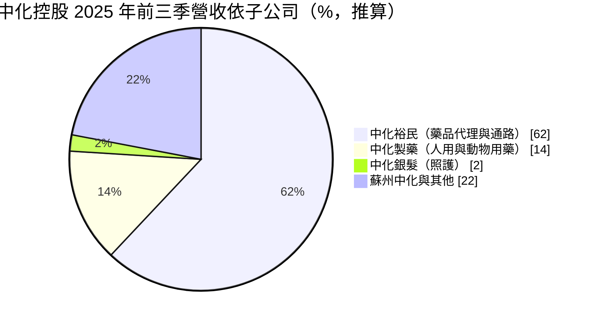
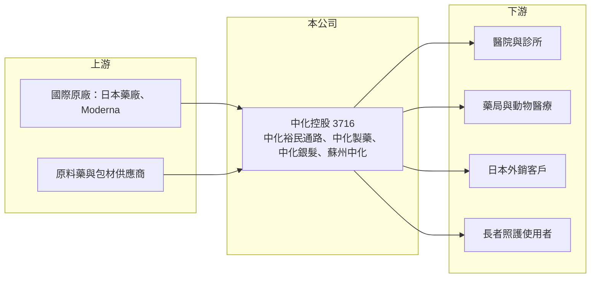

# 3716 中化控股

> 上市｜[[產業索引-生技醫療業|生技醫療業]]｜上市（櫃）日期 2024/09/02

# 第一章：企業模式與商業藍圖

> [!info] 撰寫說明
> 精簡版，由 Claude 依公開資料整理，架構比照 [[2330台積電]] 的四章研究，資料截至 2026-10-08。來源：Goodinfo 年度經營績效頁（2023 至 2025 年）、證交所開放資料（基本資料、2026 年第二季資產負債與綜合損益、營益分析、股利）、富果研究 2025 年 12 月中化控股法說會整理；控股前的歷史憑既有知識撰寫，已標「待校對」。#待校對

中化控股（股票代號：3716）是台灣老牌藥廠中國化學製藥（簡稱中化）轉型為控股公司後的上市主體。理解它的關鍵是：營收大部分來自藥品代理與通路，而不是自家藥廠的生產。

- **核心業務：** 中化控股於 2024 年 9 月 2 日成立並同日上市，董事長為王謝怡貞（證交所開放資料），取代原本上市的中國化學製藥成為集團母公司。#待校對 旗下主要子公司包括負責藥品製造（人用藥與動物用藥）的中化製藥、負責藥品代理與醫療通路的中化裕民、經營日間照護的中化銀髮，以及中國的蘇州中化（富果研究整理）。
- **營收結構：** 2025 年前三季集團營收 64.24 億元，其中中化裕民 39.55 億元（約 62%）、中化製藥 9.15 億元（約 14%）、中化銀髮 1.29 億元（約 2%），其餘約 22% 來自蘇州中化與其他事業（富果研究整理，比重為推算）。中化裕民代理多個日本品牌藥品，並與 Moderna 有委託銷售（[[CSO]]）合作。
- **營運據點：** 主要營運在台灣，2025 年前三季台灣營收（不含蘇州）約 51.36 億元，年增 4.2%。中化製藥的日本外銷訂單年增 17%；蘇州中化則受中國[[帶量採購]]政策與市場疲弱影響，營收下滑（富果研究整理）。
- **長期方向：** 公司的方向是聚焦高門檻製程、引進差異化授權產品，並發展銀髮照護。中化銀髮的日照中心在 2025 年第三季滿床並轉為獲利（富果研究整理），在台灣高齡化的趨勢下，照護服務有機會成為新的長期業務。

# 第二章：護城河深度與競爭優勢

中化控股的競爭力在於通路與產品組合，而不是單一明星藥品；它的護城河較寬但較淺。

- **競爭優勢：** 中化裕民長期經營醫院與診所通路，擁有多個日本品牌的代理權，國際藥廠要進入台灣市場時，需要這種現成的業務團隊與通路，這是 Moderna 選擇與它合作的原因。中化製藥則具有通過日本客戶要求的生產品質，能接到外銷訂單。
- **主要對手：** 藥品代理與通路方面，對手包括 [[4104佳醫]] 旗下的久裕等醫藥物流與代理商；學名藥製造方面，對手有 [[3705永信]]、[[1795美時]]、[[4114健喬]]、[[1720生達]] 等。#待校對
- **觀察重點：** 第一，營業利益率由 2023 年的 2.7% 提升到 2025 年的 5% 以後，能否持續改善；第二，代理產品的合約續約狀況，因為代理權是通路商最重要的資產；第三，蘇州中化在帶量採購下的虧損能否收斂，以及中化銀髮能否複製更多據點。

# 第三章：財務體質與盈利規模

資料日期：2026-10-08，表格是撰寫當時的快照；最新月營收、毛利率、累計 EPS 由自動排程寫在本筆記的屬性欄位（月營收、毛利率、累計EPS 等）。#待校對

中化控股成立時間短，Goodinfo 只有 2023 年起的年度資料。這三年多的數字顯示，它的營收規模穩定，但獲利能力偏低。

| 年度 | 營收（新台幣） | [[毛利率]] | [[營業利益率]] | EPS（元） | [[ROE]] |
|---|---|---|---|---|---|
| 2021 | 未查得 | 未查得 | 未查得 | 未查得 | 未查得 |
| 2022 | 未查得 | 未查得 | 未查得 | 未查得 | 未查得 |
| 2023 | 85.7 億 | 36.6% | 2.7% | 2.17 | 4.33% |
| 2024 | 89.2 億 | 38.2% | 3.36% | 2.49 | 4.25% |
| 2025 | 85.7 億 | 38.7% | 5.0% | 2.39 | 3.96% |
| 2026 上半年 | 42.3 億 | 39.92% | 6.86% | 3.02 | 未查得 |

- **營收規模：** 2023 至 2025 年營收維持在 86 億至 89 億元之間，沒有明顯成長。2026 年上半年營收 42.3 億元，毛利率 39.92%、營業利益率 6.86%（證交所營益分析），本業獲利率持續改善。
- **獲利：** 營業利益率只有 3% 至 7%，ROE 約 4%，三年平均 ROE 約 4.2%（推算）。毛利率接近 40%，但通路業務的推廣費用高，侵蝕了大部分毛利。2026 年上半年營業外收入約 1.64 億元，占稅前淨利約 36%（證交所開放資料），EPS 的提升有相當部分來自業外。
- **財務特色：** 2026 年第二季底權益約 76.8 億元，其中資本公積約 59.1 億元、總負債約 46.5 億元（證交所開放資料）。2025 年度現金股利 1.0 元，約為 EPS 的 42%（推算），配息率在藥廠中偏低，公司章程規定現金股利不低於股東紅利的 50%。

**[[ROIC]] 與 [[WACC]]：**
- ROIC（推算）：2025 年營業利益約 85.7 億元 × 5.0% ≈ 4.3 億元，稅後約 3.4 億元；投入資本以權益 76.8 億元加上推估的有息負債約 20 億元（開放資料未拆分，假設），合計約 97 億元，ROIC 約 3.5%（推算）。以 2026 年上半年營業利益 2.9 億元年化計算，ROIC 約 4.8%（推算）。
- WACC（推算）：無風險利率 1.75%、市場風險溢酬 6%，β 取製藥與通路股常見值 0.6（假設），股東權益成本約 5.4%；負債成本 2.5%、稅後 2.0%，負債占比約 21%，WACC 約 4.6%（推算）。
- 結論：ROIC 大致與 WACC 持平，中化控股目前只是勉強賺回資金成本，尚未明顯創造經濟價值。權益中有大量資本公積與非營業資產，若能提高營業利益率或活化資產，利差才會擴大。

# 第四章：總體風險與地緣政治

中化控股的風險主要來自藥價政策、代理權依賴與中國市場。

- **產業週期：** 藥品需求穩定，但台灣健保每年的藥價調整會壓縮學名藥與代理藥品的利潤。疫苗等防疫相關產品的需求則與疫情與公費採購政策有關，波動較大。
- **營運風險：** 營收有六成來自代理與通路，代理合約若不續約，或原廠改為直營，相關營收會一次流失。控股公司架構下，子公司之間的資源分配與管理效率，也會影響整體獲利。
- **其他風險：** 蘇州中化受中國帶量採購與醫保控費影響，長期獲利空間有限；日本外銷則受日圓匯率影響。台灣的長照政策與補助制度變化，會影響銀髮照護事業的發展速度。

# 專有名詞解析

## 金融

- **[[控股公司]]**：本身不直接營運、透過持有子公司股權來管理集團事業的公司。
- **[[ROIC]]**：投入資本報酬率，稅後營業利益除以股東權益與有息負債的合計，衡量本業對所有資金提供者的報酬。
- **[[WACC]]**：加權平均資金成本，依股東權益與負債的比重加權計算的資金成本，ROIC 高於它才代表創造價值。

## 產業

- **[[CSO]]**：委託銷售組織，替藥廠負責產品在特定市場的推廣與銷售。
- **[[帶量採購]]**：中國政府集中招標、以採購量換取大幅降價的藥品採購制度，壓縮學名藥利潤。
- **[[學名藥]]**：原廠藥專利到期後，其他藥廠依相同成分與劑型生產的藥品，價格通常較低。

# 核心供應鏈

- 上游：委託代理的國際藥廠（多個日本品牌、Moderna）、原料藥與包材供應商。
- 下游／客戶：醫院、診所、藥局、動物醫療與畜牧業者、日本外銷客戶、日照中心使用者。
- 同業：[[3705永信]]、[[1795美時]]、[[4114健喬]]、[[1720生達]]，以及醫藥通路商 [[4104佳醫]]。#待校對

## 最新新聞
<!-- news:start -->
<!-- news:end -->

## 相關連結
- [公開資訊觀測站](https://mopsov.twse.com.tw/mops/web/t05st03?step=1&firstin=1&co_id=3716)
- [Goodinfo](https://goodinfo.tw/tw/StockDetail.asp?STOCK_ID=3716)
- [Yahoo 股市](https://tw.stock.yahoo.com/quote/3716)
- [鉅亨網新聞](https://www.cnyes.com/twstock/3716/news)
