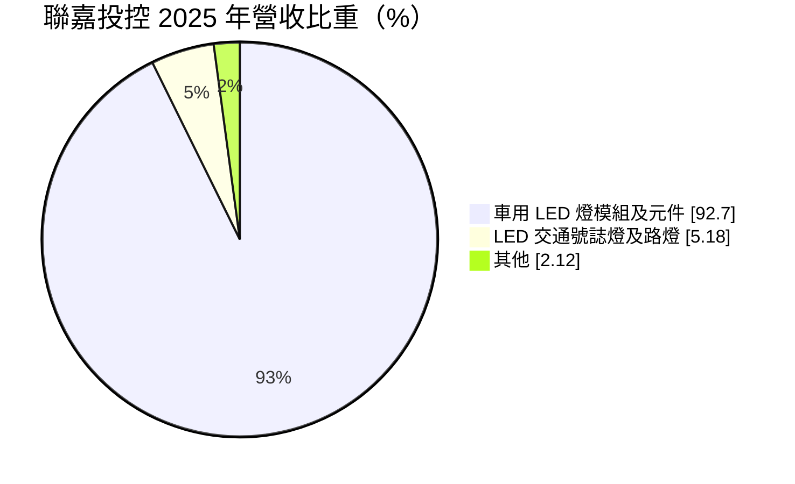
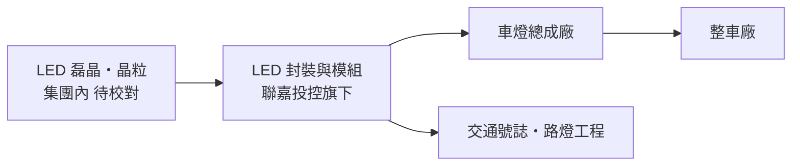
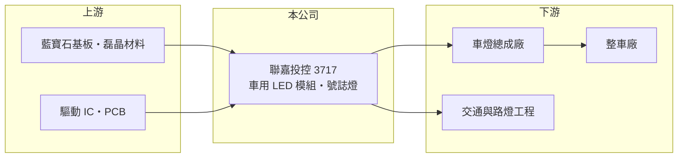

# 3717 聯嘉投控

> 上市｜[[產業索引-汽車工業|汽車工業]]｜上市（櫃）日期 2018/05/09

# 第一章：企業模式與商業藍圖

> [!info] 撰寫說明
> 本文由 Claude 依公開資料整理，架構比照 [[2330台積電]] 的四章研究，資料截至 2026-10-08。財務數字來源：Goodinfo 台灣股市資訊網年度經營績效（僅 2024 至 2025 年）、MoneyDJ 理財網個股基本資料（營收比重）、證交所開放資料（本筆記 _data 快照）。控股公司的組成成員與前身憑既有知識整理並標「待校對」。公開資料有限，多年度數據不足。#待校對

在評估單一個股的長期投資價值時，首要步驟是拆解企業的底層獲利邏輯。本章說明聯嘉投控（股票代號：3717）這家新設控股公司的業務組成，以及它想藉由整合解決什麼問題。

## 一、核心定位：以車用 LED 為主的照明控股公司

聯嘉投控於 2025 年 8 月 15 日設立並同日上市（證交所開放資料），屬於以股份轉換方式成立的控股公司。據既有資料，成員包括原上市的聯嘉光電與 LED 磊晶廠光鋐科技（組成待校對），董事長黃國欣。依 MoneyDJ，2025 年營收中車用 LED 燈模組及元件占 92.70%、LED 交通號誌燈及路燈占 5.18%、其他占 2.12%。

* **車用 LED 燈模組及元件：** 車燈用的 LED 光源模組，以及車內外照明元件，是集團主要營收來源。
* **交通號誌與路燈：** LED 交通號誌燈與路燈，屬於公共工程與城市照明市場，比重較小。
* **上游光源能力：** 若成員包含 LED 磊晶廠（待校對），集團就能從晶粒到模組垂直整合，降低對外部光源的依賴。

## 二、資本轉化邏輯

控股公司的意義在於整合：把原本分屬不同公司的晶粒、封裝與模組放在同一個集團下，可以共同研發、統一採購，也能讓資本分配更有彈性。這種整合能否帶來效益，要看合併後毛利率與營業利益率是否提升。

## 三、企業長期方向

車燈 LED 化已接近普及，下一階段是智慧車燈與車內照明，單台車的 LED 用量仍在增加。聯嘉投控的長期方向是把垂直整合的成本優勢，轉化成車用照明專案的競爭力，並降低交通號誌等低成長業務的比重（推估）。2026 年上半年營業利益率 7.72%，明顯高於 2025 年全年的 1.74%（證交所開放資料、Goodinfo），是整合後的初步改善。

# 第二章：護城河深度與競爭優勢

在長期價值投資中，「護城河」指企業抵禦競爭、維持超額利潤的保護機制。本章分析聯嘉投控的優勢與挑戰。

## 一、護城河的核心組成要素

* **1. 車規驗證：** 車用 LED 模組要通過車規可靠度測試與車燈廠認證，量產後隨車型出貨數年，提供穩定的訂單基礎。
* **2. 垂直整合：** 從光源到模組的整合（待校對），讓集團能控制關鍵零件的品質與成本，這是單純模組廠沒有的優勢。
* **3. 整合尚未驗證：** 控股公司成立時間短，合併的綜效還需要數年財報才能確認，目前的護城河仍屬窄護城河。

## 二、主要對手

| 對手 | 定位 | 對聯嘉投控的威脅 |
|---|---|---|
| 歐司朗、日亞化等國際 LED 大廠 | 車用 LED 光源龍頭 | 在高階光源與品牌上占優 |
| 中國 LED 封裝與模組廠 | 成本低、產能大 | 壓低一般車用 LED 價格 |
| [[3346麗清]] | 台系 LED 車燈模組 | 在車燈模組直接競爭 |

## 三、守得住／守不住／觀察重點

* **守得住：** 已量產的車用專案與具垂直整合成本優勢的產品。
* **守不住：** 交通號誌與路燈這類標案型、價格導向的業務。
* **觀察重點：** 合併後營業利益率能否穩定在 5% 以上，以及控股公司是否進一步整併或處分非核心業務。

# 第三章：財務體質與盈利規模

資料日期：2026-10-08。數字取自 Goodinfo 年度經營績效與證交所開放資料快照，表格是撰寫當時的快照；最新月營收、毛利率、累計 EPS 由自動排程寫在本筆記的屬性欄位（月營收、毛利率、累計EPS 等）。#待校對

財務報表是檢驗護城河是否真實存在的最終標準。由於控股公司 2025 年才成立，可比較的年度數據只有兩年。

## 一、多年度三率與 ROE

| 年度 | 營收（新台幣） | [[毛利率]] | [[營業利益率]] | EPS（元） | [[ROE]] |
|---|---|---|---|---|---|
| 2021 | 未查得 | 未查得 | 未查得 | 未查得 | 未查得 |
| 2022 | 未查得 | 未查得 | 未查得 | 未查得 | 未查得 |
| 2023 | 未查得 | 未查得 | 未查得 | 未查得 | 未查得 |
| 2024 | 55.4 億 | 14.4% | 0.09% | 0.42 | 2.59% |
| 2025 | 57.4 億 | 15.4% | 1.74% | 0.08 | 0.51% |
| 2026 上半年 | 35.3 億 | 19.51% | 7.72% | 1.15 | 未查得 |

* **[[毛利率]]：** 從 2024 年的 14.4% 提升到 2026 年上半年的 19.51%。
* **[[營業利益率]]：** 2024 至 2025 年幾乎打平，2026 年上半年營業利益 2.73 億元（證交所開放資料），改善明顯。
* **營收：** 2026 年 1 至 8 月營收 45.5 億元（證交所開放資料）。2025 年同期數字只涵蓋控股公司成立後的期間，不宜直接比較成長率。2024 年以前的數字是否為合併前成員的模擬合併數，未查得。
* **長期指標：** 多年度平均 ROE 與營收年複合成長率因資料不足無法計算。

## 二、財務結構

2026 年第二季底資產 91.3 億元、負債 56.0 億元，負債比約 61%，每股淨值 16.93 元（證交所開放資料）。

## 三、[[ROIC]] 與 [[WACC]]

2025 年營業利益約 1.0 億元（57.4 億元 × 1.74%），稅後約 0.8 億元，以權益 35.2 億元近似投入資本，ROIC 約 2.3%（推算）。若以 2026 年上半年營業利益 2.73 億元年化（約 5.46 億元，稅後約 4.36 億元），投入資本以權益 35.2 億元加非流動負債 16.9 億元近似（約 52.1 億元），ROIC 約 8.4%（推算，有息負債細項未查得）。WACC 以 CAPM 推估：無風險利率 1.5% 至 2%、市場風險溢酬 6%、β 未查得，取 1.1（假設），權益成本約 8.1% 至 8.6%；負債成本假設 3%，負債約占資本三成，WACC 約 6.5% 至 7%（推算）。2025 年 ROIC 低於 WACC，2026 年上半年若能維持則略高於 WACC，整合效益是否持續是判斷能否創造價值的關鍵。

# 第四章：總體風險與地緣政治

任何企業都無法脫離宏觀環境獨立存在。本章整理聯嘉投控長期必須面對的風險。

## 一、地緣政治與政策

* **生產據點：** 生產據點的地理分布未查得，若部分產能在中國，會受關稅與兩岸關係影響（推估）。

## 二、產業週期與市場結構

* **車市循環與價格戰：** 車用 LED 需求跟著新車產量，車廠降價壓力會傳到零件廠。
* **LED 產業供過於求：** 中國 LED 產能龐大，一般 LED 元件價格長期下滑。

## 三、營運風險

* **整合風險：** 控股公司成立後需要整合不同公司的文化、系統與產品線，整合不順會拖累效益。
* **財務槓桿：** 負債比約 61%，獲利回升前資金壓力較大。

## 四、技術演進

* **智慧照明與 Micro LED：** 車燈往像素化、可顯示資訊的方向發展，需要更高的晶片與光學技術，若研發跟不上，可能被國際大廠拉開差距。

# 專有名詞解析

## 半導體

- **[[LED 磊晶]]**：在基板上長出發光半導體薄膜的製程，是 LED 晶粒的上游。

## 金融

- **[[ROIC]]**：投入資本報酬率，衡量公司用股東與債權人資金創造本業稅後利潤的效率。
- **[[WACC]]**：加權平均資金成本，依股權與負債比重加權的資金成本，是 ROIC 要超過的門檻。

## 產業

- **[[控股公司]]**：本身主要持有子公司股權、透過子公司經營業務的公司型態，常用於整合多家公司。
- **[[垂直整合]]**：同一集團掌握上下游多個環節，以降低成本或確保關鍵零件供應。

# 核心供應鏈

## 1. 上游：材料與元件
- 基板與磊晶材料、驅動 IC、印刷電路板（供應商名稱未查得）

## 2. 中游：聯嘉投控本身
- 旗下子公司（成員待校對）負責 LED 晶粒、封裝與車用模組

## 3. 下游：客戶
- 車燈總成廠、整車廠、交通號誌與路燈工程（客戶名單未查得）

## 4. 同業
- 台股：[[3346麗清]]、[[2248華勝-KY]]
- 國際：歐司朗、日亞化

## 最新新聞
<!-- news:start -->
<!-- news:end -->

## 相關連結
- [公開資訊觀測站](https://mopsov.twse.com.tw/mops/web/t05st03?step=1&firstin=1&co_id=3717)
- [Goodinfo](https://goodinfo.tw/tw/StockDetail.asp?STOCK_ID=3717)
- [Yahoo 股市](https://tw.stock.yahoo.com/quote/3717)
- [鉅亨網新聞](https://www.cnyes.com/twstock/3717/news)
