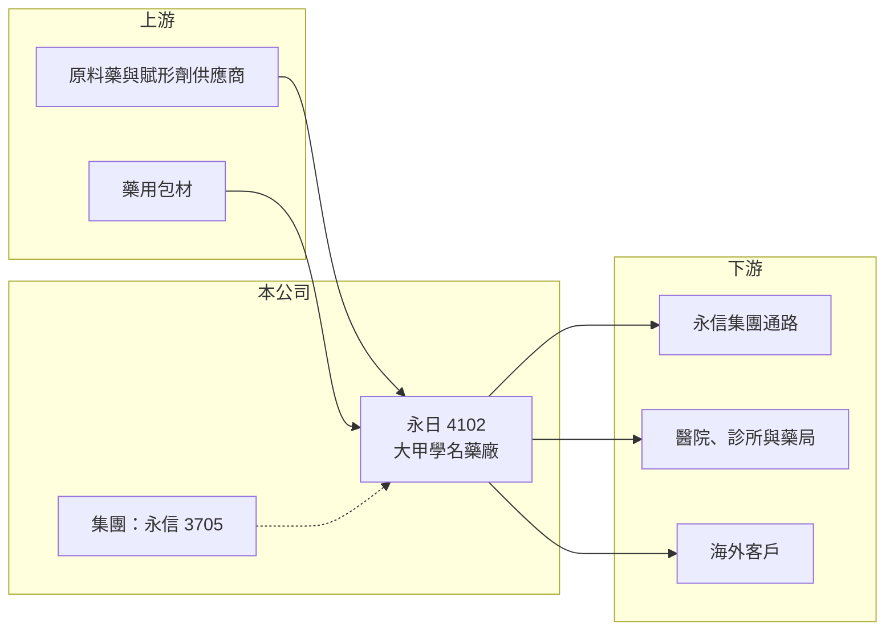

# 4102 永日

> 上櫃｜[[產業索引-生技醫療業|生技醫療業]]｜上市（櫃）日期 2001/03/20

# 第一章：企業模式與商業藍圖

> [!info] 撰寫說明
> 精簡版，由 Claude 依公開資料整理，架構比照 [[2330台積電]] 的四章研究，資料截至 2026-10-08。來源：Goodinfo 年度經營績效頁（2020 至 2025 年）、櫃買中心開放資料（基本資料、2026 年第二季資產負債與綜合損益、本益比殖利率）、富果研究 2026 年 9 月永信法說會整理；產品細節憑既有知識撰寫，已標「待校對」。公開資料有限。#待校對

永日化學工業（股票代號：4102，以下簡稱永日）是一家位於台中大甲的老牌藥廠，屬於 [[3705永信]] 集團。對投資人而言，理解永日要從它在集團中的角色出發，而不是把它當成獨立經營的藥廠。

- **核心業務：** 永日 1978 年成立、2001 年上櫃，廠址位於台中大甲幼獅工業區，董事長為林青煌（櫃買中心開放資料）。公司電子郵件網域與永信集團相同，永信法說會也將永日列為集團在台灣通過美國 FDA 查核的生產據點之一（富果研究整理）。永日以[[學名藥]]製造為主，產品與集團內的通路與外銷業務互相搭配。#待校對
- **營收結構：** 各產品線與內外銷的營收比重本次未查得。永日年營收約 5 億元上下，規模遠小於母集團，推估有相當比重的產品透過集團通路或代工關係銷售（推估）。
- **營運據點：** 生產集中在大甲廠區。擁有美國 FDA 查核資格，代表工廠具備供應嚴格法規市場的能力，這是小型藥廠少見的資產。
- **長期方向：** 永信法說會提到，永日在董事改選後集團持股變動，影響了永信 2025 年的 EPS（富果研究整理，原文不完整）。#待校對 永日未來的發展方向與集團的資源分配密切相關，投資人應同時追蹤永信集團的策略。

# 第二章：護城河深度與競爭優勢

永日的優勢主要來自所屬集團的資源與工廠的國際認證，單獨來看規模小、議價能力有限。

- **競爭優勢：** 通過美國 FDA 查核的工廠需要長期維持品質系統，新進業者很難短期取得。身為永信集團成員，永日可以共用集團的研發、法規與海外通路資源，降低獨立經營的成本。
- **主要對手：** 台灣中小型學名藥廠眾多，包括 [[1720生達]]、[[4114健喬]] 等，國際上還有印度與中國的低成本藥廠。#待校對 在健保藥價持續調降的環境下，小型藥廠的利潤空間特別容易被壓縮。
- **觀察重點：** 第一，2025 年轉為虧損後，2026 年上半年營業利益已轉正，能否延續；第二，毛利率能否回到 2022 至 2024 年約 30% 的水準；第三，與永信集團之間的持股與業務關係是否有進一步調整。

# 第三章：財務體質與盈利規模

資料日期：2026-10-08，表格是撰寫當時的快照；最新月營收、毛利率、累計 EPS 由自動排程寫在本筆記的屬性欄位（月營收、毛利率、累計EPS 等）。#待校對

永日的財務數字波動大，2022 至 2024 年是較好的期間，2025 年則因毛利率大幅下滑而轉虧。

| 年度 | 營收（新台幣） | [[毛利率]] | [[營業利益率]] | EPS（元） | [[ROE]] |
|---|---|---|---|---|---|
| 2020 | 4.63 億 | 29.1% | 6.35% | 0.73 | 5.58% |
| 2021 | 4.78 億 | 21.9% | 1.51% | 0.14 | 1.40% |
| 2022 | 5.67 億 | 29.1% | 8.59% | 1.65 | 12.1% |
| 2023 | 5.59 億 | 31.1% | 10.0% | 1.48 | 9.58% |
| 2024 | 5.84 億 | 30.6% | 10.5% | 1.52 | 9.66% |
| 2025 | 4.74 億 | 19.9% | -4.18% | -0.34 | -1.43% |
| 2026 上半年 | 2.76 億 | 24.2% | 2.5% | 0.13 | 未查得 |

- **營收規模：** 2020 至 2025 年營收年複合成長率約 0.5%（推算），營收在 4.6 億至 5.8 億元之間。營收規模小，單一產品或客戶訂單的變化就足以影響全年表現。
- **獲利：** 毛利率在 20% 至 31% 之間，營業利益率最高約 10.5%；2021 至 2025 年平均 ROE 約 6.3%（推算）。2025 年毛利率跌到 19.9%，營業利益轉為虧損，原因本次未查得。
- **財務特色：** 2026 年第二季底權益總計約 6.80 億元，其中非控制權益約 0.81 億元，總負債約 2.72 億元（櫃買中心開放資料），財務結構穩健。2025 年度因虧損未配發股利（櫃買中心本益比殖利率資料）。

**[[ROIC]] 與 [[WACC]]：**
- ROIC（推算）：2025 年營業利益約 4.74 億元 × -4.18% ≈ -0.20 億元，投入資本以權益 6.80 億元加上推估的有息負債約 1 億元（假設），合計約 7.8 億元，ROIC 約 -2.5%（推算），為負值。以 2026 年上半年營業利益約 0.07 億元年化，ROIC 約 1.4%（推算）。2022 至 2024 年的較好年度，ROIC 約在 6% 至 8% 之間（推算）。
- WACC（推算）：無風險利率 1.75%、市場風險溢酬 6%，β 取小型藥廠常見值 0.8（假設），股東權益成本約 6.6%；負債成本 2.5%、稅後 2.0%，負債占比約 13%，WACC 約 6.0%（推算）。
- 結論：只有在 2022 至 2024 年的較好年度，ROIC 才略高於 WACC；2025 年虧損時則明顯低於資金成本。長期來看，永日的價值創造能力薄弱，取決於毛利率能否穩定在 30% 左右。

# 第四章：總體風險與地緣政治

永日的風險具有小型學名藥廠的共同特徵，另外還有對集團的依賴。

- **產業週期：** 藥品需求穩定，但健保藥價調降是長期壓力，每一次藥價調整都可能壓縮毛利。原料藥價格與供應狀況也會影響生產成本與交期。
- **營運風險：** 營收規模小，產能利用率與產品組合的小幅變動，就會讓毛利率大幅波動，2025 年毛利率由 30.6% 跌到 19.9% 就是例子。維持美國 FDA 查核資格需要持續投入品質系統成本。
- **其他風險：** 與永信集團之間的關係人交易、持股變動與資源分配，會影響小股東的權益，需要留意集團決策是否兼顧永日股東的利益。外銷產品則受匯率影響。

# 專有名詞解析

## 金融

- **[[ROIC]]**：投入資本報酬率，稅後營業利益除以股東權益與有息負債的合計，衡量本業對所有資金提供者的報酬。
- **[[WACC]]**：加權平均資金成本，依股東權益與負債的比重加權計算的資金成本，ROIC 高於它才代表創造價值。

## 產業

- **[[學名藥]]**：原廠藥專利到期後，其他藥廠依相同成分與劑型生產的藥品，價格通常較低。
- **[[美國 FDA 查廠]]**：美國食品藥物管理局對藥廠的實地查核，通過後才能將藥品銷售到美國市場。
- **[[關係人交易]]**：公司與母公司、子公司或主要股東之間的交易，價格是否公允會影響小股東權益。

# 核心供應鏈

- 上游：原料藥、賦形劑與藥用包材供應商。
- 下游／客戶：永信集團通路與合作夥伴、台灣醫療院所與藥局、海外客戶（推估）。
- 同業：[[3705永信]]（集團母公司）、[[1720生達]]、[[4114健喬]] 等台灣學名藥廠。#待校對

## 最新新聞
<!-- news:start -->
<!-- news:end -->

## 相關連結
- [公開資訊觀測站](https://mopsov.twse.com.tw/mops/web/t05st03?step=1&firstin=1&co_id=4102)
- [Goodinfo](https://goodinfo.tw/tw/StockDetail.asp?STOCK_ID=4102)
- [Yahoo 股市](https://tw.stock.yahoo.com/quote/4102)
- [鉅亨網新聞](https://www.cnyes.com/twstock/4102/news)
