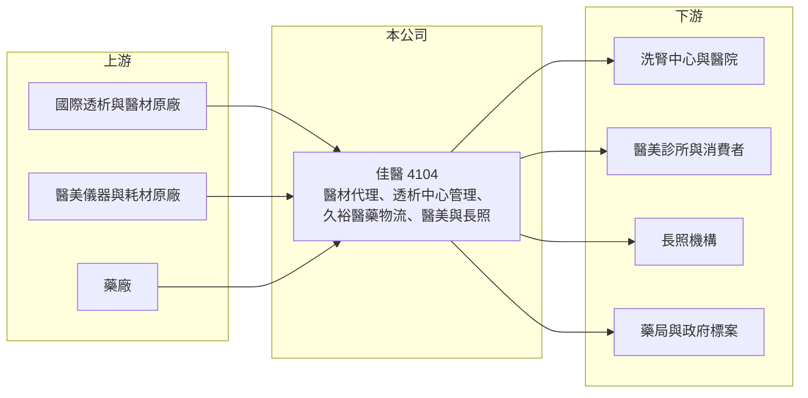

# 4104 佳醫

> 上市｜[[產業索引-生技醫療業|生技醫療業]]｜上市（櫃）日期 2007/12/31

# 第一章：企業模式與商業藍圖

> [!info] 撰寫說明
> 精簡版，由 Claude 依公開資料整理，架構比照 [[2330台積電]] 的四章研究，資料截至 2026-10-08。來源：Goodinfo 年度經營績效頁（2020 至 2025 年）、證交所開放資料（基本資料、2026 年第二季資產負債與綜合損益、營益分析、股利）、富果研究 2026 年 3 月佳醫法說會整理。#待校對

佳醫集團（股票代號：4104，以下簡稱佳醫）是台灣以[[血液透析]]起家的整合型醫療健康集團。它的商業模式是把「醫材代理」、「醫療通路經營」與「醫藥物流」串成一條龍，從賣產品延伸到管理醫療服務。

- **核心業務：** 佳醫 1988 年成立、2007 年底上市，董事長為傅輝東（證交所開放資料）。業務分為三大板塊：貿易代理（透析產品、醫美儀器與耗材、外科醫療設備、健康家電）、醫療通路（經營或管理血液透析中心、醫美診所、長照機構、地區醫院、健髮中心），以及醫藥物流（子公司久裕與吉康負責藥品與醫材的推廣、倉儲與配送）（富果研究整理）。
- **營收結構：** 各板塊的營收比重本次未查得。2025 年合併營收 87.9 億元，血液透析產品線持續成長，醫美營收微幅下滑，久裕因產品線增加營收顯著成長（富果研究整理）。醫藥物流與代理屬於低毛利、高營收的業務，這也是佳醫毛利率只有約 21% 的原因。
- **營運據點：** 以台灣為核心，並經營香港、菲律賓、馬來西亞等亞洲市場，東南亞持續擴張（富果研究整理）。轉投資的透析通路與長照、醫院通路是重要的獲利來源，2025 年轉投資認列利益約 4.01 億元。
- **長期方向：** 佳醫的願景是成為「亞洲最有價值之整合性醫療健康產業投資經營團隊」，策略是透過併購與策略聯盟擴大亞洲布局（富果研究整理）。台灣洗腎盛行率高、人口快速老化，透析、長照與醫院通路的需求具有長期支撐。

# 第二章：護城河深度與競爭優勢

佳醫的護城河來自它在台灣透析產業累積的通路網絡與服務能力，這種結構不容易被單一競爭者複製。

- **競爭優勢：** 透析病患每週需要多次治療，洗腎中心需要穩定的耗材供應、設備維修與管理支援，佳醫能同時提供這三項服務，與透析中心建立長期關係。醫藥物流需要 GMP、GDP 等認證與倉儲設施，久裕承接疾管署等大型標案的經驗，也顯示它在藥品配送上的規模地位（富果研究整理）。
- **主要對手：** 透析耗材與設備有國際大廠 Fresenius、Baxter、Nipro 等在台直接經營或透過其他代理商銷售；醫藥物流方面有其他大型藥品物流商；醫美領域則競爭激烈，子公司曜亞面臨行銷費用上升的壓力（富果研究整理）。#待校對
- **觀察重點：** 第一，轉投資的透析與長照通路能否持續貢獻穩定的投資收益；第二，東南亞的併購與擴張能否複製台灣模式；第三，醫美業務在激烈競爭下的獲利能力。

# 第三章：財務體質與盈利規模

資料日期：2026-10-08，表格是撰寫當時的快照；最新月營收、毛利率、累計 EPS 由自動排程寫在本筆記的屬性欄位（月營收、毛利率、累計EPS 等）。#待校對

佳醫的財務數字以「穩定」為最大特色：營收逐年成長、利潤率幾乎不變，並維持高配息。

| 年度 | 營收（新台幣） | [[毛利率]] | [[營業利益率]] | EPS（元） | [[ROE]] |
|---|---|---|---|---|---|
| 2020 | 66.8 億 | 19.6% | 7.93% | 4.06 | 7.35% |
| 2021 | 65.7 億 | 20.9% | 9.05% | 4.30 | 7.48% |
| 2022 | 71.9 億 | 21.1% | 8.44% | 4.50 | 7.84% |
| 2023 | 82.3 億 | 20.4% | 8.54% | 4.80 | 8.70% |
| 2024 | 85.4 億 | 20.9% | 8.82% | 4.72 | 8.72% |
| 2025 | 87.9 億 | 21.3% | 8.28% | 4.70 | 8.37% |
| 2026 上半年 | 47.3 億 | 21.44% | 7.91% | 2.77 | 未查得 |

- **營收規模：** 2020 至 2025 年營收由 66.8 億元成長到 87.9 億元，年複合成長率約 5.6%（推算）。毛利率穩定在 20% 至 21%，營業利益率在 8% 至 9% 之間，顯示事業組合穩定。
- **獲利：** 2021 至 2025 年平均 ROE 約 8.2%（推算）。佳醫的淨利有相當比重來自轉投資，2026 年上半年營業外收入約 3.38 億元，接近營業利益 3.74 億元（證交所開放資料），業外收益的穩定度是獲利品質的重點。
- **財務特色：** 2026 年第二季底總資產約 211.6 億元、權益總計約 132.0 億元（其中非控制權益約 33.9 億元）、總負債約 79.5 億元（證交所開放資料）。2025 年營業現金流因支付疾管署標案款項而淨流出 13.6 億元，屬於一次性因素（富果研究整理）。2025 年度現金股利 4.3 元，約為 EPS 的 91%（推算），配息穩定且偏高。

**[[ROIC]] 與 [[WACC]]：**
- ROIC（推算）：2025 年營業利益約 7.28 億元，稅後約 5.8 億元；投入資本以權益總計 132.0 億元加上推估的有息負債約 35 億元（開放資料未拆分，假設），合計約 167 億元，ROIC 約 3.5%（推算）。若把 4.01 億元的轉投資利益一併計入，報酬率約 5.9%（推算）。
- WACC（推算）：無風險利率 1.75%、市場風險溢酬 6%，β 取醫療通路股常見值 0.6（假設），股東權益成本約 5.4%；負債成本 2.5%、稅後 2.0%，負債占比約 21%，WACC 約 4.7%（推算）。
- 結論：只看本業，ROIC 略低於 WACC；計入轉投資收益後，報酬率略高於資金成本。佳醫的價值創造幅度有限但穩定，關鍵在於轉投資的醫療通路能否持續產生高於資金成本的報酬。

# 第四章：總體風險與地緣政治

佳醫的風險主要來自健保政策、代理權與併購執行。

- **產業週期：** 透析與醫療需求不太受景氣影響，屬於防禦型產業。但醫美與健康家電屬於可選消費，景氣轉弱時需求會下降。
- **營運風險：** 健保對透析的給付點值與總額預算，直接影響洗腎中心的收入，進而影響耗材採購與佳醫的服務收入。代理業務依賴國際原廠授權，原廠若改為直營，相關營收會受到衝擊。併購擴張則有整合與商譽減損的風險。
- **其他風險：** 東南亞各國的醫療法規、外資持股限制與匯率波動，會影響海外擴張的速度與報酬。醫藥物流承接政府標案時，可能出現大額的暫收與應付款項，讓現金流在年度之間大幅波動。

# 專有名詞解析

## 應用

- **[[血液透析]]**：俗稱洗腎，以機器過濾腎衰竭病患的血液，病患通常每週需要接受三次治療。

## 金融

- **[[轉投資收益]]**：公司持有其他事業股權所認列的投資利益，不屬於本業營業利益。
- **[[ROIC]]**：投入資本報酬率，稅後營業利益除以股東權益與有息負債的合計，衡量本業對所有資金提供者的報酬。
- **[[WACC]]**：加權平均資金成本，依股東權益與負債的比重加權計算的資金成本，ROIC 高於它才代表創造價值。

## 產業

- **[[醫藥物流]]**：負責藥品與醫材的倉儲、配送與推廣，須符合 GDP 等藥品運銷規範。
- **[[GDP]]**：藥品優良運銷規範，要求藥品在儲存與運送過程中維持品質。

# 核心供應鏈

- 上游：國際透析設備與耗材原廠、醫美儀器原廠、委託配送的藥廠。#待校對
- 下游／客戶：洗腎中心、醫院與診所、醫美診所、長照機構、藥局與政府防疫標案。
- 同業：國際透析大廠在台分公司、其他醫材代理與醫藥物流業者、[[3716中化控股]] 等醫藥通路商。#待校對

## 最新新聞
<!-- news:start -->
<!-- news:end -->

## 相關連結
- [公開資訊觀測站](https://mopsov.twse.com.tw/mops/web/t05st03?step=1&firstin=1&co_id=4104)
- [Goodinfo](https://goodinfo.tw/tw/StockDetail.asp?STOCK_ID=4104)
- [Yahoo 股市](https://tw.stock.yahoo.com/quote/4104)
- [鉅亨網新聞](https://www.cnyes.com/twstock/4104/news)
