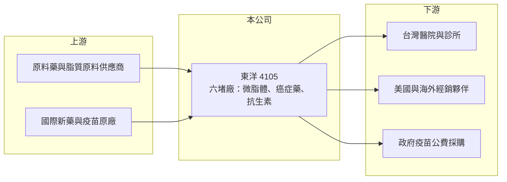

# 4105 東洋

> 上櫃｜[[產業索引-生技醫療業|生技醫療業]]｜上市（櫃）日期 2001/09/27

# 第一章：企業模式與商業藍圖

> [!info] 撰寫說明
> 精簡版，由 Claude 依公開資料整理，架構比照 [[2330台積電]] 的四章研究，資料截至 2026-10-08。來源：Goodinfo 年度經營績效頁（2020 至 2025 年）、櫃買中心開放資料（基本資料、2026 年第二季資產負債與綜合損益、本益比殖利率）、優分析 2026 年 3 月東洋法說會報導；憑既有知識撰寫的部分已標「待校對」。#待校對

東洋藥品（股票代號：4105，以下簡稱東洋）是台灣以癌症用藥與高技術劑型聞名的藥廠。它和一般[[學名藥]]廠不同之處，在於專注製程難度高的特殊劑型，並結合代理國際新藥，建立高毛利的產品組合。

- **核心業務：** 東洋 1960 年成立、2001 年上櫃，董事長為林全（櫃買中心開放資料）。產品線包括癌症用藥、[[微脂體]]劑型藥品、抗生素與疫苗，並代理國際藥廠的新藥。代表產品之一是微脂體劑型的抗黴菌藥 Lipo-AB，2025 年在美國市占率約三分之一（優分析報導）。
- **營收結構：** 各產品線的營收比重本次未查得。從法說內容看，成長動能來自四個方向：微脂體藥品的海外銷售、癌症用藥（包括 2026 年 1 月取證的國產肺癌標靶藥 Pulmivex，以及代理的血癌新藥 Xpovio）、抗生素（Bobimixym 2025 年貢獻約 8,000 萬元），以及疫苗（代理的流感佐劑疫苗、2025 年取證的水痘疫苗）（優分析報導）。
- **營運據點：** 主要生產基地為基隆六堵廠，2025 年新增設備以因應 Lipo-AB 需求，Pulmivex 也將在此生產（優分析報導）。東洋在中國等海外市場另有布局，具體據點與營收本次未查得。#待校對
- **長期方向：** 東洋的長期方向是把台灣生產的高難度劑型推向國際市場。Lipo-AB 目標將美國市占率提高到二分之一，並規劃拓展澳洲與東南亞，預估 2026 年取得 2 個地區藥證；水痘疫苗預計 2027 年開始供貨（優分析報導）。這些[[藥證]]里程碑決定未來幾年的成長幅度。

# 第二章：護城河深度與競爭優勢

東洋的護城河來自高門檻的製程技術與藥證，這類優勢一旦建立，競爭者很難在短期內追上。

- **競爭優勢：** 微脂體是把藥物包在脂質小球中的技術，可以降低毒性、提高療效，但製程複雜、品質控制困難，全球能穩定量產並通過美國 FDA 核准的廠商不多。東洋能在美國市場取得約三分之一的市占率，證明它的製程能力具國際競爭力。癌症用藥與疫苗也需要取得藥證與政府採購資格，進入門檻高。
- **主要對手：** 國內的高技術劑型與癌症藥同業包括 [[1795美時]]、[[4162智擎]] 等；微脂體領域則有國際學名藥廠與 4152台微體 等專注微脂體技術的公司。#待校對 代理新藥則要與其他代理商競爭國際原廠的授權。
- **觀察重點：** 第一，Lipo-AB 能否如期取得海外藥證並提高美國市占率；第二，Pulmivex 等自有新藥的上市後銷售；第三，疫苗能否穩定取得政府公費採購標案。

# 第三章：財務體質與盈利規模

資料日期：2026-10-08，表格是撰寫當時的快照；最新月營收、毛利率、累計 EPS 由自動排程寫在本筆記的屬性欄位（月營收、毛利率、累計EPS 等）。#待校對

東洋是台灣藥廠中少數能同時維持高毛利、穩定成長與高 ROE 的公司。

| 年度 | 營收（新台幣） | [[毛利率]] | [[營業利益率]] | EPS（元） | [[ROE]] |
|---|---|---|---|---|---|
| 2020 | 42.2 億 | 61.8% | 22.7% | 3.72 | 16.0% |
| 2021 | 45.4 億 | 61.0% | 25.1% | 3.35 | 13.9% |
| 2022 | 50.6 億 | 59.7% | 24.3% | 4.40 | 18.4% |
| 2023 | 55.1 億 | 59.6% | 24.9% | 4.54 | 17.6% |
| 2024 | 58.9 億 | 58.0% | 23.6% | 5.83 | 21.7% |
| 2025 | 64.5 億 | 57.7% | 26.4% | 6.27 | 21.3% |
| 2026 上半年 | 31.7 億 | 59.3% | 30.8% | 3.42 | 未查得 |

- **營收規模：** 2020 至 2025 年營收由 42.2 億元成長到 64.5 億元，年複合成長率約 8.8%（推算），每年都正成長。管理層預期 2026 年營收成長高個位數百分比（優分析報導）。
- **獲利：** 毛利率長期約 58% 至 62%，營業利益率由 22.7% 提高到 26.4%，2026 年上半年更達 30.8%（櫃買中心開放資料推算）。2021 至 2025 年平均 ROE 約 18.6%（推算），在藥廠中屬於高水準。
- **財務特色：** 2026 年第二季底權益總計約 77.5 億元（其中非控制權益約 7.9 億元）、總負債約 40.8 億元（櫃買中心開放資料）。2025 年度現金股利 4.5 元，約為 EPS 的 72%（推算），在配息的同時仍保留資金擴充六堵廠產能。

**[[ROIC]] 與 [[WACC]]：**
- ROIC（推算）：2025 年營業利益約 64.5 億元 × 26.4% ≈ 17.0 億元，稅後約 13.6 億元；投入資本以權益總計 77.5 億元加上推估的有息負債約 15 億元（開放資料未拆分，假設），合計約 92.5 億元，ROIC 約 14.7%（推算）。
- WACC（推算）：無風險利率 1.75%、市場風險溢酬 6%，β 取製藥股常見值 0.8（假設），股東權益成本約 6.6%；負債成本 2.5%、稅後 2.0%，負債占比約 16%，WACC 約 5.8%（推算）。
- 結論：ROIC 高於 WACC 約 9 個百分點，東洋長期為股東創造明確的經濟價值。只要高難度劑型的競爭優勢持續，這個利差有機會隨海外銷售擴大而維持。

# 第四章：總體風險與地緣政治

東洋的風險集中在產品與市場的集中度、法規審查與研發成敗。

- **產業週期：** 藥品需求相對穩定，但疫苗的需求與政府公費採購政策高度相關，招標時程與得標結果會造成年度之間的波動。抗生素與抗黴菌藥的需求則與醫院感染狀況有關。
- **營運風險：** Lipo-AB 在美國的銷售是重要的獲利來源，若美國出現新的競爭者或價格下滑，影響會很明顯。六堵廠是主要的生產基地，任何品質問題或查廠缺失，都可能影響多項產品的供應。
- **其他風險：** 新藥與新適應症需要取得各國藥證，審查時程延誤會延後營收貢獻。美元匯率影響外銷產品的台幣收入，台灣健保藥價調整則會壓縮內銷產品的利潤。

# 專有名詞解析

## 金融

- **[[ROIC]]**：投入資本報酬率，稅後營業利益除以股東權益與有息負債的合計，衡量本業對所有資金提供者的報酬。
- **[[WACC]]**：加權平均資金成本，依股東權益與負債的比重加權計算的資金成本，ROIC 高於它才代表創造價值。

## 產業

- **[[微脂體]]**：以脂質雙層包覆藥物的奈米級載體，可降低藥物毒性並讓藥物集中在病灶，製程難度高。
- **[[學名藥]]**：原廠藥專利到期後，其他藥廠依相同成分與劑型生產的藥品，價格通常較低。
- **[[藥證]]**：主管機關核准藥品上市的許可證，取得後才能在該國銷售。
- **[[佐劑疫苗]]**：添加佐劑以增強免疫反應的疫苗，常用於免疫反應較弱的長者族群。

# 核心供應鏈

- 上游：原料藥與微脂體用脂質原料供應商、授權代理新藥與疫苗的國際原廠（如 Xpovio 原廠）。#待校對
- 下游／客戶：台灣醫院與診所、美國及澳洲與東南亞的經銷夥伴、政府疫苗採購單位。
- 同業：[[1795美時]]、[[4162智擎]]、4152台微體、[[3705永信]] 等。#待校對

## 最新新聞
<!-- news:start（自動產生，請勿手動編輯此範圍） -->
- 2026-10-05 📰 媒體 09:46｜賴清德表揚生技金質獎 東洋總經理侯靜蘭籲：公私協力打造新護國神山｜[鉅亨網](https://news.cnyes.com/news/id/6621330)

完整紀錄：[[4105東洋 新聞]]
<!-- news:end -->

## 相關連結
- [公開資訊觀測站](https://mopsov.twse.com.tw/mops/web/t05st03?step=1&firstin=1&co_id=4105)
- [Goodinfo](https://goodinfo.tw/tw/StockDetail.asp?STOCK_ID=4105)
- [Yahoo 股市](https://tw.stock.yahoo.com/quote/4105)
- [鉅亨網新聞](https://www.cnyes.com/twstock/4105/news)
