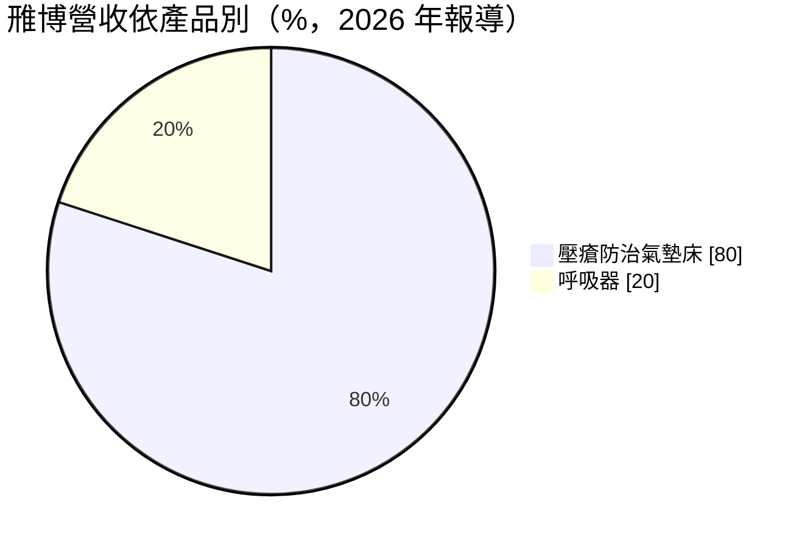
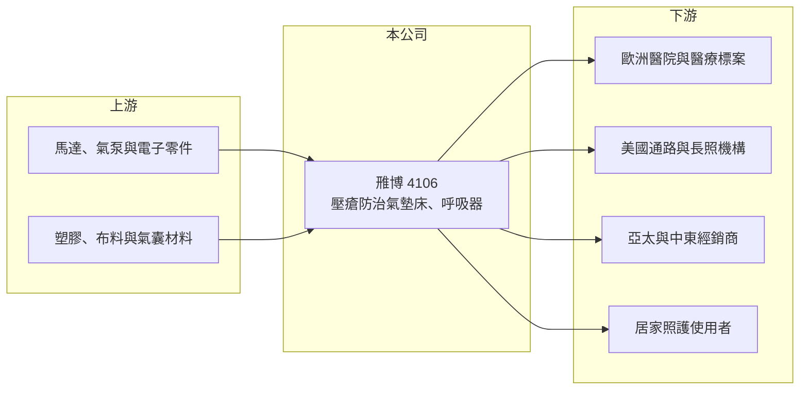

# 4106 雃博

> 上市｜[[產業索引-生技醫療業|生技醫療業]]｜上市（櫃）日期 2004/11/08

# 第一章：企業模式與商業藍圖

> [!info] 撰寫說明
> 精簡版，由 Claude 依公開資料整理，架構比照 [[2330台積電]] 的四章研究，資料截至 2026-10-08。來源：Goodinfo 年度經營績效頁（2020 至 2025 年）、證交所開放資料（基本資料、2026 年第二季資產負債與綜合損益、營益分析、股利）、優分析 2026 年 9 月雃博報導；憑既有知識撰寫的部分已標「待校對」。#待校對

雃博（股票代號：4106）是台灣少數以自有品牌在歐洲醫療市場站穩腳步的醫療器材廠。它的主力產品是預防[[壓瘡]]的醫療用氣墊床，客戶以醫院、長照機構與居家照護為主。

- **核心業務：** 雃博 1990 年成立、2004 年上市，董事長為法人雅勝的代表人李永川（證交所開放資料）。產品分為兩大類：壓瘡防治的醫療用氣墊床，以及治療睡眠呼吸中止症的[[呼吸器]]等呼吸治療設備。公司近年以 Wellell 品牌經營國際市場。#待校對
- **營收結構：** 依 2026 年 9 月報導，氣墊床約占營收 80%、呼吸器約占 20%；其中高階的自動翻身氣墊床約占氣墊床銷售的 10%（優分析報導）。地區別營收比重本次未查得，但成長動能來自歐洲的醫療標案市場、美國的新通路，以及亞太與中東市場。
- **營運據點：** 公司總部位於新北市土城（證交所開放資料），在歐洲經營自有品牌（[[OBM]]）。生產據點的完整配置本次未查得。#待校對
- **長期方向：** 雃博的長期成長來自全球人口高齡化與照護人力短缺。2026 年 9 月公布與台大醫院合作的研究，加護病房使用自動翻身氣墊床可降低護理人員人力負荷 69%（優分析報導），這類以「節省照護人力」為訴求的高階產品，是提高產品單價與毛利的方向。公司也規劃在 2026 年第四季推出支援最高 450 公斤病患的肥胖病患專用機種。

# 第二章：護城河深度與競爭優勢

雃博的護城河來自歐洲醫療通路的自有品牌與產品認證，但整體規模不大，競爭壓力明顯。

- **競爭優勢：** 醫療器材進入歐洲與美國市場，需要取得當地的醫材法規認證，並建立醫院與長照機構的銷售通路。雃博在歐洲以自有品牌參與醫療標案，累積的通路關係與臨床使用經驗是後進者難以複製的資產。毛利率由 2020 年的 42.3% 提高到 2025 年的 45.9%（Goodinfo），反映產品組合往高階移動。
- **主要對手：** 壓瘡防治氣墊床的國際對手包括 Arjo、Invacare 等歐美醫療器材公司；呼吸器領域則由 ResMed、Philips 等大廠主導，雃博在這個市場的規模相對小。#待校對 國內的醫材同業包括 [[4116明基醫]] 等。
- **觀察重點：** 第一，自動翻身氣墊床在醫院的導入速度；第二，美國新通路的開發成效；第三，營業利益率能否由 5% 至 7% 提升到 10% 以上，2026 年上半年已達 10.61%（證交所營益分析）。

# 第三章：財務體質與盈利規模

資料日期：2026-10-08，表格是撰寫當時的快照；最新月營收、毛利率、累計 EPS 由自動排程寫在本筆記的屬性欄位（月營收、毛利率、累計EPS 等）。#待校對

雃博的財務特色是毛利率高、但營業費用也高，營業利益率長期偏低，資本報酬普通。

| 年度 | 營收（新台幣） | [[毛利率]] | [[營業利益率]] | EPS（元） | [[ROE]] |
|---|---|---|---|---|---|
| 2020 | 20.0 億 | 42.3% | 4.94% | 1.04 | 5.10% |
| 2021 | 23.7 億 | 41.6% | 4.39% | 1.01 | 4.96% |
| 2022 | 26.6 億 | 40.0% | 6.94% | 1.60 | 7.55% |
| 2023 | 26.5 億 | 43.0% | 7.34% | 1.51 | 6.70% |
| 2024 | 23.9 億 | 45.0% | 5.52% | 1.14 | 4.85% |
| 2025 | 24.0 億 | 45.9% | 6.27% | 1.20 | 4.92% |
| 2026 上半年 | 12.6 億 | 49.4% | 10.61% | 1.09 | 未查得 |

- **營收規模：** 2020 至 2025 年營收年複合成長率約 3.7%（推算），2022 至 2023 年達到 26 億元以上後回落。2026 年前 7 月營收 14.78 億元、年增 7%（優分析報導），上半年毛利率升到 49.4%。
- **獲利：** 毛利率超過 40%，但自有品牌需要負擔海外銷售、行銷與售後服務費用，營業利益率長期只有 4% 至 7%。2021 至 2025 年平均 ROE 約 5.8%（推算）。
- **財務特色：** 2026 年第二季底權益約 25.3 億元、總負債約 7.8 億元，負債比約 24%（證交所開放資料），財務保守。2025 年度現金股利 1.0 元，約為 EPS 的 83%（推算）。

**[[ROIC]] 與 [[WACC]]：**
- ROIC（推算）：2025 年營業利益約 24.0 億元 × 6.27% ≈ 1.50 億元，稅後約 1.2 億元；投入資本以權益 25.3 億元加上推估的有息負債約 3 億元（假設），合計約 28.3 億元，ROIC 約 4.3%（推算）。若以 2026 年上半年營業利益 1.33 億元年化計算，ROIC 約 7.5%（推算）。
- WACC（推算）：無風險利率 1.75%、市場風險溢酬 6%，β 取醫材股常見值 0.8（假設），股東權益成本約 6.6%；負債成本 2.5%、稅後 2.0%，負債占比約 11%，WACC 約 6.1%（推算）。
- 結論：過去幾年 ROIC 大多低於 WACC，雃博的資本報酬並不突出；2026 年上半年利潤率改善，若能延續，ROIC 才有機會穩定超過資金成本。

# 第四章：總體風險與地緣政治

雃博的風險來自海外市場的標案特性、匯率與醫療器材的法規要求。

- **產業週期：** 醫院與長照機構的設備採購受政府醫療預算與標案時程影響，訂單可能在年度之間大幅波動。呼吸器需求則與睡眠醫學的診斷率及保險給付政策相關。
- **營運風險：** 歐洲是重要市場，當地的標案競爭與價格壓力會影響利潤。高階產品需要持續的臨床研究與產品開發投入，若新產品推廣不如預期，研發費用將難以回收。
- **其他風險：** 營收以歐元與美元計價為主，匯率波動會影響獲利。歐盟醫療器材法規（MDR）提高了產品認證的要求與成本，美國關稅政策則可能影響進口醫材的價格競爭力。#待校對

# 專有名詞解析

## 應用

- **[[壓瘡]]**：長期臥床病患因皮膚持續受壓而造成的組織損傷，俗稱褥瘡，預防方式包括定時翻身與使用減壓氣墊床。
- **[[呼吸器]]**：此處指治療睡眠呼吸中止症的正壓呼吸器，以氣流撐開呼吸道，改善睡眠時的呼吸中斷。

## 金融

- **[[ROIC]]**：投入資本報酬率，稅後營業利益除以股東權益與有息負債的合計，衡量本業對所有資金提供者的報酬。
- **[[WACC]]**：加權平均資金成本，依股東權益與負債的比重加權計算的資金成本，ROIC 高於它才代表創造價值。

## 產業

- **[[OBM]]**：自有品牌製造，廠商以自己的品牌設計、生產並銷售產品。
- **[[MDR]]**：歐盟醫療器材法規，對醫材上市前的臨床證據與上市後監督要求更嚴格。

# 核心供應鏈

- 上游：氣泵與馬達、控制電路與電子零件、氣囊與布料等材料供應商。#待校對
- 下游／客戶：歐洲醫院與醫療標案、美國通路與長照機構、亞太與中東經銷商、台灣醫學中心與居家照護使用者。
- 同業：Arjo、Invacare、ResMed、Philips 等國際醫材公司，國內的 [[4116明基醫]]。#待校對

## 最新新聞
<!-- news:start -->
<!-- news:end -->

## 相關連結
- [公開資訊觀測站](https://mopsov.twse.com.tw/mops/web/t05st03?step=1&firstin=1&co_id=4106)
- [Goodinfo](https://goodinfo.tw/tw/StockDetail.asp?STOCK_ID=4106)
- [Yahoo 股市](https://tw.stock.yahoo.com/quote/4106)
- [鉅亨網新聞](https://www.cnyes.com/twstock/4106/news)
