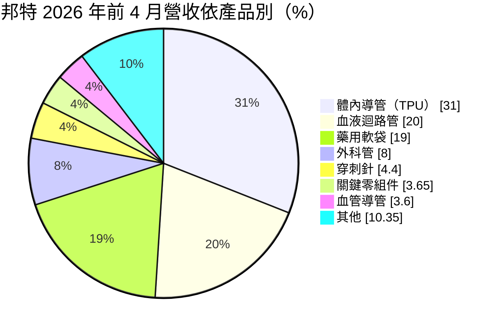
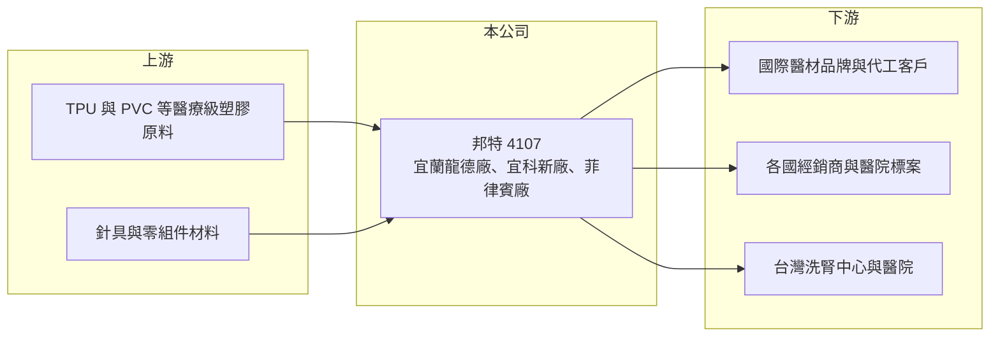

# 4107 邦特

> 上櫃｜[[產業索引-生技醫療業|生技醫療業]]｜上市（櫃）日期 2002/03/04

# 第一章：企業模式與商業藍圖

> [!info] 撰寫說明
> 精簡版，由 Claude 依公開資料整理，架構比照 [[2330台積電]] 的四章研究，資料截至 2026-10-08。來源：Goodinfo 年度經營績效頁（2020 至 2025 年）、櫃買中心開放資料（基本資料、2026 年第二季資產負債與綜合損益、本益比殖利率）、富果研究 2026 年 5 月邦特法說會整理。#待校對

邦特生物科技（股票代號：4107，以下簡稱邦特）是台灣代表性的醫療耗材製造商，產品從[[血液透析]]用的血液迴路管，延伸到技術門檻更高的體內導管與藥用軟袋。它的商業模式是以精密塑膠加工能力，生產醫院每天大量消耗的一次性醫療耗材。

- **核心業務：** 邦特 1991 年成立、2002 年上櫃，董事長為李明忠（櫃買中心開放資料）。主要產品包括以 [[TPU]] 材料製成的體內導管、血液迴路管、藥用軟袋、外科管、穿刺針、血管導管與關鍵零組件（富果研究整理）。醫療耗材屬於重複性消耗品，需求穩定，不太受景氣影響。
- **營收結構：** 2026 年前 4 個月，體內導管占 31%、血液迴路管 20%、藥用軟袋 19%、外科管 8%、穿刺針 4.4%、關鍵零組件 3.65%、血管導管 3.6%，其他約 10.35%。依地區，亞洲 26%、美洲 25.5%、台灣 22%、歐洲 12.6%、非洲 7.9%、中國 6%（富果研究整理），外銷占近八成，客戶遍及全球。
- **營運據點：** 生產基地包括宜蘭的龍德舊廠、宜科新廠與菲律賓廠。宜科新廠產能利用率約 40%，主要來自舊廠產線移轉；菲律賓廠定位為勞力密集產品的備援生產基地（富果研究整理）。
- **長期方向：** 邦特規劃投資約 538 萬歐元購置三台新軟袋機，預計 2027 年 8 月前全數進駐宜科廠，以擴大藥用軟袋產能（富果研究整理）。長期策略是提高高毛利產品比重、把勞力密集產品移往菲律賓以分散地緣風險，並爭取國際客戶的 TPU 導管代工訂單。

# 第二章：護城河深度與競爭優勢

邦特的護城河建立在醫療耗材的法規認證、材料加工技術與全球客戶基礎，這些都需要長時間累積。

- **競爭優勢：** 醫療耗材要進入各國市場，必須取得美國 FDA、歐盟 CE 等認證，客戶更換供應商前也要重新驗證，轉換成本高。邦特長期維持約 42% 至 44% 的毛利率與約 30% 的營業利益率（Goodinfo），在醫療耗材製造業中屬於高水準，反映 TPU 導管等產品的技術門檻。
- **主要對手：** 國際上有 Nipro、B. Braun、Fresenius 等大型醫材集團，它們同時生產透析設備與耗材，具有整套銷售的優勢；中國與印度的耗材廠則以低價競爭血液迴路管等標準化產品。#待校對 國內同業包括 [[4126太醫]] 等。
- **觀察重點：** 第一，血液迴路管屬於低毛利產品，原料上漲時的價格轉嫁能力；第二，宜科新廠的利用率提升速度，公司表示約 30% 利用率即可損益兩平；第三，可成（[[2474可成]]）入主後在董事會占五席，雙方表示僅為財務投資關係（富果研究整理），經營層的資本配置方向值得追蹤。

# 第三章：財務體質與盈利規模

資料日期：2026-10-08，表格是撰寫當時的快照；最新月營收、毛利率、累計 EPS 由自動排程寫在本筆記的屬性欄位（月營收、毛利率、累計EPS 等）。#待校對

邦特的財務數字呈現「低成長、高獲利、高配息」的典型穩定型企業特徵。

| 年度 | 營收（新台幣） | [[毛利率]] | [[營業利益率]] | EPS（元） | [[ROE]] |
|---|---|---|---|---|---|
| 2020 | 19.5 億 | 43.7% | 31.2% | 7.05 | 19.0% |
| 2021 | 18.3 億 | 44.0% | 30.0% | 6.22 | 15.8% |
| 2022 | 20.1 億 | 42.0% | 28.8% | 7.12 | 16.9% |
| 2023 | 19.4 億 | 42.1% | 29.8% | 6.53 | 14.5% |
| 2024 | 20.7 億 | 43.7% | 31.0% | 7.62 | 15.9% |
| 2025 | 21.4 億 | 43.9% | 31.4% | 7.78 | 15.3% |
| 2026 上半年 | 11.3 億 | 45.3% | 32.8% | 4.29 | 未查得 |

- **營收規模：** 2020 至 2025 年營收年複合成長率約 1.9%（推算），營收在 18 億至 21 億元之間，成長緩慢。公司 2026 年的營收目標是成長 10%（富果研究整理）。
- **獲利：** 營業利益率長期約 30%，2021 至 2025 年平均 ROE 約 15.7%（推算）。2026 年原料第一波漲幅約 30%，公司預估第三季起毛利率承壓，血液迴路管毛利率可能下滑 3 至 4 個百分點（富果研究整理）。
- **財務特色：** 2026 年第二季底權益約 35.3 億元、總負債約 13.5 億元，負債比約 28%（櫃買中心開放資料）。2025 年度現金股利 5.5 元，約為 EPS 的 71%（推算），配息穩定。

**[[ROIC]] 與 [[WACC]]：**
- ROIC（推算）：2025 年營業利益約 21.4 億元 × 31.4% ≈ 6.7 億元，稅後約 5.4 億元；投入資本以權益 35.3 億元加上推估的有息負債約 6 億元（開放資料未拆分，假設），合計約 41.3 億元，ROIC 約 13%（推算）。
- WACC（推算）：無風險利率 1.75%、市場風險溢酬 6%，β 取醫材股常見值 0.7（假設），股東權益成本約 6.0%；負債成本 2.5%、稅後 2.0%，負債占比約 15%，WACC 約 5.4%（推算）。
- 結論：ROIC 高於 WACC 約 7 至 8 個百分點，邦特長期穩定創造經濟價值。宜科新廠的折舊會暫時壓低資本報酬，但若利用率逐步提升，新產能將有助於維持這個利差。

# 第四章：總體風險與地緣政治

邦特的風險主要來自原料價格、匯率與全球醫療耗材市場的價格競爭。

- **產業週期：** 醫療耗材需求穩定，透析病患人數隨人口老化與糖尿病盛行率上升而增加，是長期的需求支撐。但客戶的庫存調整與國際標案時程，仍會造成短期的訂單波動。
- **營運風險：** 塑膠原料價格上漲會直接壓縮毛利，血液迴路管等標準化產品的價格轉嫁能力有限。新廠在利用率不足時折舊負擔較重，舊廠處分的時程與用途也尚未確定（富果研究整理）。
- **其他風險：** 外銷占營收近八成，新台幣升值會壓縮獲利。關稅戰後客戶要求供應鏈分散，邦特因此規劃把勞力密集產品移至菲律賓廠；各國醫材法規與認證要求的變化，也會影響產品上市時程。

# 專有名詞解析

## 應用

- **[[血液透析]]**：俗稱洗腎，以機器過濾腎衰竭病患的血液，病患通常每週需要接受三次治療。

## 金融

- **[[ROIC]]**：投入資本報酬率，稅後營業利益除以股東權益與有息負債的合計，衡量本業對所有資金提供者的報酬。
- **[[WACC]]**：加權平均資金成本，依股東權益與負債的比重加權計算的資金成本，ROIC 高於它才代表創造價值。

## 產業

- **[[TPU]]**：熱塑性聚氨酯，具柔軟、耐用與生物相容性的塑膠材料，用於製作體內導管。
- **[[藥用軟袋]]**：用來盛裝點滴與注射藥液的軟質包裝袋，須符合藥品包材的品質規範。
- **[[醫療耗材]]**：一次性使用、用完即丟的醫療用品，需求隨醫療使用量持續發生。

# 核心供應鏈

- 上游：TPU、PVC 等醫療級塑膠原料供應商，以及針具與零組件材料供應商。#待校對
- 下游／客戶：國際醫材品牌與代工客戶、亞洲與美洲的經銷商與醫院標案、台灣洗腎中心與醫院。
- 同業：Nipro、B. Braun、Fresenius 等國際醫材集團，國內的 [[4126太醫]]。#待校對

## 最新新聞
<!-- news:start -->
<!-- news:end -->

## 相關連結
- [公開資訊觀測站](https://mopsov.twse.com.tw/mops/web/t05st03?step=1&firstin=1&co_id=4107)
- [Goodinfo](https://goodinfo.tw/tw/StockDetail.asp?STOCK_ID=4107)
- [Yahoo 股市](https://tw.stock.yahoo.com/quote/4107)
- [鉅亨網新聞](https://www.cnyes.com/twstock/4107/news)
