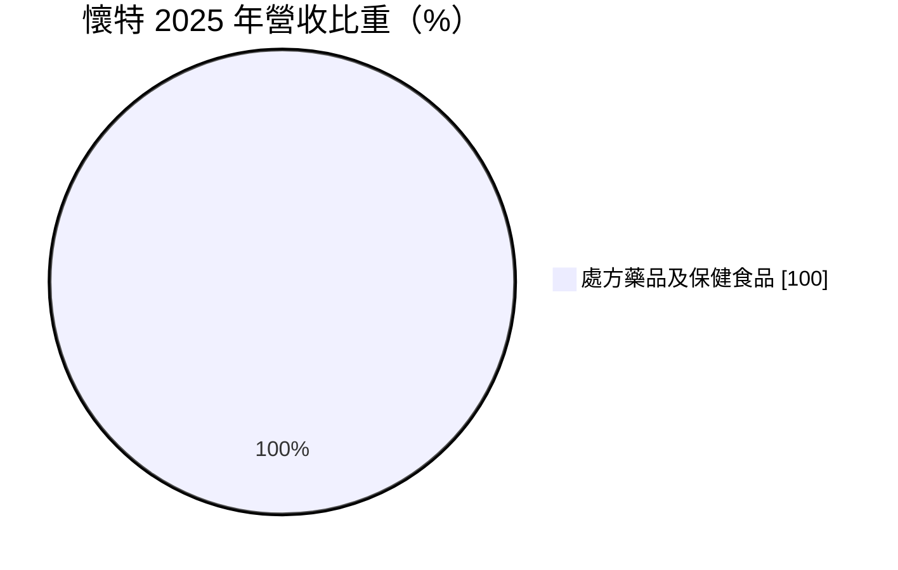
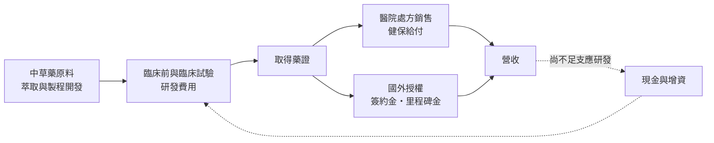
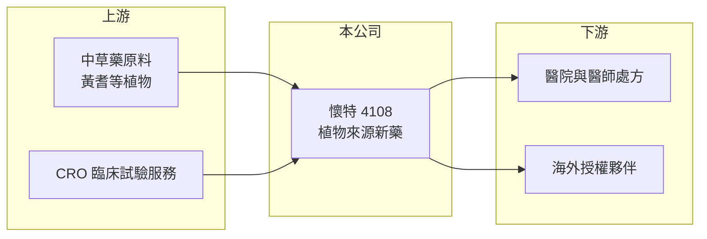

# 4108 懷特

> 上市｜[[產業索引-生技醫療業|生技醫療業]]｜上市（櫃）日期 2008/07/16

# 第一章：企業模式與商業藍圖

> [!info] 撰寫說明
> 本文由 Claude 依公開資料整理，架構比照 [[2330台積電]] 的四章研究，資料截至 2026-10-08。財務數字來源：MoneyDJ 理財網年度財務比率與公司基本資料、證交所開放資料（基本資料、2026 年第二季財報、股利）；業務描述參考富果研究、科技新報與經濟日報的新聞標題。公開資料有限，產品與藥證細節多憑整理性記憶，已標註待校對。#待校對

評估一家新藥公司，第一步是弄清楚它靠什麼產品賺錢、研發要燒多少錢，以及這兩者之間的差距要多久才能補上。本章說明懷特新藥（股票代號：4108，以下簡稱懷特）的商業模式。

## 一、核心定位：以中草藥萃取為基礎的新藥公司

懷特成立於 1998 年，2008 年轉為上市，董事長為李伊俐，實收資本額約 19.9 億元，屬於[[1731美吾華]]集團（集團關係待校對）。公司的研發主軸是從中草藥萃取有效成分，再依現代藥品法規做臨床試驗，取得[[新藥]]許可。

* **營收來源單一：** 依 MoneyDJ 資料，2025 年營收 100% 來自「處方藥品及保健食品」。公司代表性產品是以黃耆多醣製成的注射劑「懷特血寶」（PG2），用於癌症病人的疲憊症狀（適應症與上市年份待校對）。
* **營收規模小、研發支出大：** 2025 年營收約 1.35 億元（推算），2026 年上半年營收約 0.70 億元，但營業費用約 0.98 億元，是營收的 1.4 倍。這代表公司目前仍處於「研發投入大於產品回收」的階段。

## 二、資本轉化邏輯：用股本支撐臨床試驗

* **現金是生命線：** 2026 年第二季底總資產約 24.1 億元、負債僅約 0.58 億元，幾乎沒有借款。公司主要靠歷年募資累積的現金與投資支撐研發，負債比率長期只有 2% 至 6%。
* **授權是放大器：** 新藥公司的大筆收入通常來自[[授權]]國外藥廠的簽約金與[[里程碑金]]。依 2025 年 9 月的科技新報網址，懷特與歐洲藥廠 Aristo Pharma 有合作相關消息，具體內容未查得（待校對）。

## 三、長期方向

懷特的長期價值取決於兩件事：第一，既有藥品能否擴大適應症或打進海外市場，把營收拉到足以支撐研發的規模；第二，研發中的品項能否完成臨床並取得藥證或授權。在這兩件事發生之前，公司的財務會持續呈現營業虧損，這是新藥公司常見的型態，而不是單一年度的異常。

# 第二章：護城河深度與競爭優勢

護城河是企業抵禦競爭、長期維持超額利潤的機制。對新藥公司而言，護城河主要來自專利、藥證與臨床數據，本章說明懷特的優勢與限制。

## 一、懷特護城河的核心組成要素

* **1. 藥證與臨床數據：** 新藥取得許可需要多年臨床試驗，後進者無法直接複製。已上市的藥品等於有一段法規保護期，這是新藥公司最基本的進入門檻。
* **2. 中草藥萃取的製程經驗：** 植物來源的藥品成分複雜，要做到每批品質一致並不容易。長期累積的萃取與品管經驗，構成一定程度的技術門檻。
* **3. 集團資源：** 屬美吾華集團，在通路、資金與管理上可取得集團支援（具體合作範圍待校對）。

## 二、主要競爭對手格局

| 對手 | 定位 | 對懷特的影響 |
|---|---|---|
| [[4128中天]] | 植物新藥與保健品 | 同樣走天然來源新藥路線，爭取同類資金與通路 |
| [[4123晟德]] | 西藥製造與生技投資 | 擁有較大的製造與銷售規模 |
| 跨國藥廠的癌症支持療法 | 疲憊、疼痛等症狀治療 | 醫師處方選擇多，新藥需證明差異化 |

## 三、優勢轉化：守得住與守不住的地方

* **守得住：** 已取得藥證的產品在適應症範圍內有穩定的處方來源，加上幾乎無負債，公司短期內沒有財務壓力。
* **守不住：** 營收規模太小，2020 至 2025 年[[營業利益率]]都在負 75% 到負 186% 之間，護城河還沒轉化成獲利。
* **觀察重點：** 海外授權是否帶來實際收入、研發中品項的臨床進度，以及營收能否突破損益兩平所需的規模。

# 第三章：財務體質與盈利規模

資料日期：2026-10-08。數字取自 MoneyDJ 理財網年度財務資料與證交所開放資料，表格是撰寫當時的快照；最新月營收、毛利率、累計 EPS 由自動排程寫在本筆記的屬性欄位（月營收、毛利率、累計EPS 等）。#待校對

財務報表是檢驗護城河是否真實存在的最終標準。本章用五年的三率、ROE 與資本報酬，檢視懷特的財務體質。

## 一、多年度財務表現

| 年度 | 營收（新台幣） | 每股營業額 | [[毛利率]] | [[營業利益率]] | EPS（元） | [[ROE]] |
|---|---|---|---|---|---|---|
| 2021 | 未查得 | 0.85 元 | 46.4% | -78.2% | -0.40 | -4.67% |
| 2022 | 未查得 | 0.68 元 | 42.1% | -115.7% | -0.40 | -4.92% |
| 2023 | 約 1.63 億（推算） | 0.82 元 | 41.6% | -74.9% | -0.24 | -3.26% |
| 2024 | 約 1.53 億（推算） | 0.77 元 | 41.7% | -104.3% | -0.37 | -4.68% |
| 2025 | 約 1.35 億（推算） | 0.68 元 | 30.7% | -129.7% | -0.29 | -4.72% |

資料來源：MoneyDJ 理財網年度財務比率；營收以每股營業額乘目前股數約 1.99 億股推算。2026 年上半年（證交所資料）營收約 0.70 億元、毛利率約 36.6%、營業虧損約 0.72 億元、EPS 負 0.11 元。

懷特連續多年營業虧損，虧損幅度相對營收很大，但相對股東權益並不大，ROE 大致落在負 3% 到負 5%。原因是公司手上現金與投資多、營收小，虧損主要來自研發與營運費用。業外收入（2026 年上半年約 0.25 億元）能抵銷部分虧損。近五年平均 ROE 約負 4.5%（推算），營收沒有明顯成長趨勢，2024、2025 年未配發現金股利。

## 二、[[ROIC]] 與 [[WACC]]：價值創造利差

**ROIC 推算：** 2025 年營業虧損約 1.75 億元（營收 1.35 億元乘營業利益率負 129.7%，推算），虧損年度不計稅盾。公司幾乎沒有有息負債，投入資本以 2026 年第二季權益總計約 23.5 億元計算，ROIC 約負 7.4%（推算）。

**WACC 推算：** 台灣 10 年期公債殖利率取 1.75%、市場風險溢酬 6%、β 取生技同業常見值 1.0（未查得公司實際 β），股東權益成本約 7.75%。由於幾乎無負債，WACC 約等於 7.75%（推算）。

**結論：** ROIC 為負，與 WACC 的差距約 15 個百分點，代表公司目前仍在消耗資本。這是研發型新藥公司在產品放量前的正常狀態，評估重點不是當下的報酬率，而是研發成果能否在未來轉化為足夠的營收，讓累積投入的資本得到回收。

# 第四章：總體風險與地緣政治

任何企業都無法脫離宏觀環境獨立存在。本章分析懷特長期必須面對的研發、法規與財務風險。

## 一、研發與法規風險

* **臨床失敗風險：** 新藥開發的成功率低，任何一個關鍵試驗未達主要指標，都可能讓多年投入歸零。
* **審查與給付：** 即使取得藥證，健保是否給付、[[健保藥價]]訂多少，會直接決定產品能賣多少。

## 二、營運環境的隱性風險

* **營收集中：** 營收全部來自少數處方藥與保健品，單一產品的處方量變化就會影響整體營收。
* **原料品質：** 中草藥原料的產地、氣候與批次差異，會影響製程穩定性與成本。

## 三、財務風險

* **持續燒錢：** 營業虧損每年約 1.5 至 2 億元，雖然目前現金充足、負債極低，但若研發延長，未來仍可能需要增資，稀釋既有股東。
* **授權收入不穩定：** 授權金與里程碑金是一次性收入，無法當作經常性獲利來源。

# 專有名詞解析

## 金融

- **[[ROIC]]**：投入資本報酬率，稅後營業利益除以股東權益加有息負債，衡量本業運用資本的效率。
- **[[WACC]]**：加權平均資金成本，股東與債權人要求報酬率的加權平均，是 ROIC 要超越的門檻。

## 產業

- **[[新藥]]**：含有新成分、新療效或新給藥途徑的藥品，需完成完整臨床試驗才能取得上市許可。
- **[[授權]]**：藥廠把產品或技術的開發、銷售權利授予其他公司，以換取簽約金、里程碑金與銷售權利金。
- **[[里程碑金]]**：授權合約中，被授權方在臨床、藥證或銷售達到約定進度時支付給授權方的款項。
- **[[健保藥價]]**：全民健保給付藥品的價格，由主管機關核定並定期調整，直接影響國內藥廠的營收與毛利。

# 核心供應鏈

## 1. 上游：原料與研發服務
- 中草藥原料供應商（名稱未查得）
- 臨床試驗委託研究機構（CRO）

## 2. 中游：懷特與同業
- 集團母公司：[[1731美吾華]]（待校對）
- 植物新藥與生技同業：[[4128中天]]、[[4123晟德]]

## 3. 下游：客戶
- 國內醫院與癌症治療相關科別
- 海外授權合作藥廠（Aristo Pharma 等，待校對）

## 最新新聞
<!-- news:start -->
<!-- news:end -->

## 相關連結
- [公開資訊觀測站](https://mopsov.twse.com.tw/mops/web/t05st03?step=1&firstin=1&co_id=4108)
- [Goodinfo](https://goodinfo.tw/tw/StockDetail.asp?STOCK_ID=4108)
- [Yahoo 股市](https://tw.stock.yahoo.com/quote/4108)
- [鉅亨網新聞](https://www.cnyes.com/twstock/4108/news)
