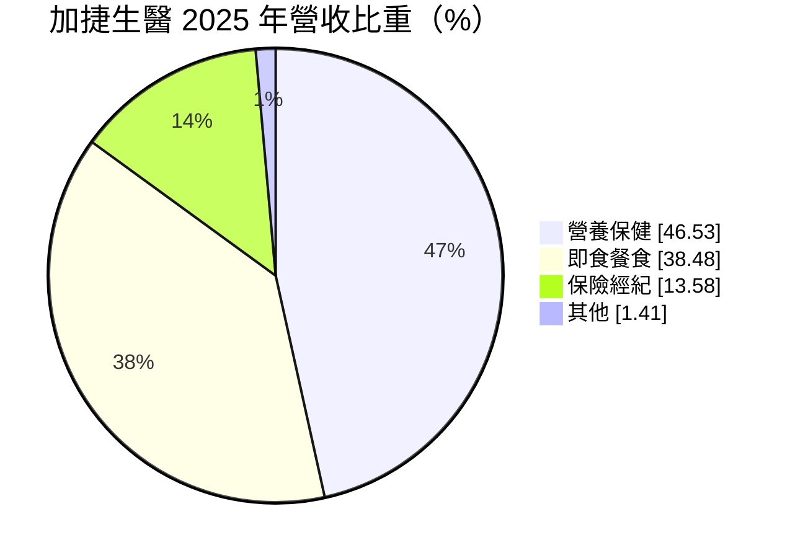
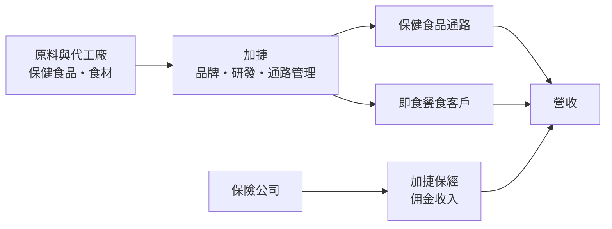
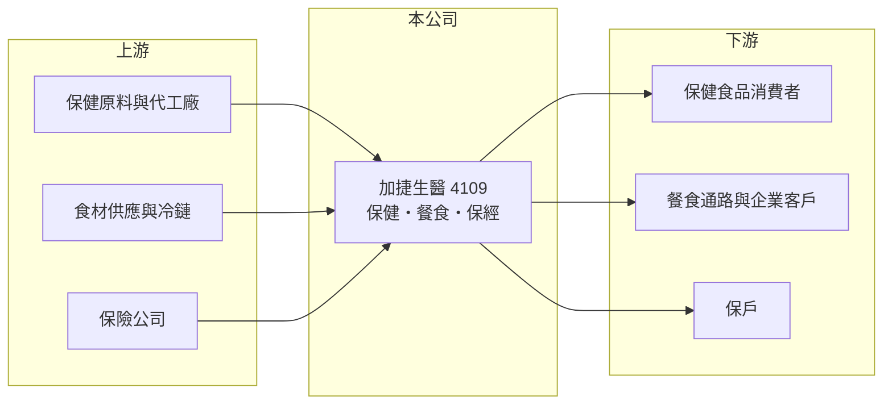

# 4109 加捷生醫

> 上櫃｜[[產業索引-生技醫療業|生技醫療業]]｜上市（櫃）日期 2002/08/08

# 第一章：企業模式與商業藍圖

> [!info] 撰寫說明
> 本文由 Claude 依公開資料整理，架構比照 [[2330台積電]] 的四章研究，資料截至 2026-10-08。財務數字來源：MoneyDJ 理財網年度財務比率與公司基本資料、櫃買中心開放資料（基本資料、2026 年第二季財報、每月營收）、Yahoo 股市新聞標題（2024 年營收）。公開資料有限，各事業的品牌、客戶與據點未逐項查證。#待校對

評估一家多角化經營的小型公司，第一步是拆開它的事業組合，看哪一塊是主力、哪一塊在拖累獲利。本章說明加捷生醫（股票代號：4109，以下簡稱加捷）的商業模式。

## 一、核心定位：營養保健、即食餐食與保險經紀三角組合

加捷成立於 1995 年，2002 年在櫃買中心掛牌，總部位於高雄市三民區，董事長為謝汶芳，實收資本額約 11.9 億元。依 MoneyDJ 資料，2025 年營收中營養保健占 46.5%、[[即食餐食]] 占 38.5%、保險經紀占 13.6%、其他 1.4%。

* **營養保健是主體：** 公司銷售[[保健食品]]，這類產品毛利較高，但需要品牌與通路經營，屬於消費性產品。
* **即食餐食是成長引擎：** 近年營收的成長主要來自餐食事業，依新聞標題，2024 年營收約 5.3 億元、年增 61%。餐食屬於量大、毛利較低的生意，提高了營收規模，也拉低整體毛利率。
* **保險經紀提供穩定佣金：** 保險經紀收入來自保單佣金，不需要存貨，但規模有限。

## 二、資本轉化邏輯

* **輕資產與投資並存：** 2026 年第二季底總資產約 18.8 億元，但流動資產只有約 5.9 億元，代表有相當比例的資產放在長期投資或不動產等非流動項目（細項未查得）。這也解釋了為什麼加捷的稅後淨利常與本業獲利差距很大。

## 三、長期方向

加捷的長期課題，是讓本業的營業利益率穩定轉正並擴大。過去五年本業大多在損益兩平附近，獲利主要靠業外。若即食餐食能建立規模經濟、保健食品能建立品牌溢價，本業才有機會成為穩定的獲利來源。

# 第二章：護城河深度與競爭優勢

護城河是企業抵禦競爭、長期維持超額利潤的機制。加捷的三個事業都屬於競爭激烈、進入門檻不高的市場，本章說明它的優勢與限制。

## 一、加捷護城河的核心組成要素

* **1. 事業組合分散：** 保健、餐食與保經三種收入來源的景氣循環不同，可以降低單一市場衰退的衝擊。
* **2. 南部在地經營：** 總部在高雄，在南部的通路與客戶關係較深（具體通路未查得）。
* **3. 資產厚度：** 負債比率長期在 8% 至 10%（2023 年曾達 24%），財務保守，經得起本業的短期虧損。

## 二、主要競爭對手格局

| 對手 | 定位 | 對加捷的影響 |
|---|---|---|
| [[4127天良]] | 保健食品，以電視購物為主要通路 | 同樣爭取保健食品消費者 |
| [[4128中天]] | 保健品與有機食品 | 品牌與通路規模較大 |
| 大型食品廠與超商鮮食供應商 | 即食餐食 | 規模與冷鏈成本優勢明顯 |

## 三、優勢轉化：守得住與守不住的地方

* **守得住：** 低負債與事業分散，讓公司在景氣差時不至於陷入財務危機。
* **守不住：** 三個事業都缺乏明顯的定價權，2021 至 2025 年[[營業利益率]]在負 20% 到正 6% 之間擺盪，本業獲利能力偏弱。
* **觀察重點：** 即食餐食的規模能否帶來營業利益，以及業外投資收益是否會持續。

# 第三章：財務體質與盈利規模

資料日期：2026-10-08。數字取自 MoneyDJ 理財網年度財務資料與櫃買中心開放資料，表格是撰寫當時的快照；最新月營收、毛利率、累計 EPS 由自動排程寫在本筆記的屬性欄位（月營收、毛利率、累計EPS 等）。#待校對

財務報表是檢驗護城河是否真實存在的最終標準。本章用五年的三率、ROE 與資本報酬，檢視加捷的獲利品質。

## 一、多年度財務表現

| 年度 | 營收（新台幣） | [[毛利率]] | [[營業利益率]] | 稅後淨利率 | EPS（元） | [[ROE]] |
|---|---|---|---|---|---|---|
| 2021 | 未查得 | 34.6% | -0.4% | 2.1% | 0.06 | 0.55% |
| 2022 | 未查得 | 36.7% | -4.3% | -2.0% | -0.06 | -0.69% |
| 2023 | 約 3.3 億（推算） | 35.4% | -19.9% | 44.2% | 1.62 | 14.75% |
| 2024 | 約 5.3 億 | 32.3% | 6.2% | 40.3% | 2.16 | 17.79% |
| 2025 | 約 4.9 億（推算） | 31.0% | 0.2% | 10.7% | 0.43 | 3.39% |

資料來源：MoneyDJ 理財網年度財務比率；2024 年營收取自新聞標題，2023 年以年增 61% 回推，2025 年以每股營業額 4.09 元乘目前股數推算。股本近年可能有變動，故 2021、2022 年營收不推算。2026 年上半年（櫃買中心資料）營收約 2.68 億元、毛利率約 27.7%、營業利益約 0.02 億元、業外損失約 0.30 億元、EPS 負 0.29 元。

加捷最值得注意的是稅後淨利率遠高於營業利益率。2023、2024 年稅後淨利率超過 40%，但本業營業利益率分別只有負 19.9% 與正 6.2%，代表當年獲利主要來自業外（可能是投資處分或評價利益，細項未查得）。近五年平均 ROE 約 7.2%（推算），但若扣除業外，本業報酬率接近零。營收在 2023 至 2025 年明顯擴大，但毛利率逐年下滑，反映低毛利的餐食比重提高。依櫃買中心資料，最近一次現金股利為每股 0.2 元。

## 二、[[ROIC]] 與 [[WACC]]：價值創造利差

**ROIC 推算：** 2025 年營業利益約 0.01 億元（營收 4.86 億元乘營業利益率 0.15%，推算），幾乎為零。官方資料只揭露負債總計約 2.24 億元，假設三成為有息負債約 0.67 億元（推估），加上權益總計約 16.6 億元，投入資本約 17.2 億元，ROIC 約 0%（推算）。

**WACC 推算：** 台灣 10 年期公債殖利率取 1.75%、市場風險溢酬 6%、β 取同業常見值 1.0（未查得公司實際 β），股東權益成本約 7.75%。負債成本假設 2.5%，稅率 20%，稅後約 2.0%。權益占投入資本約 96%，WACC 約 7.5%（推算）。

**結論：** 本業 ROIC 遠低於 WACC，代表以本業衡量，公司尚未替股東創造價值。過去的帳面高 ROE 主要來自業外收益，這類收益難以每年重複，長期投資人應以本業營業利益的改善為主要判斷依據。

# 第四章：總體風險與地緣政治

任何企業都無法脫離宏觀環境獨立存在。本章分析加捷長期必須面對的市場、營運與財務風險。

## 一、市場與法規風險

* **保健食品競爭：** 保健食品進入門檻低，品牌眾多，價格競爭與廣告費用都會壓縮利潤。食品標示與廣告法規趨嚴，也會限制行銷方式。
* **保險法規：** 保險經紀收入受保險商品設計與主管機關佣金規範影響。

## 二、營運環境的隱性風險

* **食材與人工成本：** 即食餐食對食材價格、冷鏈物流與基層人力成本敏感，成本上漲難以完全轉嫁。
* **食品安全：** 餐食與保健食品一旦發生食安事件，對品牌與營收的衝擊很大。

## 三、財務風險

* **獲利依賴業外：** 業外損益波動大，2026 年上半年業外由盈轉虧，即讓 EPS 轉為負數。
* **本業規模小：** 營收約 5 億元，固定費用的比重高，營收小幅下滑就可能轉為營業虧損。

# 專有名詞解析

## 金融

- **[[ROIC]]**：投入資本報酬率，稅後營業利益除以股東權益加有息負債，衡量本業運用資本的效率。
- **[[WACC]]**：加權平均資金成本，股東與債權人要求報酬率的加權平均，是 ROIC 要超越的門檻。

## 產業

- **[[保健食品]]**：以補充營養或維持健康為訴求的食品，不屬藥品，進入門檻低、品牌競爭激烈。
- **[[即食餐食]]**：經加工後可直接食用或加熱即食的餐點，常透過超商、量販或團膳通路銷售。

# 核心供應鏈

## 1. 上游：原料、食材與保險商品
- 保健食品原料與代工廠、食材供應商（名稱未查得）
- 合作保險公司（名稱未查得）

## 2. 中游：加捷與同業
- 保健食品同業：[[4127天良]]、[[4128中天]]

## 3. 下游：客戶
- 保健食品消費者、即食餐食通路與企業客戶、保險客戶

## 最新新聞
<!-- news:start（自動產生，請勿手動編輯此範圍） -->
- 2026-10-08 📰 媒體 19:51｜營收速報 - 加捷生醫(4109)9月營收4,990萬元年增率高達38.07％｜[鉅亨網](https://news.cnyes.com/news/id/6625878)

完整紀錄：[[4109加捷生醫 新聞]]
<!-- news:end -->

## 相關連結
- [公開資訊觀測站](https://mopsov.twse.com.tw/mops/web/t05st03?step=1&firstin=1&co_id=4109)
- [Goodinfo](https://goodinfo.tw/tw/StockDetail.asp?STOCK_ID=4109)
- [Yahoo 股市](https://tw.stock.yahoo.com/quote/4109)
- [鉅亨網新聞](https://www.cnyes.com/twstock/4109/news)
