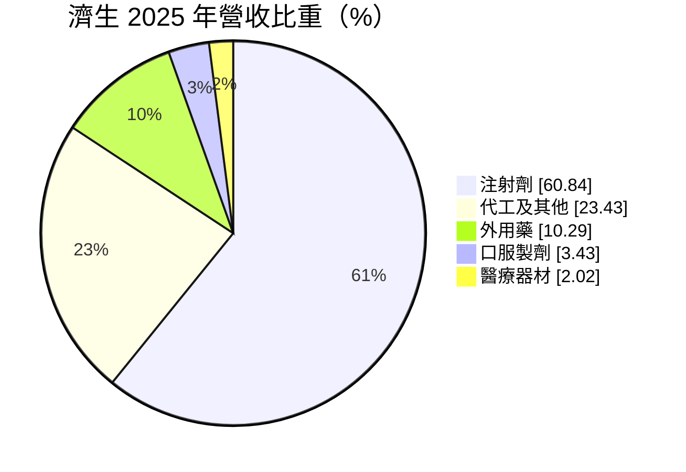
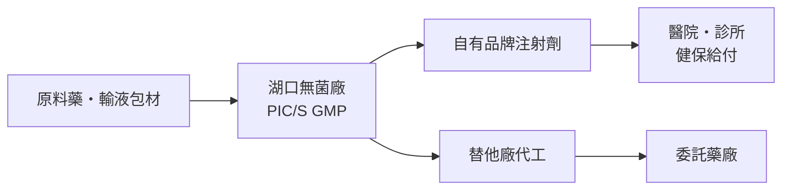
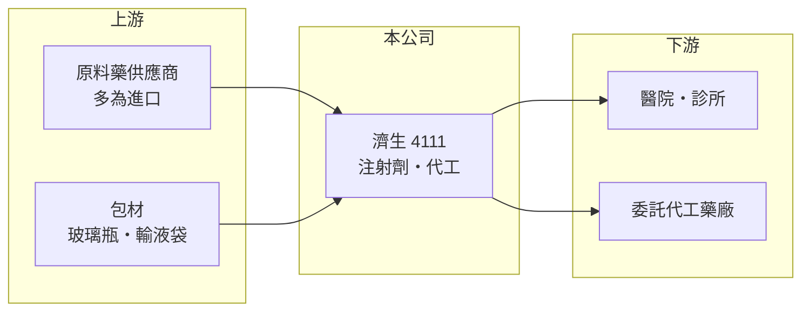

# 4111 濟生

> 上櫃｜[[產業索引-生技醫療業|生技醫療業]]｜上市（櫃）日期 1999/03/06

# 第一章：企業模式與商業藍圖

> [!info] 撰寫說明
> 本文由 Claude 依公開資料整理，架構比照 [[2330台積電]] 的四章研究，資料截至 2026-10-08。財務數字來源：MoneyDJ 理財網年度財務比率與公司基本資料、櫃買中心開放資料（基本資料、2026 年第二季財報、每月營收、股利）；產業描述為整理性內容，個別產品與客戶未逐項查證。#待校對

評估一家學名藥廠的長期價值，關鍵在於它的產品是否有製造門檻，以及能否在健保藥價持續調降的環境中維持利潤。本章說明濟生醫藥生技（股票代號：4111，以下簡稱濟生）的商業模式。

## 一、核心定位：以注射劑為主的老牌藥廠

濟生成立於 1962 年，1999 年在櫃買中心掛牌，工廠位於新竹縣湖口鄉，董事長兼總經理為蘇東茂，實收資本額約 6.0 億元。依 MoneyDJ 資料，2025 年營收中注射劑占 60.8%、代工及其他 23.4%、外用藥 10.3%、口服製劑 3.4%、醫療器材 2.0%。

* **[[注射劑]]是核心：** 注射劑必須在無菌環境下生產，廠房、設備與品管的要求比口服藥高很多，能做的廠商較少。這讓濟生在醫院用藥市場有一定的位置。
* **代工是第二支柱：** 代工收入占兩成以上，代表濟生的無菌產線也替其他[[學名藥]]廠生產，提高產能利用率。

## 二、資本轉化邏輯

* **重資產、穩定需求：** 醫院用的注射劑屬於必需品，需求不太受景氣影響，但工廠需要持續投資以符合 PIC/S GMP 規範。
* **營收規模穩定成長：** 以每股營業額推算，營收由 2023 年約 11.1 億元成長到 2025 年約 13.8 億元。2026 年 1 至 8 月營收約 9.69 億元，較 2025 年同期的 9.18 億元成長約 5.5%。

## 三、長期方向

濟生的長期成長來自兩個方向：一是提高產能利用率，把無菌產線的固定成本攤得更薄；二是把產品組合往毛利較高的特殊針劑移動。2021 至 2025 年[[毛利率]]由約 33% 提升到 39.5%，顯示產品組合有改善（具體產品未查得）。

# 第二章：護城河深度與競爭優勢

護城河是企業抵禦競爭、長期維持超額利潤的機制。對注射劑藥廠而言，護城河主要來自無菌製造的門檻與醫院端的長期供應關係，本章說明濟生的優勢與限制。

## 一、濟生護城河的核心組成要素

* **1. 無菌製造門檻：** 注射劑需要無菌充填、滅菌與嚴格的環境監控，新廠從建廠到取得認證需要多年，這限制了新競爭者進入。
* **2. 醫院供應紀錄：** 醫院採購重視穩定供貨與品質紀錄，長期供應商不容易被取代，尤其是急重症用藥。
* **3. 代工的雙向收益：** 有能力替其他藥廠代工，代表產線品質獲得同業認可，也讓產能不只依賴自有產品的銷量。

## 二、主要競爭對手格局

| 對手 | 定位 | 對濟生的影響 |
|---|---|---|
| [[1720生達]] | 綜合學名藥廠 | 產品線廣，醫院通路競爭 |
| [[4114健喬]] | 品牌學名藥與新藥 | 規模較大，部分品項重疊 |
| 進口原廠藥與國外輸液廠 | 原廠注射劑 | 品牌與臨床資料較完整 |

## 三、優勢轉化：守得住與守不住的地方

* **守得住：** 醫院必需的注射劑需求穩定，2020 至 2025 年營業利益率都是正數，獲利未曾出現虧損。
* **守不住：** [[健保藥價]]定期調降，若無法以新品或代工補位，既有品項的毛利會被逐步侵蝕。
* **觀察重點：** 毛利率能否維持在 35% 以上、代工比重的變化，以及新產線或新品項的取證進度。

# 第三章：財務體質與盈利規模

資料日期：2026-10-08。數字取自 MoneyDJ 理財網年度財務資料與櫃買中心開放資料，表格是撰寫當時的快照；最新月營收、毛利率、累計 EPS 由自動排程寫在本筆記的屬性欄位（月營收、毛利率、累計EPS 等）。#待校對

財務報表是檢驗護城河是否真實存在的最終標準。本章用五年的三率、ROE 與資本報酬，檢視濟生的獲利品質。

## 一、多年度財務表現

| 年度 | 營收（新台幣） | [[毛利率]] | [[營業利益率]] | EPS（元） | [[ROE]] |
|---|---|---|---|---|---|
| 2021 | 未查得 | 33.3% | 8.8% | 1.42 | 7.42% |
| 2022 | 未查得 | 37.0% | 13.5% | 2.70 | 15.44% |
| 2023 | 約 11.1 億（推算） | 32.3% | 5.8% | 1.21 | 5.63% |
| 2024 | 約 12.2 億（推算） | 34.1% | 8.5% | 1.94 | 8.87% |
| 2025 | 約 13.8 億（推算） | 39.5% | 14.5% | 2.75 | 12.37% |

資料來源：MoneyDJ 理財網年度財務比率（2025 年為個別財報，其餘為合併財報）；營收以每股營業額乘目前股數約 5,983 萬股推算。2026 年上半年（櫃買中心資料）營收約 7.32 億元、毛利率約 39.4%、營業利益率約 15.0%、EPS 1.64 元。

濟生的獲利呈現「穩定但有波動」的型態：五年都賺錢，但營業利益率在 5.8% 到 14.5% 之間擺盪，主要受產品組合與成本影響。近五年平均 ROE 約 10%（推算）。營收在 2023 至 2025 年間年複合成長率約 11%（推算）。依櫃買中心資料，最近一次現金股利為每股 1.3 元，配發相對穩定。負債比率由 2021 年約 34% 降到 2025 年約 29%，財務結構保守。

## 二、[[ROIC]] 與 [[WACC]]：價值創造利差

**ROIC 推算：** 2025 年營業利益約 2.0 億元（營收 13.8 億元乘營業利益率 14.5%，推算），稅後約 1.6 億元。官方資料只揭露負債總計約 6.35 億元，假設四成為有息負債約 2.5 億元（推估），加上權益總計約 14.0 億元，投入資本約 16.6 億元，ROIC 約 9.6%（推算）。

**WACC 推算：** 台灣 10 年期公債殖利率取 1.75%、市場風險溢酬 6%、β 取醫藥同業常見值 0.8（未查得公司實際 β），股東權益成本約 6.55%。負債成本假設 2.5%，稅率 20%，稅後約 2.0%。權益約占投入資本 85%，WACC 約 5.9%（推算）。

**結論：** 2025 年 ROIC 高於 WACC 約 3.7 個百分點，代表公司在獲利較好的年度能創造價值。不過 2023 年營業利益率僅 5.8%，當年 ROIC 推估低於 WACC，顯示利差並不穩定。長期來看，毛利率能否守在較高水準，決定濟生能否持續創造價值。

# 第四章：總體風險與地緣政治

任何企業都無法脫離宏觀環境獨立存在。本章分析濟生長期必須面對的法規、營運與財務風險。

## 一、法規與政策風險

* **健保藥價調降：** 國內藥廠主要客戶是健保體系下的醫院，藥價每隔一段時間就會調整，對老品項的毛利壓力持續存在。
* **GMP 稽查：** 無菌製劑的稽查標準嚴格，若稽查發現缺失，可能被要求停產改善，對營收影響很大。

## 二、營運環境的隱性風險

* **原料藥依賴進口：** 注射劑的原料藥多從國外採購，供應中斷或價格上漲會壓縮毛利。
* **單一廠區：** 主要產能集中在湖口廠，若發生停電、停水或設備故障，會影響供貨。

## 三、其他風險

* **代工客戶集中：** 代工占營收兩成以上，主要委託客戶的訂單變動會影響產能利用率（客戶名單未查得）。
* **匯率：** 原料以外幣計價，新台幣貶值會提高成本。

# 專有名詞解析

## 金融

- **[[ROIC]]**：投入資本報酬率，稅後營業利益除以股東權益加有息負債，衡量本業運用資本的效率。
- **[[WACC]]**：加權平均資金成本，股東與債權人要求報酬率的加權平均，是 ROIC 要超越的門檻。

## 產業

- **[[注射劑]]**：以注射方式給藥的藥品，必須在無菌環境下生產，製造門檻高於口服藥。
- **[[PIC S GMP]]**：國際醫藥品稽查協約組織的藥品優良製造規範，是台灣藥廠必須符合的製造標準。
- **[[健保藥價]]**：全民健保給付藥品的價格，由主管機關核定並定期調整，直接影響國內藥廠的營收與毛利。
- **[[學名藥]]**：原廠藥專利到期後，由其他藥廠生產、成分與療效相同的藥品，價格通常較低。

# 核心供應鏈

## 1. 上游：原料與包材
- 原料藥供應商（名稱未查得）
- 注射劑包材供應商

## 2. 中游：濟生與同業
- 國內學名藥同業：[[1720生達]]、[[4114健喬]]、[[4123晟德]]

## 3. 下游：客戶
- 各級醫院與診所（透過健保給付）
- 委託代工的國內藥廠

## 最新新聞
<!-- news:start -->
<!-- news:end -->

## 相關連結
- [公開資訊觀測站](https://mopsov.twse.com.tw/mops/web/t05st03?step=1&firstin=1&co_id=4111)
- [Goodinfo](https://goodinfo.tw/tw/StockDetail.asp?STOCK_ID=4111)
- [Yahoo 股市](https://tw.stock.yahoo.com/quote/4111)
- [鉅亨網新聞](https://www.cnyes.com/twstock/4111/news)
