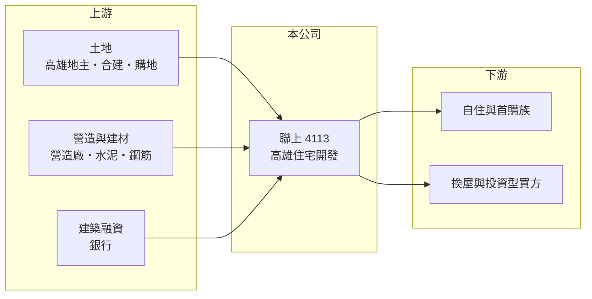

# 4113 聯上

> 上櫃｜[[產業索引-建材營造業|建材營造業]]｜上市（櫃）日期 2003/07/22

# 第一章：企業模式與商業藍圖

> [!info] 撰寫說明
> 本文由 Claude 依公開資料整理，架構比照 [[2330台積電]] 的四章研究，資料截至 2026-10-08。財務數字來源：MoneyDJ 理財網年度財務比率與損益表、櫃買中心開放資料（基本資料、2026 年第二季財報）；業務描述參考 Yahoo 股市、經濟日報、旺得富（中時）與富果研究法說會頁面的新聞標題。公開資料有限，個別建案名稱與總銷金額未逐案查證。#待校對

在評估一家建商的長期價值時，第一步是看懂它的土地在哪裡、推案節奏如何，以及營收為什麼會大起大落。本章針對聯上實業（股票代號：4113，以下簡稱聯上）的商業模式進行定性分析，說明一家以高雄為基地的住宅建商如何經營。

## 一、核心定位：深耕高雄的住宅建商

聯上成立於 1998 年，2003 年在櫃買中心掛牌，總部位於高雄市左營區，董事長兼總經理為蘇永義，實收資本額約 23.1 億元。公司的本業是在高雄地區購地或與地主[[合建]]，開發住宅大樓後銷售，屬於典型的區域型建商。

* **營收高度集中在交屋年度：** 台灣建商採[[建案交屋]]認列營收，聯上的營收因此極不平均。2024 年營收約 57.2 億元，是 2023 年的 11 倍；2025 年又降到約 6.1 億元。依新聞標題，2024 年營收創下公司歷史新高。
* **在建規模大：** 2026 年第二季底總資產約 166 億元，流動資產約 154 億元，主要是土地與在建房地。對照 2025 年營收約 6 億元，代表公司手上有大量尚未完工交屋的建案。

## 二、資本轉化邏輯：買地、預售、興建、交屋

* **[[預售屋]]降低資金壓力：** 高雄建商多以預售方式在動工前就開始銷售，買方分期繳款，讓建商可以邊蓋邊收錢，降低自有資金的需求。
* **槓桿經營：** 聯上的負債比率在 2019 年約 61%，之後升到 2023 年的 80%，2025 年約 73%。負債中包括建築融資與預收房款，代表公司以較高的財務槓桿擴大推案規模。

## 三、長期方向：受惠高雄產業轉型的住宅需求

依新聞標題，聯上在 2025 年初花費約 12 億元購地，持續補充土地庫存。高雄近年因半導體廠進駐、產業園區開發與交通建設，帶動外地就業人口移入與住宅需求，是在地建商的長期成長動能。公司能否在土地成本上升前取得足夠的開發用地，並維持穩定的推案節奏，是長期經營的關鍵。

# 第二章：護城河深度與競爭優勢

護城河是企業抵禦競爭、長期維持超額利潤的機制。對區域型建商而言，護城河主要來自在地土地資源與資金實力，本章說明聯上的優勢與競爭環境。

## 一、聯上護城河的核心組成要素

* **1. 在地土地與地主關係：** 長期在高雄經營，熟悉各區的土地行情與地主，能透過合建或議價取得一般外地建商較難接觸的土地。
* **2. 推案規模與資產實力：** 總資產超過 160 億元，在高雄在地建商中規模不小，可以同時進行多個建案，分散單一建案的風險。
* **3. 產品毛利：** 2021 至 2025 年[[毛利率]]多在 20% 至 32%，代表在土地取得成本控制得宜時，產品仍有不錯的利潤空間。

## 二、主要競爭對手格局

| 對手 | 定位 | 對聯上的威脅 |
|---|---|---|
| [[5508永信建]] | 高雄老牌建商，毛利率高 | 同區域搶地，品牌累積深 |
| [[2537聯上發]] | 南部住宅建商 | 同在南部市場競爭 |
| [[2542興富發]] | 全台大型建商，南部案量大 | 規模與融資成本優勢 |
| [[2524京城]] | 高雄在地大型建商 | 在高雄精華區直接競爭 |

## 三、優勢轉化：哪些守得住、哪些守不住

* **守得住：** 在房市穩定時，聯上憑土地庫存與在地經驗，可以維持兩成以上的毛利率。
* **守不住：** 營收高度集中在少數交屋年度，中間年度常出現營業虧損，2022、2023、2025 年 EPS 都是負數。高槓桿也讓公司對房市轉冷較敏感。
* **觀察重點：** 第一，在建房地何時完工交屋，這決定未來兩三年的營收；第二，[[信用管制]]與房市量縮對預售去化的影響；第三，新購土地的推案時程。

# 第三章：財務體質與盈利規模

資料日期：2026-10-08。數字取自 MoneyDJ 理財網年度財務資料與櫃買中心開放資料，表格是撰寫當時的快照；最新月營收、毛利率、累計 EPS 由自動排程寫在本筆記的屬性欄位（月營收、毛利率、累計EPS 等）。#待校對

財務報表是檢驗護城河是否真實存在的最終標準。本章用五年的三率、ROE、營建業指標與資本報酬，檢視聯上的獲利品質。

## 一、獲利能力的基石：三率

| 年度 | 營收（新台幣） | [[毛利率]] | [[營業利益率]] | EPS（元） | [[ROE]] |
|---|---|---|---|---|---|
| 2021 | 14.4 億 | 25.3% | 13.8% | 0.63 | 3.87% |
| 2022 | 0.87 億 | 31.7% | -76.7% | -0.68 | -4.28% |
| 2023 | 5.18 億 | 21.1% | -1.32% | -0.69 | -4.57% |
| 2024 | 57.2 億 | 26.6% | 18.3% | 3.55 | 20.2% |
| 2025 | 6.10 億 | 20.5% | -0.42% | -0.43 | -2.28% |

資料來源：MoneyDJ 理財網年度損益表與財務比率。2026 年上半年（櫃買中心資料）營收約 1.88 億元、毛利率約 19.5%、營業虧損約 0.25 億元、EPS 負 0.46 元。

聯上的財務數字呈現典型的「一年大賺、數年虧損」型態。2024 年大量交屋時營業利益率達 18.3%、ROE 達 20%；其他年度營收太小，無法支撐銷管費用與利息，出現虧損。2018 至 2025 年間，只有 2018、2021、2024 年 EPS 為正。營收年複合成長率因交屋集中而失去參考意義，較適合以多年合計觀察：2021 至 2025 年合計營收約 84 億元、合計稅後淨利約 5.2 億元（推算）。

## 二、營建業指標：推案量、已售未入帳與存貨

公司未公開完整的[[已售未入帳]]金額（未查得）。從資產負債表看，2026 年第二季底流動資產約 154 億元、流動負債約 116 億元，負債總計約 124 億元、股東權益約 41.8 億元，負債比率約 75%。存貨相對營收的倍數很高，代表未來數年有不少待完工建案，但也代表資金長期卡在土地與工程上，需要靠交屋才能回收。

## 三、[[ROE]] 與股利

2021 至 2025 年平均 ROE 約 2.6%（推算），五年中只有兩年為正。依櫃買中心資料，目前未配發現金股利。股利會跟著交屋年度的獲利走，屬於不穩定型。建商的自由現金流在買地與興建期多為負值，交屋年度才轉正，完整的多年現金流資料未查得。

## 四、[[ROIC]] 與 [[WACC]]：價值創造利差

**ROIC 推算：** 2025 年營業利益約負 0.03 億元，ROIC 接近 0%。若以 2021 至 2025 年平均營業利益約 2.34 億元計算，稅後約 1.87 億元。官方資料只揭露負債總計約 124 億元，假設其中六成為有息負債約 74.5 億元（推估），加上股東權益約 41.8 億元，投入資本約 116 億元，五年平均 ROIC 約 1.6%（推算）。

**WACC 推算：** 台灣 10 年期公債殖利率取 1.75%、市場風險溢酬 6%、β 取營建同業常見值 0.9（未查得公司實際 β），股東權益成本約 7.2%。負債成本假設 3%，稅率 20%，稅後約 2.4%。權益約占投入資本 36%，WACC 約 4.1%（推算）。

**結論：** 以過去五年平均來看，聯上的 ROIC 低於 WACC，資本運用效率偏弱。但建商的報酬集中在交屋年度，若目前大量在建房地能以 25% 左右的毛利率順利交屋，未來幾年的 ROIC 有機會明顯改善。投資人應以完整的開發週期，而非單一年度判斷。

# 第四章：總體風險與地緣政治

任何企業都無法脫離宏觀環境獨立存在。本章分析聯上長期必須面對的房市週期、政策與財務風險。

## 一、產業週期與政策風險

* **房市週期：** 建商的獲利直接受房價與成交量影響。高雄房價在 2020 年後上漲較快，若未來需求不如預期，新推案的售價與去化速度都可能下修。
* **[[信用管制]]：** 2024 年第七波選擇性信用管制後，買方貸款成數與建商融資都受限，房市交易量下滑。高槓桿的區域型建商受影響通常較大。
* **稅制：** 房地合一稅、囤房稅與預售屋轉售限制，會壓抑投資型買盤。

## 二、營運環境的隱性風險

* **交屋時點集中：** 營收與獲利集中在少數年度，若工程延誤導致交屋延後，原本預期的獲利年度就會落空。
* **營造成本：** 缺工與建材價格上漲，會推高在建工程的成本，壓縮已預售建案的毛利。
* **區域集中：** 業務集中在高雄，當地供給過剩或產業投資延後，都會直接影響銷售。

## 三、財務風險

* **高負債：** 負債比率約七成五，利息支出在非交屋年度會直接造成虧損，2026 年上半年業外支出約 0.81 億元即為例子。
* **利率：** 建築融資多為浮動利率，升息會增加持有土地的成本。
* **流動性：** 若預售去化不佳又遇到融資收緊，可能面臨資金調度壓力。

# 專有名詞解析

## 金融

- **[[信用管制]]**：央行限制購屋與建商貸款成數的政策，會影響房市成交與建商資金。
- **[[ROIC]]**：投入資本報酬率，稅後營業利益除以股東權益加有息負債，衡量本業運用資本的效率。
- **[[WACC]]**：加權平均資金成本，股東與債權人要求報酬率的加權平均，是 ROIC 要超越的門檻。

## 產業

- **[[建案交屋]]**：建商在房屋完工並交付買方時才認列營收，因此營建公司的營收常集中在交屋年度。
- **[[已售未入帳]]**：已經賣出、但尚未完工交屋而未認列營收的建案金額，是建商未來營收的主要能見度指標。
- **[[預售屋]]**：房屋在興建完成前就先銷售，買方分期繳款，建商可藉此降低資金與銷售風險。
- **[[合建]]**：地主提供土地、建商負責出資興建，完工後雙方依約定比例分配房屋或銷售收入的開發模式。

# 核心供應鏈

## 1. 上游：土地、營造與資金
- 土地來源：高雄自購與合建
- 營造：外部發包營造廠（合作對象未查得）；建材如 [[1101台泥]]、[[2002中鋼]]
- 資金：銀行建築融資

## 2. 中游：聯上與同業
- 高雄與南部建商：[[5508永信建]]、[[2524京城]]、[[2537聯上發]]、[[2542興富發]]

## 3. 下游：客戶
- 高雄的自住、首購、換屋與投資型購屋者

## 最新新聞
<!-- news:start（自動產生，請勿手動編輯此範圍） -->
- 2026-10-08 📰 媒體 21:20｜營收速報 - 聯上(4113)9月營收18.15億元年增率高達3425111.32％｜[鉅亨網](https://news.cnyes.com/news/id/6626014)

完整紀錄：[[4113聯上 新聞]]
<!-- news:end -->

## 相關連結
- [公開資訊觀測站](https://mopsov.twse.com.tw/mops/web/t05st03?step=1&firstin=1&co_id=4113)
- [Goodinfo](https://goodinfo.tw/tw/StockDetail.asp?STOCK_ID=4113)
- [Yahoo 股市](https://tw.stock.yahoo.com/quote/4113)
- [鉅亨網新聞](https://www.cnyes.com/twstock/4113/news)
