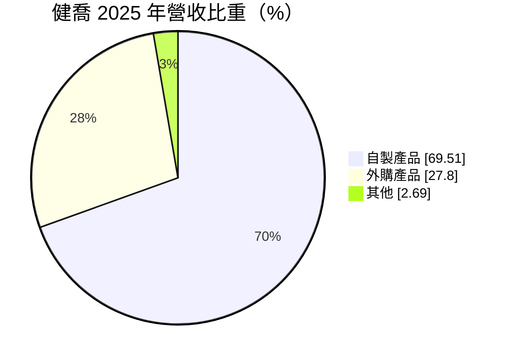
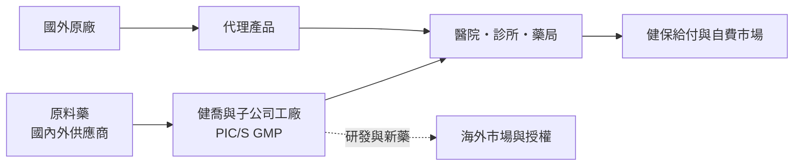
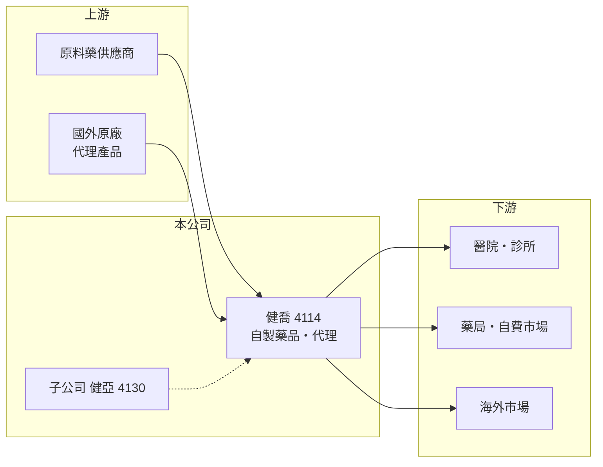

# 4114 健喬

> 上櫃｜[[產業索引-生技醫療業|生技醫療業]]｜上市（櫃）日期 2003/05/12

# 第一章：企業模式與商業藍圖

> [!info] 撰寫說明
> 本文由 Claude 依公開資料整理，架構比照 [[2330台積電]] 的四章研究，資料截至 2026-10-08。財務數字來源：MoneyDJ 理財網年度財務比率與公司基本資料、櫃買中心開放資料（基本資料、2026 年第二季財報、每月營收、股利）；長期計畫參考優分析新聞標題。集團關係與產品線為整理性內容，已標註待校對。#待校對

評估一家本土藥廠，要看它能否在健保藥價壓力下，靠產品組合、規模與新產品維持成長。本章說明健喬信元醫藥生技（股票代號：4114，以下簡稱健喬）的商業模式。

## 一、核心定位：以自製藥品為主的綜合藥廠

健喬成立於 1970 年，2003 年在櫃買中心掛牌，總部位於台北市內湖區，董事長兼總經理為林智暉，實收資本額約 55.0 億元，是國內規模較大的本土藥廠之一。依 MoneyDJ 資料，2025 年營收中自製產品占 69.5%、外購（代理）產品占 27.8%、其他 2.7%。

* **自製為主、代理為輔：** 七成營收來自自有工廠生產的[[學名藥]]與品牌藥，三成來自代理國外藥品。自製產品能掌握毛利，代理產品則擴大產品線與醫院通路的完整度。
* **集團化經營：** 健喬旗下有子公司[[4130健亞]]等（持股與子公司範圍待校對）。2026 年第二季權益總計約 98.7 億元中，母公司業主權益約 86.5 億元，其餘約 12 億元屬非控制權益，反映集團內有部分持股的子公司。

## 二、資本轉化邏輯

* **規模經濟：** 營收規模數十億元，能分攤業務團隊、法規與品管的固定成本。2021 至 2025 年[[毛利率]]由約 40% 提升到 43%，[[營業利益率]]由 5.7% 提升到 12.6%，顯示規模效益逐步顯現。
* **成長動能：** 依櫃買中心資料，2026 年 1 至 8 月營收約 51.0 億元，較 2025 年同期約 40.6 億元成長約 25%。

## 三、長期方向：國際化

依優分析新聞標題，健喬啟動「六年國際升級計畫」，目標 2030 年營收突破 300 億元（數字依新聞標題，範圍是否含集團與併購待校對）。國內藥價受健保控管、成長有限，往海外市場發展是本土藥廠突破規模天花板的主要路徑，但也需要長期投入法規、臨床與通路。

# 第二章：護城河深度與競爭優勢

護城河是企業抵禦競爭、長期維持超額利潤的機制。對本土藥廠而言，護城河來自產品線的廣度、醫院通路關係與製造規模，本章說明健喬的優勢與限制。

## 一、健喬護城河的核心組成要素

* **1. 產品線廣度：** 自製與代理產品並行，讓業務團隊在醫院與診所能提供完整的產品組合，提高議價與進藥的效率。
* **2. 製造規模與認證：** 自有工廠符合 PIC/S GMP，產能規模大，單位成本比小型藥廠低。
* **3. 營運效率提升：** 營業利益率五年間翻倍，代表管理團隊在費用控制與產品組合調整上有成效。

## 二、主要競爭對手格局

| 對手 | 定位 | 對健喬的影響 |
|---|---|---|
| [[1720生達]] | 綜合學名藥廠 | 醫院與診所通路直接競爭 |
| [[1734杏輝]] | 學名藥與保健品 | 部分慢性病用藥重疊 |
| [[4123晟德]] | 西藥與益生菌 | 學名藥市場競爭 |
| 跨國原廠藥 | 原廠品牌 | 專利期內與品牌藥市場佔優 |

## 三、優勢轉化：守得住與守不住的地方

* **守得住：** 2020 至 2025 年營業利益率都是正數，且大致呈上升趨勢，代表規模優勢已轉化為獲利。
* **守不住：** 國內[[健保藥價]]調整與學名藥價格競爭，使營收成長與毛利有天花板。
* **觀察重點：** 海外市場的實際營收貢獻、併購或新產品是否推升營業利益率，以及子公司的獲利改善。

# 第三章：財務體質與盈利規模

資料日期：2026-10-08。數字取自 MoneyDJ 理財網年度財務資料與櫃買中心開放資料，表格是撰寫當時的快照；最新月營收、毛利率、累計 EPS 由自動排程寫在本筆記的屬性欄位（月營收、毛利率、累計EPS 等）。#待校對

財務報表是檢驗護城河是否真實存在的最終標準。本章用五年的三率、ROE 與資本報酬，檢視健喬的獲利品質。

## 一、多年度財務表現

| 年度 | 營收（新台幣） | 每股營業額 | [[毛利率]] | [[營業利益率]] | EPS（元） | [[ROE]] |
|---|---|---|---|---|---|---|
| 2021 | 未查得 | 10.88 元 | 39.7% | 5.7% | 1.02 | 1.93% |
| 2022 | 未查得 | 13.51 元 | 41.6% | 10.3% | 2.46 | 9.71% |
| 2023 | 未查得 | 13.46 元 | 41.2% | 12.0% | 1.61 | 5.49% |
| 2024 | 未查得 | 13.21 元 | 43.3% | 13.4% | 1.63 | 5.68% |
| 2025 | 未查得 | 12.31 元 | 43.3% | 12.6% | 1.66 | 6.69% |

資料來源：MoneyDJ 理財網年度財務比率（合併報表）。以每股營業額乘目前股數推算的 2025 年營收約 68 億元，與官方 2025 年 1 至 8 月營收約 40.6 億元的年化水準（約 61 億元）有落差，可能是股本變動所致，因此營收欄寫「未查得」。2026 年上半年（櫃買中心資料）營收約 35.5 億元、毛利率約 40.4%、營業利益率約 11.5%、EPS 0.80 元。

健喬的獲利品質近年明顯改善：營業利益率由 2021 年的 5.7% 升到 2023 至 2025 年的 12% 至 13%。但 ROE 只有 5% 至 7%，原因是股東權益規模大（每股淨值約 17 元），且部分獲利歸屬非控制權益。近五年平均 ROE 約 5.9%（推算）。負債比率由 2020 年約 43% 降到 2025 年約 28%，財務結構轉為保守。依櫃買中心資料，最近一次現金股利約每股 1.65 元。

## 二、[[ROIC]] 與 [[WACC]]：價值創造利差

**ROIC 推算：** 以 2026 年上半年營業利益約 4.07 億元年化，全年約 8.1 億元，稅後約 6.5 億元（推算）。官方資料只揭露負債總計約 54.1 億元，假設五成為有息負債約 27 億元（推估），加上權益總計約 98.7 億元，投入資本約 125.7 億元，ROIC 約 5.2%（推算）。

**WACC 推算：** 台灣 10 年期公債殖利率取 1.75%、市場風險溢酬 6%、β 取醫藥同業常見值 0.9（未查得公司實際 β），股東權益成本約 7.15%。負債成本假設 2.5%，稅率 20%，稅後約 2.0%。權益約占投入資本 78%，WACC 約 6.0%（推算）。

**結論：** ROIC 約 5%，略低於 WACC 約 6%，代表健喬的本業雖然賺錢，但以目前龐大的資本基礎衡量，尚未明顯創造超額價值。若國際化計畫能在不大幅增加資本的情況下提升營收與利益率，利差才會轉正。

# 第四章：總體風險與地緣政治

任何企業都無法脫離宏觀環境獨立存在。本章分析健喬長期必須面對的政策、營運與擴張風險。

## 一、政策與市場風險

* **健保藥價調整：** 國內營收主要依賴健保給付，藥價調降會直接壓縮毛利。
* **學名藥競爭：** 原廠專利到期後，多家藥廠同時推出學名藥，價格競爭激烈。

## 二、營運環境的隱性風險

* **代理權續約：** 外購產品占營收近三成，若國外原廠收回代理權或改變合作條件，會影響營收。
* **原料藥供應：** 原料藥多仰賴進口，中國與印度供應鏈波動會影響成本與供貨。

## 三、擴張與財務風險

* **國際化執行：** 海外市場需要藥證、通路與在地團隊，投入期長，若成效不如預期，會拖累獲利率。
* **併購整合：** 集團化經營若透過併購擴大規模，需留意商譽與整合成本。

# 專有名詞解析

## 金融

- **[[ROIC]]**：投入資本報酬率，稅後營業利益除以股東權益加有息負債，衡量本業運用資本的效率。
- **[[WACC]]**：加權平均資金成本，股東與債權人要求報酬率的加權平均，是 ROIC 要超越的門檻。

## 產業

- **[[學名藥]]**：原廠藥專利到期後，由其他藥廠生產、成分與療效相同的藥品，價格通常較低。
- **[[PIC S GMP]]**：國際醫藥品稽查協約組織的藥品優良製造規範，是台灣藥廠必須符合的製造標準。
- **[[健保藥價]]**：全民健保給付藥品的價格，由主管機關核定並定期調整，直接影響國內藥廠的營收與毛利。

# 核心供應鏈

## 1. 上游：原料與代理來源
- 原料藥供應商（名稱未查得）
- 代理產品的國外原廠（名稱未查得）

## 2. 中游：健喬與同業
- 集團子公司：[[4130健亞]]（待校對）
- 國內藥廠同業：[[1720生達]]、[[1734杏輝]]、[[4123晟德]]、[[4111濟生]]

## 3. 下游：客戶
- 醫學中心、區域醫院、診所與社區藥局

## 最新新聞
<!-- news:start（自動產生，請勿手動編輯此範圍） -->
- 2026-10-07 📰 媒體 18:53｜營收速報 - 健喬(4114)9月營收7.47億元年增率高達38.69％｜[鉅亨網](https://news.cnyes.com/news/id/6623864)
- 2026-10-07 📰 媒體 18:34｜健喬Q3營收22.93億元年增近5成 旺季與新品加持助攻全年營運｜[鉅亨網](https://news.cnyes.com/news/id/6623825)

完整紀錄：[[4114健喬 新聞]]
<!-- news:end -->

## 相關連結
- [公開資訊觀測站](https://mopsov.twse.com.tw/mops/web/t05st03?step=1&firstin=1&co_id=4114)
- [Goodinfo](https://goodinfo.tw/tw/StockDetail.asp?STOCK_ID=4114)
- [Yahoo 股市](https://tw.stock.yahoo.com/quote/4114)
- [鉅亨網新聞](https://www.cnyes.com/twstock/4114/news)
