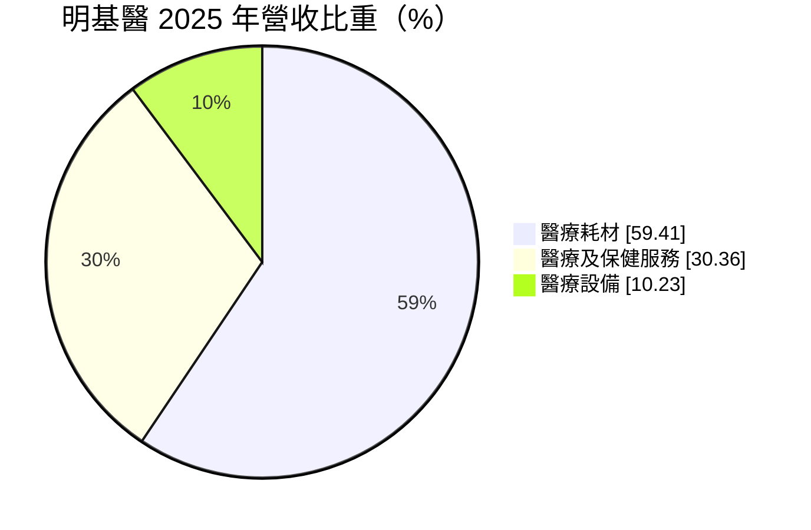
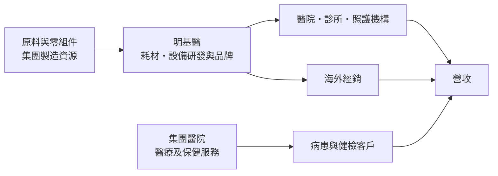
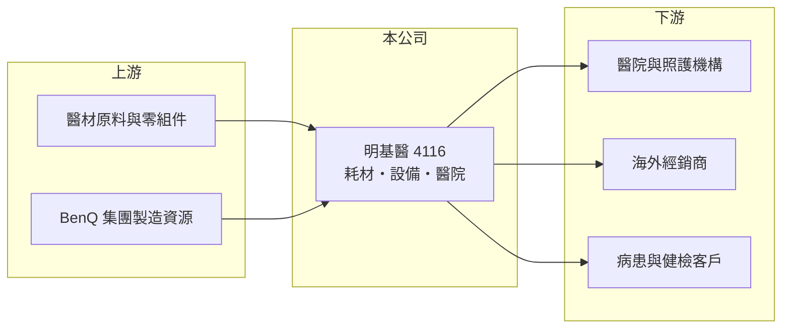

# 4116 明基醫

> 上櫃｜[[產業索引-生技醫療業|生技醫療業]]｜上市（櫃）日期 2015/12/16

# 第一章：企業模式與商業藍圖

> [!info] 撰寫說明
> 本文由 Claude 依公開資料整理，架構比照 [[2330台積電]] 的四章研究，資料截至 2026-10-08。財務數字來源：MoneyDJ 理財網年度財務比率與公司基本資料、櫃買中心開放資料（基本資料、2026 年第二季財報、每月營收、股利）。集團關係、醫院據點與 2022 年營收跳升的原因為整理性內容，已標註待校對。#待校對

評估一家醫療集團的長期價值，要先看懂它的營收從哪些環節來：賣產品、賣設備，還是提供醫療服務。本章說明明基醫（股票代號：4116，以下簡稱明基醫）的商業模式。

## 一、核心定位：BenQ 集團的醫療事業平台

明基醫成立於 1989 年，2015 年在櫃買中心掛牌，總部位於台北市內湖區，董事長為陳其宏，實收資本額約 4.5 億元，屬於[[2352佳世達]]領軍的 BenQ 集團（持股關係待校對）。依 MoneyDJ 資料，2025 年營收中[[醫療耗材]]占 59.4%、醫療及保健服務占 30.4%、醫療設備占 10.2%。

* **醫療耗材是主力：** 耗材屬於重複消費型產品，醫院與照護機構需要持續採購，營收穩定度較高。
* **醫療服務帶來規模：** 醫療及保健服務占三成，依集團公開資訊，主要來自集團在中國經營的明基醫院（南京、蘇州等，待校對）。
* **規模在 2022 年跳升：** 每股營業額由 2021 年的 32.9 元跳到 2022 年的 98.2 元，營收規模約變為三倍，反映當年集團醫療資產整併進入明基醫（整併內容待校對）。

## 二、資本轉化邏輯

* **製造與服務的組合：** 產品事業依賴研發、認證與通路，醫院事業則依賴醫師、床位與地方醫療政策，兩者的資本需求與風險完全不同。
* **槓桿較高：** 負債比率由 2020 年約 38% 升到 2025 年約 57%，反映醫院等重資產事業納入後的資本結構。

## 三、長期方向

明基醫的長期課題，是在耗材、設備與醫院三條線中找到協同效應：醫院可以成為自家產品的臨床驗證與銷售場域，產品事業則提供醫院穩定的供應。人口老化帶來的照護與耗材需求，是長期的結構性成長動能。

# 第二章：護城河深度與競爭優勢

護城河是企業抵禦競爭、長期維持超額利潤的機制。本章說明明基醫在醫療耗材、設備與醫院服務上的優勢與限制。

## 一、明基醫護城河的核心組成要素

* **1. 集團資源：** 背靠 BenQ 集團的製造、品管與全球通路經驗，在電子化醫療設備上有技術延伸的基礎。
* **2. 醫療器材認證：** 耗材與設備需要各國醫材法規認證，取得認證的產品有一定的進入門檻。
* **3. 醫院實體據點：** 醫院經營需要執照、醫師團隊與在地信任，新進者不容易短期複製。

## 二、主要競爭對手格局

| 對手 | 定位 | 對明基醫的影響 |
|---|---|---|
| [[4126太醫]] | 醫療耗材製造 | 耗材市場直接競爭 |
| [[4121優盛]] | 醫療用品零售與醫材 | 居家照護產品競爭 |
| 國際醫材大廠 | 耗材與設備 | 品牌、臨床資料與規模優勢 |

## 三、優勢轉化：守得住與守不住的地方

* **守得住：** 2020 至 2025 年營業利益率都是正數，2022 至 2025 年 ROE 介於 9% 到 20%，代表整併後的事業組合有穩定獲利能力。
* **守不住：** 營業利益率由 2023 年的 8.0% 降到 2025 年的 6.5%，而且有一半以上權益屬[[非控制權益]]，母公司股東能分到的獲利比例有限。
* **觀察重點：** 營業利益率能否回升、醫院事業的獲利變化，以及耗材在海外市場的擴張。

# 第三章：財務體質與盈利規模

資料日期：2026-10-08。數字取自 MoneyDJ 理財網年度財務資料與櫃買中心開放資料，表格是撰寫當時的快照；最新月營收、毛利率、累計 EPS 由自動排程寫在本筆記的屬性欄位（月營收、毛利率、累計EPS 等）。#待校對

財務報表是檢驗護城河是否真實存在的最終標準。本章用五年的三率、ROE 與資本報酬，檢視明基醫的獲利品質。

## 一、多年度財務表現

| 年度 | 營收（新台幣） | 每股營業額 | [[毛利率]] | [[營業利益率]] | EPS（元） | [[ROE]] |
|---|---|---|---|---|---|---|
| 2021 | 未查得 | 32.86 元 | 35.0% | 3.2% | 0.65 | 4.42% |
| 2022 | 未查得 | 98.20 元 | 28.5% | 8.0% | 4.04 | 19.92% |
| 2023 | 約 45.4 億（推算） | 101.94 元 | 29.6% | 8.0% | 2.57 | 11.09% |
| 2024 | 約 47.7 億（推算） | 106.97 元 | 30.4% | 7.0% | 2.35 | 10.59% |
| 2025 | 約 52.5 億（推算） | 117.89 元 | 32.2% | 6.5% | 1.75 | 9.40% |

資料來源：MoneyDJ 理財網年度財務比率（合併報表）；營收以每股營業額乘目前股數約 4,457 萬股推算，2021、2022 年股本可能不同，故不推算。2026 年上半年（櫃買中心資料）營收約 27.5 億元、毛利率約 32.3%、營業利益率約 5.8%、EPS 1.61 元；2026 年 1 至 8 月營收約 36.0 億元，較去年同期成長約 4.8%。

明基醫的營收在 2023 至 2025 年穩定成長，年複合成長率約 7.5%（推算），毛利率也由 29.6% 回升到 32.2%，但營業利益率反而下滑，代表營業費用增加的速度快於毛利。EPS 由 2022 年的 4.04 元逐年降到 2025 年的 1.75 元。近五年平均 ROE 約 11%（推算）。依櫃買中心資料，最近一次現金股利為每股 2.0 元。

## 二、[[ROIC]] 與 [[WACC]]：價值創造利差

**ROIC 推算：** 2025 年營業利益約 3.4 億元（營收 52.5 億元乘營業利益率 6.5%，推算），稅後約 2.7 億元。官方資料只揭露負債總計約 32.4 億元，假設四成為有息負債約 13 億元（推估），加上權益總計約 22.7 億元，投入資本約 35.7 億元，ROIC 約 7.7%（推算）。

**WACC 推算：** 台灣 10 年期公債殖利率取 1.75%、市場風險溢酬 6%、β 取醫療同業常見值 0.9（未查得公司實際 β），股東權益成本約 7.15%。負債成本假設 2.5%，稅率 20%，稅後約 2.0%。權益約占投入資本 64%，WACC 約 5.3%（推算）。

**結論：** ROIC 高於 WACC 約 2.4 個百分點，代表整體事業仍在創造價值，但利差隨營業利益率下滑而縮小。由於權益有一半屬非控制權益，母公司股東實際分到的超額報酬會比整體數字小。

# 第四章：總體風險與地緣政治

任何企業都無法脫離宏觀環境獨立存在。本章分析明基醫長期必須面對的地緣政治、法規與營運風險。

## 一、地緣政治與政策風險

* **中國醫療政策：** 醫院事業若主要在中國，會受當地醫保支付改革、集中採購與民營醫院政策影響（據點待校對）。
* **兩岸關係：** 台灣企業在中國經營醫院，面臨政策與資金匯出的不確定性。

## 二、法規與營運風險

* **醫材法規：** 歐盟 [[CE MDR]] 等新法規提高認證成本與時間，產品上市速度可能放慢。
* **價格壓力：** 醫院採購與各國集中採購會壓低耗材價格。

## 三、財務風險

* **負債比率偏高：** 負債比率接近六成，醫院擴建或設備投資若再增加，財務彈性會下降。
* **少數股權比重高：** 合併報表的營收與獲利，有相當比例不歸母公司股東。

# 專有名詞解析

## 金融

- **[[非控制權益]]**：合併報表中，子公司不屬於母公司持有的那部分權益，對應的獲利不歸母公司股東。
- **[[ROIC]]**：投入資本報酬率，稅後營業利益除以股東權益加有息負債，衡量本業運用資本的效率。
- **[[WACC]]**：加權平均資金成本，股東與債權人要求報酬率的加權平均，是 ROIC 要超越的門檻。

## 產業

- **[[醫療耗材]]**：使用一次或短期使用後即丟棄的醫療用品，例如針筒、管路、敷料，需求重複且穩定。
- **[[CE MDR]]**：歐盟醫療器材法規，2021 年起全面取代舊指令，對臨床證據與上市後監督要求更嚴格。

# 核心供應鏈

## 1. 上游：原料與集團資源
- 醫材原料與零組件供應商（名稱未查得）
- 集團關係企業：[[2352佳世達]]（待校對）

## 2. 中游：明基醫與同業
- 醫療耗材同業：[[4126太醫]]、[[4121優盛]]

## 3. 下游：客戶
- 醫院、診所、長照機構、海外經銷商與醫院就診病患

## 最新新聞
<!-- news:start -->
<!-- news:end -->

## 相關連結
- [公開資訊觀測站](https://mopsov.twse.com.tw/mops/web/t05st03?step=1&firstin=1&co_id=4116)
- [Goodinfo](https://goodinfo.tw/tw/StockDetail.asp?STOCK_ID=4116)
- [Yahoo 股市](https://tw.stock.yahoo.com/quote/4116)
- [鉅亨網新聞](https://www.cnyes.com/twstock/4116/news)
