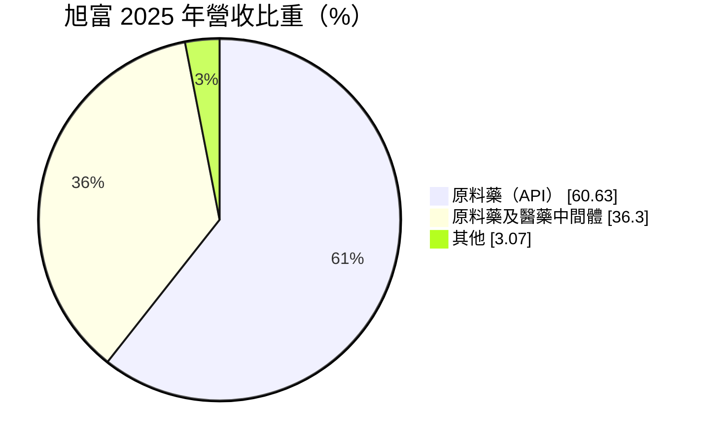
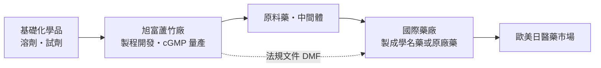
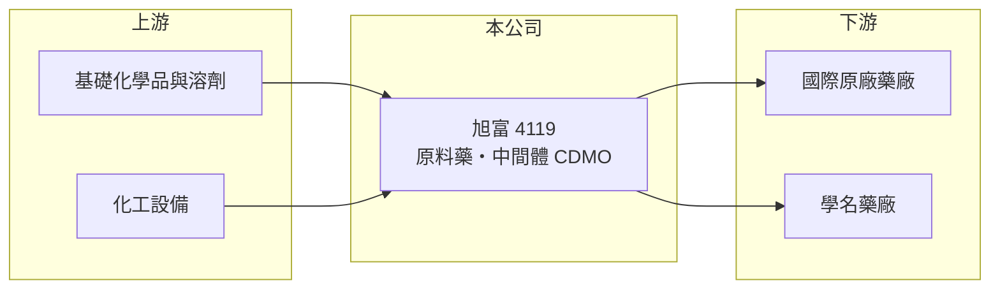

# 4119 旭富

> 上市｜[[產業索引-生技醫療業|生技醫療業]]｜上市（櫃）日期 2004/01/07

# 第一章：企業模式與商業藍圖

> [!info] 撰寫說明
> 本文由 Claude 依公開資料整理，架構比照 [[2330台積電]] 的四章研究，資料截至 2026-10-08。財務數字來源：MoneyDJ 理財網年度財務比率與公司基本資料、證交所開放資料（基本資料、2026 年第二季財報、每月營收、股利）；業務描述參考 Yahoo 股市與旺得富（中時）新聞標題。客戶與產品品項未逐項查證。#待校對

原料藥廠位在製藥產業的最上游，它的長期價值取決於化學合成技術、法規認證，以及能否被國際藥廠長期採用。本章說明旭富製藥科技（股票代號：4119，以下簡稱旭富）的商業模式。

## 一、核心定位：替國際藥廠生產原料藥與中間體

旭富成立於 1987 年，2004 年上市，工廠位於桃園市蘆竹區，董事長為翁維駿，實收資本額約 12.0 億元。依 MoneyDJ 資料，2025 年營收中[[原料藥]]（API）占 60.6%、原料藥及醫藥中間體占 36.3%、其他 3.1%。

* **[[CDMO]] 型態：** 旭富的客戶主要是國外藥廠，依客戶委託開發製程並量產原料藥或中間體。這類生意的特色是「開發期長、量產期也長」，一旦藥品上市並登錄原料藥來源，客戶不會輕易更換供應商。
* **新產品帶動成長：** 依 2025 年新聞標題，旭富 2025 年成長主要靠新產品驅動，營收目標年增二成。實際 2025 年營收以每股營業額推算約 13.4 億元，較 2024 年約 15.2 億元反而下滑，目標未達成（推算）。

## 二、資本轉化邏輯

* **重資產：** 2026 年第二季底總資產約 69.3 億元，其中流動資產只有約 10.6 億元，其餘近 59 億元為非流動資產，代表公司在廠房、設備或長期投資上投入很多（細項未查得）。相對於每年十幾億元的營收，資產周轉率很低。
* **法規文件是資產：** 原料藥要供應歐美市場，需向主管機關登錄[[DMF]]並通過稽查。每一份通過的文件，都是客戶持續下單的基礎。

## 三、長期方向

旭富的長期成長取決於新分子的接案數量，以及大型新產能的產能利用率。若新產能能逐步填滿，龐大的資產基礎才會轉化為營收與獲利；若接單不足，折舊就會壓低毛利率，這也是 2025 年以來毛利率下滑的可能原因之一（推估）。

# 第二章：護城河深度與競爭優勢

護城河是企業抵禦競爭、長期維持超額利潤的機制。對原料藥廠而言，護城河主要來自法規認證、製程技術與客戶轉換成本，本章說明旭富的優勢與限制。

## 一、旭富護城河的核心組成要素

* **1. 客戶轉換成本：** 藥品上市時就登記了原料藥來源，客戶若要更換供應商，必須重新申請變更並做比對試驗，耗時又花錢，因此合作關係通常持續多年。
* **2. 製程化學能力：** 複雜分子的多步驟合成需要專業的化學與放大生產經驗，這是長期累積的技術門檻。
* **3. 國際稽查紀錄：** 通過歐美主管機關稽查的工廠，是國際藥廠篩選供應商的基本條件。

## 二、主要競爭對手格局

| 對手 | 定位 | 對旭富的影響 |
|---|---|---|
| [[4746台耀]] | 原料藥與 CDMO | 同為台灣原料藥廠，爭取國際客戶 |
| [[1789神隆]] | 高活性原料藥 | 技術層次與國際客戶基礎相近 |
| 印度、中國原料藥廠 | 大量生產低價原料藥 | 價格競爭壓力大 |

## 三、優勢轉化：守得住與守不住的地方

* **守得住：** 2021 至 2025 年營業利益率都維持在 8.5% 到 13.3%，代表 CDMO 客戶關係穩定。
* **守不住：** 毛利率由 2022 年的 32.4% 降到 2025 年的 26.1%，2026 年上半年再降到 21.2%，價格或產能利用率面臨壓力。
* **觀察重點：** 新產品的量產進度、新產能的利用率，以及毛利率能否回升。

# 第三章：財務體質與盈利規模

資料日期：2026-10-08。數字取自 MoneyDJ 理財網年度財務資料與證交所開放資料，表格是撰寫當時的快照；最新月營收、毛利率、累計 EPS 由自動排程寫在本筆記的屬性欄位（月營收、毛利率、累計EPS 等）。#待校對

財務報表是檢驗護城河是否真實存在的最終標準。本章用五年的三率、ROE 與資本報酬，檢視旭富的獲利品質。

## 一、多年度財務表現

| 年度 | 營收（新台幣） | [[毛利率]] | [[營業利益率]] | 稅後淨利率 | EPS（元） | [[ROE]] |
|---|---|---|---|---|---|---|
| 2021 | 未查得 | 24.1% | 8.5% | 6.4% | 0.58 | 1.68% |
| 2022 | 未查得 | 32.4% | 13.2% | 34.3% | 3.24 | 8.89% |
| 2023 | 約 12.0 億（推算） | 29.1% | 13.3% | 24.5% | 2.70 | 6.75% |
| 2024 | 約 15.2 億（推算） | 27.0% | 13.0% | 35.1% | 4.47 | 10.11% |
| 2025 | 約 13.4 億（推算） | 26.1% | 11.6% | 8.0% | 0.90 | 1.98% |

資料來源：MoneyDJ 理財網年度財務比率；營收以每股營業額乘目前股數約 1.195 億股推算，2020 年每股營業額 33.83 元與之後落差很大，推測股本曾變動，故 2021 年以前不推算。2026 年上半年（證交所資料）營收約 6.49 億元、毛利率約 21.2%、營業利益率約 6.6%、業外損失約 0.26 億元、EPS 0.06 元。

旭富的稅後淨利率在 2022 至 2024 年遠高於營業利益率，代表這幾年獲利有很大比例來自業外（可能是投資或資產處分利益，細項未查得），本業的貢獻相對有限。近五年平均 ROE 約 5.9%（推算）。每股淨值約 44 元，股東權益規模大，即使本業穩定賺錢，ROE 也不容易高。依證交所資料，2025 年度現金股利每股 0.75 元。

## 二、[[ROIC]] 與 [[WACC]]：價值創造利差

**ROIC 推算：** 2025 年營業利益約 1.55 億元（營收 13.4 億元乘營業利益率 11.6%，推算），稅後約 1.24 億元。官方資料只揭露負債總計約 16.2 億元，假設五成為有息負債約 8.1 億元（推估），加上權益約 53.1 億元，投入資本約 61.2 億元，ROIC 約 2.0%（推算）。

**WACC 推算：** 台灣 10 年期公債殖利率取 1.75%、市場風險溢酬 6%、β 取同業常見值 1.0（未查得公司實際 β），股東權益成本約 7.75%。負債成本假設 2.5%，稅率 20%，稅後約 2.0%。權益約占投入資本 87%，WACC 約 7.0%（推算）。

**結論：** ROIC 約 2%，明顯低於 WACC 約 7%，代表以目前的資本規模，本業尚未創造價值。差距主要來自龐大的非流動資產尚未轉化為營收。若新產能能被新客戶與新產品填滿，資產周轉率提升後 ROIC 才有機會接近或超過 WACC。

# 第四章：總體風險與地緣政治

任何企業都無法脫離宏觀環境獨立存在。本章分析旭富長期必須面對的產業、營運與匯率風險。

## 一、產業週期與競爭風險

* **客戶藥品生命週期：** 原料藥的需求跟著下游藥品走，若客戶藥品專利到期、銷量下滑或臨床失敗，訂單就會減少。
* **亞洲低價競爭：** 印度與中國原料藥廠產能大、成本低，對成熟品項的價格壓力持續存在。

## 二、營運環境的隱性風險

* **稽查風險：** 若國外主管機關稽查發現缺失，可能被發出警告信，影響供貨資格。
* **環保與工安：** 化學合成涉及溶劑與危險物質，環保法規趨嚴會提高成本，工安事故的衝擊也大。
* **產能利用率：** 重資產結構下，產能利用率不足時折舊會壓低毛利率。

## 三、其他風險

* **匯率：** 客戶以國外藥廠為主，營收多以外幣計價，新台幣升值會壓縮營收與毛利。
* **客戶集中：** CDMO 客戶數通常不多，單一大客戶的訂單變化影響很大（客戶名單未查得）。

# 專有名詞解析

## 金融

- **[[ROIC]]**：投入資本報酬率，稅後營業利益除以股東權益加有息負債，衡量本業運用資本的效率。
- **[[WACC]]**：加權平均資金成本，股東與債權人要求報酬率的加權平均，是 ROIC 要超越的門檻。

## 產業

- **[[原料藥]]**：藥品中具有療效的活性成分（API），由原料藥廠生產後賣給製劑廠做成藥品。
- **[[CDMO]]**：委託開發暨製造服務，替藥廠開發製程並量產藥品或原料藥，本身不賣自有品牌。
- **[[DMF]]**：藥物主檔案，原料藥廠向主管機關登錄的製程與品質文件，藥廠申請藥證時會引用。

# 核心供應鏈

## 1. 上游：化學原料與設備
- 基礎化學品、溶劑與試劑供應商（名稱未查得）

## 2. 中游：旭富與同業
- 台灣原料藥同業：[[4746台耀]]、[[1789神隆]]

## 3. 下游：客戶
- 歐美日國際藥廠與學名藥廠（客戶名單未查得）

## 最新新聞
<!-- news:start（自動產生，請勿手動編輯此範圍） -->
- 2026-10-08 📰 媒體 19:51｜營收速報 - 旭富(4119)9月營收1.63億元年增率高達33.05％｜[鉅亨網](https://news.cnyes.com/news/id/6625879)

完整紀錄：[[4119旭富 新聞]]
<!-- news:end -->

## 相關連結
- [公開資訊觀測站](https://mopsov.twse.com.tw/mops/web/t05st03?step=1&firstin=1&co_id=4119)
- [Goodinfo](https://goodinfo.tw/tw/StockDetail.asp?STOCK_ID=4119)
- [Yahoo 股市](https://tw.stock.yahoo.com/quote/4119)
- [鉅亨網新聞](https://www.cnyes.com/twstock/4119/news)
