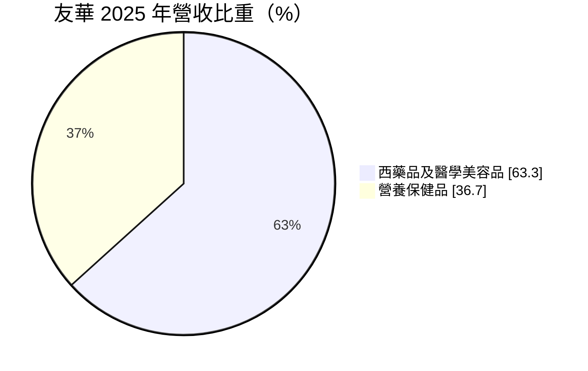
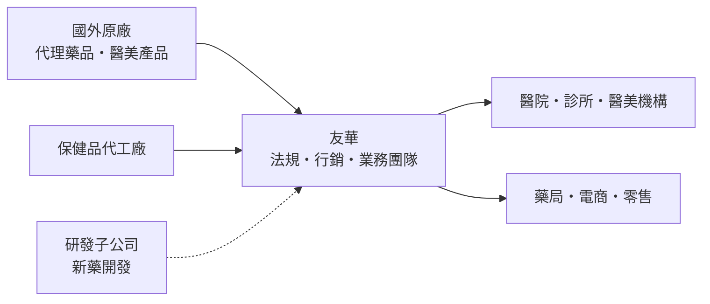
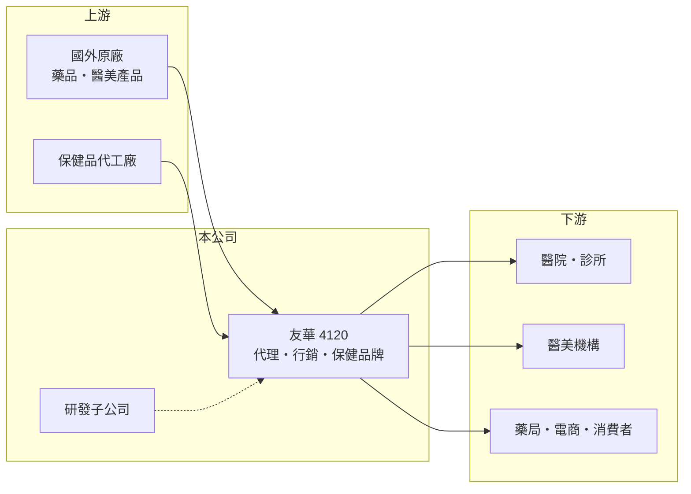

# 4120 友華

> 上櫃｜[[產業索引-生技醫療業|生技醫療業]]｜上市（櫃）日期 2003/11/05

# 第一章：企業模式與商業藍圖

> [!info] 撰寫說明
> 本文由 Claude 依公開資料整理，架構比照 [[2330台積電]] 的四章研究，資料截至 2026-10-08。財務數字來源：MoneyDJ 理財網年度財務比率與公司基本資料、櫃買中心開放資料（基本資料、2026 年第二季財報、每月營收、股利）。子公司與研發項目為整理性內容，已標註待校對。#待校對

評估一家藥品代理與保健品公司，要看它靠什麼通路賺錢、毛利從哪裡來，以及費用是否吃掉了毛利。本章說明友華生技醫藥（股票代號：4120，以下簡稱友華）的商業模式。

## 一、核心定位：藥品、醫美與營養保健品的行銷平台

友華成立於 1982 年，2003 年在櫃買中心掛牌，總部位於台北市北投區，董事長為蔡正弘，實收資本額約 8.7 億元。依 MoneyDJ 資料，2025 年營收中西藥品及醫學美容品占 63.3%、[[營養保健品]]占 36.7%。

* **高毛利的通路生意：** 友華的毛利率長期在 43% 至 49% 之間，在國內藥廠中屬於偏高，反映它以代理國外品牌藥、醫美產品與自有保健品牌為主，靠行銷與通路創造價值。
* **費用吃掉毛利：** 2026 年上半年營收約 23.4 億元、毛利約 11.6 億元，但營業費用約 12.6 億元，反而超過毛利，造成營業虧損。代表公司的行銷、研發或管理費用結構偏重。
* **研發子公司：** 集團內有從事新藥研發的子公司（如友霖生技，待校對），研發費用是合併報表虧損的來源之一。

## 二、資本轉化邏輯

* **輕製造、重行銷：** 主要價值在於取得好的代理權、經營醫師關係與消費者品牌，因此人事與行銷費用占比高。
* **資產結構：** 2026 年第二季底總資產約 117.5 億元，負債約 54.1 億元，權益約 63.4 億元，其中母公司業主權益約 52.3 億元，每股淨值約 60 元。

## 三、長期方向

友華的長期課題，是讓龐大的通路毛利重新轉化為營業利益。保健品與醫美屬於自費市場，受人口老化與健康意識提升支撐，成長空間比受健保管制的處方藥大。若研發投入能產生授權或上市產品，也能改善獲利；反之，研發支出會持續拖累損益。

# 第二章：護城河深度與競爭優勢

護城河是企業抵禦競爭、長期維持超額利潤的機制。友華的護城河主要來自代理權與通路關係，本章說明它的優勢與限制。

## 一、友華護城河的核心組成要素

* **1. 代理權與產品組合：** 長期代理國外品牌藥與醫美產品，累積原廠信任，取得新代理權的機會也較高。
* **2. 醫師與通路關係：** 醫院、診所與醫美機構的業務網絡需要多年經營，新進者不容易短期建立。
* **3. 毛利率水準：** 近五年毛利率維持在 43% 至 49%，說明產品本身有定價能力。

## 二、主要競爭對手格局

| 對手 | 定位 | 對友華的影響 |
|---|---|---|
| [[4114健喬]] | 自製與代理藥品 | 醫院通路競爭 |
| [[4123晟德]] | 西藥與益生菌 | 保健品與處方藥都有重疊 |
| [[1734杏輝]] | 學名藥與保健品 | 保健品市場競爭 |
| 國際醫美品牌直營 | 原廠自行在台銷售 | 可能收回代理權 |

## 三、優勢轉化：守得住與守不住的地方

* **守得住：** 高毛利率顯示產品組合仍有競爭力。
* **守不住：** 2020 至 2025 年營業利益率在負 6.8% 到正 2.2% 之間，2024 至 2025 年連續營業虧損，護城河沒有轉化為股東報酬。
* **觀察重點：** 營業費用率能否下降、研發子公司的投入與成果，以及代理權是否穩定續約。

# 第三章：財務體質與盈利規模

資料日期：2026-10-08。數字取自 MoneyDJ 理財網年度財務資料與櫃買中心開放資料，表格是撰寫當時的快照；最新月營收、毛利率、累計 EPS 由自動排程寫在本筆記的屬性欄位（月營收、毛利率、累計EPS 等）。#待校對

財務報表是檢驗護城河是否真實存在的最終標準。本章用五年的三率、ROE 與資本報酬，檢視友華的獲利品質。

## 一、多年度財務表現

| 年度 | 營收（新台幣） | [[毛利率]] | [[營業利益率]] | EPS（元） | [[ROE]] |
|---|---|---|---|---|---|
| 2021 | 未查得 | 45.1% | -2.0% | 1.39 | 2.02% |
| 2022 | 未查得 | 43.0% | -3.2% | -3.58 | -8.57% |
| 2023 | 約 45.9 億（推算） | 46.8% | 1.5% | 1.66 | 4.45% |
| 2024 | 約 43.9 億（推算） | 47.1% | -0.2% | -3.27 | -4.63% |
| 2025 | 約 46.0 億（推算） | 48.7% | -6.8% | -6.54 | -7.29% |

資料來源：MoneyDJ 理財網年度財務比率（合併報表）；營收以每股營業額乘目前股數約 8,675 萬股推算，與官方 2025 年 1 至 8 月營收約 30.0 億元的年化水準相符。2026 年上半年（櫃買中心資料）營收約 23.4 億元、毛利率約 49.4%、營業虧損約 1.04 億元、EPS 負 2.40 元。

友華的營收規模多年持平在 44 億至 46 億元，沒有明顯成長；毛利率逐年提升，但營業利益率反而惡化，2025 年 EPS 負 6.54 元是近年最差。近五年平均 ROE 約負 2.8%（推算）。值得注意的是，依櫃買中心資料，最近一次現金股利仍有每股 4.0 元，在虧損年度配息，代表股利來源可能是過去累積的保留盈餘或資本公積（未查證），這種配息方式長期不可持續。負債比率由 2022 年約 67% 降到 2025 年約 40%。

## 二、[[ROIC]] 與 [[WACC]]：價值創造利差

**ROIC 推算：** 2025 年營業虧損約 3.1 億元（營收 46.0 億元乘營業利益率負 6.8%，推算），虧損年度不計稅盾。官方資料只揭露負債總計約 54.1 億元，假設五成為有息負債約 27 億元（推估），加上權益總計約 63.4 億元，投入資本約 90.4 億元，ROIC 約負 3.4%（推算）。

**WACC 推算：** 台灣 10 年期公債殖利率取 1.75%、市場風險溢酬 6%、β 取醫藥同業常見值 0.9（未查得公司實際 β），股東權益成本約 7.15%。負債成本假設 2.5%，稅率 20%，稅後約 2.0%。權益約占投入資本 70%，WACC 約 5.6%（推算）。

**結論：** ROIC 為負，低於 WACC 約 9 個百分點，代表公司目前正在消耗資本。虧損主要來自費用結構與研發投入，而不是產品毛利不足。若能控制費用或讓研發產出收入，ROIC 有回到正值的空間；否則高毛利也無法轉化為股東價值。

# 第四章：總體風險與地緣政治

任何企業都無法脫離宏觀環境獨立存在。本章分析友華長期必須面對的代理、法規與財務風險。

## 一、代理與市場風險

* **代理權流失：** 國外原廠可能在台設立分公司直營，或改由其他代理商經銷，造成營收突然下滑。
* **自費市場競爭：** 醫美與保健品屬於自費消費，品牌眾多，景氣轉差時消費者容易減少支出。

## 二、法規與研發風險

* **保健食品與醫美法規：** 廣告用語、成分標示與醫美器材管理趨嚴，會限制行銷方式。
* **研發失敗：** 研發子公司的新藥若臨床失敗或授權不順，前期投入將難以回收。

## 三、財務風險

* **連續虧損：** 2024 至 2025 年營業虧損擴大，若持續，會侵蝕股東權益。
* **配息可持續性：** 虧損年度仍配發現金股利，若獲利未改善，未來配息可能下降。

# 專有名詞解析

## 金融

- **[[非控制權益]]**：合併報表中，子公司不屬於母公司持有的那部分權益，對應的獲利不歸母公司股東。
- **[[ROIC]]**：投入資本報酬率，稅後營業利益除以股東權益加有息負債，衡量本業運用資本的效率。
- **[[WACC]]**：加權平均資金成本，股東與債權人要求報酬率的加權平均，是 ROIC 要超越的門檻。

## 產業

- **[[營養保健品]]**：以補充營養為訴求、在藥局與通路銷售的保健產品，屬自費市場。
- **[[新藥]]**：含有新成分、新療效或新給藥途徑的藥品，需完成完整臨床試驗才能取得上市許可。

# 核心供應鏈

## 1. 上游：代理來源與代工
- 國外原廠藥與醫美品牌（名稱未查得）
- 保健品代工廠（名稱未查得）

## 2. 中游：友華與同業
- 藥品與保健品同業：[[4114健喬]]、[[4123晟德]]、[[1734杏輝]]

## 3. 下游：客戶
- 醫院、診所、醫美機構、藥局與電商通路的消費者

## 最新新聞
<!-- news:start -->
<!-- news:end -->

## 相關連結
- [公開資訊觀測站](https://mopsov.twse.com.tw/mops/web/t05st03?step=1&firstin=1&co_id=4120)
- [Goodinfo](https://goodinfo.tw/tw/StockDetail.asp?STOCK_ID=4120)
- [Yahoo 股市](https://tw.stock.yahoo.com/quote/4120)
- [鉅亨網新聞](https://www.cnyes.com/twstock/4120/news)
