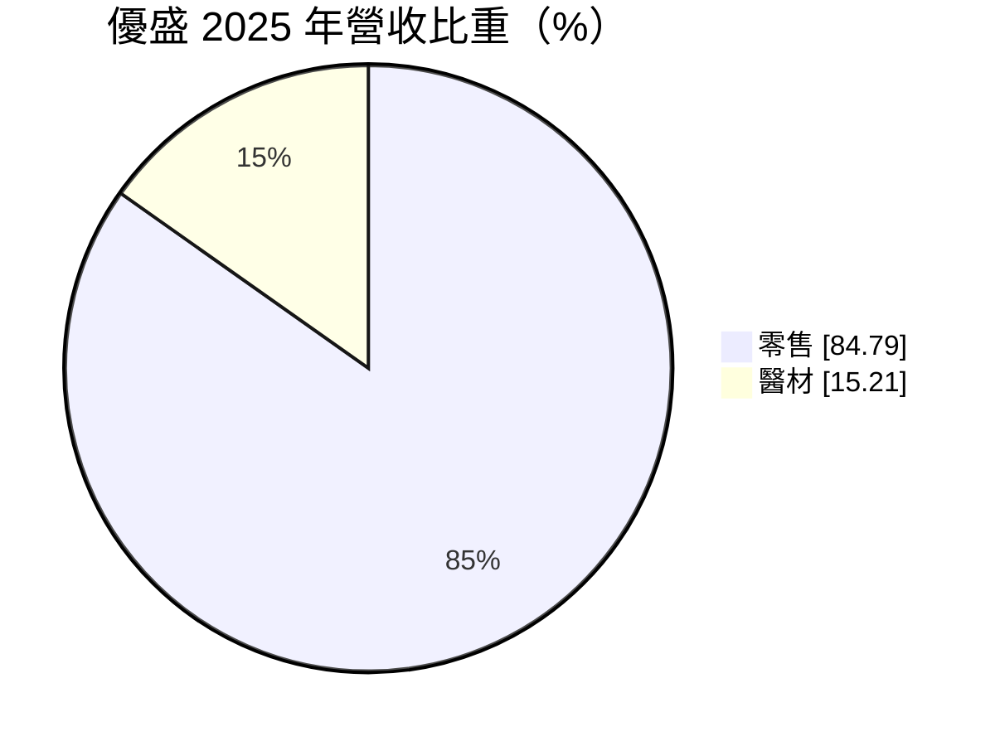
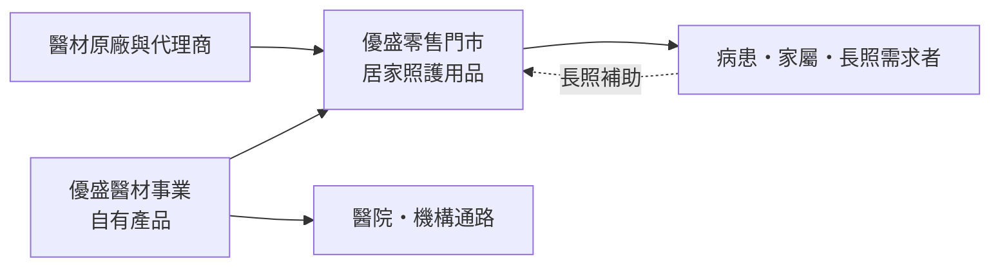
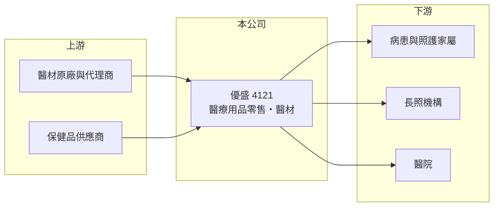

# 4121 優盛

> 上櫃｜[[產業索引-生技醫療業|生技醫療業]]｜上市（櫃）日期 2003/07/25

# 第一章：企業模式與商業藍圖

> [!info] 撰寫說明
> 本文由 Claude 依公開資料整理，架構比照 [[2330台積電]] 的四章研究，資料截至 2026-10-08。財務數字來源：MoneyDJ 理財網年度財務比率與公司基本資料、櫃買中心開放資料（基本資料、2026 年第二季財報、每月營收、股利）。零售通路品牌與醫材產品為整理性內容，已標註待校對。公開資料有限。#待校對

評估一家以零售為主的醫療用品公司，關鍵在於門市網絡能否帶來足夠的坪效，以及自有醫材能否提高毛利。本章說明優盛醫學科技（股票代號：4121，以下簡稱優盛）的商業模式。

## 一、核心定位：醫療用品零售通路加醫材製造

優盛成立於 1988 年，2003 年在櫃買中心掛牌，總部位於台北市內湖區，董事長為劉志平，實收資本額約 8.3 億元。依 MoneyDJ 資料，2025 年營收中零售占 84.8%、醫材占 15.2%。

* **[[醫療用品零售]]是主體：** 優盛的營收主要來自醫療用品連鎖門市（依整理性資料為「維康醫療用品」等通路，待校對），銷售輪椅、護具、居家照護用品與保健產品。這是一門靠門市數量、地點與專業服務取勝的生意。
* **醫材提供較高毛利：** 醫材事業占營收約一成五，自有產品的毛利通常高於轉售商品，是改善整體獲利的關鍵。

## 二、資本轉化邏輯

* **門市是主要資產：** 零售業需要租金、人力與庫存，固定費用高，營收成長若跟不上費用成長，就會出現營業虧損。
* **資本結構：** 2026 年第二季底總資產約 40.0 億元，負債約 20.9 億元，負債比率約五成，與零售業的租賃負債與應付帳款結構一致。權益總計約 19.1 億元中，母公司業主權益約 13.8 億元，其餘屬[[非控制權益]]，代表零售通路可能由持股未達百分之百的子公司經營（待校對）。

## 三、長期方向

台灣人口快速老化，[[長照]]需求與居家照護用品市場持續擴大，政府的長照輔具補助也帶動購買。優盛的長期機會在於把門市網絡變成居家照護的服務據點，並提高自有醫材的比重，讓營收成長轉化為利潤。

# 第二章：護城河深度與競爭優勢

護城河是企業抵禦競爭、長期維持超額利潤的機制。對醫療用品零售商而言，護城河主要來自門市密度與專業服務，本章說明優盛的優勢與限制。

## 一、優盛護城河的核心組成要素

* **1. 門市網絡：** 醫療用品的購買者多半是急需照護的家屬，就近、即時取得很重要，門市密度本身就是競爭力。
* **2. 專業服務：** 輔具挑選、尺寸調整與長照補助申請需要專業人員協助，這是電商不容易完全取代的部分。
* **3. 醫材自有產品：** 製造與零售整合，可以把自有醫材放進自家通路，提高毛利。

## 二、主要競爭對手格局

| 對手 | 定位 | 對優盛的影響 |
|---|---|---|
| 大樹、杏一等連鎖藥局與醫療用品店 | 藥局與醫療用品零售 | 門市與產品高度重疊 |
| 電商平台 | 線上銷售照護用品 | 價格透明，壓縮標準品毛利 |
| [[4116明基醫]] | 醫療耗材 | 醫材產品競爭 |

## 三、優勢轉化：守得住與守不住的地方

* **守得住：** 營收規模穩定在 37 億至 38 億元，代表通路需求穩定，毛利率長期維持在 33% 至 35%。
* **守不住：** 營業利益率由 2022 年的 6.0% 降到 2024 至 2025 年的約負 2%，代表費用成長快於毛利，獲利能力明顯轉弱。
* **觀察重點：** 門市調整與費用控制成效、自有醫材比重，以及長照政策帶來的需求成長。

# 第三章：財務體質與盈利規模

資料日期：2026-10-08。數字取自 MoneyDJ 理財網年度財務資料與櫃買中心開放資料，表格是撰寫當時的快照；最新月營收、毛利率、累計 EPS 由自動排程寫在本筆記的屬性欄位（月營收、毛利率、累計EPS 等）。#待校對

財務報表是檢驗護城河是否真實存在的最終標準。本章用五年的三率、ROE 與資本報酬，檢視優盛的獲利品質。

## 一、多年度財務表現

| 年度 | 營收（新台幣） | [[毛利率]] | [[營業利益率]] | EPS（元） | [[ROE]] |
|---|---|---|---|---|---|
| 2021 | 未查得 | 32.8% | 3.4% | 1.35 | 7.42% |
| 2022 | 未查得 | 34.7% | 6.0% | 2.01 | 11.65% |
| 2023 | 約 37.3 億（推算） | 33.4% | 0.1% | -0.08 | 0.03% |
| 2024 | 約 37.5 億（推算） | 34.7% | -2.0% | -0.34 | -2.79% |
| 2025 | 約 38.2 億（推算） | 34.4% | -1.9% | -0.36 | -3.37% |

資料來源：MoneyDJ 理財網年度財務比率（合併報表）；營收以每股營業額乘目前股數約 8,311 萬股推算，與官方 2025 年 1 至 8 月營收約 25.5 億元的年化水準相符。2026 年上半年（櫃買中心資料）營收約 18.9 億元、毛利率約 33.8%、營業虧損約 0.48 億元、EPS 負 0.32 元。

優盛的財務呈現「營收穩、毛利穩、費用升」的型態：毛利率五年都在 33% 至 35%，但營業利益率從 2022 年高點一路下滑，2023 年起 EPS 連三年為負。近五年平均 ROE 約 2.6%（推算），營收在 2023 至 2025 年幾乎沒有成長。依櫃買中心資料，目前未配發現金股利。

## 二、[[ROIC]] 與 [[WACC]]：價值創造利差

**ROIC 推算：** 2025 年營業虧損約 0.73 億元（營收 38.2 億元乘營業利益率負 1.9%，推算），虧損年度不計稅盾。官方資料只揭露負債總計約 20.9 億元，假設四成為有息負債約 8.4 億元（推估，包含租賃負債），加上權益總計約 19.1 億元，投入資本約 27.5 億元，ROIC 約負 2.7%（推算）。

**WACC 推算：** 台灣 10 年期公債殖利率取 1.75%、市場風險溢酬 6%、β 取零售同業常見值 0.9（未查得公司實際 β），股東權益成本約 7.15%。負債成本假設 2.5%，稅率 20%，稅後約 2.0%。權益約占投入資本 70%，WACC 約 5.6%（推算）。

**結論：** ROIC 為負，低於 WACC 約 8 個百分點，代表近年公司在消耗資本。若回到 2022 年約 6% 的營業利益率，ROIC 推估可達 6% 至 7%，略高於 WACC。因此關鍵不在營收，而在費用結構能否回到過去的水準。

# 第四章：總體風險與地緣政治

任何企業都無法脫離宏觀環境獨立存在。本章分析優盛長期必須面對的零售、政策與營運風險。

## 一、市場與競爭風險

* **電商衝擊：** 標準化的照護用品容易在網路比價，實體門市的價格與毛利會受壓。
* **連鎖藥局擴張：** 大型連鎖藥局加碼醫療用品品類，直接搶奪相同客群。

## 二、政策風險

* **長照補助制度：** 輔具與居家照護的需求部分依賴政府補助，補助項目或金額調整會影響銷售。
* **醫材法規：** 醫療器材管理法規趨嚴，自有醫材的認證與上市成本上升。

## 三、營運環境的隱性風險

* **人力與租金：** 零售業對基本工資與店租敏感，成本上升難以完全轉嫁。
* **存貨管理：** 輔具品項多、單價差異大，存貨週轉不佳會造成跌價損失。

# 專有名詞解析

## 應用

- **[[醫療用品零售]]**：銷售輪椅、護具、居家照護與醫療耗材的實體或線上通路。

## 金融

- **[[非控制權益]]**：合併報表中，子公司不屬於母公司持有的那部分權益，對應的獲利不歸母公司股東。
- **[[ROIC]]**：投入資本報酬率，稅後營業利益除以股東權益加有息負債，衡量本業運用資本的效率。
- **[[WACC]]**：加權平均資金成本，股東與債權人要求報酬率的加權平均，是 ROIC 要超越的門檻。

## 產業

- **[[長照]]**：長期照顧，提供失能者與高齡者日常生活照護的服務體系，政府提供輔具與照護補助。

# 核心供應鏈

## 1. 上游：商品來源
- 醫材原廠、代理商與保健品供應商（名稱未查得）

## 2. 中游：優盛與同業
- 醫療耗材與照護同業：[[4116明基醫]]、[[4126太醫]]

## 3. 下游：客戶
- 居家照護需求者、長照機構與醫院

## 最新新聞
<!-- news:start -->
<!-- news:end -->

## 相關連結
- [公開資訊觀測站](https://mopsov.twse.com.tw/mops/web/t05st03?step=1&firstin=1&co_id=4121)
- [Goodinfo](https://goodinfo.tw/tw/StockDetail.asp?STOCK_ID=4121)
- [Yahoo 股市](https://tw.stock.yahoo.com/quote/4121)
- [鉅亨網新聞](https://www.cnyes.com/twstock/4121/news)
