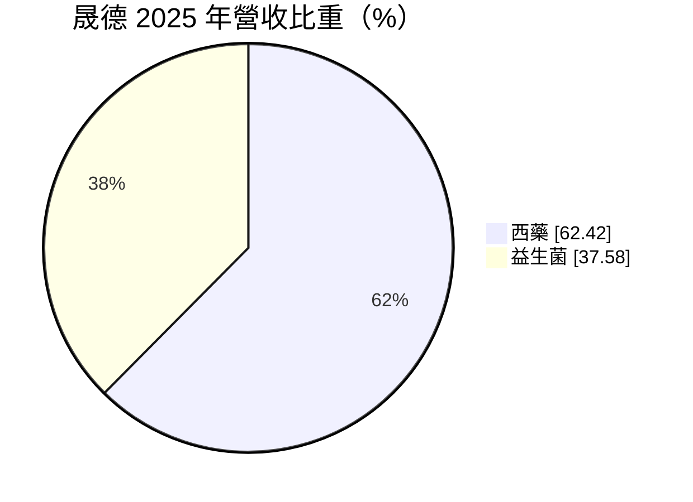
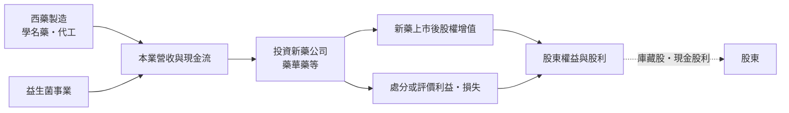
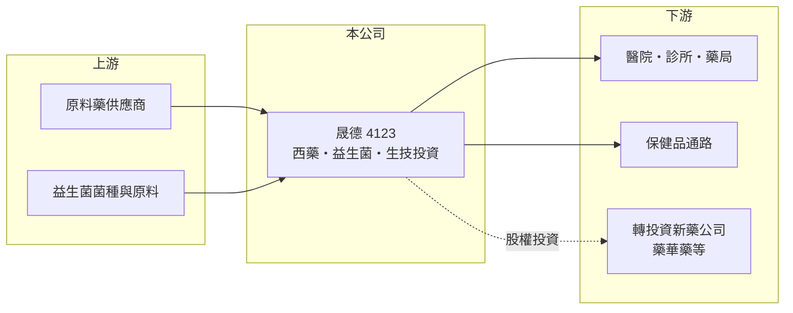

# 4123 晟德

> 上櫃｜[[產業索引-生技醫療業|生技醫療業]]｜上市（櫃）日期 2003/10/07

# 第一章：企業模式與商業藍圖

> [!info] 撰寫說明
> 本文由 Claude 依公開資料整理，架構比照 [[2330台積電]] 的四章研究，資料截至 2026-10-08。財務數字來源：MoneyDJ 理財網年度財務比率與公司基本資料、櫃買中心開放資料（基本資料、2026 年第二季財報、每月營收、股利）；2026 年上半年轉投資虧損與庫藏股參考優分析、科技新報新聞標題。轉投資名單與會計處理為整理性內容，已標註待校對。#待校對

晟德是一家同時經營藥品製造與生技投資的公司，評估它不能只看本業損益，更要看轉投資組合的價值變化。本章說明晟德大藥廠（股票代號：4123，以下簡稱晟德）的商業模式。

## 一、核心定位：老牌藥廠轉型為生技投資平台

晟德成立於 1959 年，2003 年在櫃買中心掛牌，總部位於台北市南港區，董事長為王素琦，實收資本額約 80.7 億元。依 MoneyDJ 資料，2025 年營收中西藥占 62.4%、[[益生菌]]占 37.6%。

* **本業規模小：** 2025 年營收約 16.4 億元（推算），2026 年上半年約 9.0 億元。相對於約 240 億元的總資產，本業只是公司價值的一小部分。
* **轉投資才是主體：** 晟德長年投資國內新藥公司，最具代表性的是[[6446藥華藥]]，另有其他生技公司持股（投資名單與持股比例待校對）。公司的淨值與每股盈餘，主要隨這些轉投資的價值與損益波動。

## 二、資本轉化邏輯：藥廠現金流加生技創投

* **投資收益放大損益：** 2025 年 EPS 12.33 元、ROE 約 41.9%，主要來自轉投資利益；依 2026 年新聞標題，2026 年上半年轉投資帳列虧損約百億元，EPS 負 11.24 元，但淨現金流仍達約 32 億元。顯示帳面損益受轉投資評價影響極大，與實際現金流並不同步。
* **資本配置：** 依 2026 年 8 月科技新報報導，晟德公告第四次實施[[庫藏股]]，預計買回 2 萬張，目的是轉讓給員工。

## 三、長期方向

晟德的長期價值，取決於轉投資的新藥公司能否持續放量、上市新產品，以及公司能否在適當時機回收投資並再投入下一個標的。本業的西藥與益生菌則提供穩定現金流，支撐管理費用與部分股利。

# 第二章：護城河深度與競爭優勢

護城河是企業抵禦競爭、長期維持超額利潤的機制。晟德的「護城河」不在單一產品，而在挑選與培育生技公司的能力，本章說明它的優勢與限制。

## 一、晟德護城河的核心組成要素

* **1. 生技投資眼光與網絡：** 長期投資台灣新藥公司，累積產業人脈與投資經驗，能在早期接觸到有潛力的標的。
* **2. 藥廠背景：** 擁有製造與法規經驗，能協助被投資公司處理製程、法規與商業化問題，而不只是財務投資人。
* **3. 本業現金流：** 西藥與益生菌事業提供穩定營收，讓公司不必完全依賴處分投資來維持營運。

## 二、主要競爭對手格局

| 對手 | 定位 | 對晟德的影響 |
|---|---|---|
| [[4114健喬]] | 自製學名藥與新藥 | 學名藥市場競爭 |
| [[1734杏輝]] | 學名藥、保健品與新藥投資 | 同樣經營本業並投資新藥 |
| 國內生技創投與國發基金 | 生技早期投資 | 爭取優質投資標的 |

## 三、優勢轉化：守得住與守不住的地方

* **守得住：** 成功投資案能帶來遠超本業的報酬，2020 年與 2025 年 EPS 分別達 8.5 元與 12.33 元。
* **守不住：** 投資損益波動極大，2023、2024 年 EPS 為負，2026 年上半年又出現大額帳面虧損，獲利缺乏可預測性。
* **觀察重點：** 主要轉投資的營運與股價、處分投資的時機，以及本業益生菌與西藥的成長。

# 第三章：財務體質與盈利規模

資料日期：2026-10-08。數字取自 MoneyDJ 理財網年度財務資料與櫃買中心開放資料，表格是撰寫當時的快照；最新月營收、毛利率、累計 EPS 由自動排程寫在本筆記的屬性欄位（月營收、毛利率、累計EPS 等）。#待校對

財務報表是檢驗護城河是否真實存在的最終標準。晟德的財報同時包含藥品本業與大額轉投資，本章拆開來看。

## 一、多年度財務表現

| 年度 | 營收（新台幣） | [[毛利率]] | [[營業利益率]] | EPS（元） | [[ROE]] |
|---|---|---|---|---|---|
| 2021 | 未查得 | 51.9% | -50.8% | 3.60 | 10.34% |
| 2022 | 未查得 | 52.9% | 37.0% | 0.17 | -2.85% |
| 2023 | 約 16.4 億（推算） | 44.3% | 5.6% | -1.50 | -5.31% |
| 2024 | 約 18.2 億（推算） | 46.3% | 14.5% | -1.55 | -5.77% |
| 2025 | 約 16.4 億（推算） | 41.0% | -23.9% | 12.33 | 41.86% |

資料來源：MoneyDJ 理財網年度財務比率（合併報表）；營收以每股營業額乘目前股數約 8.07 億股推算，與官方 2025 年 1 至 8 月營收約 9.9 億元的年化水準大致相符。2026 年上半年（櫃買中心資料）營收約 9.0 億元、毛利率約 45.2%、營業利益約 4.67 億元、業外損失約 106 億元、EPS 負 11.24 元。

晟德的營業利益率在負 51% 到正 37% 之間劇烈擺盪，而且 2026 年上半年營業利益高於毛利，代表部分投資相關損益或其他收益被列在營業項目內（會計分類待校對），因此營業利益率不能直接代表藥品本業的獲利能力。近五年平均 ROE 約 7.7%（推算），但標準差極大。依櫃買中心資料，最近一次現金股利約每股 2.25 元。負債比率長期在 23% 至 31%，財務結構保守。

## 二、[[ROIC]] 與 [[WACC]]：價值創造利差

**ROIC 推算：** 2025 年營業損失約 3.9 億元（營收 16.4 億元乘營業利益率負 23.9%，推算），虧損年度不計稅盾。官方資料只揭露負債總計約 68.1 億元，假設五成為有息負債約 34 億元（推估），加上權益約 171.6 億元，投入資本約 205.6 億元，ROIC 約負 1.9%（推算）。

**WACC 推算：** 台灣 10 年期公債殖利率取 1.75%、市場風險溢酬 6%、β 取生技投資類公司常見值 1.1（未查得公司實際 β），股東權益成本約 8.35%。負債成本假設 2.5%，稅率 20%，稅後約 2.0%。權益約占投入資本 83%，WACC 約 7.3%（推算）。

**結論：** 以營業利益衡量的 ROIC 為負，低於 WACC，但這個指標並不適合評估晟德。公司大部分資本投入在轉投資，價值創造主要反映在投資標的的市值變化與處分利益。比較合理的長期指標是「每股淨值的長期成長率加上累計股利」能否超過約 7% 至 8% 的股東權益成本；這需要用多年淨值資料檢驗（未查得）。

# 第四章：總體風險與地緣政治

任何企業都無法脫離宏觀環境獨立存在。本章分析晟德長期必須面對的投資、產業與營運風險。

## 一、轉投資風險

* **持股集中：** 價值高度集中在少數新藥公司，單一標的的臨床、藥證、銷售或股價變化，就能讓晟德單季損益出現百億元等級的波動。
* **評價波動：** 若投資以公允價值衡量，被投資公司股價下跌會直接反映為帳面損失，即使沒有實際賣出。

## 二、產業與政策風險

* **新藥產業週期：** 生技股的資金面與評價受全球利率與風險偏好影響大，景氣反轉時轉投資價值可能同步下修。
* **健保藥價：** 西藥本業受國內健保藥價調整影響。

## 三、營運與資本配置風險

* **獲利不可預測：** 帳面 EPS 由投資損益主導，股利政策與股價容易大起大落。
* **資本配置紀律：** 庫藏股、配息與新投資之間的取捨，決定長期股東報酬，需持續觀察管理層的紀律。

# 專有名詞解析

## 金融

- **[[庫藏股]]**：公司從市場買回自家股票，可用於轉讓員工、註銷以提高每股價值，或維護股價。
- **[[ROIC]]**：投入資本報酬率，稅後營業利益除以股東權益加有息負債，衡量本業運用資本的效率。
- **[[WACC]]**：加權平均資金成本，股東與債權人要求報酬率的加權平均，是 ROIC 要超越的門檻。

## 產業

- **[[益生菌]]**：對人體有益的活性微生物，常製成保健食品，用於調整腸道菌相。
- **[[新藥]]**：含有新成分、新療效或新給藥途徑的藥品，需完成完整臨床試驗才能取得上市許可。

# 核心供應鏈

## 1. 上游：原料
- 原料藥與益生菌原料供應商（名稱未查得）

## 2. 中游：晟德與同業
- 藥品同業：[[4114健喬]]、[[1734杏輝]]、[[4111濟生]]

## 3. 轉投資
- [[6446藥華藥]]（持股比例待校對）與其他生技公司

## 4. 下游：客戶
- 醫院、診所、藥局與保健品通路

## 最新新聞
<!-- news:start（自動產生，請勿手動編輯此範圍） -->
- 2026-10-08 📰 媒體 17:23｜營收速報 - 晟德(4123)9月營收1.74億元年增率高達33.31％｜[鉅亨網](https://news.cnyes.com/news/id/6625018)

完整紀錄：[[4123晟德 新聞]]
<!-- news:end -->

## 相關連結
- [公開資訊觀測站](https://mopsov.twse.com.tw/mops/web/t05st03?step=1&firstin=1&co_id=4123)
- [Goodinfo](https://goodinfo.tw/tw/StockDetail.asp?STOCK_ID=4123)
- [Yahoo 股市](https://tw.stock.yahoo.com/quote/4123)
- [鉅亨網新聞](https://www.cnyes.com/twstock/4123/news)
