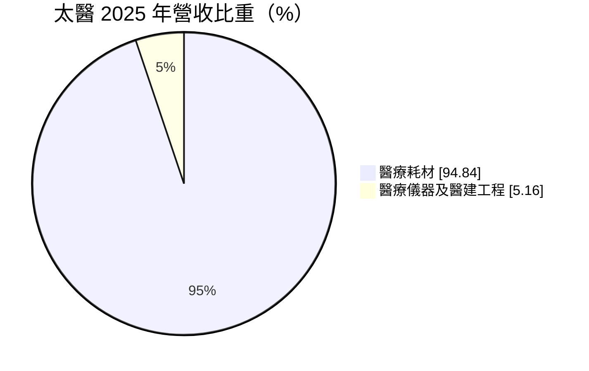
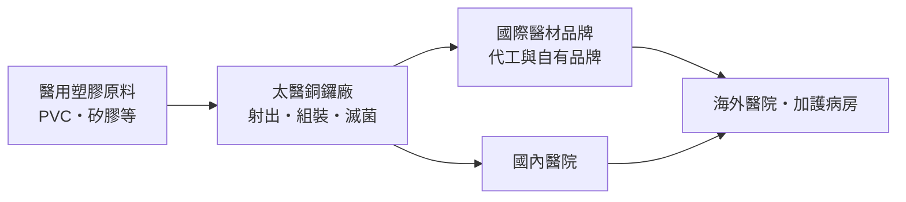
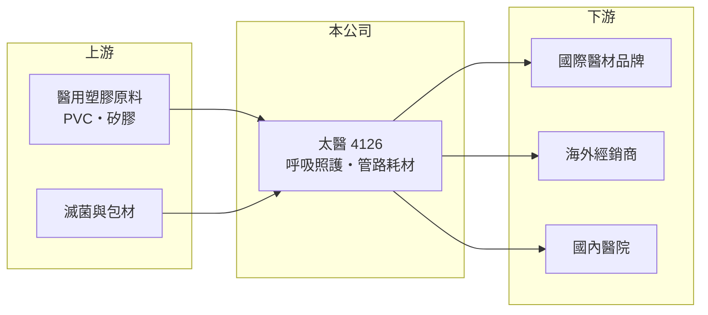

# 4126 太醫

> 上櫃｜[[產業索引-生技醫療業|生技醫療業]]｜上市（櫃）日期 2004/02/09

# 第一章：企業模式與商業藍圖

> [!info] 撰寫說明
> 本文由 Claude 依公開資料整理，架構比照 [[2330台積電]] 的四章研究，資料截至 2026-10-08。財務數字來源：MoneyDJ 理財網年度財務比率與公司基本資料、櫃買中心開放資料（基本資料、2026 年第二季財報、每月營收、股利）；產品線參考優分析與 CMoney 新聞標題。外銷比重與客戶未逐項查證。#待校對

醫療耗材是醫療產業中需求最穩定的一環，評估耗材廠的長期價值，要看它的產品是否有認證門檻、能否以規模壓低成本，以及海外客戶是否穩定。本章說明太平洋醫材（股票代號：4126，以下簡稱太醫）的商業模式。

## 一、核心定位：以呼吸照護與管路類為主的耗材廠

太醫成立於 1977 年，2004 年在櫃買中心掛牌，工廠位於苗栗縣銅鑼鄉的新竹科學園區銅鑼園區，董事長為鍾安婷，實收資本額約 7.3 億元。依 MoneyDJ 資料，2025 年營收中[[醫療耗材]]占 94.8%、醫療儀器及醫建工程占 5.2%。

* **產品線：** 依新聞標題，太醫的主力產品包括密閉式抽痰系統與各類醫用管路，多用於加護病房與呼吸照護（品項細節待校對）。這些產品一次性使用，醫院必須持續採購。
* **外銷導向：** 太醫的客戶包括國際醫材品牌與海外經銷商（外銷比重未查得），因此產品必須取得美國、歐盟等市場的醫材認證。

## 二、資本轉化邏輯

* **規模化製造：** 耗材單價低、數量大，獲利來自自動化生產與穩定的產能利用率。2023 至 2025 年[[營業利益率]]維持在約 20% 至 21%，在醫材同業中屬於偏高。
* **財務穩健：** 負債比率由 2020 年約 34% 降到 2025 年約 24%，2026 年第二季底總資產約 41.9 億元、權益約 28.6 億元。

## 三、長期方向

全球人口老化與加護病房、長照的呼吸照護需求，是太醫的長期成長基礎。歐盟 [[CE MDR]] 等新法規提高了認證門檻，能完成認證的廠商可以承接退出市場的同業訂單。太醫的長期課題是擴充產能並維持高產能利用率，讓營收規模突破目前約 24 億元的水準。

# 第二章：護城河深度與競爭優勢

護城河是企業抵禦競爭、長期維持超額利潤的機制。對醫療耗材廠而言，護城河來自法規認證、品質紀錄與客戶轉換成本，本章說明太醫的優勢與限制。

## 一、太醫護城河的核心組成要素

* **1. 法規認證門檻：** 呼吸照護與管路類產品屬於侵入性醫材，需取得美國 FDA 與歐盟 CE MDR 等認證，新進者要花多年時間與大量成本。
* **2. 客戶轉換成本：** 國際品牌客戶的產品若由太醫代工，更換供應商要重新驗證與送審，因此合作關係通常長期穩定。
* **3. 製造效率：** 營業利益率長期維持在 15% 以上，代表在低單價產品上仍能靠效率賺到不錯的利潤。

## 二、主要競爭對手格局

| 對手 | 定位 | 對太醫的影響 |
|---|---|---|
| [[4116明基醫]] | 醫療耗材與設備 | 國內耗材市場競爭 |
| [[4107邦特]] | 血液透析與輸液管路耗材 | 同為台灣管路類耗材廠 |
| 中國與東南亞耗材廠 | 低價大量生產 | 標準品價格競爭 |
| 國際醫材大廠自有工廠 | 品牌與通路 | 可能把代工收回自製 |

## 三、優勢轉化：守得住與守不住的地方

* **守得住：** 2020 至 2025 年 ROE 都在 12% 至 16%，營業利益率穩定在 15% 至 21%，是護城河轉化為獲利的證據。
* **守不住：** 營收成長緩慢，2023 至 2025 年營收約在 23 億至 24 億元，2026 年 1 至 8 月約 16.3 億元，僅較去年同期成長約 1%。
* **觀察重點：** 新產能與新客戶的放量進度、毛利率能否守在 30% 以上，以及匯率對外銷獲利的影響。

# 第三章：財務體質與盈利規模

資料日期：2026-10-08。數字取自 MoneyDJ 理財網年度財務資料與櫃買中心開放資料，表格是撰寫當時的快照；最新月營收、毛利率、累計 EPS 由自動排程寫在本筆記的屬性欄位（月營收、毛利率、累計EPS 等）。#待校對

財務報表是檢驗護城河是否真實存在的最終標準。本章用五年的三率、ROE 與資本報酬，檢視太醫的獲利品質。

## 一、多年度財務表現

| 年度 | 營收（新台幣） | [[毛利率]] | [[營業利益率]] | EPS（元） | [[ROE]] |
|---|---|---|---|---|---|
| 2021 | 未查得 | 25.9% | 15.5% | 5.32 | 14.53% |
| 2022 | 未查得 | 26.9% | 16.2% | 4.56 | 12.22% |
| 2023 | 約 23.2 億（推算） | 31.9% | 21.5% | 5.80 | 15.16% |
| 2024 | 約 23.5 億（推算） | 31.8% | 20.9% | 6.17 | 15.51% |
| 2025 | 約 24.1 億（推算） | 30.7% | 19.7% | 5.27 | 12.96% |

資料來源：MoneyDJ 理財網年度財務比率（2023 至 2025 年為個別財報，2020 至 2022 年為合併財報）；營收以每股營業額乘目前股數 7,260 萬股推算，與官方 2025 年 1 至 8 月營收約 16.2 億元的年化水準相符。2026 年上半年（櫃買中心資料）營收約 11.8 億元、毛利率約 32.6%、營業利益率約 21.2%、EPS 2.97 元。

太醫是本批生技醫療公司中獲利最穩定的一家：五年 EPS 都在 4.5 元以上，近五年平均 ROE 約 14.1%（推算）。毛利率由 2021 年約 26% 提升到 2023 年後的約 31%，反映產品組合或價格改善。依櫃買中心資料，最近一次現金股利為每股 4.5 元，對照 2025 年 EPS 5.27 元，[[配息率]]約 85%（推算），屬於高配息政策。

## 二、[[ROIC]] 與 [[WACC]]：價值創造利差

**ROIC 推算：** 2025 年營業利益約 4.7 億元（營收 24.1 億元乘營業利益率 19.7%，推算），稅後約 3.8 億元。官方資料只揭露負債總計約 13.3 億元，假設三成為有息負債約 4 億元（推估），加上權益約 28.6 億元，投入資本約 32.6 億元，ROIC 約 11.6%（推算）。

**WACC 推算：** 台灣 10 年期公債殖利率取 1.75%、市場風險溢酬 6%、β 取醫材同業常見值 0.8（未查得公司實際 β），股東權益成本約 6.55%。負債成本假設 2.5%，稅率 20%，稅後約 2.0%。權益約占投入資本 88%，WACC 約 6.0%（推算）。

**結論：** ROIC 高於 WACC 約 5.6 個百分點，而且過去五年營業利益率穩定，代表太醫長期在創造價值。高配息搭配穩定的 ROIC，是典型的成熟型利基製造業；若新產能能帶動營收成長且維持利益率，價值創造的規模還能擴大。

# 第四章：總體風險與地緣政治

任何企業都無法脫離宏觀環境獨立存在。本章分析太醫長期必須面對的法規、市場與營運風險。

## 一、法規與市場風險

* **醫材法規趨嚴：** 歐盟 CE MDR 與各國法規對臨床證據與上市後監督的要求提高，每項產品的維護成本上升。
* **價格競爭：** 標準化耗材面臨中國與東南亞廠商的低價競爭，醫院與各國集中採購也會壓低價格。

## 二、營運環境的隱性風險

* **客戶集中：** 若營收集中在少數國際品牌客戶，客戶策略改變（例如收回自製或轉單）會直接影響營收（客戶名單未查得）。
* **原料價格：** 醫用塑膠原料受石化價格影響，成本上漲會壓縮毛利。

## 三、其他風險

* **匯率：** 外銷以外幣計價，新台幣升值會壓縮營收與毛利。
* **擴產執行：** 新增產能若接單不足，折舊會拉低毛利率。

# 專有名詞解析

## 金融

- **[[配息率]]**：現金股利除以每股盈餘，代表公司把多少比例的獲利發給股東。
- **[[ROIC]]**：投入資本報酬率，稅後營業利益除以股東權益加有息負債，衡量本業運用資本的效率。
- **[[WACC]]**：加權平均資金成本，股東與債權人要求報酬率的加權平均，是 ROIC 要超越的門檻。

## 產業

- **[[醫療耗材]]**：使用一次或短期使用後即丟棄的醫療用品，例如針筒、管路、敷料，需求重複且穩定。
- **[[CE MDR]]**：歐盟醫療器材法規，2021 年起全面取代舊指令，對臨床證據與上市後監督要求更嚴格。

# 核心供應鏈

## 1. 上游：原料與包材
- 醫用塑膠原料與包材供應商（名稱未查得）

## 2. 中游：太醫與同業
- 醫療耗材同業：[[4107邦特]]、[[4116明基醫]]

## 3. 下游：客戶
- 國際醫材品牌、海外經銷商、國內醫院加護病房與呼吸照護單位

## 最新新聞
<!-- news:start -->
<!-- news:end -->

## 相關連結
- [公開資訊觀測站](https://mopsov.twse.com.tw/mops/web/t05st03?step=1&firstin=1&co_id=4126)
- [Goodinfo](https://goodinfo.tw/tw/StockDetail.asp?STOCK_ID=4126)
- [Yahoo 股市](https://tw.stock.yahoo.com/quote/4126)
- [鉅亨網新聞](https://www.cnyes.com/twstock/4126/news)
