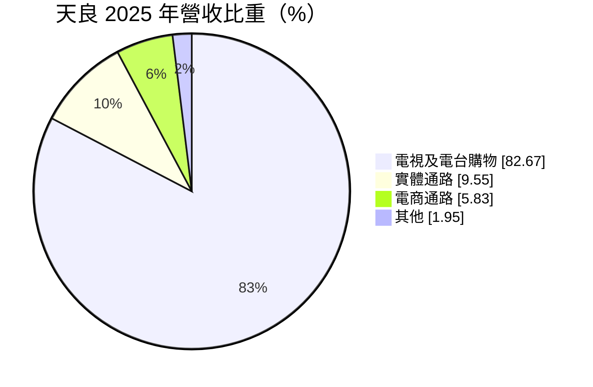
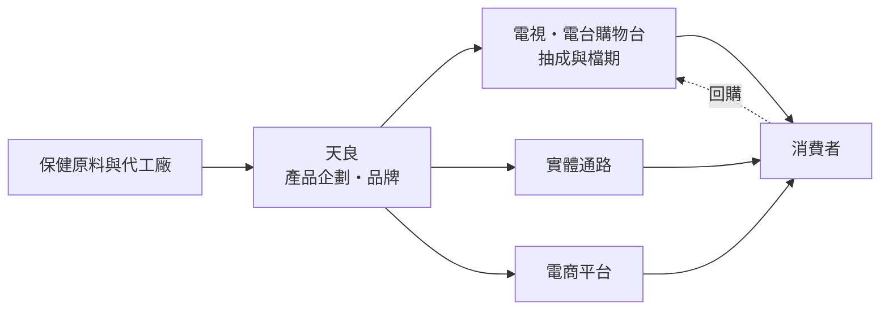
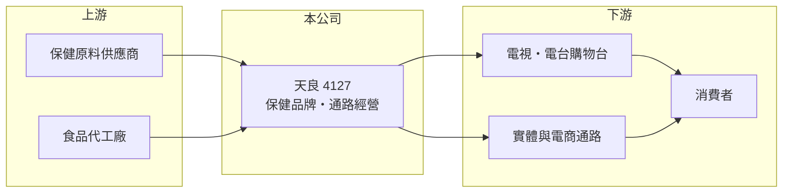

# 4127 天良

> 上櫃｜[[產業索引-生技醫療業|生技醫療業]]｜上市（櫃）日期 2005/07/29

# 第一章：企業模式與商業藍圖

> [!info] 撰寫說明
> 本文由 Claude 依公開資料整理，架構比照 [[2330台積電]] 的四章研究，資料截至 2026-10-08。財務數字來源：MoneyDJ 理財網年度財務比率與公司基本資料、櫃買中心開放資料（基本資料、2026 年第二季財報、每月營收、股利）。公開資料有限，產品品牌與合作購物台未逐項查證。#待校對

評估一家以電視購物為主要通路的保健食品公司，關鍵在於產品能否反覆被消費者購買，以及通路費用占掉多少毛利。本章說明天良生物科技企業（股票代號：4127，以下簡稱天良）的商業模式。

## 一、核心定位：靠電視與廣播購物銷售的保健品牌

天良成立於 1971 年，2005 年在櫃買中心掛牌，總部位於新北市汐止區，董事長為許曜廷，實收資本額約 4.6 億元。依 MoneyDJ 資料，2025 年營收中[[電視購物]]及電台購物占 82.7%、實體通路 9.6%、電商通路 5.8%、其他 2.0%。

* **高度依賴購物台：** 八成以上營收來自電視與電台購物，代表天良的銷售能力主要建立在節目檔期、主持人推薦與產品話題性上。
* **高毛利、高費用：** [[毛利率]]長期在 56% 至 64%，但購物台抽成、贈品與行銷費用高，營業利益率通常只有個位數。

## 二、資本轉化邏輯

* **輕製造、重行銷：** 產品主要委外生產，公司的核心工作是產品企劃與通路經營（生產方式待校對）。
* **資產結構：** 2026 年第二季底總資產約 12.2 億元，其中非流動資產約 9.1 億元，負債約 7.0 億元且幾乎都是流動負債，權益約 5.2 億元。相對於約 5 億元的營收，資產規模偏大，非流動資產的內容未查得。

## 三、長期方向

天良的長期課題是降低對單一通路的依賴。電視購物觀眾年齡偏高，年輕消費者轉向電商與社群購物，若無法把品牌延伸到電商與實體通路，營收會受電視購物整體趨勢影響。2026 年 1 至 8 月營收約 4.97 億元，較去年同期成長約 50%，顯示產品在通路上仍有爆發力，但能否持續有待觀察。

# 第二章：護城河深度與競爭優勢

護城河是企業抵禦競爭、長期維持超額利潤的機制。保健食品的進入門檻不高，天良的優勢主要在通路經營經驗，本章說明它的優勢與限制。

## 一、天良護城河的核心組成要素

* **1. 購物台經營經驗：** 長期在電視購物銷售，熟悉檔期安排、節目呈現與客群需求，與購物台的合作關係是累積多年的資產。
* **2. 產品毛利：** 毛利率長期在 56% 以上，代表產品在消費者心中有一定的品牌溢價。
* **3. 回購客群：** 保健食品屬於重複消費，熟客回購可以降低每次銷售的獲客成本。

## 二、主要競爭對手格局

| 對手 | 定位 | 對天良的影響 |
|---|---|---|
| [[4128中天]] | 保健品與有機食品 | 保健品市場直接競爭 |
| [[4109加捷生醫]] | 營養保健與餐食 | 保健品市場競爭 |
| 其他購物台保健品牌 | 同檔期競爭 | 爭取購物台時段與消費者預算 |

## 三、優勢轉化：守得住與守不住的地方

* **守得住：** 高毛利率與熟客基礎，讓公司在營收成長時能快速轉為獲利，2021 至 2022 年 ROE 都超過 11%。
* **守不住：** 營收與獲利波動大，2023 至 2025 年營業利益率由 4.4% 降到負 3.2%。通路集中也讓議價能力有限。
* **觀察重點：** 2026 年營收成長能否延續、電商與實體通路比重是否提高，以及營業費用率的變化。

# 第三章：財務體質與盈利規模

資料日期：2026-10-08。數字取自 MoneyDJ 理財網年度財務資料與櫃買中心開放資料，表格是撰寫當時的快照；最新月營收、毛利率、累計 EPS 由自動排程寫在本筆記的屬性欄位（月營收、毛利率、累計EPS 等）。#待校對

財務報表是檢驗護城河是否真實存在的最終標準。本章用五年的三率、ROE 與資本報酬，檢視天良的獲利品質。

## 一、多年度財務表現

| 年度 | 營收（新台幣） | [[毛利率]] | [[營業利益率]] | EPS（元） | [[ROE]] |
|---|---|---|---|---|---|
| 2021 | 未查得 | 59.2% | 7.5% | 1.02 | 11.93% |
| 2022 | 未查得 | 63.7% | 11.0% | 1.30 | 13.38% |
| 2023 | 約 4.6 億（推算） | 62.2% | 4.4% | 0.39 | 3.66% |
| 2024 | 約 3.9 億（推算） | 59.7% | 0.2% | 0.26 | 2.41% |
| 2025 | 約 5.1 億（推算） | 56.3% | -3.2% | -0.22 | -2.15% |

資料來源：MoneyDJ 理財網年度財務比率（2025 年與 2020 年為合併報表，2021 至 2024 年為個別報表）；營收以每股營業額乘目前股數約 4,576 萬股推算，與官方 2025 年 1 至 8 月營收約 3.3 億元的年化水準大致相符。2026 年上半年（櫃買中心資料）營收約 3.83 億元、毛利率約 60.1%、營業利益率約 7.2%、EPS 1.06 元。

天良的獲利對營收規模非常敏感：營收約 4 至 5 億元時，固定的行銷與人事費用就會吃掉大部分毛利。2026 年上半年營收大幅成長，營業利益率隨即回到約 7%，展現典型的營運槓桿。近五年平均 ROE 約 5.9%（推算）。依櫃買中心資料，目前未配發現金股利。負債比率由 2023 年約 25% 升到 2025 年約 60%，財務槓桿明顯提高（原因未查得）。

## 二、[[ROIC]] 與 [[WACC]]：價值創造利差

**ROIC 推算：** 2025 年營業虧損約 0.16 億元（營收 5.1 億元乘營業利益率負 3.2%，推算），虧損年度不計稅盾。官方資料只揭露負債總計約 7.0 億元，假設四成為有息負債約 2.8 億元（推估），加上權益約 5.2 億元，投入資本約 8.0 億元，ROIC 約負 2.0%（推算）。若以 2026 年上半年營業利益約 0.27 億元年化計算，稅後約 0.44 億元，ROIC 約 5.5%（推算）。

**WACC 推算：** 台灣 10 年期公債殖利率取 1.75%、市場風險溢酬 6%、β 取同業常見值 1.0（未查得公司實際 β），股東權益成本約 7.75%。負債成本假設 2.5%，稅率 20%，稅後約 2.0%。權益約占投入資本 65%，WACC 約 5.7%（推算）。

**結論：** 2025 年 ROIC 低於 WACC，2026 年上半年的年化 ROIC 則大致與 WACC 打平。天良能否長期創造價值，取決於營收能否穩定維持在較高水準；營收一旦回落，營運槓桿會讓 ROIC 迅速轉負。

# 第四章：總體風險與地緣政治

任何企業都無法脫離宏觀環境獨立存在。本章分析天良長期必須面對的通路、法規與財務風險。

## 一、通路風險

* **購物台依賴：** 八成以上營收來自電視與電台購物，購物台的收視下滑、抽成調整或檔期減少，都會直接衝擊營收。
* **消費習慣改變：** 年輕族群轉向電商與社群購物，電視購物客群老化。

## 二、法規風險

* **保健食品廣告規範：** 食品不得宣稱療效，購物節目的用語受主管機關監管，違規可能被罰款或下架。
* **食品安全：** 原料或代工廠發生食安問題，會重創品牌信任。

## 三、財務風險

* **營運槓桿：** 固定費用比重高，營收下滑時獲利會大幅衰退。
* **負債上升：** 負債比率由約 25% 升到約 60%，且多為流動負債，需留意短期資金調度。

# 專有名詞解析

## 應用

- **[[電視購物]]**：透過電視頻道節目介紹並接受電話或網路下單的零售通路，購物台通常抽取銷售額一定比例。

## 金融

- **[[營運槓桿]]**：固定成本占比高的企業，營收小幅變動會造成營業利益大幅變動的現象。
- **[[ROIC]]**：投入資本報酬率，稅後營業利益除以股東權益加有息負債，衡量本業運用資本的效率。
- **[[WACC]]**：加權平均資金成本，股東與債權人要求報酬率的加權平均，是 ROIC 要超越的門檻。

## 產業

- **[[保健食品]]**：以補充營養或維持健康為訴求的食品，不屬藥品，進入門檻低、品牌競爭激烈。

# 核心供應鏈

## 1. 上游：原料與代工
- 保健原料供應商與食品代工廠（名稱未查得）

## 2. 中游：天良與同業
- 保健食品同業：[[4128中天]]、[[4109加捷生醫]]

## 3. 下游：通路與客戶
- 電視與電台購物台（合作對象未查得）、實體與電商通路、終端消費者

## 最新新聞
<!-- news:start -->
<!-- news:end -->

## 相關連結
- [公開資訊觀測站](https://mopsov.twse.com.tw/mops/web/t05st03?step=1&firstin=1&co_id=4127)
- [Goodinfo](https://goodinfo.tw/tw/StockDetail.asp?STOCK_ID=4127)
- [Yahoo 股市](https://tw.stock.yahoo.com/quote/4127)
- [鉅亨網新聞](https://www.cnyes.com/twstock/4127/news)
