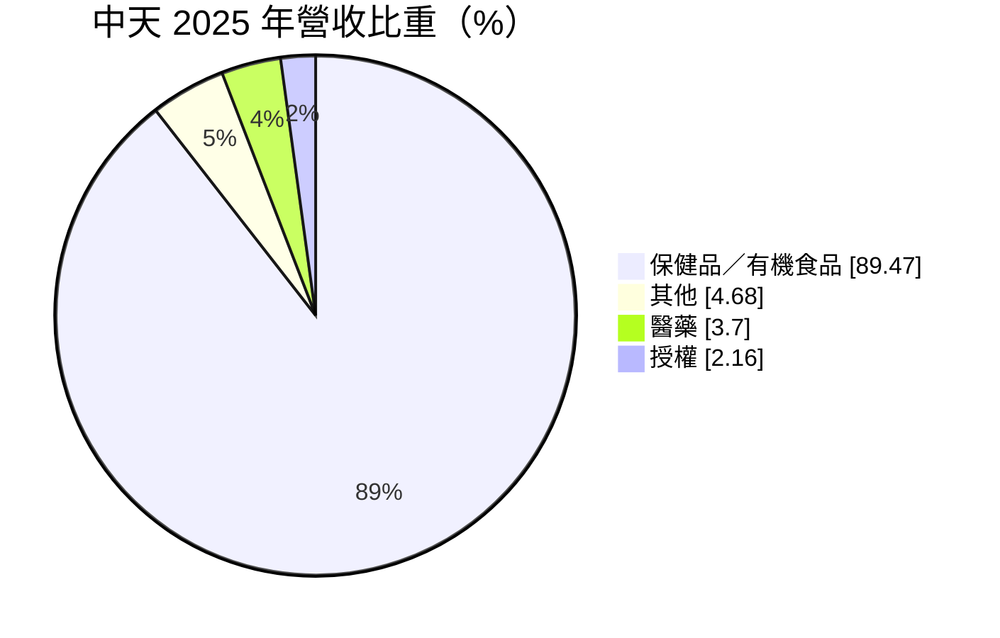
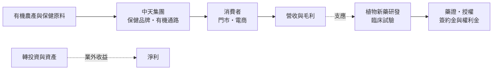
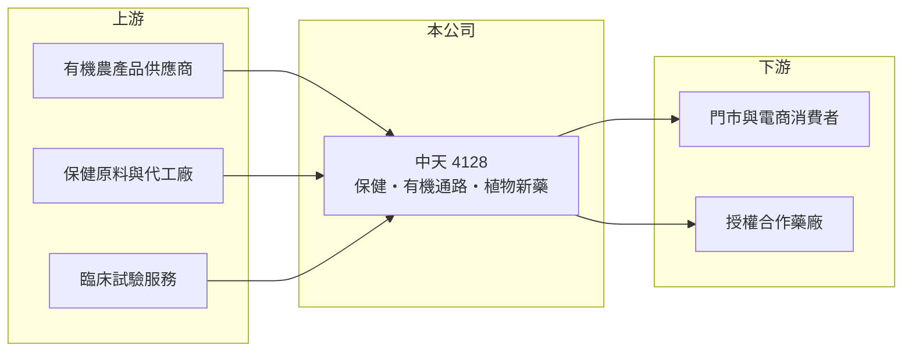

# 4128 中天

> 上櫃｜[[產業索引-生技醫療業|生技醫療業]]｜上市（櫃）日期 2006/06/09

# 第一章：企業模式與商業藍圖

> [!info] 撰寫說明
> 本文由 Claude 依公開資料整理，架構比照 [[2330台積電]] 的四章研究，資料截至 2026-10-08。財務數字來源：MoneyDJ 理財網年度財務比率與公司基本資料、櫃買中心開放資料（基本資料、2026 年第二季財報、每月營收、股利）。通路品牌、研發品項與業外收益來源為整理性內容，已標註待校對。#待校對

中天是一家「用保健品與有機食品通路養新藥研發」的公司，評估它要同時看消費事業的現金流與新藥研發的進度。本章說明中天生技（股票代號：4128，以下簡稱中天）的商業模式。

## 一、核心定位：保健與有機食品為主體，植物新藥為長期選擇權

中天成立於 2000 年，2006 年在櫃買中心掛牌，總部位於台北市南港區，董事長兼總經理為陳振文，實收資本額約 58.8 億元。依 MoneyDJ 資料，2025 年營收中保健品／有機食品占 89.5%、其他 4.7%、醫藥 3.7%、[[授權]] 2.2%。

* **消費事業是營收主體：** 近九成營收來自保健品與有機食品，主要透過自有通路銷售（有機食品零售通路如綠色小鎮等，待校對）。這類生意需要門市、物流與品牌經營，毛利率約 38% 至 41%。
* **新藥研發是長期選擇權：** 中天以[[植物新藥]]為研發主軸（代表品項如用於癌症輔助治療的 MB-6，待校對），醫藥與授權收入目前占營收不到 6%。研發費用是營業虧損的主要來源之一。

## 二、資本轉化邏輯

* **營業虧損、業外補位：** 2026 年上半年營收約 9.8 億元、營業虧損約 2.68 億元，但業外收益約 7.69 億元，使稅後淨利轉正、EPS 1.10 元（業外來源未查得）。2020 年與 2022 年也有類似情形，業外收益是中天損益的重要變數。
* **資本結構保守：** 2026 年第二季底總資產約 128.3 億元，負債約 21.4 億元，權益約 106.9 億元，負債比率約 17%。

## 三、長期方向

中天的長期價值取決於兩條線：消費事業能否從虧損轉為穩定獲利，以及植物新藥能否取得藥證或授權，帶來高毛利的收入。有機與健康飲食的長期趨勢對消費事業有利，但門市經營的費用結構需要改善。

# 第二章：護城河深度與競爭優勢

護城河是企業抵禦競爭、長期維持超額利潤的機制。本章說明中天在保健、有機通路與新藥研發上的優勢與限制。

## 一、中天護城河的核心組成要素

* **1. 自有通路：** 擁有有機食品與保健品的實體門市網絡（待校對），能直接接觸消費者，累積會員與回購數據。
* **2. 植物新藥研發平台：** 植物新藥需要從原料種植、萃取到臨床試驗的整套能力，新進者不易複製。
* **3. 財務厚度：** 權益超過 100 億元、負債比率低，能長期支撐研發投入而不必頻繁增資。

## 二、主要競爭對手格局

| 對手 | 定位 | 對中天的影響 |
|---|---|---|
| 里仁、主婦聯盟等有機通路 | 有機食品零售 | 爭取同一批重視健康飲食的消費者 |
| [[4127天良]] | 保健品電視購物 | 保健品市場競爭 |
| [[4108懷特]] | 植物來源新藥 | 同樣走植物新藥路線 |

## 三、優勢轉化：守得住與守不住的地方

* **守得住：** 營收規模穩定在 17 億至 19 億元，2023 至 2025 年緩步成長；毛利率長期維持在約 38% 至 41%。
* **守不住：** 2020 至 2025 年營業利益率都是負值，介於負 16% 到負 69%，消費事業與研發合計仍在虧錢，護城河尚未轉化為本業獲利。
* **觀察重點：** 營業虧損能否持續縮小、植物新藥的臨床與授權進度，以及業外收益的來源與持續性。

# 第三章：財務體質與盈利規模

資料日期：2026-10-08。數字取自 MoneyDJ 理財網年度財務資料與櫃買中心開放資料，表格是撰寫當時的快照；最新月營收、毛利率、累計 EPS 由自動排程寫在本筆記的屬性欄位（月營收、毛利率、累計EPS 等）。#待校對

財務報表是檢驗護城河是否真實存在的最終標準。本章用五年的三率、ROE 與資本報酬，檢視中天的財務體質。

## 一、多年度財務表現

| 年度 | 營收（新台幣） | [[毛利率]] | [[營業利益率]] | EPS（元） | [[ROE]] |
|---|---|---|---|---|---|
| 2021 | 未查得 | 41.5% | -65.2% | 0.11 | -1.75% |
| 2022 | 未查得 | 40.2% | -16.2% | 0.41 | 1.09% |
| 2023 | 約 16.7 億（推算） | 38.0% | -31.8% | -2.11 | -10.01% |
| 2024 | 約 17.2 億（推算） | 39.2% | -26.2% | -1.87 | -10.08% |
| 2025 | 約 18.9 億（推算） | 39.8% | -21.5% | -1.29 | -8.64% |

資料來源：MoneyDJ 理財網年度財務比率（合併報表）；營收以每股營業額乘目前股數約 5.88 億股推算，與官方 2025 年 1 至 8 月營收約 12.2 億元的年化水準大致相符。2026 年上半年（櫃買中心資料）營收約 9.8 億元、毛利率約 38.4%、營業虧損約 2.68 億元、業外收益約 7.69 億元、EPS 1.10 元。

中天的營業虧損幅度逐年縮小（營業利益率由 2023 年的負 31.8% 改善到 2025 年的負 21.5%），營收在 2023 至 2025 年的年複合成長率約 6.5%（推算）。但 2023 至 2025 年 EPS 連三年為負，近五年平均 ROE 約負 5.9%（推算）。依櫃買中心資料，目前未配發現金股利。值得注意的是，2026 年上半年母公司業主淨利（約 6.49 億元）高於合併淨利（約 5.01 億元），代表部分虧損由子公司的少數股東承擔。

## 二、[[ROIC]] 與 [[WACC]]：價值創造利差

**ROIC 推算：** 2025 年營業虧損約 4.1 億元（營收 18.9 億元乘營業利益率負 21.5%，推算），虧損年度不計稅盾。官方資料只揭露負債總計約 21.4 億元，假設四成為有息負債約 8.6 億元（推估），加上權益約 106.9 億元，投入資本約 115.5 億元，ROIC 約負 3.5%（推算）。

**WACC 推算：** 台灣 10 年期公債殖利率取 1.75%、市場風險溢酬 6%、β 取生技同業常見值 1.0（未查得公司實際 β），股東權益成本約 7.75%。負債成本假設 2.5%，稅率 20%，稅後約 2.0%。權益約占投入資本 93%，WACC 約 7.3%（推算）。

**結論：** 本業 ROIC 為負，低於 WACC 約 11 個百分點，代表消費事業與研發合計仍在消耗資本。中天的帳面獲利主要來自業外，若業外收益屬於一次性的資產處分或評價利益，長期投資人不宜將其視為經常性的價值創造。

# 第四章：總體風險與地緣政治

任何企業都無法脫離宏觀環境獨立存在。本章分析中天長期必須面對的研發、消費市場與財務風險。

## 一、研發與法規風險

* **植物新藥審查：** 植物新藥成分複雜，臨床設計與審查標準嚴格，開發時間長、失敗機率高。
* **授權不確定：** 授權收入占比小且不穩定，難以作為長期獲利來源。

## 二、消費市場風險

* **有機通路競爭：** 有機與健康食品通路增加，超市與電商也擴大有機品類，壓縮專門通路的優勢。
* **費用結構：** 門市租金、人力與物流成本高，營收成長若跟不上費用，虧損難以收斂。
* **食品安全：** 有機認證與農藥殘留等食安問題，會直接衝擊品牌信任。

## 三、財務風險

* **依賴業外收益：** 本業連年虧損，獲利依賴業外，業外收益一旦中斷，損益就會轉為虧損。
* **股本大：** 股本約 58.8 億元，即使轉為獲利，每股盈餘也會被大股本稀釋。

# 專有名詞解析

## 金融

- **[[非控制權益]]**：合併報表中，子公司不屬於母公司持有的那部分權益，對應的獲利不歸母公司股東。
- **[[ROIC]]**：投入資本報酬率，稅後營業利益除以股東權益加有息負債，衡量本業運用資本的效率。
- **[[WACC]]**：加權平均資金成本，股東與債權人要求報酬率的加權平均，是 ROIC 要超越的門檻。

## 產業

- **[[植物新藥]]**：以植物萃取物為有效成分的新藥，成分複雜，需完整臨床試驗才能取得藥證。
- **[[授權]]**：藥廠把產品或技術的開發、銷售權利授予其他公司，以換取簽約金、里程碑金與銷售權利金。
- **[[保健食品]]**：以補充營養或維持健康為訴求的食品，不屬藥品，進入門檻低、品牌競爭激烈。

# 核心供應鏈

## 1. 上游：原料與研發服務
- 有機農產與保健原料供應商、食品代工廠（名稱未查得）
- 臨床試驗委託研究機構（CRO）

## 2. 中游：中天與同業
- 保健品同業：[[4127天良]]、[[4109加捷生醫]]
- 植物新藥同業：[[4108懷特]]

## 3. 下游：客戶
- 有機與保健品門市、電商消費者，以及新藥授權合作對象

## 最新新聞
<!-- news:start -->
<!-- news:end -->

## 相關連結
- [公開資訊觀測站](https://mopsov.twse.com.tw/mops/web/t05st03?step=1&firstin=1&co_id=4128)
- [Goodinfo](https://goodinfo.tw/tw/StockDetail.asp?STOCK_ID=4128)
- [Yahoo 股市](https://tw.stock.yahoo.com/quote/4128)
- [鉅亨網新聞](https://www.cnyes.com/twstock/4128/news)
