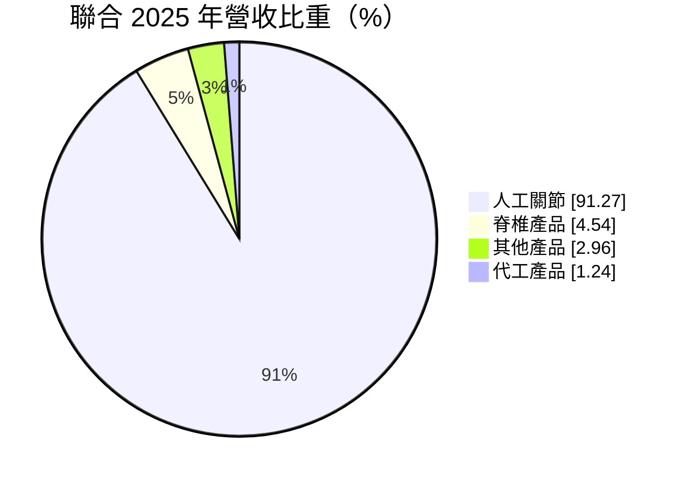
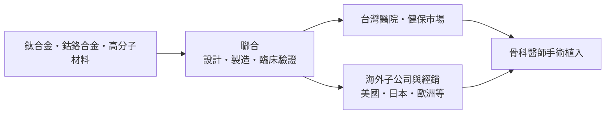
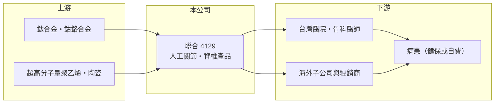

# 4129 聯合

> 上櫃｜[[產業索引-生技醫療業|生技醫療業]]｜上市（櫃）日期 2004/09/29

# 第一章：企業模式與商業藍圖

> [!info] 撰寫說明
> 本文由 Claude 依公開資料整理，架構比照 [[2330台積電]] 的四章研究，資料截至 2026-10-08。財務數字來源：MoneyDJ 理財網年度財務比率與公司基本資料（2025 年營收比重）、櫃買中心開放資料（基本資料、2026 年第二季財報、每月營收、本益比殖利率）。海外市場布局與產品線描述有部分憑記憶整理，已標註待校對。#待校對

評估一家醫材公司，要先看它賣的是一次性耗材，還是需要長期臨床驗證的植入物。本章說明聯合骨科器材（股票代號：4129，以下簡稱聯合）以[[人工關節]]為核心的商業模式。

## 一、核心定位：台灣少數自有品牌的人工關節製造商

聯合成立於 1993 年，總部位於新竹科學園區，2004 年在櫃買中心掛牌，董事長為林延生，實收資本額約 9.6 億元。依 MoneyDJ 資料，2025 年營收中人工關節占 91.3%、脊椎產品占 4.5%、其他產品占 3.0%、代工產品占 1.2%，幾乎是一家純粹的人工關節公司。

* **自有品牌而非代工：** 代工只占約 1%，代表聯合靠自己的品牌、設計與臨床資料賣進醫院。這種模式的毛利率遠高於代工，2025 年[[毛利率]]約 77.8%，但也必須自己負擔通路、醫師教育與法規認證的費用。
* **植入物的重複性需求：** 人工髖關節與膝關節用於退化性關節炎與骨折病人，需求由人口老化驅動，不太受景氣循環影響。一旦醫師習慣某一套器械與手術流程，就不容易輕易更換品牌。

## 二、資本轉化邏輯：研發、認證與海外通路

* **法規是進入門檻：** 人工關節屬高風險植入醫材，各國上市都要經過 [[FDA]] 等主管機關審查與長期臨床追蹤，新品從開發到放量常需數年。
* **營收規模隨海外拓展放大：** 每股營業額由 2021 年的 29.2 元增加到 2025 年的 58.6 元，五年間約翻倍。依理財媒體報導標題，國際市場拓展是近年成長主軸（各市場比重未查得，待校對）。

## 三、長期方向

聯合的長期課題，是把在台灣建立的品牌與臨床經驗複製到美國、日本等大市場，同時擴充產品線（例如手術導航、客製化關節，具體品項待校對）。人口老化讓關節置換手術量長期增加，這是結構性的需求動能；能否在國際大廠主導的市場中持續拿到醫院採購，決定它的成長天花板。

# 第二章：護城河深度與競爭優勢

護城河是企業抵禦競爭、長期維持超額利潤的機制。本章說明聯合在人工關節市場的優勢與限制。

## 一、聯合護城河的核心組成要素

* **1. 法規與臨床資料：** 植入醫材需要長期臨床追蹤證明安全性，累積多年的臨床數據本身就是新進者難以短期複製的資產。
* **2. 醫師使用習慣：** 骨科醫師熟悉一套器械與手術步驟後，更換品牌要重新學習，轉換成本高，客戶黏著度因此較強。
* **3. 高毛利的自有品牌：** 毛利率由 2021 年的 71.6% 一路升到 2025 年的 77.8%，顯示產品組合與定價能力在改善，而不只是靠量。

## 二、主要競爭對手格局

| 對手 | 定位 | 對聯合的影響 |
|---|---|---|
| 國際骨科大廠（Stryker、Zimmer Biomet、強生 DePuy 等） | 全球市占領先，產品線完整 | 在品牌、臨床資料與醫院關係上具優勢 |
| [[4163鐿鈦]] | 台灣骨科與牙科植入物代工及品牌 | 台灣骨科醫材同業 |
| 中國本土骨科廠 | 受集中採購政策扶植 | 以低價搶占中國市場 |

## 三、優勢轉化：守得住與守不住的地方

* **守得住：** 營業利益率由 2020 年的 3.8% 升到 2023 至 2025 年的 13% 左右，代表營收規模跨過門檻後，營業費用的槓桿開始顯現。
* **守不住：** 營業費用率仍高（毛利率近 78%，營業利益率只有約 13%），代表通路、行銷與研發費用吃掉大部分毛利，海外擴張的投入可能長期壓抑利潤率。
* **觀察重點：** 海外營收比重是否持續提升、營業利益率能否突破 15%，以及健保與各國醫材支付價格的變化。

# 第三章：財務體質與盈利規模

資料日期：2026-10-08。數字取自 MoneyDJ 理財網年度財務資料與櫃買中心開放資料，表格是撰寫當時的快照；最新月營收、毛利率、累計 EPS 由自動排程寫在本筆記的屬性欄位（月營收、毛利率、累計EPS 等）。#待校對

財務報表是檢驗護城河是否真實存在的最終標準。本章用五年的三率、ROE 與資本報酬，檢視聯合的獲利品質。

## 一、多年度財務表現

| 年度 | 營收（新台幣） | 每股營業額 | [[毛利率]] | [[營業利益率]] | EPS（元） | [[ROE]] |
|---|---|---|---|---|---|---|
| 2021 | 未查得 | 29.18 元 | 71.6% | 6.3% | 0.37 | 1.84% |
| 2022 | 未查得 | 35.96 元 | 74.6% | 10.8% | 2.84 | 7.57% |
| 2023 | 約 43.0 億（推算） | 44.60 元 | 77.3% | 13.8% | 4.50 | 11.62% |
| 2024 | 約 46.5 億（推算） | 48.25 元 | 77.9% | 13.1% | 4.74 | 12.21% |
| 2025 | 約 56.6 億（推算） | 58.64 元 | 77.8% | 13.1% | 5.83 | 14.02% |

資料來源：MoneyDJ 理財網年度財務比率（合併報表）；營收以每股營業額乘目前股數約 9,644 萬股推算，2021、2022 年股本可能不同，故不推算。2026 年上半年（櫃買中心資料）營收約 30.6 億元、營業利益約 3.1 億元、EPS 2.35 元；2026 年 1 至 8 月營收約 41.1 億元，較去年同期成長約 13.3%。

聯合近五年最清楚的趨勢是「規模帶動獲利率」：每股營業額成長約一倍，EPS 由 0.37 元升到 5.83 元，ROE 由 1.8% 升到 14.0%。2023 至 2025 年營收年複合成長率約 14.7%（推算），近五年平均 ROE 約 9.5%（推算），但近三年已穩定在 11% 以上。現金股利方面，依櫃買中心資料最近一次為每股 4.5 元，以 2025 年 EPS 5.83 元計，配息率約 77%（推算）。

## 二、[[ROIC]] 與 [[WACC]]：價值創造利差

**ROIC 推算：** 2025 年營業利益約 7.4 億元（營收約 56.6 億元乘營業利益率 13.1%，推算），稅後約 5.9 億元。2026 年第二季權益總計約 40.1 億元，負債總計約 45.1 億元，官方資料未拆分有息負債，假設四成為有息負債約 18.0 億元（推估），投入資本約 58.1 億元，ROIC 約 10.2%（推算）。

**WACC 推算：** 台灣 10 年期公債殖利率取 1.75%、市場風險溢酬 6%。MoneyDJ 顯示 β 約 0.17，但小型股流動性低使 β 偏低，不宜直接使用，改取醫材同業常見值 0.9，股東權益成本約 7.15%。負債成本假設 2.5%，稅率 20%，稅後約 2.0%。權益約占投入資本 69%，WACC 約 5.6%（推算）。

**結論：** ROIC 高於 WACC 約 4.6 個百分點，代表聯合在 2023 年之後已進入持續創造價值的階段。負債比率約五成偏高，若海外擴張持續以借款支應，利息負擔會侵蝕部分利差。

# 第四章：總體風險與地緣政治

任何企業都無法脫離宏觀環境獨立存在。本章分析聯合長期必須面對的法規、市場與財務風險。

## 一、法規與支付價格風險

* **醫材法規趨嚴：** 歐盟 [[醫材法規]]（MDR）與美國 FDA 對植入物的臨床證據要求愈來愈高，新產品上市的時間與成本都會增加。
* **健保與集中採購：** 台灣健保給付價調整、中國等市場的骨科耗材[[集中採購]]，都可能壓低人工關節的售價。

## 二、市場與競爭風險

* **國際大廠的規模優勢：** 美國市場由大型骨科廠主導，它們能以整套產品、醫院合約與手術機器人綁定客戶，小型品牌要擴大市占並不容易。
* **產品責任：** 植入物若發生召回或訴訟，賠償與商譽損失都可能很大。

## 三、財務與匯率風險

* **負債比率偏高：** 2026 年第二季負債約占資產 53%，擴張期的資金需求較大。
* **匯率：** 海外營收以外幣計價，新台幣升值會壓縮以台幣計算的營收與毛利。

# 專有名詞解析

## 應用

- **[[FDA]]**：美國食品藥物管理局，負責藥品與醫療器材的上市審查，是全球最具指標性的主管機關。

## 金融

- **[[ROIC]]**：投入資本報酬率，稅後營業利益除以股東權益加有息負債，衡量本業運用資本的效率。
- **[[WACC]]**：加權平均資金成本，股東與債權人要求報酬率的加權平均，是 ROIC 要超越的門檻。

## 產業

- **[[人工關節]]**：取代退化或受損關節的植入物，最常見為髖關節與膝關節，需經長期臨床追蹤證明安全性。
- **[[醫材法規]]**：各國對醫療器材上市與上市後監督的規範，例如歐盟 MDR、美國 FDA 510(k) 與 PMA。
- **[[集中採購]]**：由政府或醫保單位統一招標採購藥品或醫材，以量換價，通常大幅壓低得標價格。

# 核心供應鏈

## 1. 上游：原料與加工
- 醫療級金屬材料、高分子材料與陶瓷供應商（名稱未查得）

## 2. 中游：聯合與同業
- 台灣骨科醫材同業：[[4163鐿鈦]]
- 國際骨科大廠：Stryker、Zimmer Biomet、強生 DePuy

## 3. 下游：客戶
- 台灣各級醫院骨科、海外子公司與經銷商，最終為接受關節置換手術的病患

## 最新新聞
<!-- news:start -->
<!-- news:end -->

## 相關連結
- [公開資訊觀測站](https://mopsov.twse.com.tw/mops/web/t05st03?step=1&firstin=1&co_id=4129)
- [Goodinfo](https://goodinfo.tw/tw/StockDetail.asp?STOCK_ID=4129)
- [Yahoo 股市](https://tw.stock.yahoo.com/quote/4129)
- [鉅亨網新聞](https://www.cnyes.com/twstock/4129/news)
