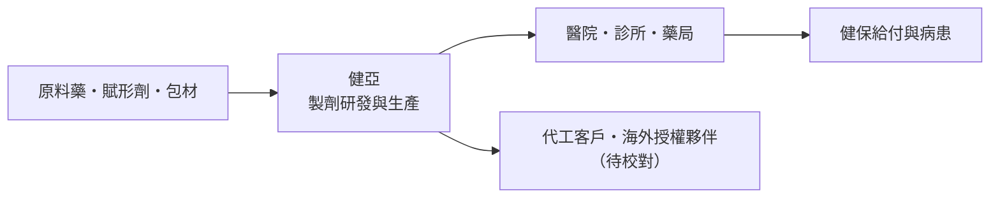
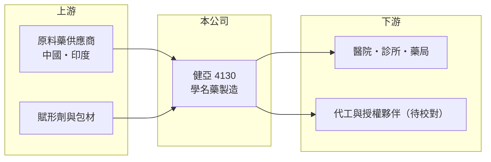

# 4130 健亞

> 上櫃｜[[產業索引-生技醫療業|生技醫療業]]｜上市（櫃）日期 2012/01/12

# 第一章：企業模式與商業藍圖

> [!info] 撰寫說明
> 本文由 Claude 依公開資料整理，架構比照 [[2330台積電]] 的四章研究，資料截至 2026-10-08。公開資料有限：櫃買中心 2026 年 10 月的開放資料快照（基本資料、2026 年第二季財報、每月營收）查無健亞的紀錄，MoneyDJ 理財網也查無年度財務比率，公司可能已有下櫃、合併或其他股權變動，請以公開資訊觀測站確認。唯一取得的財務數字是經濟日報標題「健亞 2025 年 EPS 0.10 元」。媒體另有多則股權爭奪與合併提案的報導，但標題未載明年份，依規則未寫入內文。產業描述多為憑記憶整理，已標註待校對。#待校對

評估一家藥廠，要先分清楚它是靠[[學名藥]]穩定賺錢，還是押注新藥研發的高風險報酬。本章說明健亞生物科技（股票代號：4130，以下簡稱健亞）的商業模式，由於公開資料有限，內容以產業結構為主。

## 一、核心定位：學名藥製造為本業

健亞於 2012 年 1 月在櫃買中心掛牌（依本筆記屬性），是一家以處方藥製造為主的台灣藥廠（產品線與廠區位置待校對）。學名藥是原廠專利到期後，由其他藥廠依相同成分、劑型與療效製造的藥品，台灣多數中小型藥廠都以此為主要收入。

* **學名藥的商業邏輯：** 不需負擔原創藥動輒十年的研發，靠製程能力、生產成本與通路取得穩定訂單。缺點是同一成分常有十幾家藥廠競爭，價格由[[健保藥價]]決定，利潤空間逐年被壓縮。
* **製造品質是門票：** 台灣藥廠須符合 PIC/S GMP 規範才能生產處方藥，這項規範也是外銷與承接代工的基本條件。

## 二、資本轉化邏輯

* **固定成本高：** 藥廠的廠房、品保與法規人員都是固定成本，產能利用率高低直接影響獲利。2025 年 EPS 僅 0.10 元，顯示本業獲利能力有限。

## 三、長期方向

中小型學名藥廠的長期出路通常有三條：開發具門檻的特殊劑型、承接 [[CDMO]] 代工訂單，或透過併購擴大規模。健亞屬於哪一條路線、股權結構是否已經改變，需要以公司最新公告確認（待校對）。

# 第二章：護城河深度與競爭優勢

護城河是企業抵禦競爭、長期維持超額利潤的機制。本章說明台灣學名藥廠普遍的優勢與限制，套用在健亞身上。

## 一、護城河的可能組成要素

* **1. 藥證與製造許可：** 每一張藥品許可證都需要生體相等性試驗與查驗登記，累積的藥證數量是一定程度的進入障礙。
* **2. PIC/S GMP 廠房：** 合規廠房的建置與維護成本高，使新進者不易進入處方藥製造。
* **3. 規模限制：** 但健亞規模小，難以在採購成本與通路上和大型藥廠競爭，護城河偏窄。

## 二、主要競爭對手格局

| 對手 | 定位 | 對健亞的影響 |
|---|---|---|
| [[4114健喬]] | 台灣學名藥與通路 | 同為學名藥廠，產品與通路重疊 |
| [[1720生達]]、[[1795美時]] | 規模較大的學名藥廠 | 成本與通路優勢 |
| [[1799易威]] | 學名藥與通路 | 學名藥同業 |

## 三、觀察重點

* **股權與公司存續狀態：** 官方開放資料已查無健亞的 2026 年財報與月營收，是否已下櫃或被合併，是研究這家公司的第一個前提（待校對）。
* **獲利能力：** 2025 年 EPS 0.10 元，若無新產品或代工訂單，獲利難以明顯改善。

# 第三章：財務體質與盈利規模

資料日期：2026-10-08。官方開放資料與 MoneyDJ 均查無健亞的多年度財務資料，表格是撰寫當時的快照；最新月營收、毛利率、累計 EPS 由自動排程寫在本筆記的屬性欄位（月營收、毛利率、累計EPS 等）。#待校對

財務報表是檢驗護城河是否真實存在的最終標準。由於資料來源有限，本章只能列出查得的數字，其餘以定性說明。

## 一、多年度財務表現

| 年度 | 營收（新台幣） | [[毛利率]] | [[營業利益率]] | EPS（元） | [[ROE]] |
|---|---|---|---|---|---|
| 2021 | 未查得 | 未查得 | 未查得 | 未查得 | 未查得 |
| 2022 | 未查得 | 未查得 | 未查得 | 未查得 | 未查得 |
| 2023 | 未查得 | 未查得 | 未查得 | 未查得 | 未查得 |
| 2024 | 未查得 | 未查得 | 未查得 | 未查得 | 未查得 |
| 2025 | 未查得 | 未查得 | 未查得 | 0.10 | 未查得 |

資料來源：2025 年 EPS 取自經濟日報報導標題；其餘年度在本次查詢的來源中都未取得。

學名藥廠的財務特徵通常是毛利率中等、營業利益率偏低，獲利主要取決於產能利用率與藥價調整。健亞 2025 年 EPS 僅 0.10 元，代表獲利接近損益兩平。

## 二、[[ROIC]] 與 [[WACC]]：價值創造利差

**ROIC：** 未查得營業利益、股東權益與有息負債，無法推算。以 2025 年 EPS 0.10 元判斷，ROIC 應接近零（推估）。

**WACC 推算：** 台灣 10 年期公債殖利率取 1.75%、市場風險溢酬 6%、β 取製藥同業常見值 0.9（未查得公司實際 β），股東權益成本約 7.15%。若資本結構以權益為主，WACC 約落在 6% 至 7%（推算）。

**結論：** 以接近零的獲利水準來看，健亞的 ROIC 明顯低於 WACC，代表目前並未替股東創造超額價值（推估）。這也是小型學名藥廠容易成為併購對象的原因。

# 第四章：總體風險與地緣政治

任何企業都無法脫離宏觀環境獨立存在。本章分析健亞這類學名藥廠長期必須面對的風險。

## 一、法規與藥價風險

* **健保藥價調整：** 健保署定期調降藥價，學名藥受影響最大，獲利空間會持續被壓縮。
* **法規升級：** PIC/S GMP 與藥品查驗登記標準提高，維持合規需要持續投入。

## 二、營運與公司治理風險

* **規模不足：** 小型藥廠在原料採購、通路議價上都處於弱勢。
* **股權變動：** 公司狀態與股權結構需以公開資訊觀測站確認，若發生合併或下櫃，原股東權益的處理方式會改變（待校對）。

## 三、其他風險

* **原料藥供應：** 原料藥多仰賴中國與印度，供應中斷或漲價會影響生產成本。

# 專有名詞解析

## 金融

- **[[ROIC]]**：投入資本報酬率，稅後營業利益除以股東權益加有息負債，衡量本業運用資本的效率。
- **[[WACC]]**：加權平均資金成本，股東與債權人要求報酬率的加權平均，是 ROIC 要超越的門檻。

## 產業

- **[[學名藥]]**：原廠藥專利到期後，由其他藥廠以相同成分、劑型與療效製造的藥品，價格較低。
- **[[健保藥價]]**：健保署核定的藥品給付價格，定期調整，是台灣藥廠營收與毛利的關鍵變數。
- **[[PIC S GMP]]**：國際醫藥品稽查協約組織的藥品優良製造規範，台灣處方藥廠必須符合。
- **[[CDMO]]**：委託開發暨製造服務，替客戶進行藥品製程開發與量產的代工模式。

# 核心供應鏈

## 1. 上游：原料
- 原料藥、賦形劑與包材供應商（名稱未查得）

## 2. 中游：健亞與同業
- 學名藥同業：[[4114健喬]]、[[1720生達]]、[[1795美時]]、[[1799易威]]

## 3. 下游：客戶
- 醫院、診所、社區藥局，最終由健保給付與病患使用

## 最新新聞
<!-- news:start -->
<!-- news:end -->

## 相關連結
- [公開資訊觀測站](https://mopsov.twse.com.tw/mops/web/t05st03?step=1&firstin=1&co_id=4130)
- [Goodinfo](https://goodinfo.tw/tw/StockDetail.asp?STOCK_ID=4130)
- [Yahoo 股市](https://tw.stock.yahoo.com/quote/4130)
- [鉅亨網新聞](https://www.cnyes.com/twstock/4130/news)
