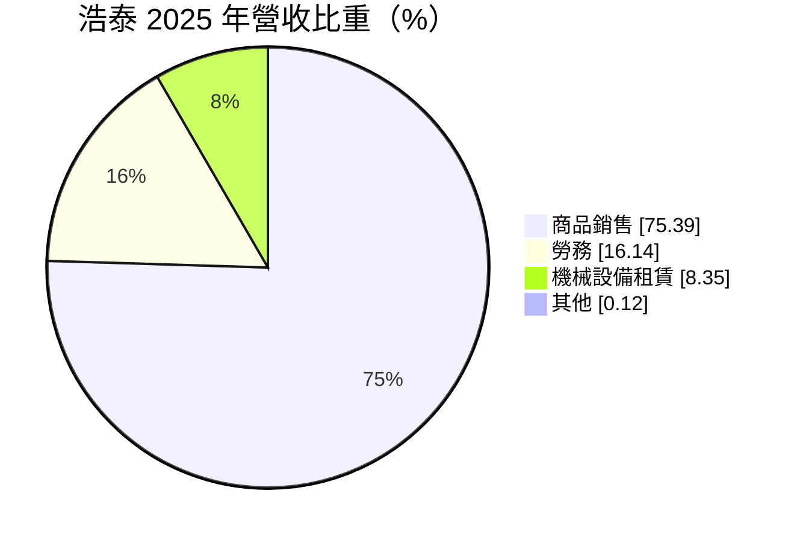
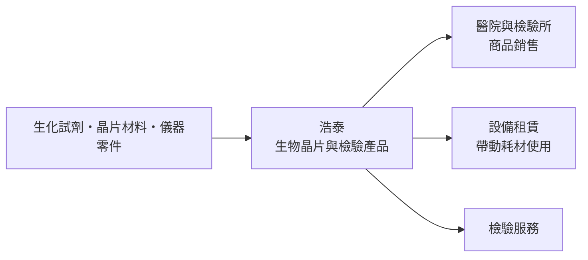
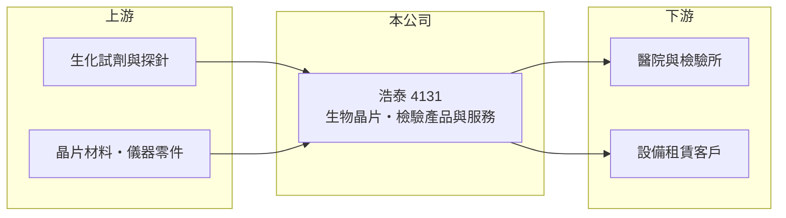

# 4131 浩泰

> 上櫃｜[[產業索引-生技醫療業|生技醫療業]]｜上市（櫃）日期 2004/04/09

# 第一章：企業模式與商業藍圖

> [!info] 撰寫說明
> 本文由 Claude 依公開資料整理，架構比照 [[2330台積電]] 的四章研究，資料截至 2026-10-08。財務數字來源：MoneyDJ 理財網年度財務比率與公司基本資料（2025 年營收比重）、櫃買中心開放資料（基本資料、2026 年第二季財報、每月營收）、科技新報公司資料（公司全名）、CMoney 投資快訊標題（業務描述）。公開資料有限，公司舊名、產品細節與 2025 年營收跳升的原因未能確認，已標註待校對。#待校對

評估一家小型檢驗生技公司，關鍵在於它能否把技術變成穩定、可重複的營收。本章說明浩泰精準（股票代號：4131，以下簡稱浩泰）的商業模式。

## 一、核心定位：生物晶片與醫學檢驗

浩泰成立於 1998 年，2004 年在櫃買中心掛牌，登記地址在台南市，董事長為周鼎茂，實收資本額約 4.0 億元。依 CMoney 的描述，浩泰是專注醫學檢驗領域的[[生物晶片]]公司；公司舊名可能為晶宇生物科技（憑記憶，待校對）。依 MoneyDJ 資料，2025 年營收中商品銷售占 75.4%、勞務（檢驗服務）占 16.1%、機械設備租賃占 8.4%。

* **商品、服務與租賃並行：** 檢驗試劑或晶片屬於耗材，設備租賃讓客戶不必一次買斷儀器，之後持續採購耗材與服務，這是體外診斷產業常見的「儀器帶耗材」模式。
* **規模仍小：** 2025 年營收約 2.5 億元（推算），即使大幅成長，仍是一家小型公司，固定費用對獲利的影響很大。

## 二、資本轉化邏輯

* **營收在 2025 年跳升：** 每股營業額由 2024 年的 1.56 元升到 2025 年的 6.19 元，營收約變為四倍（推算），2026 年 1 至 8 月營收約 1.89 億元，又較去年同期成長約 16.5%。跳升的來源（新產品、新客戶或併入新事業）未查得，待校對。

## 三、長期方向

浩泰的長期課題是讓新增的營收規模站穩，並把毛利率從過去的低檔拉回到檢驗耗材應有的水準。2026 年上半年營業利益已轉為小幅正數，若能延續，代表公司開始跨過損益兩平點。

# 第二章：護城河深度與競爭優勢

護城河是企業抵禦競爭、長期維持超額利潤的機制。本章說明浩泰在醫學檢驗市場的優勢與限制。

## 一、浩泰護城河的可能組成要素

* **1. 檢驗平台的轉換成本：** 檢驗所一旦導入某一套儀器與試劑，要更換就得重新驗證流程，因此「儀器加耗材」的組合有一定黏著度。
* **2. 法規許可：** 體外診斷產品需要取得[[醫材許可證]]，取得證照需要時間與臨床資料。
* **3. 限制：** 但浩泰長年虧損，研發與通路資源有限，護城河目前偏窄。

## 二、主要競爭對手格局

| 對手 | 定位 | 對浩泰的影響 |
|---|---|---|
| 國際體外診斷大廠（Roche、Abbott、Siemens 等） | 儀器與試劑完整平台 | 掌握大型醫院與檢驗所 |
| [[4736泰博]]、[[1733五鼎]] | 台灣體外診斷與血糖檢測 | 台灣檢驗醫材同業 |

## 三、優勢轉化：守得住與守不住的地方

* **守不住的歷史：** 2018 至 2025 年營業利益率每年都是負數，2023 年甚至低於 -130%，顯示過去的營收規模不足以支撐研發與營運費用。
* **改善的跡象：** 2025 年毛利率回升到 35.3%，2026 年上半年約 43.8%，營業利益約 459 萬元，首次出現正數。
* **觀察重點：** 營收能否穩定在 2025 年以後的規模，以及毛利率能否維持在四成以上。

# 第三章：財務體質與盈利規模

資料日期：2026-10-08。數字取自 MoneyDJ 理財網年度財務資料與櫃買中心開放資料，表格是撰寫當時的快照；最新月營收、毛利率、累計 EPS 由自動排程寫在本筆記的屬性欄位（月營收、毛利率、累計EPS 等）。#待校對

財務報表是檢驗護城河是否真實存在的最終標準。本章用五年的三率、ROE 與資本報酬，檢視浩泰由虧轉盈的進度。

## 一、多年度財務表現

| 年度 | 營收（新台幣） | 每股營業額 | [[毛利率]] | [[營業利益率]] | EPS（元） | [[ROE]] |
|---|---|---|---|---|---|---|
| 2021 | 未查得 | 4.68 元 | 21.8% | -31.9% | -0.91 | -18.40% |
| 2022 | 未查得 | 4.68 元 | 13.3% | -45.3% | -1.49 | -38.80% |
| 2023 | 未查得 | 1.64 元 | -14.0% | -131.2% | -1.87 | -37.98% |
| 2024 | 約 0.62 億（推算） | 1.56 元 | 5.4% | -119.9% | -1.23 | -17.34% |
| 2025 | 約 2.47 億（推算） | 6.19 元 | 35.3% | -25.7% | -0.78 | -11.30% |

資料來源：MoneyDJ 理財網年度財務比率（合併報表）；營收以每股營業額乘目前股數約 3,986 萬股推算。每股淨值由 2022 年的 4.00 元跳到 2023 年的 8.80 元，顯示當時股本有變動（減資或增資，待校對），因此 2023 年以前不推算營收。2026 年上半年（櫃買中心資料）營收約 1.56 億元、毛利率約 43.8%、營業利益約 459 萬元、EPS -0.06 元。

浩泰近五年 ROE 全為負數，平均約 -25%（推算），長期仰賴股東資金支應虧損，未發放現金股利。2025 年以後營收規模放大、毛利率回升，是多年來第一次看到結構性改善的跡象，但能否轉為穩定獲利仍待觀察。

## 二、[[ROIC]] 與 [[WACC]]：價值創造利差

**ROIC 推算：** 2025 年營業損失約 0.63 億元（營收約 2.47 億元乘營業利益率 -25.7%，推算），虧損不計稅盾。2026 年第二季權益總計約 3.07 億元、負債總計約 2.74 億元，假設四成為有息負債約 1.1 億元（推估），投入資本約 4.2 億元，ROIC 約 -15%（推算）。

**WACC 推算：** 台灣 10 年期公債殖利率取 1.75%、市場風險溢酬 6%，虧損型小型生技股風險較高，β 取 1.1（同業常見值，未查得公司實際 β），股東權益成本約 8.35%。負債成本假設 2.5%，稅率 20%，稅後約 2.0%。權益約占投入資本 74%，WACC 約 6.7%（推算）。

**結論：** ROIC 為負，遠低於 WACC，代表浩泰長期是在消耗股東資本而非創造價值。2026 年上半年營業利益轉正後，ROIC 可能回到零附近，但要超過約 7% 的資金成本，營業利益率需要大幅提升。

# 第四章：總體風險與地緣政治

任何企業都無法脫離宏觀環境獨立存在。本章分析浩泰長期必須面對的營運、法規與財務風險。

## 一、營運風險

* **營收來源集中與不透明：** 2025 年營收大幅跳升的原因未能確認，若來自少數客戶或一次性專案，未來可能不易延續。
* **規模經濟不足：** 營收規模小，研發、法規與管理費用的比重高，獲利對營收波動非常敏感。

## 二、法規風險

* **醫材法規：** 體外診斷產品需符合各國[[醫材法規]]，新規範會增加認證成本與上市時間。

## 三、財務風險

* **長期虧損與增資需求：** 歷年虧損累積，若無法持續獲利，未來可能需要再辦理增資或減資彌補虧損，稀釋或影響原股東權益。
* **負債比率上升：** 負債比率由 2024 年的 10.5% 升到 2025 年的 45.3%，財務槓桿明顯提高。

# 專有名詞解析

## 金融

- **[[ROIC]]**：投入資本報酬率，稅後營業利益除以股東權益加有息負債，衡量本業運用資本的效率。
- **[[WACC]]**：加權平均資金成本，股東與債權人要求報酬率的加權平均，是 ROIC 要超越的門檻。

## 產業

- **[[生物晶片]]**：在微小基板上排列大量生物分子探針，可一次檢測多種基因或蛋白質的檢驗工具。
- **[[醫材許可證]]**：醫療器材在各國上市前須取得的主管機關核准，審查內容包括安全性與有效性資料。
- **[[醫材法規]]**：各國對醫療器材上市與上市後監督的規範，例如歐盟 MDR、美國 FDA 510(k) 與 PMA。

# 核心供應鏈

## 1. 上游：原料與零件
- 生化試劑、探針、晶片材料與儀器零件供應商（名稱未查得）

## 2. 中游：浩泰與同業
- 台灣體外診斷同業：[[4736泰博]]、[[1733五鼎]]

## 3. 下游：客戶
- 醫院、檢驗所與研究機構（客戶名稱未查得）

## 最新新聞
<!-- news:start -->
<!-- news:end -->

## 相關連結
- [公開資訊觀測站](https://mopsov.twse.com.tw/mops/web/t05st03?step=1&firstin=1&co_id=4131)
- [Goodinfo](https://goodinfo.tw/tw/StockDetail.asp?STOCK_ID=4131)
- [Yahoo 股市](https://tw.stock.yahoo.com/quote/4131)
- [鉅亨網新聞](https://www.cnyes.com/twstock/4131/news)
