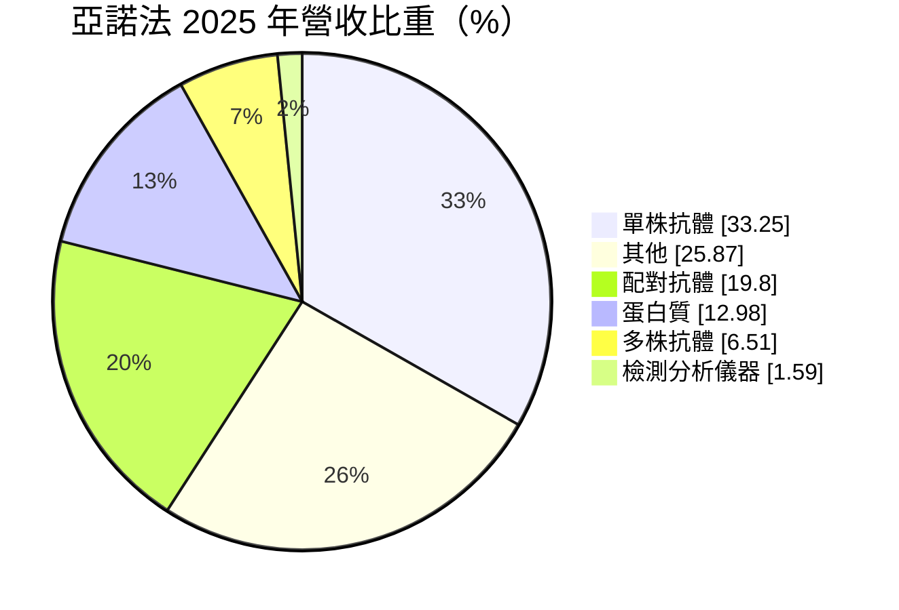
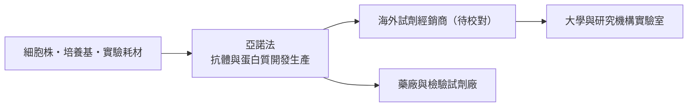
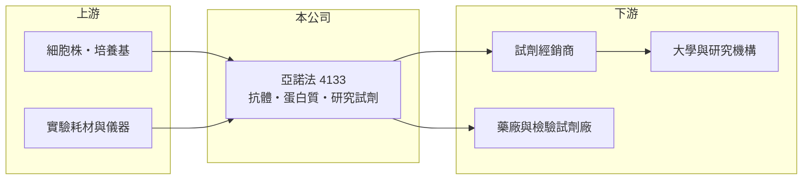

# 4133 亞諾法

> 上市｜[[產業索引-生技醫療業|生技醫療業]]｜上市（櫃）日期 2009/12/28

# 第一章：企業模式與商業藍圖

> [!info] 撰寫說明
> 本文由 Claude 依公開資料整理，架構比照 [[2330台積電]] 的四章研究，資料截至 2026-10-08。財務數字來源：MoneyDJ 理財網年度財務比率與公司基本資料（2025 年營收比重）、證交所開放資料（基本資料、2026 年第二季財報與營益分析、每月營收、股利）。銷售通路與客群描述為產業整理性內容，已標註待校對。#待校對

評估研究試劑公司，要看它賣的是一次性的大型設備，還是實驗室天天要用的耗材。本章說明亞諾法生技（股票代號：4133，英文名 Abnova，以下簡稱亞諾法）的商業模式。

## 一、核心定位：生命科學研究用抗體與蛋白質供應商

亞諾法成立於 2002 年，總部位於台北市內湖區，2009 年在證交所上市，董事長為黃韋伯，實收資本額約 6.1 億元。公司以「Abnova」品牌銷售[[研究試劑]]，依 MoneyDJ 資料，2025 年營收中[[單株抗體]]占 33.3%、[[配對抗體]]占 19.8%、蛋白質占 13.0%、多株抗體占 6.5%、檢測分析儀器占 1.6%、其他占 25.9%。

* **型錄式產品：** 研究試劑的特色是品項數量龐大、單價不高，客戶是大學、研究機構與藥廠的實驗室。誰能提供最齊全、品質穩定的型錄，誰就容易被研究人員反覆採購。
* **配對抗體連結檢驗應用：** 配對抗體是兩支能同時辨認同一目標蛋白的抗體，常用來開發 ELISA 等檢測試劑，讓亞諾法的產品可以從純研究延伸到檢驗試劑開發。

## 二、資本轉化邏輯

* **前期投入、長期收割：** 每一支抗體開發完成後，可以在型錄上銷售很多年，邊際生產成本低，因此毛利率長期維持在 44% 至 49%。
* **規模不易放大：** 研究試劑市場分散，單一品項的需求有限，營收成長主要靠增加品項與通路，而不是單一爆款產品。

## 三、長期方向

亞諾法的長期課題，是在研究試劑之外找到更大的應用，例如把配對抗體與蛋白質延伸到體外診斷試劑原料或藥物開發服務（具體布局待校對）。研究經費的長期成長與生技藥物開發的熱度，是它需求面的基本驅動力。

# 第二章：護城河深度與競爭優勢

護城河是企業抵禦競爭、長期維持超額利潤的機制。本章說明亞諾法在研究試劑市場的優勢與限制。

## 一、亞諾法護城河的核心組成要素

* **1. 品項資料庫：** 長年累積的抗體與蛋白質型錄，是新進者需要多年時間與大量資金才能複製的資產。
* **2. 研究人員的引用習慣：** 學術論文若引用某品牌抗體，後續研究者為了重現結果，往往會沿用同一產品，形成一種隱性的轉換成本。
* **3. 財務穩健：** 負債比率長年只有 5% 到 7%，幾乎沒有財務槓桿，能夠承受景氣波動。

## 二、主要競爭對手格局

| 對手 | 定位 | 對亞諾法的影響 |
|---|---|---|
| Thermo Fisher、Abcam（Danaher 旗下，待校對） | 全球研究試劑龍頭 | 品項、品牌與通路全面領先 |
| Cell Signaling Technology、Bio-Techne | 高品質抗體與蛋白質 | 在高階研究市場競爭 |
| 中國試劑廠 | 低價抗體與蛋白質 | 壓低一般品項價格 |

## 三、優勢轉化：守得住與守不住的地方

* **守得住：** 毛利率長期穩定在 44% 以上，2018 至 2025 年從未出現虧損的營業利益，代表產品本身有定價能力。
* **守不住：** 營業利益率由 2022 年的 15.7% 降到 2025 年的 4.9%，每股營業額也由 2021 年的 7.46 元降到 2025 年的 5.80 元，顯示營收在萎縮、費用卻相對固定。
* **觀察重點：** 營收能否止跌回升，以及 2026 年上半年營業利益率回到約 9.9% 是否能延續。

# 第三章：財務體質與盈利規模

資料日期：2026-10-08。數字取自 MoneyDJ 理財網年度財務資料與證交所開放資料，表格是撰寫當時的快照；最新月營收、毛利率、累計 EPS 由自動排程寫在本筆記的屬性欄位（月營收、毛利率、累計EPS 等）。#待校對

財務報表是檢驗護城河是否真實存在的最終標準。本章用五年的三率、ROE 與資本報酬，檢視亞諾法的獲利品質。

## 一、多年度財務表現

| 年度 | 營收（新台幣） | 每股營業額 | [[毛利率]] | [[營業利益率]] | EPS（元） | [[ROE]] |
|---|---|---|---|---|---|---|
| 2021 | 約 4.5 億（推算） | 7.46 元 | 43.7% | 9.7% | 0.47 | 2.34% |
| 2022 | 約 4.1 億（推算） | 6.80 元 | 48.9% | 15.7% | 1.24 | 5.98% |
| 2023 | 約 3.8 億（推算） | 6.31 元 | 45.5% | 12.4% | 0.72 | 3.39% |
| 2024 | 約 3.6 億（推算） | 5.87 元 | 46.0% | 9.7% | 1.02 | 4.75% |
| 2025 | 約 3.5 億（推算） | 5.80 元 | 44.4% | 4.9% | -0.02 | -0.09% |

資料來源：MoneyDJ 理財網年度財務比率（合併報表）；營收以每股營業額乘目前股數約 6,055 萬股推算，每股淨值多年維持在 20 至 22 元，股本變動應不大。2026 年上半年（證交所資料）營收約 1.76 億元、毛利率 51.9%、營業利益率 9.9%、EPS 0.38 元；2026 年 1 至 8 月營收約 2.29 億元，較去年同期減少約 5.0%。

亞諾法最大的財務特徵是「高毛利、低報酬」：毛利率接近五成，但近五年平均 ROE 只有約 3.3%（推算），2021 至 2025 年營收年複合成長率約 -6.1%（推算）。原因是公司持有大量權益資本、營收規模小，費用比重高。股利方面，2025 年雖然小幅虧損，仍以累積盈餘配發每股 0.112 元現金股利（證交所資料），配息金額不高但未中斷。

## 二、[[ROIC]] 與 [[WACC]]：價值創造利差

**ROIC 推算：** 2025 年營業利益約 0.17 億元（營收約 3.51 億元乘營業利益率 4.85%，推算），稅後約 0.14 億元。2026 年第二季權益總計約 12.7 億元、負債總計僅約 0.8 億元，假設四成為有息負債約 0.3 億元（推估），投入資本約 13.1 億元，ROIC 約 1.0%（推算）。2022 年營業利益率較高時，ROIC 推估也只在 4% 左右。

**WACC 推算：** 台灣 10 年期公債殖利率取 1.75%、市場風險溢酬 6%、β 取生技同業常見值 0.9（未查得公司實際 β），股東權益成本約 7.15%。公司幾乎沒有負債，權益占投入資本約 98%，WACC 約 7.0%（推算）。

**結論：** ROIC 長期低於 WACC，代表亞諾法的資本並未創造超額價值。問題不在產品毛利，而在營收規模太小、權益資本太多；若能提升營收或把閒置資金還給股東，報酬率才有改善空間。

# 第四章：總體風險與地緣政治

任何企業都無法脫離宏觀環境獨立存在。本章分析亞諾法長期必須面對的市場、競爭與匯率風險。

## 一、市場需求風險

* **研究經費波動：** 研究試劑的需求取決於各國政府與藥廠的研發預算，美國國家衛生研究院（NIH）等機構經費縮減時，學術端採購會直接下滑。
* **生技投資循環：** 新創生技公司募資困難時，會減少實驗與試劑採購。

## 二、競爭風險

* **大廠整併：** 國際試劑龍頭持續併購，品項與通路優勢擴大，小型品牌被邊緣化的風險提高。
* **低價競爭：** 中國試劑廠以低價切入一般品項，壓縮毛利。

## 三、其他風險

* **匯率：** 研究試劑多外銷，以美元與歐元計價，新台幣升值會壓低以台幣計算的營收與毛利。

# 專有名詞解析

## 金融

- **[[ROIC]]**：投入資本報酬率，稅後營業利益除以股東權益加有息負債，衡量本業運用資本的效率。
- **[[WACC]]**：加權平均資金成本，股東與債權人要求報酬率的加權平均，是 ROIC 要超越的門檻。

## 產業

- **[[單株抗體]]**：由單一細胞株產生、只辨認單一抗原位點的抗體，專一性高，用於研究、檢驗與治療。
- **[[配對抗體]]**：兩支能同時辨認同一目標蛋白不同位置的抗體，是開發 ELISA 等夾心式檢測試劑的關鍵原料。
- **[[研究試劑]]**：供大學、研究機構與藥廠實驗室使用的抗體、蛋白質與化學品，不用於臨床診斷或治療。

# 核心供應鏈

## 1. 上游：原料
- 細胞株、培養基與實驗耗材供應商（名稱未查得）

## 2. 中游：亞諾法與同業
- 國際研究試劑廠：Thermo Fisher、Abcam、Cell Signaling Technology、Bio-Techne

## 3. 下游：客戶
- 全球試劑經銷商、大學與研究機構實驗室、藥廠與檢驗試劑廠（客戶名稱未查得）

## 最新新聞
<!-- news:start -->
<!-- news:end -->

## 相關連結
- [公開資訊觀測站](https://mopsov.twse.com.tw/mops/web/t05st03?step=1&firstin=1&co_id=4133)
- [Goodinfo](https://goodinfo.tw/tw/StockDetail.asp?STOCK_ID=4133)
- [Yahoo 股市](https://tw.stock.yahoo.com/quote/4133)
- [鉅亨網新聞](https://www.cnyes.com/twstock/4133/news)
