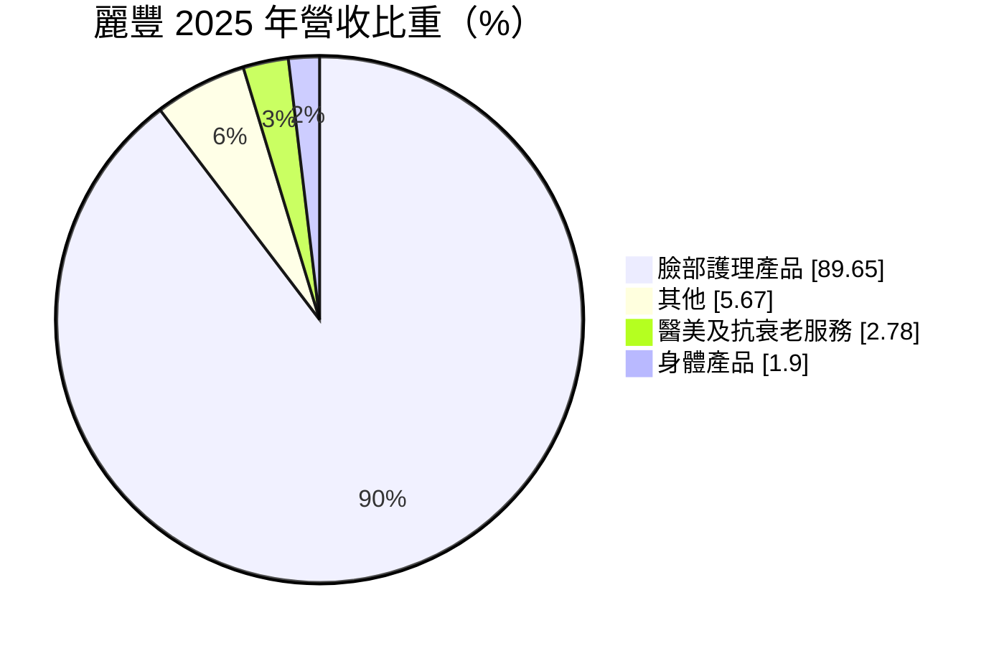
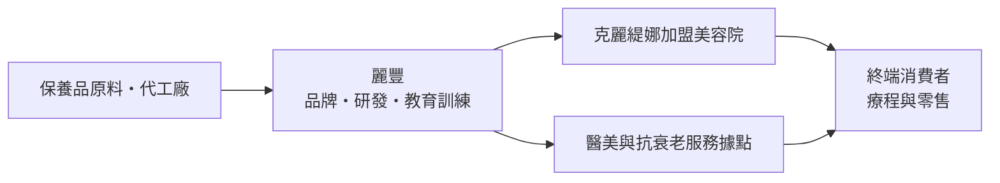
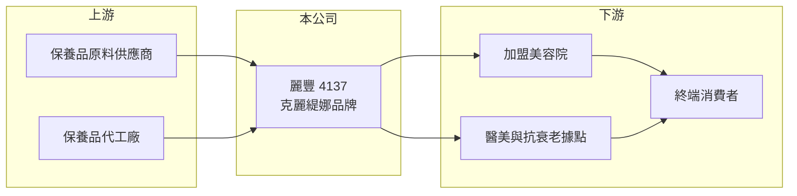

# 4137 麗豐-KY

> 上市｜[[產業索引-生技醫療業|生技醫療業]]｜上市（櫃）日期 2013/11/27

# 第一章：企業模式與商業藍圖

> [!info] 撰寫說明
> 本文由 Claude 依公開資料整理，架構比照 [[2330台積電]] 的四章研究，資料截至 2026-10-08。財務數字來源：MoneyDJ 理財網年度財務比率與公司基本資料（2025 年營收比重）、證交所開放資料（基本資料、2026 年第二季財報與營益分析、每月營收、股利）。加盟體系的運作方式與主要市場為整理性內容，已標註待校對。#待校對

評估一家美容品牌，要看它賺的是一次性的產品錢，還是能靠通路網絡持續回購的錢。本章說明麗豐控股（股票代號：4137，品牌「克麗緹娜 CHLITINA」，以下簡稱麗豐）的商業模式。

## 一、核心定位：以加盟美容院銷售自有保養品

麗豐為開曼群島註冊的控股公司，2012 年成立，2013 年在證交所上市，董事長兼總經理為趙承佑，實收資本額約 8.2 億元。依 MoneyDJ 資料，2025 年營收中臉部護理產品占 89.7%、其他占 5.7%、醫美及抗衰老服務占 2.8%、身體產品占 1.9%。

* **品牌商加[[加盟]]通路：** 麗豐的主要客戶是使用克麗緹娜品牌的加盟美容院，由加盟店向公司進貨保養品，再用於店內療程或賣給消費者（主要市場為中國，待校對）。公司不必自己經營每一家店，卻能透過店數擴張放大營收。
* **高毛利的品牌產品：** 2025 年[[毛利率]]約 82.1%，2018 年以來都在 82% 至 85% 之間，這是品牌消費品的典型特徵，產品成本只占售價的一小部分。

## 二、資本轉化邏輯

* **輕資產的現金機器：** 加盟店負擔店面與人力，品牌商只需負責產品、教育訓練與行銷，因此資本支出小、現金流充沛，能維持高配息。
* **加盟店的健康度決定營收：** 加盟店的來客數與續約意願，取決於消費景氣與品牌吸引力。

## 三、長期方向

麗豐的長期課題，是在中國美容院市場成熟之後，找到新的成長來源。營收中已出現醫美及抗衰老服務，代表公司嘗試從生活美容延伸到[[醫學美容]]（具體據點與規模待校對）。能否讓加盟體系年輕化、吸引新一代消費者，決定這個品牌未來十年的地位。

# 第二章：護城河深度與競爭優勢

護城河是企業抵禦競爭、長期維持超額利潤的機制。本章說明麗豐的品牌與加盟網絡優勢，以及這些優勢在消費習慣改變下能守住多少。

## 一、麗豐護城河的核心組成要素

* **1. 加盟網絡：** 大量加盟美容院構成的銷售網絡，是新品牌很難在短期內複製的通路資產。加盟主投入了裝潢與人力，更換品牌的成本高。
* **2. 品牌與教育體系：** 美容院的療程需要美容師受訓操作，品牌商提供的教育訓練與產品綁在一起，提高了加盟主的黏著度。
* **3. 定價能力：** 毛利率長期維持在八成以上，代表品牌有足夠的溢價能力。

## 二、主要競爭對手格局

| 對手 | 定位 | 對麗豐的影響 |
|---|---|---|
| 國際保養品牌（雅詩蘭黛、萊雅等） | 百貨與電商通路 | 爭奪同一批中高階消費者 |
| 中國本土美容院連鎖與品牌 | 價格較低、在地化 | 在美容院通路直接競爭 |
| 醫美診所 | 以醫療手段取代生活美容 | 分流追求快速效果的消費者 |
| [[4138曜亞]] | 台灣醫美器材與產品代理 | 醫美領域的同業 |

## 三、優勢轉化：守得住與守不住的地方

* **守得住：** 毛利率穩定在 82% 以上，代表品牌價值沒有明顯流失。
* **守不住：** 營業利益率由 2019 年的 34.8% 降到 2024 年的 18.5%，每股營業額由 2021 年的 66.3 元降到 2025 年的 47.0 元，顯示營收規模縮小，而通路與行銷費用相對固定。
* **觀察重點：** 營收能否止跌，以及醫美與抗衰老服務能否成為新的成長來源。

# 第三章：財務體質與盈利規模

資料日期：2026-10-08。數字取自 MoneyDJ 理財網年度財務資料與證交所開放資料，表格是撰寫當時的快照；最新月營收、毛利率、累計 EPS 由自動排程寫在本筆記的屬性欄位（月營收、毛利率、累計EPS 等）。#待校對

財務報表是檢驗護城河是否真實存在的最終標準。本章用五年的三率、ROE、配息與資本報酬，檢視麗豐的獲利品質。

## 一、多年度財務表現

| 年度 | 營收（新台幣） | 每股營業額 | [[毛利率]] | [[營業利益率]] | EPS（元） | [[ROE]] |
|---|---|---|---|---|---|---|
| 2021 | 約 54.7 億（推算） | 66.31 元 | 83.1% | 33.6% | 17.05 | 28.83% |
| 2022 | 約 42.5 億（推算） | 51.51 元 | 82.5% | 29.0% | 8.68 | 14.30% |
| 2023 | 約 47.1 億（推算） | 57.05 元 | 83.5% | 26.4% | 13.03 | 21.09% |
| 2024 | 約 40.7 億（推算） | 49.30 元 | 82.9% | 18.5% | 5.81 | 8.84% |
| 2025 | 約 38.8 億（推算） | 47.01 元 | 82.1% | 19.0% | 7.13 | 10.87% |

資料來源：MoneyDJ 理財網年度財務比率（合併報表）；營收以每股營業額乘目前股數約 8,249 萬股推算，股本多年未見大幅變動，但仍屬推算。2026 年上半年（證交所資料）營收約 19.0 億元、毛利率 79.8%、營業利益率 14.8%、EPS 2.92 元；2026 年 1 至 8 月營收約 25.1 億元，較去年同期成長約 5.2%。

麗豐近五年平均 ROE 約 16.8%（推算），但趨勢明顯向下，2021 至 2025 年營收年複合成長率約 -8.2%（推算）。配息是麗豐最突出的特徵：依證交所資料，2025 年度第四季擬配發盈餘現金股利每股 7 元加資本公積現金每股 3 元，合計 10 元，高於當年 EPS 7.13 元，代表公司把多年累積的資金大量還給股東。

## 二、[[ROIC]] 與 [[WACC]]：價值創造利差

**ROIC 推算：** 2025 年營業利益約 7.4 億元（營收約 38.8 億元乘營業利益率 19.0%，推算），稅後約 5.9 億元。2026 年第二季權益總計約 49.4 億元、負債總計約 50.7 億元，官方資料未拆分有息負債，假設四成為有息負債約 20.3 億元（推估），投入資本約 69.6 億元，ROIC 約 8.5%（推算）。由於負債中可能有相當比例是應付股利、合約負債等無息負債，實際 ROIC 可能更高。

**WACC 推算：** 台灣 10 年期公債殖利率取 1.75%、市場風險溢酬 6%、β 取消費品同業常見值 0.9（未查得公司實際 β），股東權益成本約 7.15%。負債成本假設 2.5%，稅率 20%，稅後約 2.0%。權益約占投入資本 71%，WACC 約 5.7%（推算）。

**結論：** ROIC 仍高於 WACC 約 2.8 個百分點，品牌事業仍在創造價值；但 2021 年 ROE 接近 29% 時的利差遠大於現在，價值創造能力正在縮小。

# 第四章：總體風險與地緣政治

任何企業都無法脫離宏觀環境獨立存在。本章分析麗豐長期必須面對的地緣政治、消費與營運風險。

## 一、地緣政治與政策風險

* **中國市場集中：** 若主要營收來自中國加盟店，公司會受中國消費景氣、化妝品監管法規與兩岸關係影響（市場比重待校對）。
* **資金匯出：** 開曼控股公司的獲利需要從營運子公司匯回才能配息，外匯管制或稅制改變會影響配息能力。

## 二、消費與競爭風險

* **消費習慣改變：** 年輕消費者偏好電商與醫美，傳統美容院的來客數可能長期下滑。
* **加盟體系老化：** 加盟主若退出或轉換品牌，營收會直接減少。

## 三、匯率風險

* **人民幣匯率：** 營收若以人民幣計價，人民幣兌新台幣貶值會降低以台幣計算的營收與獲利。

# 專有名詞解析

## 金融

- **[[ROIC]]**：投入資本報酬率，稅後營業利益除以股東權益加有息負債，衡量本業運用資本的效率。
- **[[WACC]]**：加權平均資金成本，股東與債權人要求報酬率的加權平均，是 ROIC 要超越的門檻。

## 產業

- **[[加盟]]**：品牌商授權加盟主使用品牌與經營方式，加盟主自負店面成本並向品牌商進貨，品牌商得以輕資產擴張。
- **[[醫學美容]]**：以醫療器材、注射或雷射等醫療手段改善外觀的服務，須由醫師執行，簡稱醫美。

# 核心供應鏈

## 1. 上游：原料與代工
- 保養品原料與代工廠（名稱未查得）

## 2. 中游：麗豐與同業
- 美容與醫美同業：[[4138曜亞]]、[[4190佐登-KY]]（待校對業務重疊程度）

## 3. 下游：客戶
- 克麗緹娜加盟美容院、醫美據點，最終為接受療程與購買產品的消費者

## 最新新聞
<!-- news:start -->
<!-- news:end -->

## 相關連結
- [公開資訊觀測站](https://mopsov.twse.com.tw/mops/web/t05st03?step=1&firstin=1&co_id=4137)
- [Goodinfo](https://goodinfo.tw/tw/StockDetail.asp?STOCK_ID=4137)
- [Yahoo 股市](https://tw.stock.yahoo.com/quote/4137)
- [鉅亨網新聞](https://www.cnyes.com/twstock/4137/news)
