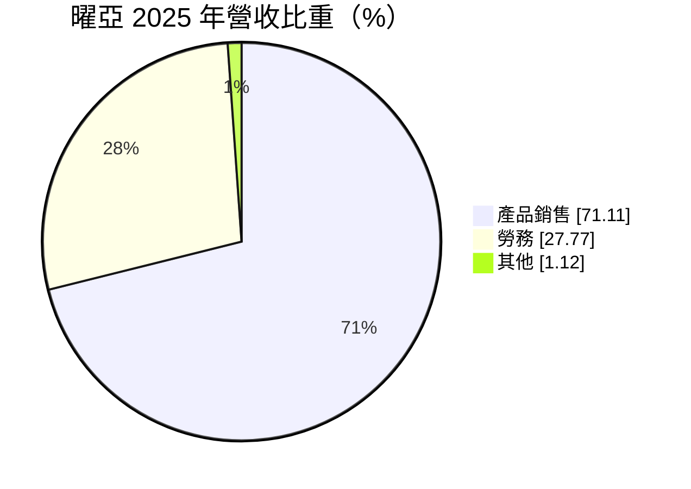
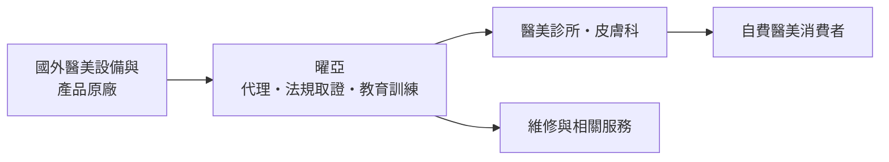
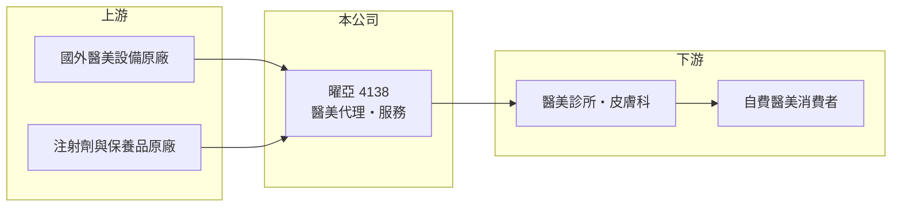

# 4138 曜亞

> 上櫃｜[[產業索引-生技醫療業|生技醫療業]]｜上市（櫃）日期 2010/12/29

# 第一章：企業模式與商業藍圖

> [!info] 撰寫說明
> 本文由 Claude 依公開資料整理，架構比照 [[2330台積電]] 的四章研究，資料截至 2026-10-08。財務數字來源：MoneyDJ 理財網年度財務比率與公司基本資料（2025 年營收比重）、櫃買中心開放資料（基本資料、2026 年第二季財報、每月營收、本益比殖利率）。代理品牌、服務收入內容與客群描述為整理性內容，未能逐項確認，已標註待校對。#待校對

評估一家代理商，要看它手上的代理權是否穩固，以及它能否在代理之外建立自己的附加價值。本章說明曜亞國際（股票代號：4138，以下簡稱曜亞）的商業模式。

## 一、核心定位：醫學美容產業的設備與產品通路商

曜亞成立於 2003 年，總部位於新北市中和區，2010 年在櫃買中心掛牌，董事長為傅輝東，實收資本額約 4.0 億元。曜亞主要以[[代理商]]身分，把國外的[[醫學美容]]設備、注射與保養產品引進台灣醫美診所（代理品牌細節待校對）。依 MoneyDJ 資料，2025 年營收中產品銷售占 71.1%、勞務占 27.8%、其他占 1.1%。

* **產品銷售：** 醫美雷射、電波等設備屬於一次性銷售，注射劑與耗材則是診所持續回購的重複性營收。
* **勞務收入占近三成：** 可能包括設備維修保養、療程相關服務或醫美診所管理服務（內容待校對），這類收入比單純賣產品更穩定，也讓曜亞和診所的關係更緊密。

## 二、資本轉化邏輯

* **取證與教育是核心工作：** 醫美設備與注射劑在台灣上市前需取得[[醫材許可證]]，代理商負責送件、臨床資料與醫師訓練。這些前期投入讓代理商成為原廠在當地不可或缺的夥伴。
* **自費市場：** 醫美屬於消費者自費項目，不受健保給付限制，價格由市場決定，但也更受消費景氣影響。

## 三、長期方向

曜亞的長期課題，是降低對單一代理品牌的依賴，並擴大服務型收入的比重。台灣醫美市場隨著消費者接受度提高而成長，但診所之間的價格競爭也愈來愈激烈，代理商需要在產品組合與服務上持續加值。

# 第二章：護城河深度與競爭優勢

護城河是企業抵禦競爭、長期維持超額利潤的機制。本章說明曜亞作為醫美代理商的優勢與限制。

## 一、曜亞護城河的核心組成要素

* **1. 代理權與許可證：** 代理商持有的醫材許可證與原廠授權，是其他業者無法直接販售同一產品的法律門檻。
* **2. 診所客戶網絡：** 長年經營的醫美診所客戶與醫師教育體系，讓新產品能較快推進市場。
* **3. 限制：** 代理權來自原廠，原廠可以收回自營或更換代理商，這是代理商護城河最根本的弱點。

## 二、主要競爭對手格局

| 對手 | 定位 | 對曜亞的影響 |
|---|---|---|
| 國際醫美原廠在台子公司 | 原廠直營 | 原廠自營會直接取代代理商 |
| 其他醫美器材代理商 | 代理不同品牌設備與注射劑 | 爭奪同一批診所預算 |
| [[4137麗豐-KY]] | 美容保養與醫美服務 | 美容與醫美消費的同業 |

## 三、優勢轉化：守得住與守不住的地方

* **守得住：** 毛利率由 2018 年的 28.9% 一路升到 2025 年的 44.1%，代表產品組合往高毛利品項移動，或服務收入比重提高。
* **守不住：** 每股營業額由 2023 年的 48.3 元降到 2025 年的 34.7 元，營收規模明顯縮小，EPS 也由 6.37 元降到 3.81 元。
* **觀察重點：** 營收能否止跌，以及新代理產品的導入速度。

# 第三章：財務體質與盈利規模

資料日期：2026-10-08。數字取自 MoneyDJ 理財網年度財務資料與櫃買中心開放資料，表格是撰寫當時的快照；最新月營收、毛利率、累計 EPS 由自動排程寫在本筆記的屬性欄位（月營收、毛利率、累計EPS 等）。#待校對

財務報表是檢驗護城河是否真實存在的最終標準。本章用五年的三率、ROE、配息與資本報酬，檢視曜亞的獲利品質。

## 一、多年度財務表現

| 年度 | 營收（新台幣） | 每股營業額 | [[毛利率]] | [[營業利益率]] | EPS（元） | [[ROE]] |
|---|---|---|---|---|---|---|
| 2021 | 約 13.7 億（推算） | 34.27 元 | 34.5% | 15.6% | 4.11 | 9.65% |
| 2022 | 約 17.2 億（推算） | 43.06 元 | 35.0% | 12.3% | 4.57 | 9.24% |
| 2023 | 約 19.3 億（推算） | 48.29 元 | 37.8% | 16.9% | 6.37 | 14.60% |
| 2024 | 約 17.3 億（推算） | 43.33 元 | 40.0% | 15.6% | 5.66 | 13.75% |
| 2025 | 約 13.9 億（推算） | 34.73 元 | 44.1% | 13.7% | 3.81 | 9.84% |

資料來源：MoneyDJ 理財網年度財務比率（合併報表）；營收以每股營業額乘目前股數約 3,993 萬股推算，每股淨值多年維持在 42 至 47 元，股本變動應不大，但仍屬推算。2026 年上半年（櫃買中心資料）營收約 6.9 億元、毛利率約 42.1%、營業利益約 0.81 億元、EPS 1.83 元；2026 年 1 至 8 月營收約 9.2 億元，較去年同期成長約 2.4%。

曜亞近五年平均 ROE 約 11.4%（推算），2021 至 2025 年營收年複合成長率接近 0%（推算），呈現先升後降的循環。配息相當慷慨：依櫃買中心資料，最近一次現金股利為每股 4.2 元，高於 2025 年 EPS 3.81 元，配息率超過 100%。

## 二、[[ROIC]] 與 [[WACC]]：價值創造利差

**ROIC 推算：** 2025 年營業利益約 1.9 億元（營收約 13.9 億元乘營業利益率 13.7%，推算），稅後約 1.5 億元。2026 年第二季權益總計約 17.9 億元（其中歸屬母公司約 15.8 億元，其餘為非控制權益）、負債總計約 11.7 億元，假設四成為有息負債約 4.7 億元（推估），投入資本約 22.6 億元，ROIC 約 6.7%（推算）。2023 年營業利益率較高時，ROIC 推估約 11%（以目前投入資本計算，推算）。

**WACC 推算：** 台灣 10 年期公債殖利率取 1.75%、市場風險溢酬 6%、β 取醫材通路同業常見值 0.9（未查得公司實際 β），股東權益成本約 7.15%。負債成本假設 2.5%，稅率 20%，稅後約 2.0%。權益約占投入資本 79%，WACC 約 6.1%（推算）。

**結論：** 2025 年 ROIC 僅略高於 WACC，利差約 0.6 個百分點，價值創造能力比 2023 至 2024 年明顯減弱。曜亞的報酬率高度取決於代理產品的銷售週期，營收若持續下滑，ROIC 可能跌到資金成本以下。

# 第四章：總體風險與地緣政治

任何企業都無法脫離宏觀環境獨立存在。本章分析曜亞長期必須面對的代理、景氣與法規風險。

## 一、代理權風險

* **原廠收回代理：** 這是代理商最大的結構性風險。原廠若在台灣設立子公司直營，或改由其他代理商經銷，曜亞的營收會一次性大幅減少。
* **產品集中：** 若營收集中在少數品牌，單一品牌的競爭力下滑就會直接影響業績。

## 二、景氣與競爭風險

* **自費消費景氣：** 醫美屬於非必需消費，景氣下滑時消費者最先刪減。
* **診所價格戰：** 醫美診所之間的削價競爭，會壓縮診所購買設備的預算，並壓低耗材價格。

## 三、法規風險

* **醫材與廣告法規：** 醫美設備與注射劑受醫材法規與醫療廣告規範管制，法規趨嚴會增加取證成本與行銷限制。

# 專有名詞解析

## 金融

- **[[ROIC]]**：投入資本報酬率，稅後營業利益除以股東權益加有息負債，衡量本業運用資本的效率。
- **[[WACC]]**：加權平均資金成本，股東與債權人要求報酬率的加權平均，是 ROIC 要超越的門檻。

## 產業

- **[[代理商]]**：取得國外原廠授權，在特定地區負責產品進口、取證、銷售與售後服務的公司。
- **[[醫學美容]]**：以醫療器材、注射或雷射等醫療手段改善外觀的服務，須由醫師執行，簡稱醫美。
- **[[醫材許可證]]**：醫療器材在各國上市前須取得的主管機關核准，審查內容包括安全性與有效性資料。

# 核心供應鏈

## 1. 上游：國外原廠
- 醫美雷射、電波設備與注射劑原廠（代理品牌名稱未查得）

## 2. 中游：曜亞與同業
- 美容與醫美同業：[[4137麗豐-KY]]
- 其他醫美器材代理商（名稱未查得）

## 3. 下游：客戶
- 醫美診所、皮膚科診所，最終為自費醫美消費者

## 最新新聞
<!-- news:start -->
<!-- news:end -->

## 相關連結
- [公開資訊觀測站](https://mopsov.twse.com.tw/mops/web/t05st03?step=1&firstin=1&co_id=4138)
- [Goodinfo](https://goodinfo.tw/tw/StockDetail.asp?STOCK_ID=4138)
- [Yahoo 股市](https://tw.stock.yahoo.com/quote/4138)
- [鉅亨網新聞](https://www.cnyes.com/twstock/4138/news)
