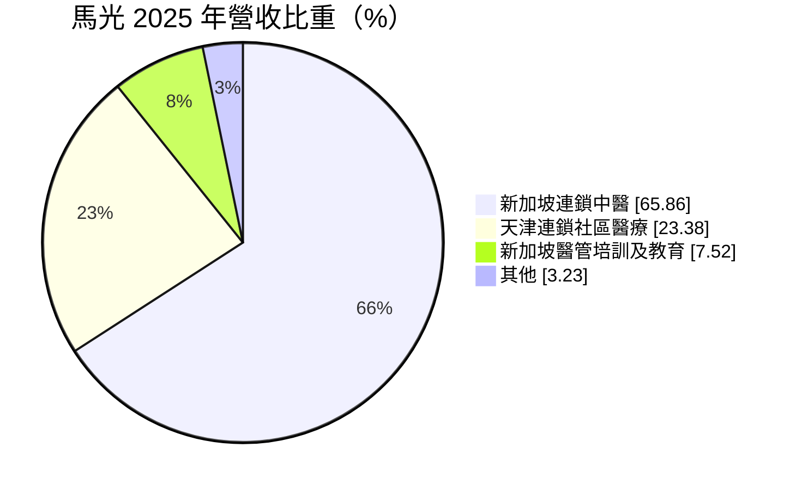
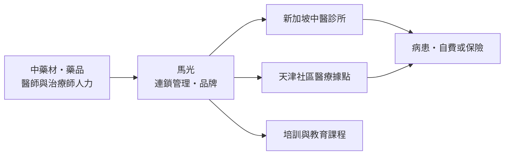
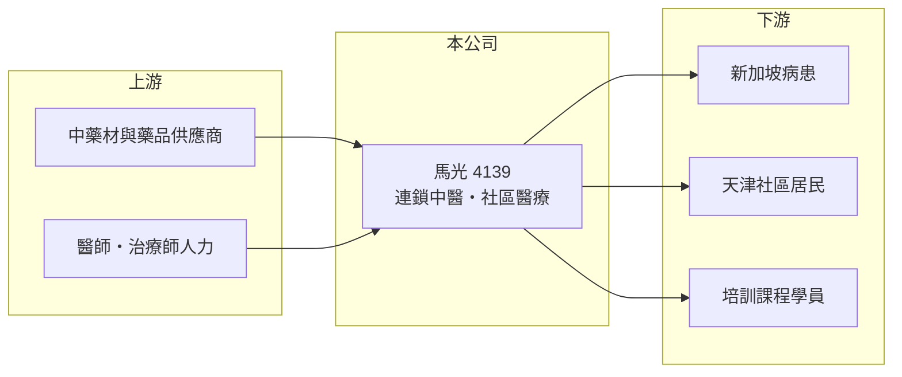

# 4139 馬光-KY

> 上櫃｜[[產業索引-生技醫療業|生技醫療業]]｜上市（櫃）日期 2011/04/29

# 第一章：企業模式與商業藍圖

> [!info] 撰寫說明
> 本文由 Claude 依公開資料整理，架構比照 [[2330台積電]] 的四章研究，資料截至 2026-10-08。財務數字來源：MoneyDJ 理財網年度財務比率與公司基本資料（2025 年營收比重）、櫃買中心開放資料（基本資料、2026 年第二季財報、每月營收）。診所數量與經營細節未查得，產業描述為整理性內容，已標註待校對。#待校對

評估一家醫療服務公司，要看它的獲利來自醫師的專業、品牌，還是規模化的管理效率。本章說明馬光醫療（股票代號：4139，以下簡稱馬光）以[[連鎖中醫]]為核心的商業模式。

## 一、核心定位：新加坡連鎖中醫與天津社區醫療

馬光為開曼群島註冊的控股公司，2009 年成立，2011 年在櫃買中心掛牌，台灣聯絡處位於高雄，董事長為福苓興業有限公司代表人巫雲光，實收資本額約 4.5 億元。依 MoneyDJ 資料，2025 年營收中新加坡連鎖中醫占 65.9%、天津連鎖[[社區醫療]]占 23.4%、新加坡醫管培訓及教育占 7.5%、其他占 3.2%。

* **新加坡連鎖中醫是主體：** 在新加坡以連鎖品牌經營中醫診所，提供針灸、推拿與中藥等服務。連鎖化的好處是統一品牌、採購與管理，讓消費者在不同據點得到一致的服務。
* **天津社區醫療是第二支柱：** 在中國天津經營社區型醫療據點，屬於基層醫療服務，受當地醫保與醫療政策影響較大。
* **培訓與教育：** 在新加坡提供醫管與中醫相關培訓課程，可同時培養自家所需人才。

## 二、資本轉化邏輯

* **人力密集的服務業：** 醫療服務的主要成本是醫師與治療師薪資及店租，這些都計入營業成本，因此[[毛利率]]只有約 13%，和製造業或品牌消費品完全不同。
* **獲利取決於據點效率：** 每一家診所的看診人次、客單價與人力配置，決定整體能否賺錢。據點擴張太快或來客不足，都會直接吃掉微薄的利潤。

## 三、長期方向

新加坡人口老化，華人社會對中醫的接受度高，長期需求穩定。馬光的長期課題，是提升每家據點的經營效率，並決定天津社區醫療事業的去留或調整方向，讓整體重新回到獲利。

# 第二章：護城河深度與競爭優勢

護城河是企業抵禦競爭、長期維持超額利潤的機制。本章說明馬光在連鎖中醫市場的優勢與限制。

## 一、馬光護城河的核心組成要素

* **1. 連鎖品牌與據點網絡：** 在新加坡建立的連鎖品牌與據點，是消費者辨識與信任的基礎。
* **2. 人才培訓體系：** 自有的培訓與教育事業，可以穩定供應醫師與治療師，降低人力短缺的衝擊。
* **3. 限制：** 中醫服務高度依賴個別醫師，病患可能跟著醫師走，品牌的鎖定效果有限；毛利率低也顯示定價能力不強。

## 二、主要競爭對手格局

| 對手 | 定位 | 對馬光的影響 |
|---|---|---|
| 新加坡其他中醫連鎖與獨立診所 | 中醫門診服務 | 直接爭奪病患 |
| 西醫家庭診所與物理治療 | 基層醫療與復健 | 部分功能重疊 |
| 天津公立社區衛生中心 | 政府經營的基層醫療 | 價格與醫保優勢 |

## 三、優勢轉化：守得住與守不住的地方

* **守得住：** 營收規模多年維持在 10 億至 13 億元之間（推算），新加坡中醫事業的需求相對穩定。
* **守不住：** 毛利率由 2020 年的 19.3% 一路降到 2025 年的 12.7%，營業利益率由正轉負，顯示人力與租金成本上升的速度超過收費調整。
* **觀察重點：** 毛利率能否止跌，以及天津事業是否持續拖累整體獲利。

# 第三章：財務體質與盈利規模

資料日期：2026-10-08。數字取自 MoneyDJ 理財網年度財務資料與櫃買中心開放資料，表格是撰寫當時的快照；最新月營收、毛利率、累計 EPS 由自動排程寫在本筆記的屬性欄位（月營收、毛利率、累計EPS 等）。#待校對

財務報表是檢驗護城河是否真實存在的最終標準。本章用五年的三率、ROE 與資本報酬，檢視馬光的獲利品質。

## 一、多年度財務表現

| 年度 | 營收（新台幣） | 每股營業額 | [[毛利率]] | [[營業利益率]] | EPS（元） | [[ROE]] |
|---|---|---|---|---|---|---|
| 2021 | 約 10.2 億（推算） | 22.55 元 | 18.1% | 4.8% | 0.91 | 7.00% |
| 2022 | 約 11.2 億（推算） | 24.88 元 | 15.2% | 3.6% | -0.73 | -6.98% |
| 2023 | 約 12.9 億（推算） | 28.63 元 | 14.1% | 2.0% | -1.00 | -8.28% |
| 2024 | 約 12.0 億（推算） | 26.56 元 | 13.3% | 1.3% | 0.24 | -0.21% |
| 2025 | 約 10.9 億（推算） | 24.27 元 | 12.7% | -2.4% | -1.55 | -16.39% |

資料來源：MoneyDJ 理財網年度財務比率（合併報表）；營收以每股營業額乘目前股數約 4,501 萬股推算，股本多年變動不大，但仍屬推算。2026 年上半年（櫃買中心資料）營收約 5.3 億元、毛利率約 10.1%、營業損失約 0.19 億元、EPS -0.90 元；2026 年 1 至 8 月營收約 7.2 億元，與去年同期大致持平。

馬光近五年平均 ROE 約 -5.0%（推算），2021 至 2025 年營收年複合成長率約 1.8%（推算）。2022 至 2023 年營業利益仍為正數，但稅後卻是虧損，代表有業外損失或減損拖累（原因待校對）。依櫃買中心資料，近期未發放現金股利。

## 二、[[ROIC]] 與 [[WACC]]：價值創造利差

**ROIC 推算：** 2025 年營業損失約 0.26 億元（營收約 10.9 億元乘營業利益率 -2.4%，推算），虧損不計稅盾。2026 年第二季權益總計約 4.4 億元、負債總計約 8.7 億元，官方資料未拆分有息負債，假設四成為有息負債約 3.5 億元（推估；診所租賃負債可能使實際比例更高），投入資本約 7.9 億元，ROIC 約 -3.3%（推算）。

**WACC 推算：** 台灣 10 年期公債殖利率取 1.75%、市場風險溢酬 6%、β 取醫療服務同業常見值 0.9（未查得公司實際 β；MoneyDJ 顯示約 0.16，因交易量低而偏低，不採用），股東權益成本約 7.15%。負債成本假設 2.5%，稅率 20%，稅後約 2.0%。權益約占投入資本 56%，WACC 約 4.9%（推算）。

**結論：** ROIC 為負，低於 WACC 約 8 個百分點，代表馬光目前在消耗股東資本。負債比率約 66% 偏高，權益基礎薄，若虧損持續，財務彈性會進一步下降。

# 第四章：總體風險與地緣政治

任何企業都無法脫離宏觀環境獨立存在。本章分析馬光長期必須面對的地緣政治、法規與營運風險。

## 一、地緣政治與政策風險

* **中國醫療政策：** 天津社區醫療事業受中國醫保支付、基層醫療政策與民營醫療管理規範影響。
* **新加坡法規：** 新加坡對中醫師執業與診所經營有嚴格的登記與監管制度，法規變動會影響人力與營運。

## 二、營運風險

* **人力成本上升：** 醫師與治療師薪資、店租持續上漲，是毛利率長期下滑的主因之一。
* **人才流失：** 資深中醫師若離職自行開業，可能帶走病患。

## 三、財務與匯率風險

* **高負債：** 負債比率約三分之二，利息與租金負擔重。
* **匯率：** 營收以新加坡幣與人民幣計價，兌新台幣匯率波動會影響帳面營收與獲利。

# 專有名詞解析

## 金融

- **[[ROIC]]**：投入資本報酬率，稅後營業利益除以股東權益加有息負債，衡量本業運用資本的效率。
- **[[WACC]]**：加權平均資金成本，股東與債權人要求報酬率的加權平均，是 ROIC 要超越的門檻。

## 產業

- **[[連鎖中醫]]**：以統一品牌、管理與採購經營多家中醫診所的模式，提供針灸、推拿與中藥等服務。
- **[[社區醫療]]**：設在住宅區附近、提供門診、慢性病管理與預防保健的基層醫療服務。

# 核心供應鏈

## 1. 上游：藥材與人力
- 中藥材與藥品供應商（名稱未查得）、醫師與治療師

## 2. 中游：馬光與同業
- 新加坡中醫連鎖與獨立診所、天津公立社區衛生中心（名稱未查得）

## 3. 下游：客戶
- 新加坡中醫病患、天津社區居民、醫管與中醫培訓課程學員

## 最新新聞
<!-- news:start -->
<!-- news:end -->

## 相關連結
- [公開資訊觀測站](https://mopsov.twse.com.tw/mops/web/t05st03?step=1&firstin=1&co_id=4139)
- [Goodinfo](https://goodinfo.tw/tw/StockDetail.asp?STOCK_ID=4139)
- [Yahoo 股市](https://tw.stock.yahoo.com/quote/4139)
- [鉅亨網新聞](https://www.cnyes.com/twstock/4139/news)
