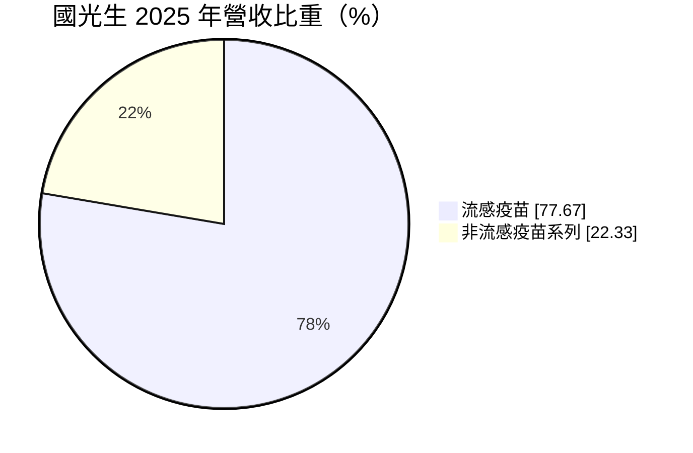
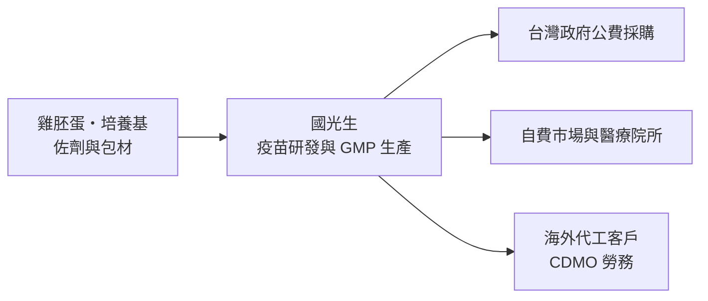
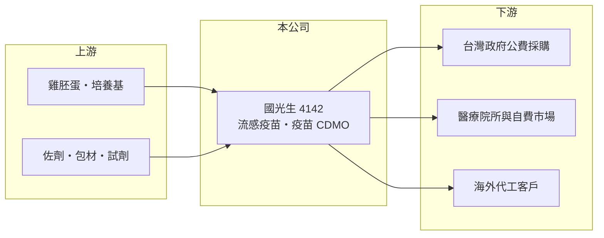

# 4142 國光生

> 上市｜[[產業索引-生技醫療業|生技醫療業]]｜上市（櫃）日期 2012/05/03

# 第一章：企業模式與商業藍圖

> [!info] 撰寫說明
> 本文由 Claude 依公開資料整理，架構比照 [[2330台積電]] 的四章研究，資料截至 2026-10-08。財務數字來源：MoneyDJ 理財網年度財務比率與公司基本資料（2025 年營收比重）、證交所開放資料（基本資料、2026 年第二季財報與營益分析、每月營收與備註、股利）。政府採購、產品線與代工客戶等描述有部分憑記憶整理，已標註待校對。#待校對

評估一家疫苗廠，要看它的營收是靠季節性的政府採購，還是能靠技術平台承接長期訂單。本章說明國光生物科技（股票代號：4142，以下簡稱國光生）的商業模式。

## 一、核心定位：台灣主要的本土流感疫苗製造商

國光生成立於 1965 年，總部與廠區位於台中市潭子區，2012 年在證交所上市，董事長為詹啟賢，實收資本額約 43.0 億元。依 MoneyDJ 資料，2025 年營收中[[流感疫苗]]占 77.7%、非流感疫苗系列占 22.3%。

* **流感疫苗是主體：** 流感病毒每年變異，疫苗必須每年依世界衛生組織建議的病毒株重新生產，需求每年重來一次，是一種「年年重複」的營收。國光生的流感疫苗主要供應台灣政府公費接種（採購比重待校對）。
* **非流感疫苗與代工：** 非流感疫苗系列包含其他人用疫苗（品項待校對），以及近年發展的疫苗 [[CDMO]] 代工服務。證交所月營收備註顯示，2026 年 8 月營收年增主要來自外銷勞務收入增加，代表代工服務已開始貢獻營收。

## 二、資本轉化邏輯

* **高固定成本、季節性出貨：** 疫苗廠的廠房、品保與法規人員都是固定成本，但流感疫苗集中在每年下半年出貨。上半年營收少、固定成本照樣發生，因此 2026 年上半年出現毛損，這是季節性結構，不能只看單季判斷。
* **CDMO 平衡季節性：** 承接代工可以讓產能在流感疫苗淡季也有工作，是改善產能利用率與獲利穩定度的關鍵。

## 三、長期方向

國光生的長期課題，是從仰賴單一市場、單一產品的流感疫苗廠，轉型為具國際認證的疫苗代工與開發平台。疫苗自主生產對國家防疫具戰略意義，這讓公司在台灣有穩定的基本盤；能否取得更多國際代工訂單，決定它能否擺脫長年虧損。

# 第二章：護城河深度與競爭優勢

護城河是企業抵禦競爭、長期維持超額利潤的機制。本章說明國光生在疫苗製造上的優勢與限制。

## 一、國光生護城河的核心組成要素

* **1. 疫苗製造的高門檻：** 人用疫苗需要通過嚴格的 PIC/S GMP 規範與批次放行檢驗，從建廠到取得許可往往需要多年，新進者極難短期進入。
* **2. 本土防疫戰略地位：** 疫情期間各國優先保障本國供應，本土疫苗產能具有國安價值，政府採購有一定的穩定性。
* **3. 限制：** 台灣市場規模小，流感疫苗需求量有上限，而且政府採購以價格為重要考量，獲利空間有限。

## 二、主要競爭對手格局

| 對手 | 定位 | 對國光生的影響 |
|---|---|---|
| 國際疫苗大廠（賽諾菲、葛蘭素史克等） | 全球流感疫苗供應 | 在台灣公費與自費市場直接競爭 |
| [[6547高端疫苗]] | 台灣疫苗研發與製造 | 本土疫苗同業，也爭取代工訂單 |
| 國際疫苗 CDMO 業者 | 規模化代工 | 爭奪國際代工客戶 |

## 三、優勢轉化：守得住與守不住的地方

* **守得住：** 2020 至 2022 年 ROE 曾轉正，代表在需求強勁、產能滿載時，疫苗廠仍有獲利能力。
* **守不住：** 2023 至 2025 年營業利益率都在 -19% 至 -40% 之間，營收規模逐年縮小，固定成本無法攤提。
* **觀察重點：** CDMO 勞務收入能否持續成長，以及每年流感疫苗得標量的變化。

# 第三章：財務體質與盈利規模

資料日期：2026-10-08。數字取自 MoneyDJ 理財網年度財務資料與證交所開放資料，表格是撰寫當時的快照；最新月營收、毛利率、累計 EPS 由自動排程寫在本筆記的屬性欄位（月營收、毛利率、累計EPS 等）。#待校對

財務報表是檢驗護城河是否真實存在的最終標準。本章用五年的三率、ROE 與資本報酬，檢視國光生的獲利品質。

## 一、多年度財務表現

| 年度 | 營收（新台幣） | 每股營業額 | [[毛利率]] | [[營業利益率]] | EPS（元） | [[ROE]] |
|---|---|---|---|---|---|---|
| 2021 | 未查得 | 4.18 元 | 34.4% | -3.0% | 0.10 | 0.22% |
| 2022 | 約 22.9 億（推算） | 5.34 元 | 39.6% | 4.2% | 0.68 | 2.25% |
| 2023 | 約 18.2 億（推算） | 4.24 元 | 23.0% | -40.5% | -1.52 | -12.50% |
| 2024 | 約 15.8 億（推算） | 3.69 元 | 28.8% | -19.2% | -0.58 | -5.93% |
| 2025 | 約 14.3 億（推算） | 3.32 元 | 20.6% | -25.7% | -0.57 | -6.21% |

資料來源：MoneyDJ 理財網年度財務比率（合併報表）；營收以每股營業額乘目前股數約 4.30 億股推算。每股淨值在 2019 至 2020 年間由 10.04 元升到 14.71 元，顯示曾有增資或大額獲利，2021 年股本是否相同無法確認，故不推算。2026 年上半年（證交所資料）營收約 1.49 億元，因流感疫苗集中在下半年出貨，出現毛損與營業損失約 3.72 億元，EPS -0.82 元；2026 年 1 至 8 月營收約 5.55 億元，較去年同期成長約 12.6%。

國光生近五年平均 ROE 約 -4.4%（推算），2022 至 2025 年營收年複合成長率約 -15%（推算）。依證交所資料，2025 年稅後淨損約 2.4 億元，期末可分配盈餘轉為負數，沒有配發股利。生技公司常以研發費用率衡量投入，國光生的研發費用率未查得。

## 二、[[ROIC]] 與 [[WACC]]：價值創造利差

**ROIC 推算：** 2025 年營業損失約 3.7 億元（營收約 14.3 億元乘營業利益率 -25.65%，推算），虧損不計稅盾。2026 年第二季權益總計約 47.0 億元、負債總計約 34.1 億元，官方資料未拆分有息負債，假設四成為有息負債約 13.6 億元（推估），投入資本約 60.7 億元，ROIC 約 -6.0%（推算）。

**WACC 推算：** 台灣 10 年期公債殖利率取 1.75%、市場風險溢酬 6%、β 取疫苗與生技同業常見值 1.0（MoneyDJ 顯示約 0.14，因個股特性偏低，不採用），股東權益成本約 7.75%。負債成本假設 2.5%，稅率 20%，稅後約 2.0%。權益約占投入資本 78%，WACC 約 6.5%（推算）。

**結論：** ROIC 為負，低於 WACC 約 12 個百分點，代表國光生在近三年持續消耗資本。疫苗廠的資本密集特性，使它必須靠更高的產能利用率（例如穩定的代工訂單）才能讓 ROIC 回到資金成本以上。

# 第四章：總體風險與地緣政治

任何企業都無法脫離宏觀環境獨立存在。本章分析國光生長期必須面對的政策、技術與營運風險。

## 一、政策與採購風險

* **政府採購依賴：** 流感疫苗營收高度依賴政府公費採購，每年得標數量與價格直接決定全年業績。
* **藥政法規：** 疫苗批次需經主管機關檢驗放行，任何品質問題都可能導致整批無法出貨。

## 二、技術演進風險

* **疫苗平台改變：** mRNA 等新型疫苗平台若在流感疫苗上取得成功，傳統雞胚蛋製程可能失去競爭力，需要新的資本投入。
* **代工競爭：** 國際 CDMO 業者規模更大，國光生需要以認證與品質爭取訂單。

## 三、營運與財務風險

* **季節性虧損：** 上半年幾乎沒有流感疫苗出貨，財報呈現明顯的季節性虧損，投資人若只看單季容易誤判。
* **固定成本高：** 產能利用率不足時，折舊與人事成本會持續造成虧損。

# 專有名詞解析

## 金融

- **[[ROIC]]**：投入資本報酬率，稅後營業利益除以股東權益加有息負債，衡量本業運用資本的效率。
- **[[WACC]]**：加權平均資金成本，股東與債權人要求報酬率的加權平均，是 ROIC 要超越的門檻。

## 產業

- **[[流感疫苗]]**：依每年世界衛生組織建議的病毒株生產的疫苗，需每年接種，需求集中在秋冬。
- **[[CDMO]]**：委託開發暨製造服務，替客戶進行藥品製程開發與量產的代工模式。
- **[[PIC S GMP]]**：國際醫藥品稽查協約組織的藥品優良製造規範，台灣處方藥廠必須符合。

# 核心供應鏈

## 1. 上游：原料
- 雞胚蛋、培養基、佐劑與包材供應商（名稱未查得）

## 2. 中游：國光生與同業
- 台灣疫苗同業：[[6547高端疫苗]]
- 國際疫苗大廠：賽諾菲、葛蘭素史克

## 3. 下游：客戶
- 台灣政府公費疫苗採購、醫療院所與自費接種者、海外 CDMO 代工客戶（名稱未查得）

## 最新新聞
<!-- news:start（自動產生，請勿手動編輯此範圍） -->
- 2026-10-07 📰 媒體 14:50｜營收速報 - 國光生(4142)9月營收3.10億元年增率高達90.14％｜[鉅亨網](https://news.cnyes.com/news/id/6623631)

完整紀錄：[[4142國光生 新聞]]
<!-- news:end -->

## 相關連結
- [公開資訊觀測站](https://mopsov.twse.com.tw/mops/web/t05st03?step=1&firstin=1&co_id=4142)
- [Goodinfo](https://goodinfo.tw/tw/StockDetail.asp?STOCK_ID=4142)
- [Yahoo 股市](https://tw.stock.yahoo.com/quote/4142)
- [鉅亨網新聞](https://www.cnyes.com/twstock/4142/news)
